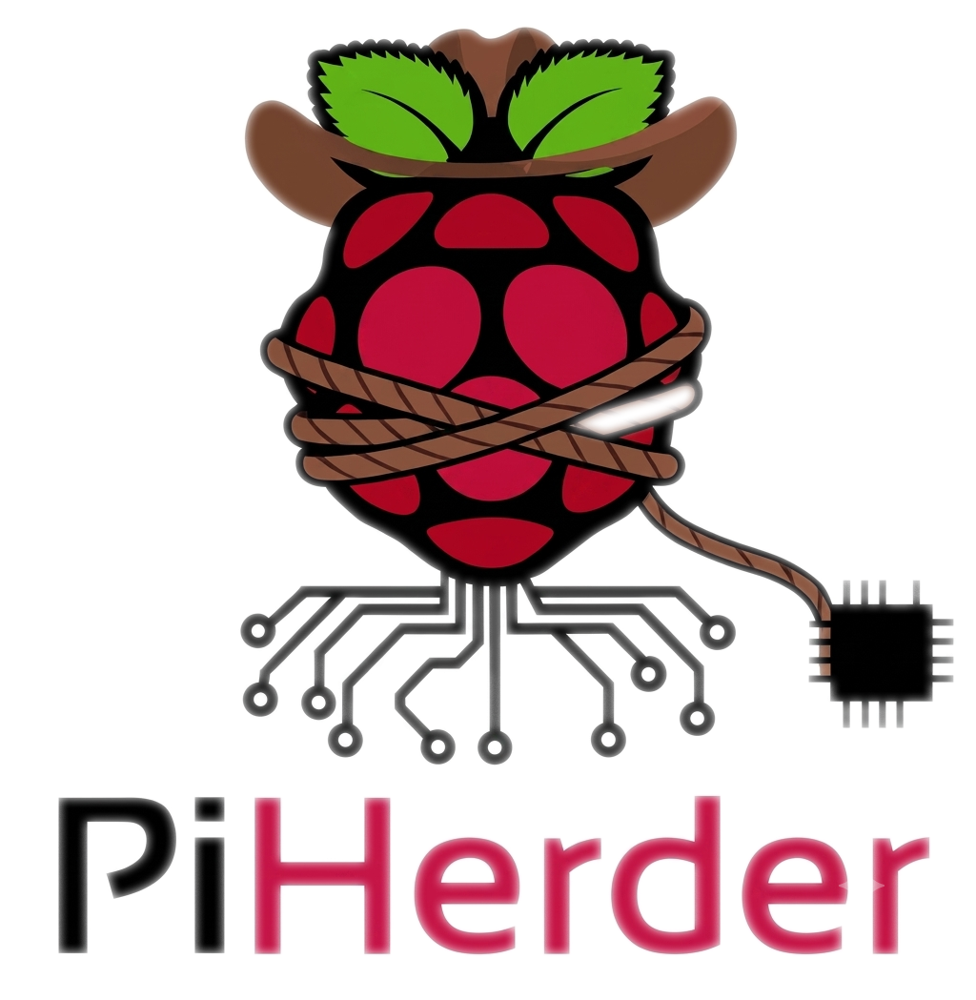

# PiHerder

**Secure fleet management for Raspberry Pi clusters — backups, patching, and control with zero plaintext secrets.**



[](LICENSE)
[](https://www.python.org/downloads/)
[](docs/RELEASE_v0.4.0.md)
[](https://bjorngluck.github.io/piherder/)

PiHerder is a self-hosted web app that manages one or more remote Linux servers (primarily Raspberry Pis). It replaces manual bash scripts with an auditable UI while keeping secrets encrypted at rest.

- **Documentation:** **[bjorngluck.github.io/piherder](https://bjorngluck.github.io/piherder/)** — install, day-to-day ops, templates, API, troubleshooting  
- **Repository:** [github.com/bjorngluck/piherder](https://github.com/bjorngluck/piherder)
- **Specification:** [SPEC.md](SPEC.md) — link this to your [GitHub Project](https://docs.github.com/en/issues/planning-and-tracking-with-projects/learning-about-projects/about-projects) board
- **Ecosystem roadmap:** [docs/ROADMAP_ECOSYSTEM.md](docs/ROADMAP_ECOSYSTEM.md) (production → integrations → templates → community)
- **Docs source (MkDocs):** [wiki/](wiki/) — edit here; publish updates the live site  
- **Admin guide (long-form / single file):** [docs/ADMIN.md](docs/ADMIN.md)
- **Automation API reference:** [docs/API.md](docs/API.md) · live OpenAPI at `/docs` (tag **api-v1**)
- **Docker Hub:** [bjorngluck/piherder](https://hub.docker.com/r/bjorngluck/piherder) · publish process: [docs/PUBLISH_IMAGE.md](docs/PUBLISH_IMAGE.md)
- **Security:** [SECURITY.md](SECURITY.md)
- **IAM / 2FA / update checks / notifications:** [docs/FEATURE_PLAN_IAM_2FA_UPDATES_NOTIFICATIONS.md](docs/FEATURE_PLAN_IAM_2FA_UPDATES_NOTIFICATIONS.md)
- **PWA + Web Push:** [docs/FEATURE_PLAN_PWA_PUSH_NOTIFICATIONS.md](docs/FEATURE_PLAN_PWA_PUSH_NOTIFICATIONS.md) · iOS: [docs/DECISION_IOS_PUSH.md](docs/DECISION_IOS_PUSH.md)
- **Integrations (Kuma + Grafana):** [docs/FEATURE_PLAN_INTEGRATIONS.md](docs/FEATURE_PLAN_INTEGRATIONS.md) · ops in [docs/ADMIN.md](docs/ADMIN.md)
- **Pi-hole + NPM + certs:** [docs/FEATURE_PLAN_PIHOLE_NPM_CERTS.md](docs/FEATURE_PLAN_PIHOLE_NPM_CERTS.md)
- **Release notes:** [docs/RELEASE_v0.4.0.md](docs/RELEASE_v0.4.0.md) · [v0.3.0](docs/RELEASE_v0.3.0.md) · [v0.2.0](docs/RELEASE_v0.2.0.md)
- **v0.5.0 plan (active):** [docs/PLAN_v0.5.0.md](docs/PLAN_v0.5.0.md)
- **Service templates:** [docs/FEATURE_PLAN_TEMPLATES.md](docs/FEATURE_PLAN_TEMPLATES.md) · ops in [docs/ADMIN.md](docs/ADMIN.md)
- **Stabilisation plan:** [docs/DECISION_PLAN_STABILISATION.md](docs/DECISION_PLAN_STABILISATION.md)

**Community:** [Issues](https://github.com/bjorngluck/piherder/issues) welcome; [PRs](https://github.com/bjorngluck/piherder/pulls) accepted for **review** — only the maintainer merges. See [CONTRIBUTING.md](CONTRIBUTING.md). Discussions/Discord may be enabled later.

## Features

### Fleet & jobs
- Add servers via SSH keypair (generated in-app or uploaded) — private key encrypted immediately with Fernet.
- **SSH access** on each server: test connection, deploy public key (optional password bootstrap), rotate keypair, least-priv user scripts (**Pi OS / Ubuntu**), copy-paste install commands. HAOS: key deploy + plain rsync guidance.
- Per-server **feature flags** (Edit → Features): Backups, OS patch, **Docker / containers** — disabled features are **hard-hidden** from dest cards, host status, and ⋯ menus.
- Optional OS/container **update check** and **patch apply** schedules (Edit → Schedules; check-only vs opt-in apply; only-if-updates; audited as system/scheduler).
- **Backups** (rsync over SSH) — multi-source paths, retention, schedules; path allow/deny policy; **restore wizard** (dry-run then confirm).
- **Container patching** — `docker compose pull` + conditional `up -d`; live JobHold logs; Docker browser (list, logs, compose edit, multi-file deploy).
- **Docker inventory cache** — DB snapshot of stacks/containers; opens instantly from last collect; background SSH refresh (prefetch, after mutations, fleet interval); Force refresh for a full re-collect.
- **OS patching** — apt update / upgrade **or** full-upgrade / autoremove; live progress; Ubuntu phased-update awareness; reboot-required.
- **Jobs** — per-server card panel + fleet **Jobs** page (`/jobs`) with filters, date range, pagination, detail modal.
- **Docker details** — full mount paths on expand; per-mount host disk usage (`du`); container size = writable+image (not volumes).
- **Fleet dashboard** — patch/update attention across hosts; servers list filters and ⋯ action menus (feature-gated).
- Diagnostics (ping, DNS, system info).
- Full **audit** trail (filters, pagination 10/20/50); scheduled jobs as system/scheduler.
- Self-backup of PiHerder — servers, full users/IAM/2FA, compose versions, Web Push (VAPID + devices), notifications, herder settings, avatars; optional audit; restore with dry-run preview.
- In-app **notification center** (**bell** only — no separate Alerts nav link; dismiss, deep links).
- Optional **Web Push** (VAPID) for fleet alerts on Android and iOS Home Screen PWAs (16.4+); per-user prefs under Account.
- Installable **PWA** (manifest + service worker + home-screen install).
- Link to Pi-hole admin from dashboard (configurable env fallback; prefer integrations when configured).
- **Service templates:** under **Catalog** — deploy NPM, Uptime Kuma, Pi-hole, Grafana (and custom / from-host stacks) via wizard — variables (incl. **boolean** + **volume** storage modes), preview, host picker, encrypted desired state V1; step-up 2FA for secrets; wait modal while deploy runs.
- **Integrations:** **Catalog** (`/catalog` → Integrations) — **Uptime Kuma**, **Grafana**, **Pi-hole** (v6 multi-instance stats, local DNS/CNAME fan-out, gravity/actions), **Nginx Proxy Manager** (proxy hosts RO + bind; cert pull). **Network maps** (Catalog → Network): host A records, service paths, Pi-hole adopt, Hosts map (Internet → router → LAN → hosts + cloud/VPS) and Path map, network settings + optional Kuma on router/WAN. **Certificates:** encrypted store from NPM pull or PEM upload; deploy targets (pair/combined/pfx); NPM auto-renew loop.
- HTTPS via Caddy with **operator-supplied TLS certs** (volume `./certs`) and `PIHERDER_HOSTNAME` (default ports **8888** HTTP / **8443** HTTPS).

### Account & security
- User profile: display name, email, avatar, password change; registration locks after first user.
- **RBAC:** admin / operator / viewer; admin **Users** page (create-user modal with password generator + one-time invite credentials modal, roles, delete modal).
- **Password policy** (min 10 + complexity); admin-created users **must change password on first login**.
- Optional **2FA** (TOTP + backup codes + trusted device); optional **force 2FA for all** (Settings → Security policy).
- Basic rate limiting on login / 2FA endpoints.
- Schema via **Alembic** on startup; unit tests with `pytest`.

**Volumes (docker-compose.yml):**
- `${PIHERDER_BACKUP_HOST_PATH:-./backups}:/backups` — destination root for per-server rsync backups (set `PIHERDER_BACKUP_HOST_PATH` for a secondary disk).
- `./piherder_backups:/herder_backups` — PiHerder self-backup archives (fleet config, IAM, push keys, avatars, optional audit).
- `./piherder_data:/data` — avatars (instance Settings live in Postgres).
- `./certs:/certs` (Caddy, read-only) — `fullchain.pem` + `privkey.pem` for trusted HTTPS (see `certs/README.md`).

**Current release:** **v0.4.0** (git tag). **In development / QA:** **v0.5.0** first RC — template polish, drift, restore, Pi-hole/NPM/certs, **Network maps** (DNS fabric), fleet ops, B07–B09, audit client IP; multi-arch + freeze remaining — [PLAN_v0.5.0.md](docs/PLAN_v0.5.0.md). **Docs:** [online wiki](https://bjorngluck.github.io/piherder/) · env: [`.env.example`](.env.example) · notes: [docs/RELEASE_v0.4.0.md](docs/RELEASE_v0.4.0.md).

## Tech Stack

FastAPI + SQLModel + PostgreSQL + paramiko + cryptography (Fernet) + Jinja2 + (vendored) Tailwind + HTMX + Alpine + APScheduler + Celery.

**Offline / air-gapped ready**: Once built, the container has no external CDN dependencies.
All frontend assets (Tailwind Play, HTMX, Alpine) are vendored during `docker build`.

**Code structure**: Small focused modules (routers for servers/docker/backups/audit/auth; services for backup, SSH, onboarding, patching, docker inventory, notifications, fleet status). Behavior-preserving splits over god files.

**Important for building the image yourself:**
The build step requires internet access (to download the frontend assets).
The build will **fail hard** with a clear error if `tailwind.js` is missing or invalid.

If you see SSL/certificate errors (or the download gets a Pi-hole page) while vendoring:
- Whitelist `cdn.tailwindcss.com` in Pi-hole temporarily, or
- `VENDOR_INSECURE=1 bash scripts/vendor_cdns.sh`, or
- `curl -kL -o app/static/tailwind.js https://cdn.tailwindcss.com`

Pre-built images will be available on Docker Hub so most people don't need to build.

## Quick Start

Full walkthrough: **[Getting started → Install](https://bjorngluck.github.io/piherder/getting-started/install/)**.

1. Clone / enter this dir:
   ```bash
   cd ~/docker/piherder
   cp .env.example .env
   ```

2. **Generate master key** (critical):
   ```bash
   python -c "from cryptography.fernet import Fernet; print(Fernet.generate_key().decode())"
   ```
   Paste into `.env` as `PIHERDER_MASTER_KEY=...`

3. **Public hostname + TLS (recommended for PWA / push on phones):**
   ```bash
   # .env
   PIHERDER_HOSTNAME=piherder.example.com
   PIHERDER_PUBLIC_URL=https://piherder.example.com:8443
   ```
   Place trusted PEMs in `certs/fullchain.pem` and `certs/privkey.pem` (gitignored).  
   Local-only / no certs yet: mount `Caddyfile.dev` instead of `Caddyfile` (self-signed; Android push unreliable).  
   Full steps: [docs/ADMIN.md](docs/ADMIN.md) §6.

4. Start everything:
   ```bash
   docker compose up -d --build
   ```

5. Open the app:
   - With certs + hostname: `https://your.host:8443` (or your `PIHERDER_PUBLIC_URL`)
   - Direct to the web container (no Caddy): `http://localhost:8000`
   - Compose Caddy ports: **8888** → HTTP, **8443** → HTTPS

   - First visit: register the initial admin user (further open registration is locked after the first account).
   - Account → optional 2FA, profile, avatar; optional **Push notifications** after VAPID keys are set.
   - Add your first server (generate keypair recommended). Optionally store a one-time SSH password for deploy.

6. On the target host / from PiHerder **SSH access**:
   - **Deploy key** (password session if needed) or copy the install script into `authorized_keys`.
   - **Test connection**, then clear any stored password once key auth works.
   - Optional least-priv user (**Pi OS / Ubuntu**): limited sudoers + docker group; **Run on host** or copy-paste script. **HAOS:** deploy key as root; plain rsync is auto-detected.
   - **Option B (recommended for least-priv + existing stacks under another home):** set **Docker base dir** to an absolute path (e.g. `/home/bjorn/docker`), then run the **Option B ACL script** from SSH access so the service user can traverse that tree. `~/docker` expands to the *SSH* user’s home and breaks restart/build/logs after re-pointing to `piherder`.
   - Otherwise ensure passwordless sudo for apt/docker/rsync as needed, and `docker` group for container ops.

7. Per server: **Edit → Features** to enable Backups / OS / Docker; **Edit → Schedules** for update checks (and optional apply). Server list / dashboard show pending OS and container updates for enabled features.

8. Optional **Web Push:** VAPID keys are **auto-generated at web startup** and stored encrypted in the DB (optional `VAPID_*` env override). Over trusted HTTPS: Account → **Enable on this device** (Android Chrome, or iOS 16.4+ after Safari → Add to Home Screen).

## Configuration from Legacy Scripts

PiHerder replicates the exact behavior of:
- `~/docker/backup_script.sh` + `backup_cleanup.sh`
- `~/docker/scripts/docker-cluster-update.sh`

After adding a server, set:
- `backup_paths` (JSON list)
- `docker_base_dir`
- `excluded_projects`
- `retention_days`

These match the variables in the old scripts.

## Running Jobs

From the server detail page (⋯ menu — only actions for **enabled** features) and related pages:
- Run Backup / retention (when Backups is on)
- Run Container Patch / OS Patch; check OS / container updates (when those features are on)
- Reboot, diagnostics
- Docker: compose edit, build, logs, redeploy (when Docker / containers is on)

All actions create AuditLog entries with status + snippet. Actionable alerts also appear in the notification center when configured checks/jobs raise them.

**Edit server** (modal tabs): **General** (connection), **Features** (flags), **Schedules** (update checks + patch apply). Backup cron remains on the Backups page.

## Replacing Cron Jobs

Use the built-in scheduler:
- Per-server **backup** schedules (Backups page) — Celery workers (parallel across hosts when `CELERY_CONCURRENCY` > 1)
- Per-server OS / container **update check** and optional **apply** schedules (Edit → Schedules)
- Fleet **Docker inventory** refresh (~every 10 minutes for hosts with Docker enabled)
- Stack **Status** health poll (~every 2 minutes)
- PiHerder self-backup schedule (Settings / herder backups)

Silent auto-upgrade is never the default: apply schedules are opt-in and prefer “only if updates pending”.

**Automation (token REST API):** admins open **Settings → API management** (`?tab=api`) for tokens (create, **copy** secret, edit permissions, **rotate**, revoke), in-app **API reference**, and endpoint catalog. Scopes: `read` / `jobs` / `edit` plus optional `feature:backup|os|docker` and **IP/CIDR allowlists** (enforced with client IP from Caddy). CORS off by default (`CORS_ORIGINS` only for browser cross-origin clients). Use `Authorization: Bearer ph_…` on `/api/v1/*`. Repo guide: [docs/API.md](docs/API.md); interactive: `/docs`.

## Security Notes

- `PIHERDER_MASTER_KEY` is the only master secret. Never commit it.
- SSH private keys (and optional SSH passwords) are encrypted at rest. Decrypted **only** in memory for jobs / onboarding actions.
- Prefer key auth; clear stored SSH passwords after **Deploy key** succeeds.
- Optional app 2FA (TOTP); backup codes for recovery; trusted devices are revocable.
- All privileged access audited.
- Use strong unique passwords + **trusted** HTTPS for production and mobile push.
- Do not commit `certs/*.pem`, `.env`, or VAPID private keys.

## Development

```bash
# Local python (after docker db or sqlite for quick dev)
pip install -e ".[dev]"
uvicorn app.main:app --reload
```

Schema is applied on web startup via Alembic (`migrations/`, `alembic upgrade head`). You can also run manually:
```bash
docker compose exec web alembic upgrade head
# or with DATABASE_URL set:
alembic upgrade head
```

Unit tests (no live SSH required):
```bash
docker compose run --rm --no-deps web pytest -q
# or locally with: pip install -e '.[dev]' && pytest -q
```

## Volumes

- `./backups:/backups` — per-server backup destination (rsync targets land here). Change the host side if you already use e.g. `/home/you/backup`.
- `./piherder_backups:/herder_backups` — self-backup archives for PiHerder itself.
- `./piherder_data:/data` — avatars (Settings/timezone/force 2FA are in Postgres).
- `./certs` → Caddy `/certs` — TLS PEMs (not committed).

Bind-mount host directories as needed for persistence.

## Roadmap

- **Operator docs:** [https://bjorngluck.github.io/piherder/](https://bjorngluck.github.io/piherder/)  
- **Full phases:** [SPEC.md](SPEC.md)  
- **Ecosystem horizons (v0.2 → v1.0):** [docs/ROADMAP_ECOSYSTEM.md](docs/ROADMAP_ECOSYSTEM.md)

| Track | Theme |
|-------|--------|
| **v0.2 / H0** | Production: clean compose, token REST API, prod ADMIN |
| **v0.3 / H1** | Integration hub: Uptime Kuma + Grafana — [feature plan](docs/FEATURE_PLAN_INTEGRATIONS.md) |
| **v0.4 / H2** | **Shipped:** service templates foundation — [RELEASE_v0.4.0.md](docs/RELEASE_v0.4.0.md) |
| **v0.5 RC** | **In development:** multi-arch · freeze; **landed:** A–H (templates/drift/restore, fleet ops, Pi-hole/NPM/certs, B07–B09, audit IP) — [PLAN_v0.5.0.md](docs/PLAN_v0.5.0.md) |
| **Later / H3** | HA plugin, optional BYO LLM, Ansible, community on Discord + hacknow.info |

**Recently completed (high level):** Service templates (wizard, volumes/booleans, from-host, desired state V1), Grafana + Kuma + Pi-hole + NPM + managed certs, fleet ops polish, stack Deploy/Check as Jobs, audit client IP, host deps, Status, multi-worker Celery, Docker inventory, PWA + Web Push (incl. resolve), RBAC/2FA, token REST API, Alembic + pytest.

**Still open (examples):** published Docker Hub/GHCR multi-arch image, RC freeze bar, HA plugin, optional AI.

To track work in a GitHub Project: link the `piherder` repo, then create issues from the unchecked items in SPEC.md.

## License

**PolyForm Noncommercial 1.0.0** — see [LICENSE](LICENSE).

Source is available for **non-commercial** use (personal, hobby, education, and other permitted noncommercial purposes under that license). Copyright remains with **Bjorn Gluck**. Attribution / the `Required Notice` in LICENSE must be preserved when you distribute copies.

Commercial use is **not** granted by this license. Contact the author if you need a separate commercial grant.

This is **source-available**, not OSI “open source” (OSI licenses allow commercial use).

## Credits

Logic for backups and container patching was ported from the author's battle-tested shell scripts (see references in source).
