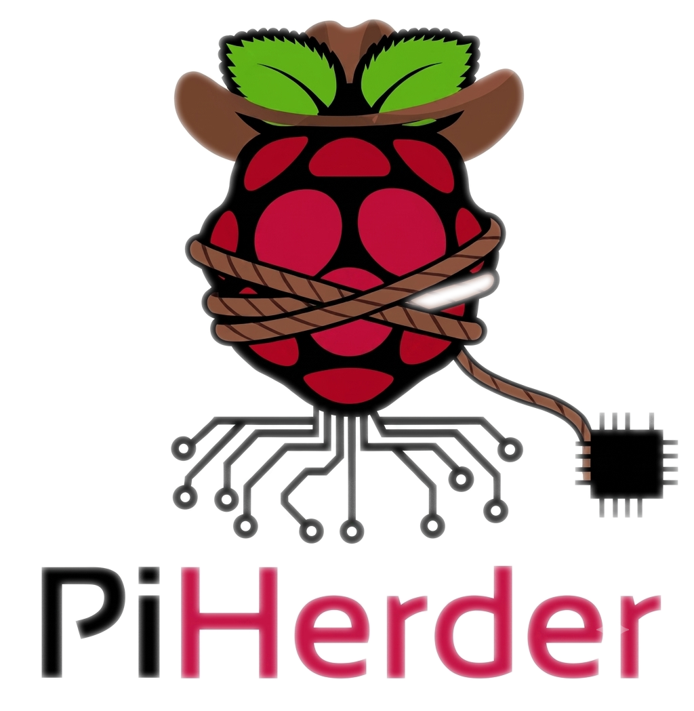

# PiHerder

**Self-hosted control plane for the Pis and Linux boxes you already SSH into — backups, patching, Compose, and an audit trail. Secrets in the database are encrypted; the master key stays on your disk.**

### Why PiHerder?

After 30+ years as an engineer, senior cybersecurity leader, tinkerer, hacker, and 3D designer/builder, I got tired of brittle bash scripts and manual processes across my Raspberry Pi clusters and homelab.

PiHerder was born the same way many great tools are: **scripts that automate the boring stuff so I could focus on building and securing systems**. It replaces manual workflows with an auditable web UI. Fleet secrets in the database are Fernet-encrypted; `PIHERDER_MASTER_KEY` stays in your host `.env`.

Inspired by projects like [Nginx Proxy Manager](https://github.com/NginxProxyManager/nginx-proxy-manager) — simple, powerful, self-hosted tools that just make life easier.

### Key Features

- SSH key management with encrypted private keys
- Backups, OS patching (apt), **HAOS** hosts via SSH + `ha` CLI check/apply, container patching with schedules
- Docker Compose browser, multi-file editing, **compose sets** (multiple compose files under one project), inventory cache
- Service templates (deploy wizard, variables, preview/confirm)
- Integrations: Uptime Kuma, Grafana, Pi-hole (v6), Nginx Proxy Manager + cert management
- **LAN Discovery** (opt-in nmap worker, devices, schedules, Hosts map overlay)
- Network Maps (DNS fabric, logical/physical topology, service paths, runtime stack view groups)
- **Reports:** backup dest, OS patches, LAN live, Docker deploys, console sessions (PiHerder history — not Grafana)
- PWA + Web Push notifications
- RBAC, 2FA (TOTP + passkeys), optional SSO/OIDC, audit trail, self-backup with full DR
- Optional in-browser **web SSH console** (off by default)
- Optional **Host Files** jailed SFTP explorer (off by default; `PIHERDER_HOST_FILES`)
- Token REST API for automation (n8n, Home Assistant, etc.)

### Quick Start

See the full **[Getting Started guide](https://piherder-docs.hacknow.info/getting-started/install/)**.

1. Clone this repo or copy `.env.example` → `.env`
2. Generate `PIHERDER_MASTER_KEY` (critical)
3. (Recommended) Set hostname + trusted TLS certs for PWA/push
4. `docker compose up -d` (pulls multi-arch `bjorngluck/piherder:latest`)
5. Register first admin user and start adding servers

### Open Source & Contributing

PiHerder is now **open source** under the MIT license. Contributions, issues, feature ideas, and PRs are very welcome.

See [CONTRIBUTING.md](CONTRIBUTING.md) for details.

If you find PiHerder useful, consider [sponsoring the project](https://github.com/sponsors/bjorngluck) or buying me a coffee — it helps fund continued development and infrastructure.

### Documentation

- Full docs & wiki: [piherder-docs.hacknow.info](https://piherder-docs.hacknow.info/)
- Admin guide: [docs/ADMIN.md](docs/ADMIN.md)
- Ecosystem roadmap: [docs/ROADMAP_ECOSYSTEM.md](docs/ROADMAP_ECOSYSTEM.md)
- **Current production (Hub):** [docs/RELEASE_v1.2.0.md](docs/RELEASE_v1.2.0.md) — passkeys · SSO · web SSH · gated demo · full DB self-backup · security remediations
- Prior: [docs/RELEASE_v1.1.1.md](docs/RELEASE_v1.1.1.md) · [docs/RELEASE_v1.1.0.md](docs/RELEASE_v1.1.0.md) · [docs/RELEASE_v1.0.0.md](docs/RELEASE_v1.0.0.md) · operator wiki [LAN Discovery](wiki/integrations/lan-discovery.md) · [HAOS hosts](wiki/day-to-day/haos-hosts.md)
- **Active train:** [docs/PLAN_v1.3.0.md](docs/PLAN_v1.3.0.md) on `v1.3.0-dev` (password / 2FA policy · console timeouts · scale lists · Connect as… · alert policy · Reports · Host Files explorer, flag-off)
- API reference: [docs/API.md](docs/API.md)

### Public demo (view-only)

Explore the UI before installing: **[https://piherder-demo.hacknow.info](https://piherder-demo.hacknow.info)**

Shared **viewer** login — current username and password are on the **[wiki / Public demo](https://piherder-docs.hacknow.info/operations/demo-site/)** page. The fleet is synthetic; there is no path to your machines. Limits and notes live on that wiki page.

### Tech Stack

FastAPI + SQLModel + PostgreSQL + Paramiko + cryptography (Fernet) + Jinja2 + compiled Tailwind + HTMX + Alpine + APScheduler + Celery.

**Offline / air-gapped ready** — Once built, the container has no external CDN dependencies. Tailwind utilities are compiled CSS (no Play / no eval).

### License

MIT — see [LICENSE](LICENSE).

---

**Repository:** [github.com/bjorngluck/piherder](https://github.com/bjorngluck/piherder)
