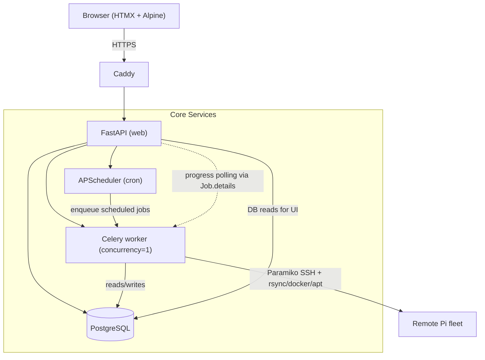
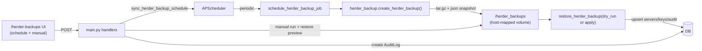

# PiHerder Specification & Roadmap

> **Repository:** [github.com/bjorngluck/piherder](https://github.com/bjorngluck/piherder)  
> **Status:** v0.1.0 — Phase 1 largely complete  
> **Last updated:** 2026-07-07 (theming decisions + test page)

This document is the canonical spec for PiHerder. Use it to track work in a [GitHub Project](https://docs.github.com/en/issues/planning-and-tracking-with-projects/learning-about-projects/about-projects) — each unchecked item below maps cleanly to an issue or project card.

---

## Decisions Log (Grok collaboration — July 2026)

### Settings & Configuration Strategy
- **Hybrid storage**: User preferences & per-server configs → PostgreSQL (travels with DB restores).
- **System / operational settings** (paths, global schedules, self-backup) → JSON file in persistent `/data` volume.
- **Sensitive runtime** (`PIHERDER_MASTER_KEY`, DB creds) → `.env` + Docker secrets.
- Rationale: Balances restore reliability with operational flexibility. DB for user-visible things, files for admin-tweakable paths.

### UI Theming
- Base: Light + Dark themes using Raspberry Pi branding (red `#E60012`/`#C8102E`, green `#00A651`).
- Default to system preference, with manual toggle.
- Extensible via Tailwind config + CSS variables for future themes/user customization.
- Goal: Consistent branding, mobile-friendly, delightful UX.
- A standalone test page is available at `/static/theme-test.html` for safe visual validation of the colour scheme without affecting the main application.

## Vision

PiHerder is a self-hosted fleet manager for Raspberry Pi (and other Linux) clusters. It replaces brittle cron + bash scripts with an auditable web UI while keeping SSH keys encrypted at rest and never storing plaintext secrets.

**Design principles**

- Replicate battle-tested shell-script behaviour exactly (backups, container patching, OS patching).
- Work offline / air-gapped once built (vendored frontend assets, no runtime CDN deps).
- Every privileged action is audited with user, server, status, and output snippet.
- Secrets decrypted only in memory for the duration of a job.

---

## Phase 1 — Core fleet management (v0.1) ✅

| Area | Status | Notes |
|------|--------|-------|
| SSH keypair generation & upload | ✅ | Fernet-encrypted at rest |
| Server CRUD + manual ordering | ✅ | |
| Per-server feature toggles | ✅ | Backups, OS patch, container patch |
| rsync backups over SSH | ✅ | Multi-source paths, dest overrides |
| Backup retention / cleanup | ✅ | |
| Per-server backup schedules | ✅ | APScheduler cron |
| Container patching | ✅ | `compose pull` + conditional `up -d` |
| OS patching (apt sequence) | ✅ | Reboot-required detection |
| Diagnostics | ✅ | ping, DNS, system info |
| Audit log + filtering | ✅ | |
| PiHerder self-backup & restore | ✅ | Compressed archives, optional audit |
| HTTPS via Caddy | ✅ | Non-standard ports 8888/8443 for co-existence |
| Pi-hole admin link | ✅ | Configurable `PIHOLE_URL` |
| Offline-ready frontend | ✅ | Vendored Tailwind, HTMX, Alpine |
| Docker Compose project browser | ✅ | List, redeploy, build, logs |
| Compose file editing + versioning | ✅ | Drafts, deploy, rollback |
| New Docker project wizard | ✅ | |
| User auth (register / login) | ✅ | Single-user v1 |

### Recent Phase 1 refinements
- Backup success/failure is now determined by per-source `rc == 0` (and absence of errors). Failed runs set status="failed", populate error details in audit, and do **not** update `last_backup_at`.
- rsync always uses `--rsync-path "sudo -n rsync"` (or local sudo) except for explicit root users / HAOS installs, where plain `rsync` is auto-probed and retried.
- PiHerder self-backup scheduling is fully wired (enable, cron, mode=config_only|full, keep, timezone) with UI at `/herder-backups`, APScheduler registration on startup, manual trigger, preview restore, and audit entries.
- Internal refactor for maintainability completed: god modules split (servers.py, backup.py into progress+profiles, docker_management.py → +docker_versions.py, main.py scheduler slim, new focused routers server_docker.py + server_backups.py + audit.py + scheduler.py). All via small modules + re-exports; behavior, routes, and lightweight principle preserved. Largest files now ~500-700 LOC.

---

## Phase 2 — Scheduling, API & polish

### Server onboarding wizard

Guided flow when adding a server (extends today’s manual “copy public key to `authorized_keys`” step). Offer UI actions **and** copy-paste shell commands for the remote host.

- [ ] **SSH key authentication bootstrap**
  - If key auth is not yet working: connect once with stored password (existing `password_auth` path), verify host, then install PiHerder’s public key into `~/.ssh/authorized_keys` on the target.
  - Show exact commands run (or equivalent) for manual execution; audit `server_ssh_key_deployed` (or similar).
  - Post-deploy: drop password auth from routine jobs once key auth succeeds (optional “remove password” step).

- [ ] **Dedicated least-privilege backup user**
  - Optional wizard step: create e.g. `piherder-backup` on the remote with:
    - SSH key-only login (no password).
    - Membership in `docker` group when container patch / compose paths are enabled.
    - Passwordless sudo limited to backup needs: `rsync`, `test`, and any docker/compose commands required by enabled features — not full root.
  - Emit a vetted sudoers drop-in snippet (e.g. `/etc/sudoers.d/piherder-backup`) and `useradd` / `usermod` commands; run via SSH when user confirms, or copy for manual apply.
  - Re-point the Server record to the new username after successful provisioning.

- [ ] **SSH key rotation**
  - Per-server action: generate new keypair, deploy public key to target (password or existing key session), verify connect, atomically swap encrypted private key in DB, remove old public key from `authorized_keys`, audit `server_ssh_key_rotated`.
  - Rollback / grace period if deploy fails (keep old key until new key verified).

Related backup hardening (same phase):

- [ ] **Per-server backup path allow/deny rules** — block or warn on configured sources before rsync starts (complements global sudo-backed rsync).

- [ ] Built-in scheduler UI for container patch and OS patch jobs (backup scheduling exists)
- [ ] REST API for all job triggers with token auth (partial — some endpoints exist)
- [ ] Webhook / notification integration wired end-to-end
- [ ] Per-server container-patch and OS-patch cron schedules
- [ ] Job queue visibility (running / queued / history per server)
- [ ] Alembic migrations replace runtime `ALTER TABLE` hacks
- [ ] Test suite (pytest) for backup, patching, and encryption paths
- [ ] Pre-built Docker Hub image published and documented
- [ ] `docker-compose` example with sensible defaults (no `~/` bind-mount assumptions)

---

## Phase 3 — Multi-user & advanced Docker

- [ ] Role-based access (admin / operator / read-only)
- [ ] Multi-user audit attribution
- [ ] Compose multi-file project support (override files, env files in UI)
- [ ] Image update notifications (digest comparison, changelog links)
- [ ] Fleet-wide dashboard (patch status across all servers)
- [ ] Backup restore wizard (select snapshot → restore paths)
- [ ] Rate limiting on auth endpoints
- [ ] Optional 2FA

---

## Phase 4 — Ecosystem

- [ ] Ansible / cloud-init bootstrap for new Pis
- [ ] Prometheus metrics exporter
- [ ] Mobile-friendly responsive pass
- [ ] Plugin hooks for custom job types

---

## Architecture



**Key flows (technical view):**

```mermaid
flowchart TD
    UI["UI: ▶ Backup (servers list / detail / backups page)"] -->|POST /servers/{id}/run/backup<br/>X-PiHerder-Async: 1| Router["FastAPI router"]
    Router -->|create_job_and_run| JobSvc["jobs service"]
    JobSvc -->|AuditLog + Job row| DB[(DB)]
    JobSvc --> Celery["Celery / background: run_backup()"]

    Celery --> Detect["Detect remote rsync path"]
    Detect --> Probe{"SSH user == root or HAOS?"}
    Probe -->|yes| Plain["use plain rsync"]
    Probe -->|no| Sudo["use sudo -n rsync<br/>--rsync-path sudo -n rsync"]

    Sudo --> Rsync["run rsync per source<br/>(delta + --delete, progress)"]
    Plain --> Rsync

    Rsync --> Check{"backup_succeeded() ?<br/>(all rc==0 + no errors)"}
    Check -->|yes| Success["status=success<br/>last_backup_at = now<br/>size via du -sb"]
    Check -->|no| Fail["status=failed<br/>error = backup_failure_message()"]

    Success --> FinalOK["finalize Job + AuditLog (success)"]
    Fail --> FinalFail["finalize Job + AuditLog (failed)<br/>do not touch last_backup_at"]

    UI -.poll.->|GET /servers/{id}/backup-progress?job_id=...| Progress["prefers DB Job.details"]
    Progress --> UI
```

**Stack:** FastAPI · SQLModel · PostgreSQL · Paramiko · cryptography (Fernet) · Jinja2 · Tailwind (vendored) · HTMX · Alpine · Caddy

The diagrams above reflect current behavior: DB-backed progress and jobs, per-source rc checking for success/failure, automatic plain rsync for root/HAOS, and `last_backup_at` only updated on true success.

**Herder self-backup flow (technical):**



---

## Security model

| Asset | Protection |
|-------|------------|
| `PIHERDER_MASTER_KEY` | Host `.env` only — never committed |
| SSH private keys | Fernet-encrypted in DB; decrypted in-memory per job |
| User passwords | bcrypt hashed |
| Sessions | JWT (HS256) |
| Transport | HTTPS via Caddy + Let's Encrypt (or self-signed for local) |

---

## Legacy script parity

PiHerder ports logic from these battle-tested scripts:

| Legacy script | PiHerder equivalent |
|---------------|---------------------|
| `backup_script.sh` | Per-server backup job |
| `backup_cleanup.sh` | Retention job |
| `docker-cluster-update.sh` | Container patch job |

Configurable per-server fields that map 1:1: `backup_paths`, `docker_base_dir`, `excluded_projects`, `retention_days`.

---

## Linking this spec to a GitHub Project

1. Push this repo to [github.com/bjorngluck/piherder](https://github.com/bjorngluck/piherder).
2. Create a new Project (user or org) on GitHub.
3. **Link the repository:** Project → Settings → Linked repositories → add `bjorngluck/piherder`.
4. **Create issues** from unchecked Phase 2–4 items above (copy title + acceptance criteria).
5. **Add issues to the project board** and group by Phase column or Milestone.
6. Pin `SPEC.md` in the repo README (already linked) for contributors.

---

## License

MIT — see [LICENSE](LICENSE).