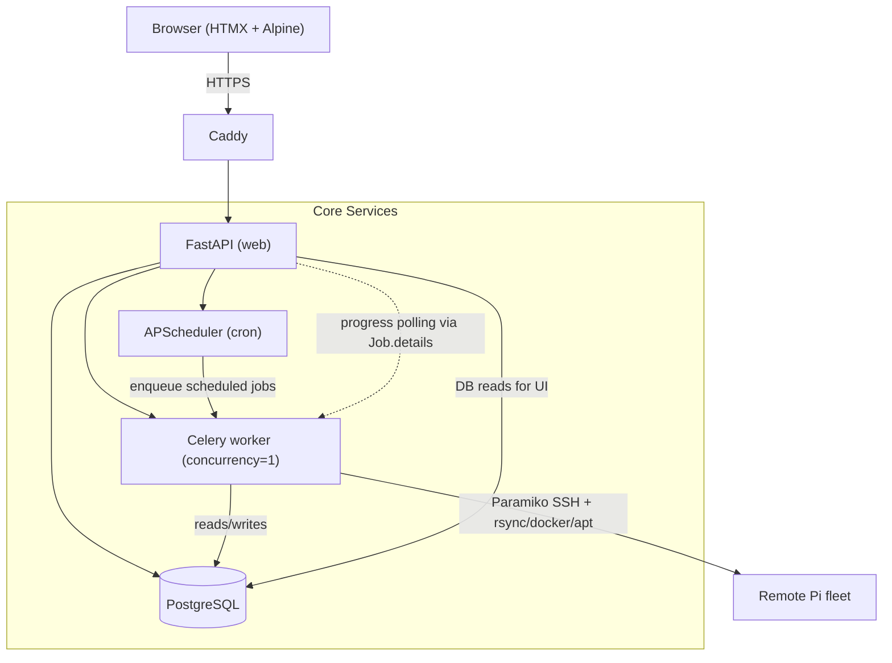
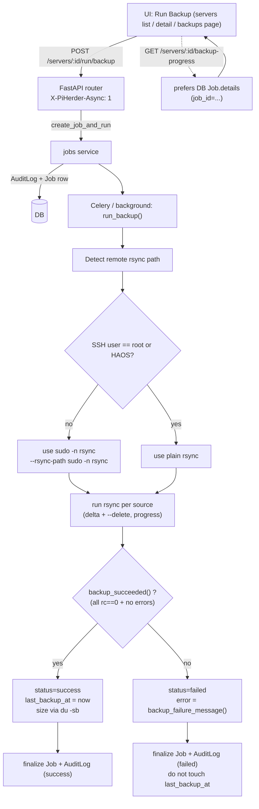
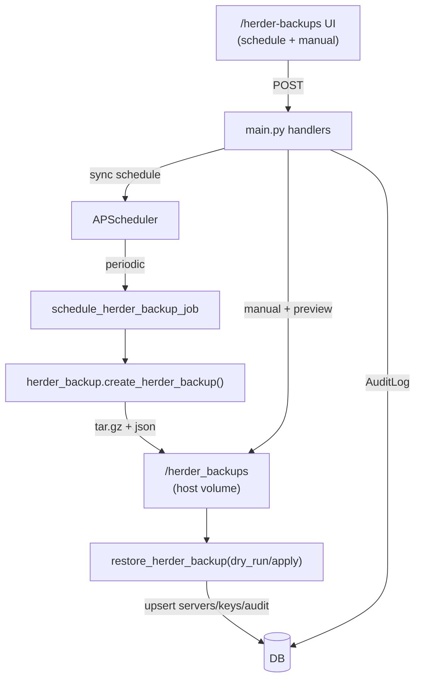

# PiHerder Specification & Roadmap

> **Repository:** [github.com/bjorngluck/piherder](https://github.com/bjorngluck/piherder)  
> **Status:** v0.2 target — Phase 1–3 complete; Phase 4 (production + ecosystem) in progress  
> **Last updated:** 2026-07-10 — ecosystem roadmap; token REST API; production install path

This document is the canonical spec for PiHerder. Use it to track work in a [GitHub Project](https://docs.github.com/en/issues/planning-and-tracking-with-projects/learning-about-projects/about-projects) — each unchecked item below maps cleanly to an issue or project card.

**Operator docs:** [docs/ADMIN.md](docs/ADMIN.md) · [docs/ROADMAP_ECOSYSTEM.md](docs/ROADMAP_ECOSYSTEM.md) · [docs/DECISION_PLAN_STABILISATION.md](docs/DECISION_PLAN_STABILISATION.md)

---

## Decisions Log (Grok collaboration — July 2026)

### Settings & Configuration Strategy
- **Hybrid storage**: User preferences & per-server configs → PostgreSQL (travels with DB restores).
- **System / operational settings** (paths, global schedules, self-backup) → JSON file in persistent `/data` volume.
- **Sensitive runtime** (`PIHERDER_MASTER_KEY`, DB creds) → `.env` + Docker secrets.
- Rationale: Balances restore reliability with operational flexibility. DB for user-visible things, files for admin-tweakable paths.

### UI Theming
- Base: Light + Dark themes using Raspberry Pi branding (red `#E60012`/`#C8102E`, green `#00A651`).
- Default to system preference, with manual toggle.
- Extensible via Tailwind config + CSS variables for future themes/user customization.
- Goal: Consistent branding, mobile-friendly, delightful UX.
- A standalone test page is available at `/static/theme-test.html` for safe visual validation of the colour scheme without affecting the main application.

### Ecosystem strategy (2026-07-10)
- **Integrations are optional** — core fleet ops (SSH, backups, patch, Docker) work without external products.
- **PiHerder owns fleet truth**; Uptime Kuma / Grafana / NPM / HA enrich or provision via adapters and deep links.
- Prefer **n8n + token REST** over embedding every vendor API in-process.
- **Provisioning** always preview → confirm → audit (same philosophy as opt-in patch apply).
- **AI** is optional, OpenAI-compatible BYO (local or cloud), off by default; Frigate vision stays on Frigate/AI Hat.
- Full multi-horizon plan: [docs/ROADMAP_ECOSYSTEM.md](docs/ROADMAP_ECOSYSTEM.md).

## Vision

PiHerder is a self-hosted fleet manager for Raspberry Pi (and other Linux) clusters. It replaces brittle cron + bash scripts with an auditable web UI while keeping SSH keys encrypted at rest and never storing plaintext secrets.

**Design principles**

- Replicate battle-tested shell-script behaviour exactly (backups, container patching, OS patching).
- Work offline / air-gapped once built (vendored frontend assets, no runtime CDN deps).
- Every privileged action is audited with user, server, status, and output snippet.
- Secrets decrypted only in memory for the duration of a job.

---

## Phase 1 — Core fleet management (v0.1) ✅

| Area | Status | Notes |
|------|--------|-------|
| SSH keypair generation & upload | ✅ | Fernet-encrypted at rest |
| Server CRUD + manual ordering | ✅ | |
| Per-server feature toggles | ✅ | Backups, OS patch, Docker/containers; hard-hide UI when off (Edit → Features) |
| rsync backups over SSH | ✅ | Multi-source paths, dest overrides |
| Backup retention / cleanup | ✅ | |
| Per-server backup schedules | ✅ | APScheduler cron |
| Container patching | ✅ | `compose pull` + conditional `up -d` |
| OS patching (apt sequence) | ✅ | Live log modal, upgrade XOR full-upgrade, phased-update awareness, reboot-required |
| Diagnostics | ✅ | ping, DNS, system info |
| Audit log + filtering | ✅ | |
| PiHerder self-backup & restore | ✅ | v2 archives: servers, full users/2FA, compose versions, push VAPID+subs, notifications, herder config, avatars; optional audit; jobs excluded |
| HTTPS via Caddy | ✅ | Ports 8888/8443; trusted PEMs in `./certs` + `PIHERDER_HOSTNAME` (or `Caddyfile.dev` self-signed) |
| PWA + Web Push (Android + iOS Home Screen) | ✅ | Manifest/SW; VAPID auto; Account prefs; iOS decision — [feature plan](docs/FEATURE_PLAN_PWA_PUSH_NOTIFICATIONS.md) · [DECISION_IOS_PUSH.md](docs/DECISION_IOS_PUSH.md) |
| Pi-hole admin link | ✅ | Configurable `PIHOLE_URL` |
| Offline-ready frontend | ✅ | Vendored Tailwind, HTMX, Alpine |
| Docker Compose project browser | ✅ | List, redeploy, build, logs; multi-file editor |
| Docker inventory cache | ✅ | DB snapshot + background L1 refresh; Force refresh for full re-collect |
| Compose file editing + versioning | ✅ | Drafts, deploy, rollback; multi-file merge-on-save |
| New Docker project wizard | ✅ | |
| User auth (register / login) | ✅ | Single-user v1 |

### Recent Phase 1 refinements
- Backup success/failure is now determined by per-source `rc == 0` (and absence of errors). Failed runs set status="failed", populate error details in audit, and do **not** update `last_backup_at`.
- rsync always uses `--rsync-path "sudo -n rsync"` (or local sudo) except for explicit root users / HAOS installs, where plain `rsync` is auto-probed and retried.
- PiHerder self-backup scheduling is fully wired (enable, cron, mode=config_only|full, keep, timezone) with UI at `/herder-backups`, APScheduler registration on startup, manual trigger, preview restore, and audit entries.
- Internal refactor for maintainability completed: god modules split (servers.py, backup.py into progress+profiles, docker_management.py → +docker_versions.py, main.py scheduler slim, new focused routers server_docker.py + server_backups.py + audit.py + scheduler.py). All via small modules + re-exports; behavior, routes, and lightweight principle preserved. Largest files now ~500-700 LOC.
- **OS patch apply (manual):** servers list + detail offer update / **upgrade XOR full-upgrade** / autoremove (sudo apt). Holding modal streams apt output (tail-focused); job rechecks upgradable counts before marking done and force-reloads the page. Ubuntu **phased** packages are counted separately in checks/alerts (listed vs actually installable). Audit rows store step results, short summary, post-check counts, and an **apt log tail** (not just “Job #N started”).

---

## Phase 2 — Scheduling, API & polish

### Server onboarding (SSH access)

Server detail **SSH access** panel (not a separate multi-page wizard): deploy key, rotate, test, least-priv user, plus copy-paste scripts. Add-server supports generate/upload key with optional one-time password for deploy.

- [x] **SSH key authentication bootstrap**
  - Deploy via password session or existing key; install public key into `authorized_keys`; verify key-only login; copy-paste install script; audit `server_ssh_key_deployed`; optional clear password after deploy (`SSH access` on server detail).

- [x] **Dedicated least-privilege backup user** *(phase 1: Debian / Pi OS / Ubuntu)*
  - Optional: create e.g. `piherder` with key-only login, optional `docker` group, sudoers for rsync/test and optional apt/reboot; `visudo -cf` before install; copy-paste script always; **Run on host** re-points `ssh_username` after verify. HAOS/specialised systems: instructions only (not automated).

- [x] **SSH key rotation**
  - Per-server: generate new keypair, deploy, verify, swap encrypted private key in DB, remove old public key; leave DB unchanged if verify fails; audit `server_ssh_key_rotated`.

Related backup hardening (same phase):

- [x] **Per-server backup path allow/deny rules** — default deny OS roots; optional allow/deny prefixes on Backups page; enforced on add-source + `run_backup`.

- [x] **Built-in scheduler UI for container/OS patch apply** — Edit server → Schedules tab; opt-in, default off
- [x] **Token REST API (v1)** — Bearer API tokens (`ph_…`); fleet read + job triggers under `/api/v1` — see ADMIN § API tokens
- [x] **Webhook / notification integration** — env `WEBHOOK_*` on new alerts + job finish; optional **Web Push** (VAPID) on new open notifications — see [PWA/push plan](docs/FEATURE_PLAN_PWA_PUSH_NOTIFICATIONS.md)
- [x] **Per-server OS-patch and container-patch apply cron** — APScheduler → thread pool; only-if-updates; skip if job active; audit as system/scheduler
- [x] **OS update check schedule (check-only)** — apt upgradable count + reboot flag; no auto-upgrade — see [feature plan](docs/FEATURE_PLAN_IAM_2FA_UPDATES_NOTIFICATIONS.md)
- [x] **Container update check schedule (check-only)** — pull + image ID compare; no `up -d` — see [feature plan](docs/FEATURE_PLAN_IAM_2FA_UPDATES_NOTIFICATIONS.md)
- [x] **In-app notification center** — bell, dismiss, deep links (OS/container updates, reboot pending, failed backups); separate from AuditLog — see [feature plan](docs/FEATURE_PLAN_IAM_2FA_UPDATES_NOTIFICATIONS.md)
- [x] **PWA + Web Push** — manifest, service worker, install banner; VAPID subscriptions + per-user prefs; iOS Home Screen path (16.4+); trusted TLS via volume-mounted certs + `PIHERDER_HOSTNAME` — [feature plan](docs/FEATURE_PLAN_PWA_PUSH_NOTIFICATIONS.md) · [DECISION_IOS_PUSH.md](docs/DECISION_IOS_PUSH.md)
- [x] **Job queue visibility** — server detail Jobs panel (card feed); fleet **Jobs** page (`/jobs`) with filters, date range, pagination, detail modal; `GET /servers/{id}/jobs` + `GET /jobs/{id}`
- [x] **Alembic migrations** — `migrations/` + startup `alembic upgrade head` (replaces bulk runtime ALTER loop); revisions through `006_docker_inventory`
- [x] **Test suite (pytest)** — path policy, OS patch, container summary, encrypt, apply steps, password policy, restore policy, RBAC helpers + sole-admin + `get_current_user` mutate gates, apply-schedule skip/busy/enqueue, job progress/`job_public_dict`, docker inventory, metrics, multifile (`tests/`)
- [x] **Container patch live progress** — per-project log lines + JobHold modal; success based on failed list; post-patch image recheck
- [x] **Docker container expand** — full mount paths via `docker inspect`; per-mount host usage via `du`; container size labeled as writable+image (not volumes)
- [x] **Audit pagination** — 10 / 20 / 50 per page with filters preserved
- [ ] Pre-built Docker Hub / GHCR image published and documented
- [x] **`docker-compose` example with sensible defaults** — relative `./backups` (not `~/`); documented volumes

---

## Phase 3 — Multi-user & advanced Docker

- [x] **User profile / IAM** — display name, email change, avatar, password change; lock open registration after first user — see [feature plan](docs/FEATURE_PLAN_IAM_2FA_UPDATES_NOTIFICATIONS.md)
- [x] **Role-based access (admin / operator / viewer)** — `User.role`; viewers read-only except self-service; operators run fleet jobs; admin manages roles at `/auth/users`
- [x] **User admin** — create user (password generator, strength meter, policy, one-time copyable invite); delete with modal confirm; sole-admin protection
- [x] **Password policy** — min 10 + upper/lower/digit; enforced on register, change password, admin create; admin-created users **must change password on first login**
- [x] **Force 2FA (global)** — Settings → Security policy `force_2fa`; blocks fleet UI until TOTP enabled
- [x] **Multi-user audit attribution** — audit rows store `user_id`; UI shows display name + email; scheduled jobs labeled “system / scheduler”
- [x] **Compose multi-file project support** — load/edit/deploy compose + override + `.env` + Dockerfile; merge-on-save version snapshots
- [ ] Image update notifications (changelog links) — partial: image ID / digest compare already drives checks + in-app alerts
- [x] Fleet-wide dashboard (patch status across all servers) — dashboard table + summary from last check fields
- [x] **Backup restore wizard** — Backups page: dry-run reverse rsync per source, confirm to apply; path policy enforced; audit `backup_restore`
- [x] Rate limiting on auth endpoints (basic in-memory on login/2FA)
- [x] **Optional app-based 2FA** — TOTP + backup codes + optional trusted device (30d, revocable) — see [feature plan](docs/FEATURE_PLAN_IAM_2FA_UPDATES_NOTIFICATIONS.md)

### Security model (multi-user notes)
| Control | Behaviour |
|---------|-----------|
| Roles | `admin` / `operator` / `viewer` — mutating HTTP methods blocked for viewers (except self-service) |
| Sole admin | Cannot demote or delete the last admin |
| Admin create user | Temporary password + invite copy; `must_change_password` until first reset |
| Force 2FA | Herder config `force_2fa`; onboarding redirect to `/auth/force-2fa` |
| Scheduled jobs | Audit `user_id=null` → UI “system / scheduler” |

Full admin reference: [docs/ADMIN.md](docs/ADMIN.md).

---

## Phase 4 — Production readiness (v0.2 / Horizon 0)

Carried refinements + ship blockers for a clean install story. Detail: [docs/ROADMAP_ECOSYSTEM.md](docs/ROADMAP_ECOSYSTEM.md).

- [x] **Prometheus metrics exporter** — `GET /metrics` (optional `METRICS_TOKEN`); fleet/job/notification/backup gauges
- [x] Mobile-friendly responsive pass (UI unification 2026-07 — see `UI_UNIFICATION_PLAN.md`)
- [x] **Docker inventory cache** — DB snapshot (`docker_inventory_*` on Server); L1 SSH refresh in background
- [x] **Server Edit IA** — tabbed Edit modal (General / Features / Schedules)
- [x] **Feature hard-hide** — dest cards, host status chips, and ⋯ actions only for enabled features
- [x] **Token REST API** — admin-managed API tokens; `/api/v1` fleet read + job triggers
- [x] **Compose volume defaults** — `./backups`, `./piherder_backups`, `./piherder_data`, `./certs`
- [x] **Production ADMIN section** — TLS, upgrades, metrics, webhooks, API tokens
- [ ] Pre-built multi-arch image on Docker Hub / GHCR + README pull path
- [ ] GitHub Release `v0.2.0` notes

---

## Phase 5 — Integration hub (v0.3 / Horizon 1)

Read-mostly integrations: registry, status, deep links. No full remote control of external products.

- [ ] Integration registry (types + encrypted credentials + server/project bindings)
- [ ] Uptime Kuma: poll availability, badges, deep link, optional down notifications
- [ ] Grafana: dashboard URL templates; “Open in Grafana”; high-level native stats chips
- [ ] Multi Pi-hole / NPM / HA / Frigate / n8n generic URL entries (seed from `PIHOLE_URL`)
- [ ] Docs: cert pattern NPM → n8n → consumers (e.g. Pi-hole)

---

## Phase 6 — Service templates (v0.4 / Horizon 2)

- [ ] Template schema (compose/checklist/variables/post-deploy actions)
- [ ] Curated pack (Pi-hole, Kuma, Grafana, Frigate, HA, NPM, n8n, media, generic web)
- [ ] Onboard wizard: monitoring / DNS / TLS-proxy / feature flags (preview → confirm → audit)
- [ ] Provider actions: Kuma create monitor; optional NPM / Cloudflare when tokens set
- [ ] Custom template create / import / export

---

## Phase 7 — Ecosystem depth (post-v0.4 / Horizon 3)

- [ ] Plugin hooks / event webhooks (`job.completed`, `server.added`, …) — prefer REST + n8n over code exec
- [ ] Ansible inventory / cloud-init bootstrap for new Pis
- [ ] Home Assistant: custom component or REST sensors (read + safe actions)
- [ ] Optional AI (OpenAI-compatible BYO; off by default; no private keys in prompts)
- [ ] Community: Discord + Discussions; hacknow.info project page / clickthrough

---

## Architecture

**Key flows (technical view):**

**Stack:** FastAPI · SQLModel · PostgreSQL · Paramiko · cryptography (Fernet) · Jinja2 · Tailwind (vendored) · HTMX · Alpine · Caddy

The diagrams above reflect current behavior: DB-backed progress and jobs, per-source rc checking for success/failure, automatic plain rsync for root/HAOS, and `last_backup_at` only updated on true success.

**Herder self-backup flow (technical):**

---

## Security model

| Asset | Protection |
|-------|------------|
| `PIHERDER_MASTER_KEY` | Host `.env` only — never committed |
| SSH private keys | Fernet-encrypted in DB; decrypted in-memory per job |
| SSH passwords (optional) | Fernet-encrypted; discouraged; clear after key deploy |
| User passwords | bcrypt hashed |
| 2FA | TOTP secret Fernet-encrypted; hashed backup codes; optional trusted device cookie; optional global force-2FA |
| User passwords | bcrypt; policy min 10 + complexity; admin-created users forced reset on first login |
| Sessions | JWT (HS256) cookie |
| Transport | HTTPS via Caddy + volume-mounted PEMs (or `Caddyfile.dev` self-signed for local) |

**SSH onboarding helpers:** `app/services/ssh_onboarding.py` (deploy / rotate / least-priv). Least-priv automation targets **Debian / Pi OS / Ubuntu** only; HAOS gets copy-paste guidance.

---

## Legacy script parity

PiHerder ports logic from these battle-tested scripts:

| Legacy script | PiHerder equivalent |
|---------------|---------------------|
| `backup_script.sh` | Per-server backup job |
| `backup_cleanup.sh` | Retention job |
| `docker-cluster-update.sh` | Container patch job |

Configurable per-server fields that map 1:1: `backup_paths`, `docker_base_dir`, `excluded_projects`, `retention_days`.

---

## Linking this spec to a GitHub Project

1. Push this repo to [github.com/bjorngluck/piherder](https://github.com/bjorngluck/piherder).
2. Create a new Project (user or org) on GitHub.
3. **Link the repository:** Project → Settings → Linked repositories → add `bjorngluck/piherder`.
4. **Create issues** from unchecked Phase 2–4 items above (copy title + acceptance criteria).
5. **Add issues to the project board** and group by Phase column or Milestone.
6. Pin `SPEC.md` in the repo README (already linked) for contributors.

---

## License

MIT — see [LICENSE](LICENSE).