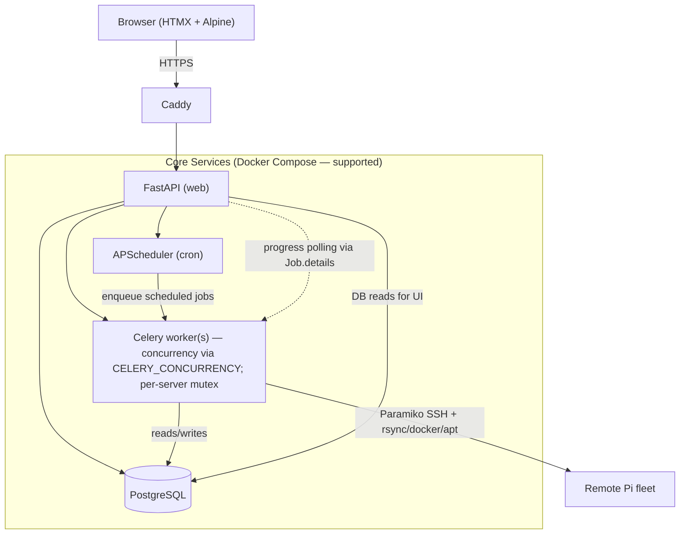
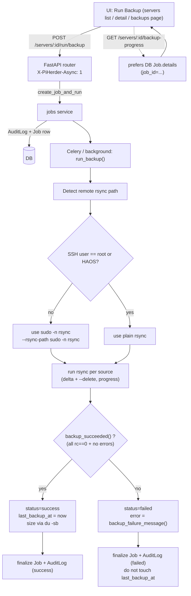
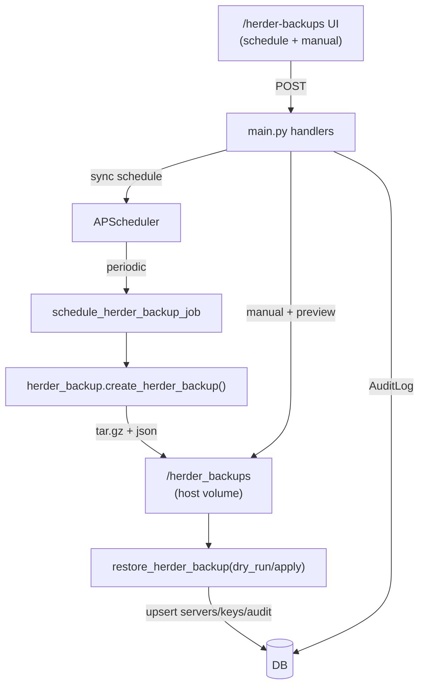

# PiHerder Specification & Roadmap

> **Repository:** [github.com/bjorngluck/piherder](https://github.com/bjorngluck/piherder)  
> **Status:** **v0.5.0 in development** — Phase 1–5 complete; Phase 6 templates **foundation shipped** in v0.4.0; ops + polish + RC → **v0.5.0**  
> **Last updated:** 2026-07-16 — Production path: ~~v0.4.0~~ done → **v0.5.0** (single target). Landed: **A–H** + UI polish + **MIT**. Security hardening: **no default admin** (first-register), admin-only instance DR, Docker cleanup HTML escape, role fail-closed, Secure cookies. Still open: multi-arch image, RC freeze.

This document is the canonical spec for PiHerder. Use it to track work in a [GitHub Project](https://docs.github.com/en/issues/planning-and-tracking-with-projects/learning-about-projects/about-projects) — each unchecked item below maps cleanly to an issue or project card.

**Operator docs:** **[https://piherder-docs.hacknow.info/](https://piherder-docs.hacknow.info/)** (live wiki) · source [wiki/](wiki/) · [docs/ADMIN.md](docs/ADMIN.md) (long-form) · [docs/ROADMAP_ECOSYSTEM.md](docs/ROADMAP_ECOSYSTEM.md)

---

## Decisions Log (Grok collaboration — July 2026)

### Settings & Configuration Strategy
- **Database-first**: User prefs, per-server config, **and** instance operational settings (timezone, force 2FA, fleet defaults, self-backup schedule) → PostgreSQL (`appsetting` singleton + domain tables). Travels with DB dumps and PiHerder self-backup.
- **Files**: avatars / binary blobs under `DATA_ROOT` only; legacy `herder-config.json` is imported once into DB if present.
- **Sensitive runtime** (`PIHERDER_MASTER_KEY`, DB creds) → `.env` + Docker secrets (never in Settings UI / DB rows as plaintext deploy secrets).
- Rationale (2026-07-10): DR and persistence — one restore path for “how the instance was configured,” not a split brain between volume files and Postgres.

### UI Theming
- Base: Light + Dark themes using Raspberry Pi branding (red `#E60012`/`#C8102E`, green `#00A651`).
- Default to system preference, with manual toggle.
- Stylesheets: `themes.css` (tokens + chrome) + `fabric.css` (Network maps) + `ops.css` / `ops-auth.css` / `ops-pages.css` (ops-hero + auth + page polish) — query-busted; SW network-first for CSS/JS.
- Ops UI: shared **ops-hero** dual-line pulse on Servers, Jobs, Audit, Alerts, Catalog, Settings, Account, Users, fleet Services, host Docker/Backups (`app/services/ops_pulse.py` + page-local pulses).
- **Hero layout contract:** desktop (≥768px) title left · viz right; mobile compact viz under title; **full content width** (no narrow page clamp on Account). Catalog always renders a viz shell so tabs share chrome.
- **Mobile orientation:** portrait↔landscape reflow (viewport vars, close slide-out, Network `PiHerderFabric.refreshLayout` resets map zoom/sizes).
- Auth pages: mesh animation; closed self-registration points operators to admin invite (`ALLOW_OPEN_REGISTRATION` opt-in).
- Goal: Consistent branding, mobile-friendly, delightful UX.
- A standalone test page is available at `/static/theme-test.html` for safe visual validation of the colour scheme without affecting the main application.

### Ecosystem strategy (2026-07-10)
- **Integrations are optional** — core fleet ops (SSH, backups, patch, Docker) work without external products.
- **PiHerder owns fleet truth**; Uptime Kuma / Grafana / NPM / HA enrich or provision via adapters and deep links.
- Prefer **n8n + token REST** over embedding every vendor API in-process.
- **Provisioning** always preview → confirm → audit (same philosophy as opt-in patch apply).
- **AI** is optional, OpenAI-compatible BYO (local or cloud), off by default; Frigate vision stays on Frigate/AI Hat.
- Full multi-horizon plan: [docs/ROADMAP_ECOSYSTEM.md](docs/ROADMAP_ECOSYSTEM.md).

### Integration hub — Uptime Kuma + Grafana (shipped; v0.3.0)
- **Registry** + **Catalog** nav (`/catalog` → Integrations | Certificates | Templates | Network); credentials Fernet-encrypted; herder backup includes rows.
- **Kuma:** API key + `GET /metrics`; optional login for `/dashboard/{id}` deep links (Kuma 1.23 often omits `monitor_id` in metrics).
- **Bindings:** SSH per server; **host services** (no Docker); **Docker project/container**; TLS days from metrics.
- **UI:** server Services page, fleet `/services` icon grid, dashboard Services tile, logos (favicon + upload); server detail dest cards for Grafana + Kuma SSH next to Backups/Docker/Services/Host status.
- **Grafana (v0.3.0+):** service account token; `/api/health` + dashboard inventory; bindings with kinds **metrics / containers / logs**; query templates (`var-` + `{hostname_short}`, `{container}`, …); **preferred name** per dashboard UID on Inventory tab (`config_json.display_names`; current + future binds; survives poll); binding rows **Clone** / **Remove**; Docker **Grafana** chip + ⋯ menu + expanded-row links (touch-friendly).
- **Plan:** [docs/FEATURE_PLAN_INTEGRATIONS.md](docs/FEATURE_PLAN_INTEGRATIONS.md) · **Release:** [docs/RELEASE_v0.3.0.md](docs/RELEASE_v0.3.0.md).

### Platform reliability & deployment (2026-07-10)
- **Remote host dependency check** (done): after SSH / least-priv onboard (and **Test connection**), probe tools for **enabled** features (`rsync`, sudo/plain rsync, `docker`, `apt`); read-only chips on server detail; re-check under SSH access; no auto-install on the remote host.
- **Settings → Status tab** (done): scheduled health (web, PostgreSQL, Redis, Celery nodes/pool slots, scheduler, **mount free**); backup tree breakdown **on demand**; alert on state change only.
- **Multi-worker** (done): `CELERY_CONCURRENCY` (default 2 pool slots in one node) + Redis **per-server backup mutex**; parallel across hosts; prefer concurrency over multi-node unless HA; cancel + stale recovery still correct.
- **Deployment:** **Docker Compose is the supported architecture**. Kubernetes and local/bare install are **under consideration only** — no committed Helm charts or dual-path installers in H0–H2.
- Detail: [docs/ROADMAP_ECOSYSTEM.md](docs/ROADMAP_ECOSYSTEM.md) § Horizon 0.5 and § Deployment architecture.

## Vision

PiHerder is a self-hosted fleet manager for Raspberry Pi (and other Linux) clusters. It replaces brittle cron + bash scripts with an auditable web UI while keeping SSH keys encrypted at rest and never storing plaintext secrets.

**Design principles**

- Replicate battle-tested shell-script behaviour exactly (backups, container patching, OS patching).
- Work offline / air-gapped once built (vendored frontend assets, no runtime CDN deps).
- Every privileged action is audited with user, server, status, and output snippet.
- Secrets decrypted only in memory for the duration of a job.

---

## Phase 1 — Core fleet management (v0.1) ✅

| Area | Status | Notes |
|------|--------|-------|
| SSH keypair generation & upload | ✅ | Fernet-encrypted at rest |
| Server CRUD + manual ordering | ✅ | |
| Per-server feature toggles | ✅ | Backups, OS patch, Docker/containers; hard-hide UI when off (Edit → Features) |
| rsync backups over SSH | ✅ | Multi-source paths, dest overrides |
| Backup retention / cleanup | ✅ | |
| Per-server backup schedules | ✅ | APScheduler cron |
| Container patching | ✅ | `compose pull` + conditional `up -d` |
| OS patching (apt sequence) | ✅ | Live log modal, upgrade XOR full-upgrade, phased-update awareness, reboot-required |
| Diagnostics | ✅ | ping, DNS, system info |
| Audit log + filtering | ✅ | |
| PiHerder self-backup & restore | ✅ | v2 archives: servers, full users/2FA, compose versions, push VAPID+subs, notifications, herder config, avatars; optional audit; jobs excluded |
| HTTPS via Caddy | ✅ | Ports 8888/8443; trusted PEMs in `./certs` + `PIHERDER_HOSTNAME` (or `Caddyfile.dev` self-signed) |
| PWA + Web Push (Android + iOS Home Screen) | ✅ | Manifest/SW; VAPID auto; Account prefs; iOS decision — [feature plan](docs/FEATURE_PLAN_PWA_PUSH_NOTIFICATIONS.md) · [DECISION_IOS_PUSH.md](docs/DECISION_IOS_PUSH.md) |
| Pi-hole admin link | ✅ | Configurable `PIHOLE_URL` |
| Offline-ready frontend | ✅ | Vendored Tailwind, HTMX, Alpine |
| Docker Compose project browser | ✅ | List, redeploy, build, logs; multi-file editor |
| Docker inventory cache | ✅ | DB snapshot + background L1 refresh; Force refresh for full re-collect |
| Compose file editing + versioning | ✅ | Drafts, deploy, rollback; multi-file merge-on-save |
| New Docker project wizard | ✅ | |
| User auth (register / login) | ✅ | Single-user v1 |

### Recent Phase 1 refinements
- Backup success/failure is now determined by per-source `rc == 0` (and absence of errors). Failed runs set status="failed", populate error details in audit, and do **not** update `last_backup_at`.
- **Backup terminal audit (0.5.0):** Celery success path refreshes the Job after `_update_job_status` (fixes stale Session skipping `backup` complete rows). Compact snippet stores source count + sizes for Audit summary lines; duration uses job wall-clock.
- **App timezone display (0.5.0):** Settings IANA zone (e.g. `Africa/Johannesburg`) formats Audit, Jobs, Notifications, and fleet timestamps; ISO strings treated as UTC; client `data-utc` appends `Z` for naive values.
- **Audit client IP (0.5.0):** `AuditLog.client_ip` on every request-driven event (Caddy XFF / X-Real-IP / peer); job queue snapshots IP for Celery finish; login and API-token lifecycle audited; UI list/detail + search.
- rsync always uses `--rsync-path "sudo -n rsync"` (or local sudo) except for explicit root users / HAOS installs, where plain `rsync` is auto-probed and retried.
- PiHerder self-backup scheduling is fully wired (enable, cron, mode=config_only|full, keep, timezone) with UI at `/herder-backups`, APScheduler registration on startup, manual trigger, preview restore, and audit entries.
- Internal refactor for maintainability completed: god modules split (servers.py, backup.py into progress+profiles, docker_management.py → +docker_versions.py, main.py scheduler slim, new focused routers server_docker.py + server_backups.py + audit.py + scheduler.py). All via small modules + re-exports; behavior, routes, and lightweight principle preserved. Largest files now ~500-700 LOC.
- **OS patch apply (manual):** servers list + detail offer update / **upgrade XOR full-upgrade** / autoremove (sudo apt). Holding modal streams apt output (tail-focused); job rechecks upgradable counts before marking done and force-reloads the page. Ubuntu **phased** packages are counted separately in checks/alerts (listed vs actually installable). Audit rows store step results, short summary, post-check counts, and an **apt log tail** (not just “Job #N started”).

---

## Phase 2 — Scheduling, API & polish

### Server onboarding (SSH access)

Server detail **SSH access** panel (not a separate multi-page wizard): deploy key, rotate, test, least-priv user, plus copy-paste scripts. Add-server supports generate/upload key with optional one-time password for deploy.

- [x] **SSH key authentication bootstrap**
  - Deploy via password session or existing key; install public key into `authorized_keys`; verify key-only login; copy-paste install script; audit `server_ssh_key_deployed`; optional clear password after deploy (`SSH access` on server detail).

- [x] **Dedicated least-privilege backup user** *(phase 1: Debian / Pi OS / Ubuntu)*
  - Optional: create e.g. `piherder` with key-only login, optional `docker` group, sudoers for rsync/test and optional apt/reboot; `visudo -cf` before install; copy-paste script always; **Run on host** re-points `ssh_username` after verify. HAOS/specialised systems: instructions only (not automated).

- [x] **SSH key rotation**
  - Per-server: generate new keypair, deploy, verify, swap encrypted private key in DB, remove old public key; leave DB unchanged if verify fails; audit `server_ssh_key_rotated`.

Related backup hardening (same phase):

- [x] **Per-server backup path allow/deny rules** — default deny OS roots; optional allow/deny prefixes on Backups page; enforced on add-source + `run_backup`.

- [x] **Built-in scheduler UI for container/OS patch apply** — Edit server → Schedules tab; opt-in, default off
- [x] **Token REST API (v1)** — admin-managed Bearer tokens (`ph_…`); scopes `read`/`jobs`/`edit` + optional `feature:*`; IP/CIDR allowlist; `PATCH …/features`; docs in [docs/API.md](docs/API.md) + `/docs`
- [x] **Webhook / notification integration** — env `WEBHOOK_*` on new alerts + job finish; optional **Web Push** (VAPID) on new open notifications — see [PWA/push plan](docs/FEATURE_PLAN_PWA_PUSH_NOTIFICATIONS.md)
- [x] **Per-server OS-patch and container-patch apply cron** — APScheduler → thread pool; only-if-updates; skip if job active; audit as system/scheduler
- [x] **OS update check schedule (check-only)** — apt upgradable count + reboot flag; no auto-upgrade — see [feature plan](docs/FEATURE_PLAN_IAM_2FA_UPDATES_NOTIFICATIONS.md)
- [x] **Container update check schedule (check-only)** — pull + image ID compare; no `up -d` — see [feature plan](docs/FEATURE_PLAN_IAM_2FA_UPDATES_NOTIFICATIONS.md)
- [x] **In-app notification center** — bell, dismiss, deep links (OS/container updates, reboot pending, failed backups); separate from AuditLog — see [feature plan](docs/FEATURE_PLAN_IAM_2FA_UPDATES_NOTIFICATIONS.md)
- [x] **PWA + Web Push** — manifest, service worker, install banner; VAPID subscriptions + per-user prefs; iOS Home Screen path (16.4+); trusted TLS via volume-mounted certs + `PIHERDER_HOSTNAME` — [feature plan](docs/FEATURE_PLAN_PWA_PUSH_NOTIFICATIONS.md) · [DECISION_IOS_PUSH.md](docs/DECISION_IOS_PUSH.md)
- [x] **Job queue visibility** — server detail Jobs panel (card feed); fleet **Jobs** page (`/jobs`) with filters, date range, pagination, detail modal; `GET /servers/{id}/jobs` + `GET /jobs/{id}`
- [x] **Alembic migrations** — `migrations/` + startup `alembic upgrade head` (replaces bulk runtime ALTER loop); revisions through `006_docker_inventory`
- [x] **Test suite (pytest)** — path policy, OS patch, container summary, encrypt, apply steps, password policy, restore policy, RBAC helpers + sole-admin + `get_current_user` mutate gates, apply-schedule skip/busy/enqueue, job progress/`job_public_dict`, docker inventory, metrics, multifile (`tests/`)
- [x] **Container patch live progress** — per-project log lines + JobHold modal; success based on failed list; post-patch image recheck
- [x] **Docker container expand** — full mount paths via `docker inspect`; per-mount host usage via `du`; container size labeled as writable+image (not volumes)
- [x] **Audit pagination** — 10 / 20 / 50 per page with filters preserved
- [ ] Pre-built Docker Hub / GHCR image published and documented
- [x] **`docker-compose` example with sensible defaults** — relative `./backups` (not `~/`); documented volumes

---

## Phase 3 — Multi-user & advanced Docker

- [x] **User profile / IAM** — display name, email change, avatar, password change; lock open registration after first user — see [feature plan](docs/FEATURE_PLAN_IAM_2FA_UPDATES_NOTIFICATIONS.md)
- [x] **Role-based access (admin / operator / viewer)** — `User.role`; viewers read-only except self-service; operators run fleet jobs; admin manages roles at `/auth/users`
- [x] **User admin** — create user (password generator, strength meter, policy, one-time copyable invite); delete with modal confirm; sole-admin protection
- [x] **Password policy** — min 10 + upper/lower/digit; soft max ~72 **characters** (storage); human-readable form text; enforced on register, change password, admin create; admin-created users **must change password on first login**
- [x] **Force 2FA (global)** — Settings → Security policy `force_2fa`; blocks fleet UI until TOTP enabled
- [x] **Multi-user audit attribution** — audit rows store `user_id`; UI shows display name + email; scheduled jobs labeled “system / scheduler”
- [x] **Compose multi-file project support** — load/edit/deploy compose + override + `.env` + Dockerfile; merge-on-save version snapshots
- [ ] Image update notifications (changelog links) — partial: image ID / digest compare already drives checks + in-app alerts
- [x] Fleet-wide dashboard (patch status across all servers) — dashboard table + summary from last check fields
- [x] **Backup restore wizard** — Backups page: dry-run reverse rsync per source, confirm to apply; path policy enforced; audit `backup_restore`
- [x] Rate limiting on auth endpoints (basic in-memory on login/2FA)
- [x] **Optional app-based 2FA** — TOTP + backup codes + optional trusted device (30d, revocable) — see [feature plan](docs/FEATURE_PLAN_IAM_2FA_UPDATES_NOTIFICATIONS.md)

### Security model (multi-user notes)
| Control | Behaviour |
|---------|-----------|
| Roles | `admin` / `operator` / `viewer` — mutating HTTP methods blocked for viewers (except self-service) |
| Sole admin | Cannot demote or delete the last admin |
| Admin create user | Temporary password + invite copy; `must_change_password` until first reset |
| Force 2FA | Herder config `force_2fa`; onboarding redirect to `/auth/force-2fa` |
| Scheduled jobs | Audit `user_id=null` → UI “system / scheduler” |

Full admin reference: [docs/ADMIN.md](docs/ADMIN.md).

---

## Phase 4 — Production readiness (v0.2 / Horizon 0)

Carried refinements + ship blockers for a clean install story. Detail: [docs/ROADMAP_ECOSYSTEM.md](docs/ROADMAP_ECOSYSTEM.md).

- [x] **Prometheus metrics exporter** — `GET /metrics` (optional `METRICS_TOKEN`); fleet/job/notification/backup gauges
- [x] Mobile-friendly responsive pass (UI unification 2026-07)
- [x] **Docker inventory cache** — DB snapshot (`docker_inventory_*` on Server); L1 SSH refresh in background
- [x] **Server Edit IA** — tabbed Edit modal (General / Features / Schedules)
- [x] **Feature hard-hide** — dest cards, host status chips, and ⋯ actions only for enabled features
- [x] **Token REST API** — admin-managed API tokens; `/api/v1` fleet read + job triggers
- [x] **Compose volume defaults** — `./backups`, `./piherder_backups`, `./piherder_data`, `./certs`
- [x] **Production ADMIN section** — TLS, upgrades, metrics, webhooks, API tokens
- [x] **Git tag `v0.2.0`** + release notes — [docs/RELEASE_v0.2.0.md](docs/RELEASE_v0.2.0.md)
- [x] **Git tag `v0.3.0`** + release notes — [docs/RELEASE_v0.3.0.md](docs/RELEASE_v0.3.0.md)
- [ ] Pre-built multi-arch image on Docker Hub / GHCR + README pull path (process: [docs/PUBLISH_IMAGE.md](docs/PUBLISH_IMAGE.md); not required to keep the git tag)

---

## Phase 4b — Platform reliability & scale (v0.2.x / Horizon 0.5)

Implement **in order** after or alongside H0 image work. Not required to tag `v0.2.0`. Full notes: [docs/ROADMAP_ECOSYSTEM.md](docs/ROADMAP_ECOSYSTEM.md) § Horizon 0.5.

- [x] **Remote host dependency check** — probe `rsync` / sudo-or-plain rsync / `docker` / `apt` by enabled features; server detail + post-onboard/test; snapshot + chips; install hints only (no auto-install)
- [x] **Settings → Status tab** — web, PostgreSQL, Redis, Celery (nodes + pool slots), APScheduler, mount free (fast); lazy backup-tree `du` + host folders; scheduled poll; notify on unhealthy; metrics from last check
- [x] **Multi-worker** — Redis per-server backup mutex; `CELERY_CONCURRENCY` (default 2 pool slots); parallel across hosts; cancel via `celery_task_id` + lock TTL on worker death

**Deployment decision (docs only — not a feature checkbox):** Compose is supported; Kubernetes and bare/local install remain under consideration only.

---

## Phase 5 — Integration hub (v0.3 / Horizon 1)

Read-mostly integrations: registry, status, deep links, **server / Docker / host-service bindings**. No full remote control of external products (create-monitor = H2).

**Plan:** [docs/FEATURE_PLAN_INTEGRATIONS.md](docs/FEATURE_PLAN_INTEGRATIONS.md) · **Ops:** [docs/ADMIN.md](docs/ADMIN.md) § Uptime Kuma / Grafana · **Release:** [docs/RELEASE_v0.3.0.md](docs/RELEASE_v0.3.0.md)

### Shipped — Uptime Kuma (H1 slice)

- [x] Integration registry (types + encrypted credentials + bindings)
- [x] **Catalog** nav (`/catalog` → Integrations; Templates second) — not under Settings
- [x] Uptime Kuma: **API key** + `/metrics` poll; TLS cert series; optional login for dashboard IDs
- [x] SSH reachability bindings + suggest matches; server list/detail chips; `/dashboard/{id}` deep links
- [x] Host service bindings (no Docker) + Docker project/container bindings
- [x] Per-server **Services** page (`/servers/{id}/services`) and fleet **Services** grid (`/services`)
- [x] Service logos (favicon discovery + upload); dashboard Services count tile
- [x] Down notifications + Web Push pref `integration_down`; scheduled poll
- [x] Herder backup includes integrations + bindings; pytest for metrics/bindings

### Shipped — Grafana (H1 / v0.3.0)

- [x] Grafana integration type + form (base URL, optional service account token)
- [x] Health poll (`/api/health`) + version/database chips
- [x] Dashboard inventory (`/api/search`) when token present
- [x] Server → dashboard bindings with **kinds** (metrics / containers / logs)
- [x] Query templates per kind (`var-` prefix; `{hostname_short}`, `{container}`, …)
- [x] Server detail Grafana rows; Docker **Grafana** chip + ⋯ menu + expanded-row links
- [x] Tabbed bind UI (clone/edit); kind preserved across poll/refresh
- [x] Scheduled poll with Kuma; herder backup + pytest

### Still open (Phase 5 remainder)

- [x] Multi Pi-hole (v6) + NPM connector + managed certificates (v0.5.0 workstream F)
- [ ] HA / Frigate / n8n generic URL entries

---

## Phase 6 — Service templates (v0.4 foundation → v0.5.0 RC / Horizon 2)

**Shipped foundation:** [docs/PLAN_v0.4.0.md](docs/PLAN_v0.4.0.md) · [docs/FEATURE_PLAN_TEMPLATES.md](docs/FEATURE_PLAN_TEMPLATES.md) · [docs/RELEASE_v0.4.0.md](docs/RELEASE_v0.4.0.md)  
**Active plan:** [docs/PLAN_v0.5.0.md](docs/PLAN_v0.5.0.md)  
**Decision:** All post-`v0.3.0` work for the foundation shipped in **`v0.4.0`** (bug IDs B01… in PLAN §2).  
**Production path:** ~~v0.4.0~~ **done** → **v0.5.0 in development** (ops + polish + first RC; former v0.4.x folded in).

### Post–v0.3.0 quality (shipped in v0.4.0)

- [x] **B01** Docker Deploy surfaces pull/up results (audit + banner; was silent success)
- [x] **B02** Successful Deploy clears pending stack + resolves `container_updates` when none remain
- [x] **B03** UI: Check updates = pull only; Deploy applies
- [x] **B04** Jobs list Cancel works (modal already did)
- [x] **B05** Successful backup resolves `backup_failed` alert
- [x] **B06** Notification dismiss idempotent if already closed

### Templates foundation (shipped in v0.4.0)

- [x] Template schema (compose/checklist/variables; `{{VAR}}` render)
- [x] Variable types: string/port/password + **boolean** + **volume** (named / project bind / host path)
- [x] Builtin catalog + OOTB: NPM, Uptime Kuma, Pi-hole, Grafana (volume-aware pack)
- [x] Apply template to host (preview → confirm → audit); host picker + inventory counts
- [x] Desired state V1: secrets encrypted; view/edit + redeploy
- [x] Step-up 2FA for secret cleartext (unlock cookie); template deploy 2FA setting
- [x] From-host: pull compose/.env; parameterize volumes, ports, booleans, secrets
- [x] Docker: template-managed badge; gate full compose edit for template stacks
- [x] Deploy / redeploy / from-host wait modal (blocking feedback until SSH finishes)
- [x] Import own template; contribute via Issues/PR (docs)
- [x] Manual DNS checklist in post-deploy steps
- [x] Host secrets model: locked-down `.env` (`chmod 600`); PiHerder encrypted SoT (home production)

### Phase 6 → v0.5.0 (ops + polish + first RC)

Living detail: [docs/PLAN_v0.5.0.md](docs/PLAN_v0.5.0.md).

**Primary**

- [x] Template UX polish (redeploy volume editor, from-host edge cases, operator feedback)
- [x] Scheduled config drift vs desired state; alert + audit (manual + every 6h)
- [x] Migrate existing host `.env` into PiHerder (Import host .env on deployment)
- [x] Restore service from backup (matched sources) + apply last known config from PiHerder
- [x] Production user wiki + dev wiki scaffold (MkDocs Material under `wiki/`; real screenshots + Pages go-live ongoing)
- [ ] Docker Hub / GHCR multi-arch image publish
- [ ] RC freeze bar (pytest, smoke, security of secret paths)

**Fleet ops polish (workstream E — landed in v0.5.0 track)**

- [x] Exclusive OS/container jobs per host (no double-run; API **409** + existing job)
- [x] Reboot reliability (deferred background reboot; no hang when rebooting herder host)
- [x] Servers list bulk actions (check/upgrade OS, check/patch containers, backup; feature-flag aware)
- [x] Docker full editor navigation (⋯ **Full editor…** + quick-edit link)
- [x] Backup complete audit + app timezone display (Audit/Jobs/Notifications/fleet)

**UI polish (RC cycle — non-blocking for freeze bar)**

- [x] Ops-hero layout contract + mobile orientation reflow + Network fabric refresh
- [x] Login / register (mesh, closed-reg invite copy) + password policy wording
- [x] Fleet Services + host Services / Docker / Backups / server detail heroes and cards
- [x] Compose full-editor wrap gutters; docker logs/build branding; audit compact pulse
- [x] Account full-width hero + card grid (aligned with other ops pages)
- [x] Open source **MIT** license + README / CONTRIBUTING

**Stretch quality G + audit IP H**

- [x] **B07** Docker stack Check/Deploy as Jobs + live log (`docker_stack_check` / `docker_stack_deploy`)
- [x] **B08** Service logos in herder self-backup
- [x] **B09** Web Push on auto-resolve of alerts
- [x] **Audit `client_ip`** on every request-driven event (Caddy XFF; login + token audits; job IP snapshotted for Celery)

**Nice-to-have in same tag**

- [ ] Git template catalog pull
- [x] NPM integration connector (proxy hosts RO, bindings, encrypted certs + PEM upload + deploy/renew)
- [ ] Template deploy as Jobs + live log (stack path done; template wizard still wait-modal)

**Deferred (post-0.5 / Horizon 3)**

- [ ] Advanced host secret stores (Swarm/vault/sealed)
- [ ] Provider actions: Kuma create monitor

---

## Phase 7 — Ecosystem depth (post-v0.5 / Horizon 3)

- [x] **Network maps / DNS fabric** (v0.5.0) — host `dns_name` A records; `ServiceDnsRecord` (CNAME or host-identity A); Catalog → **Network** hub + Hosts map `/dns/physical` (Internet→router→LAN→hosts, cloud hosts, Kuma on router/WAN) + Path map `/dns/logical`; Pi-hole adopt (duplicates = ok); node + path focus; viewBox zoom; mobile list-first + Hide map + Full screen (hamburger exits fullscreen); GET-safe topology; external checklist — [wiki](wiki/integrations/dns-fabric.md) · package `app/services/dns_fabric/`
- [ ] Cloudflare DNS automation from template hints / fabric
- [ ] Service → container first-class map + **container dependency graph** (DB, Redis, …) — ROADMAP H2.5
- [ ] Pi-hole / NPM write paths beyond local DNS (proxy host CRUD, lists, etc.)
- [ ] Service migrate host→host; destructive service remove
- [ ] Expanded curated pack (Frigate, HA, n8n, media, …)
- [ ] Plugin hooks / event webhooks (`job.completed`, `server.added`, …) — prefer REST + n8n over code exec
- [ ] Ansible inventory / cloud-init bootstrap for new Pis
- [ ] Home Assistant: custom component or REST sensors (read + safe actions)
- [ ] Optional AI (OpenAI-compatible BYO; off by default; no private keys in prompts)
- [ ] Community: Discord + Discussions; project website / clickthrough

---

## Architecture

Deployment: **Docker Compose** is the committed topology. Kubernetes and local/bare install are under consideration only (see [ROADMAP_ECOSYSTEM.md](docs/ROADMAP_ECOSYSTEM.md)). Celery concurrency defaults to 2 with a Redis per-server backup mutex (see multi-worker in the roadmap).

**Key flows (technical view):**

**Stack:** FastAPI · SQLModel · PostgreSQL · Paramiko · cryptography (Fernet) · Jinja2 · Tailwind (vendored) · HTMX · Alpine · Caddy

The diagrams above reflect current behavior: DB-backed progress and jobs, per-source rc checking for success/failure, automatic plain rsync for root/HAOS, and `last_backup_at` only updated on true success.

**Herder self-backup flow (technical):**

---

## Security model

| Asset | Protection |
|-------|------------|
| `PIHERDER_MASTER_KEY` | Host `.env` only — never committed |
| SSH private keys | Fernet-encrypted in DB; decrypted in-memory per job |
| SSH passwords (optional) | Fernet-encrypted; discouraged; clear after key deploy |
| User passwords | bcrypt; policy min 10 + upper/lower/digit; soft max ~72 characters; admin-created users forced reset on first login |
| 2FA | TOTP secret Fernet-encrypted; hashed backup codes; optional trusted device cookie; optional global force-2FA |
| Sessions | JWT (HS256) cookie via PyJWT + cryptography |
| Transport | HTTPS via Caddy + volume-mounted PEMs (or `Caddyfile.dev` self-signed for local) |

**SSH onboarding helpers:** `app/services/ssh_onboarding.py` (deploy / rotate / least-priv). Least-priv automation targets **Debian / Pi OS / Ubuntu** only; HAOS gets copy-paste guidance.

---

## Legacy script parity

PiHerder ports logic from these battle-tested scripts:

| Legacy script | PiHerder equivalent |
|---------------|---------------------|
| `backup_script.sh` | Per-server backup job |
| `backup_cleanup.sh` | Retention job |
| `docker-cluster-update.sh` | Container patch job |

Configurable per-server fields that map 1:1: `backup_paths`, `docker_base_dir`, `excluded_projects`, `retention_days`.

---

## Linking this spec to a GitHub Project

1. Push this repo to [github.com/bjorngluck/piherder](https://github.com/bjorngluck/piherder).
2. Create a new Project (user or org) on GitHub.
3. **Link the repository:** Project → Settings → Linked repositories → add `bjorngluck/piherder`.
4. **Create issues** from unchecked Phase 2–4 items above (copy title + acceptance criteria).
5. **Add issues to the project board** and group by Phase column or Milestone.
6. Pin `SPEC.md` in the repo README (already linked) for contributors.

---

## License

**MIT** — see [LICENSE](LICENSE).

Open source; copyright **Bjorn Gluck**. Contributions under the same terms — see [CONTRIBUTING.md](CONTRIBUTING.md).