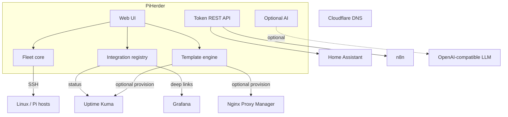

# PiHerder ecosystem roadmap

**Status:** Active  
**Date:** 2026-07-10  
**Related:** [SPEC.md](../SPEC.md) · [ADMIN.md](ADMIN.md)

This document is the public multi-horizon roadmap for taking PiHerder from a production-ready **fleet manager** to the hub of a self-hosted **homelab / security ops** ecosystem (DNS, proxy, monitoring, smart home, media, automation).

Design principles stay the same as SPEC:

- Auditable privileged actions  
- Secrets encrypted at rest; decrypt only in memory for jobs  
- Offline / air-gapped ready once built  
- Dangerous or external actions are **opt-in** (preview → confirm → audit)  
- Integrations are **optional** — core fleet ops work alone  

---

## Release track

| Version | Theme | Horizon |
|---------|--------|---------|
| **v0.2** | Production install story (image, compose, token REST, prod docs) | H0 |
| **v0.3** | Integration hub (links, Uptime Kuma status, Grafana deep links) | H1 |
| **v0.4** | Service templates + onboard wizards (monitor / DNS / TLS) | H2 |
| **v1.0** | Stable template schema + REST + docs + community process | H0–H2 freeze |

---

## Horizon 0 — Production readiness (v0.2)

| Item | Notes |
|------|--------|
| Docker Hub (or GHCR) image | Documented pull path; tags `0.2.x` + `latest` when published |
| Clean compose example | Relative volumes; no `~/` bind-mount assumptions |
| Token REST API | Admin-managed Bearer tokens: `read`/`jobs`/`edit` + feature scopes + IP allowlist; [API.md](API.md) |
| Production ADMIN guide | TLS, upgrades, metrics scrape, webhooks → Signal |
| Community scaffolding | SECURITY.md, Discussions/Discord pointers in README |

**Out of scope for H0:** templates, Uptime Kuma/Grafana product UI, HA plugin, AI.

---

## Horizon 1 — Integration hub (v0.3)

Read-mostly integrations: config + status + deep links.

- **Integration registry** — types such as Uptime Kuma, Grafana, Pi-hole (multi), NPM, Home Assistant, Frigate, n8n, generic URL  
- **Uptime Kuma** — poll availability; badges; “Open in Kuma”; optional down notifications  
- **Grafana** — URL templates (`{{host}}`); “Open in Grafana”; native high-level chips from existing fleet data  
- **Pi-hole** — generalize beyond single `PIHOLE_URL`  
- **NPM / Cloudflare / n8n** — admin URLs + docs (certs: NPM → n8n → consumers); no full zone control yet  

See planned design: `docs/FEATURE_PLAN_INTEGRATIONS.md` (when implemented).

---

## Horizon 2 — Service deployment templates (v0.4)

Versioned **templates**: compose/install recipe + variables + post-deploy checklist/actions.

On **add server** or **new Docker project**, offer:

1. Pick a template (or blank)  
2. Optional steps: monitoring (Kuma), DNS (Cloudflare or checklist), TLS/proxy (NPM), PiHerder feature flags  
3. Every automated step: **preview → confirm → audit**  

Curated pack targets a typical ecosystem: Pi-hole, Uptime Kuma, Grafana, Frigate, Home Assistant, NPM, n8n, media stack, generic web app.

Operators can **create / import / export** templates (manual import only — no remote unsigned marketplace at first).

---

## Horizon 3 — Deeper ecosystem

| Area | Direction |
|------|-----------|
| Home Assistant | Token REST first → optional custom component (sensors + safe actions); MQTT later |
| Plugin hooks | Prefer REST + n8n over arbitrary code on the herder host |
| Ansible / cloud-init | Inventory export + first-boot snippets for new Pis |
| Optional AI | OpenAI-compatible BYO (cloud or private LLM); **off by default**; never send private keys; Frigate vision stays on Frigate / AI Hat |

---

## Community & awareness (parallel)

| Channel | Role |
|---------|------|
| GitHub Issues | Bugs, features, template proposals |
| GitHub Discussions | Q&A, show-and-tell |
| Discord | Real-time help (link from README when live) |
| SECURITY.md | Vulnerability reporting |
| hacknow.info | Project story, clickthrough, professional context |

---

## Architecture (target)

---

## Decisions (locked unless reversed)

| Topic | Choice |
|-------|--------|
| Core vs integration | Integrations optional |
| Provisioning | Preview → confirm → audit |
| Automation glue | Prefer n8n + REST over embedding every vendor |
| AI | BYO OpenAI-compatible; off by default |
| Vision / Frigate LLM | Link only; not core PiHerder |
| Templates | DB metadata + files under `DATA_ROOT` |
| Multi-tenant orgs | Deferred |

---

## Success criteria

An operator can:

1. Install PiHerder from a published image in under ~15 minutes with trusted TLS.  
2. See fleet health and jump to Grafana / Uptime Kuma for detail.  
3. Onboard a service from a template with monitoring, DNS, and TLS/proxy steps.  
4. Automate via n8n + token API (and later HA).  
5. Optionally use a private LLM for summaries — never required.  
6. Find help on Discord / GitHub and the project story on hacknow.info.
