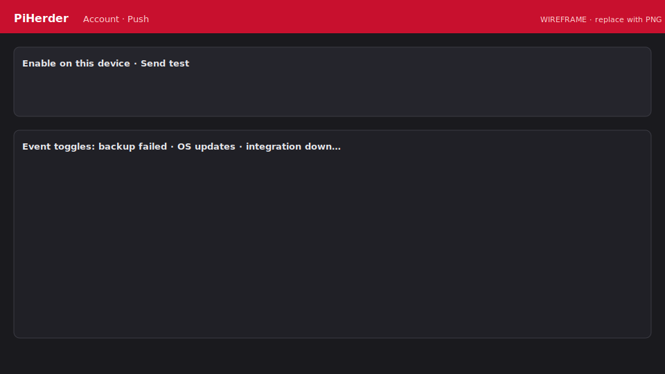

# PWA & Web Push

<figure class="ph-figure" markdown>
  
  <figcaption>Enable device + event toggles. <span class="ph-wireframe-badge">wireframe</span></figcaption>
</figure>

## Prerequisites

1. [Trusted HTTPS](../getting-started/https-tls.md) + stable `PIHERDER_PUBLIC_URL`.  
2. Web service running (VAPID auto-generated on startup).

## VAPID (default)

On web startup PiHerder **auto-generates** a VAPID key pair once and stores it in Postgres (`pushvapidconfig`). Private key is **Fernet-encrypted** with `PIHERDER_MASTER_KEY`. No script required for normal use.

Logs: `Web Push VAPID ready (source=generated)` (or `source=env` if overriding).

!!! warning "Do not rotate keys casually"
    Changing the VAPID private key invalidates every device subscription; users must re-enable push.

### Optional env pin

```bash
# Only if you intentionally pin keys after DB wipe
# VAPID_PUBLIC_KEY=...
# VAPID_PRIVATE_KEY=...
# VAPID_CONTACT=mailto:admin@yourdomain.com
```

## Enable on a device

### Android (Chrome)

1. Install PWA if prompted.  
2. **Account → Push notifications → Enable on this device**.  
3. **Send test notification** (your devices only).  
4. Toggle event types and save.

### iPhone / iPad (iOS 16.4+)

1. Safari → Share → **Add to Home Screen**.  
2. Open the **Home Screen icon** (not a plain Safari tab).  
3. Account → **Enable on this device**.  

Push does **not** work from a plain Safari tab.

## When push fires

Only when a **new** open in-app notification is created (not on every fingerprint refresh).

## In-app notifications without push

The bell inbox still works if VAPID is unavailable.

## Troubleshooting

[Push / PWA](../troubleshooting/push.md)
