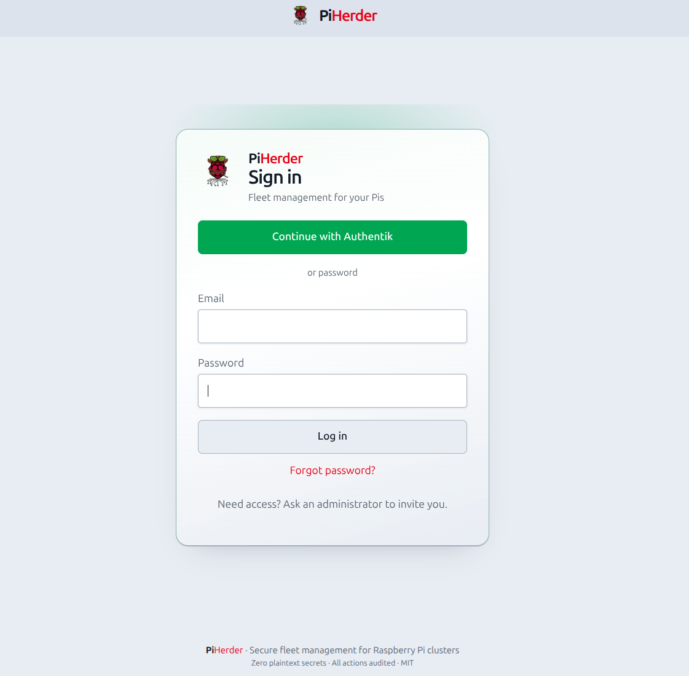
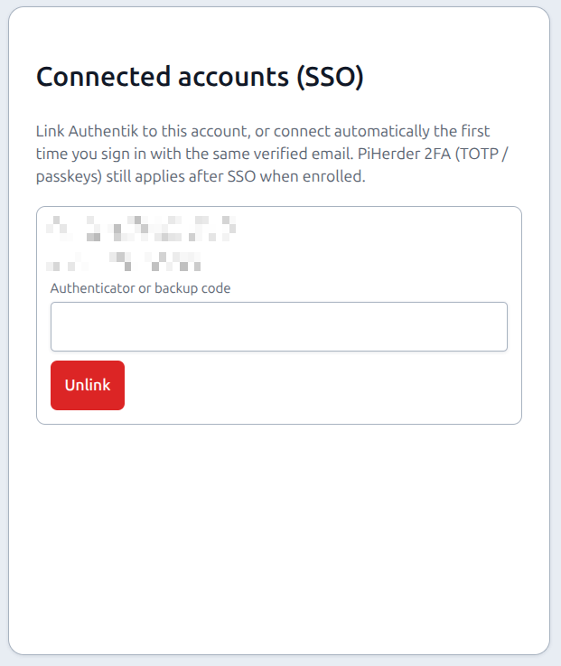

# SSO / OpenID Connect

## What this is

Optional **sign-in with your own OpenID Connect (OIDC) identity provider** — Authentik, Keycloak, Authelia, Google Workspace, Microsoft Entra ID, and similar.

Local **password login stays available** for break-glass (unless you remove a user’s password after linking SSO). PiHerder **2FA** (TOTP and/or passkeys) still applies after SSO when enrolled or when **Force 2FA** is on.

**Train:** v1.2 Stream **S** — [FEATURE_PLAN_SSO_OIDC.md](https://github.com/bjorngluck/piherder/blob/main/docs/FEATURE_PLAN_SSO_OIDC.md) · lab smoke: [SSO_AUTHENTIK_TEST.md](https://github.com/bjorngluck/piherder/blob/main/docs/SSO_AUTHENTIK_TEST.md)

## Why it exists

Many labs already have a central IdP. SSO reduces password sprawl while keeping an air-gapped recovery path when the IdP is down.

---

## End-to-end: enable SSO

1. Set `PIHERDER_PUBLIC_URL` to the **exact** origin operators open in the browser (include `:8443` if you use mapped HTTPS).  
2. In your IdP, create a **confidential** OIDC client (authorization code + PKCE).  
3. Register redirect URI (exact match):

   ```text
   {PIHERDER_PUBLIC_URL}/auth/oidc/callback
   ```

4. As **admin** → **Settings → General → SSO / OpenID Connect**:
   - Enable SSO  
   - Paste **issuer**, **client id**, **client secret**  
   - Map IdP groups → `admin` / `operator` / `viewer`  
5. Sign out → login page → **Continue with …**  
6. Optionally **Account → Connected accounts** to link/unlink; optional **Remove password** after a good link.

<figure class="ph-figure" markdown>
  
  <figcaption>Settings → General → SSO / OpenID Connect — issuer, client, group map, redirect URI.</figcaption>
</figure>

<figure class="ph-figure" markdown>
  
  <figcaption>Sign in — Continue with Authentik (or your display name) plus the password form.</figcaption>
</figure>

---

## Settings fields

**Where:** **Settings → General** (`/herder-backups?tab=general`) → **SSO / OpenID Connect**.

| Field | Purpose |
|-------|---------|
| **Enable SSO** | Show login button; allow OIDC flow |
| **Display name** | Button label (e.g. `Authentik`) |
| **Issuer URL** | OIDC issuer (discovery at `{issuer}/.well-known/openid-configuration`). Authentik usually ends with a slash (`…/application/o/<slug>/`); both forms are accepted. |
| **Client ID / secret** | Confidential client; secret stored **Fernet-encrypted** in DB (self-backup includes it) |
| **Scopes** | Default `openid email profile` (+ groups scope if your IdP needs it) |
| **Role claim path** | e.g. `groups` or `realm_access.roles` |
| **Group → role map** | **Add mapping…** modal: type IdP group name, pick role (viewer / operator / admin), **Add**. List shows mappings with **Remove**. Highest privilege wins if several groups match. |
| **Default role** | Used when no group matches (default **viewer**) |
| **Sync roles on login** | Update role from claims on every SSO login (sole admin not demoted if it would leave zero admins; audit `user_role_sync_skipped`) |
| **Auto-link by email** | First SSO login links to an existing active user with the **same verified email** |
| **Require email verified** | IdP must send `email_verified=true`. **Missing or false is not verified** (auto-link / require-verified fail closed). |
| **Allowed email domains** | Optional allow-list (comma-separated) |
| **Require SSO** | Hide password form. **Non-admins cannot `POST /auth/login`**. **Admins stay password break-glass**. Disable this or use [host recovery](../troubleshooting/locked-out.md) if the IdP is down. |

Redirect URI for the IdP is shown on the Settings card (same as above).

!!! warning "Issuer must be reachable from the PiHerder **web** container"
    If PiHerder runs in Docker and issuer is `http://localhost:9000`, discovery uses the **container’s** localhost. Prefer a host/LAN URL both the browser and the container can reach. Lab notes: [SSO_AUTHENTIK_TEST.md](https://github.com/bjorngluck/piherder/blob/main/docs/SSO_AUTHENTIK_TEST.md).

---

## How users get linked

| Path | What happens |
|------|----------------|
| **SSO → local (auto)** | Login with IdP; if `(issuer, subject)` unknown but **email matches** one active local user → **auto-link** + login |
| **SSO → new user (JIT)** | No match → create user with role from map (or default), password login **off**, SSO linked |
| **Local → SSO (explicit)** | Signed in → **Account → Connected accounts → Link …** (confirm passkey or authenticator, then Link). Browser goes to the IdP; after consent you return linked. |

<figure class="ph-figure" markdown>
  
  <figcaption>Account → Connected accounts — linked issuer and unlink.</figcaption>
</figure>

Identity key is **`(issuer, subject)`**, not email alone. Email is only for soft match / display.

---

## Password optional (SSO-only)

After at least one SSO link:

| Action | Where | Notes |
|--------|--------|--------|
| **Remove password** | Account → Password | Confirms with 2FA (if enrolled) or current password; then password login fails for that user |
| **Set password** | Account → Password | Restores break-glass local login |
| **Unlink SSO** | Account → Connected accounts → **Unlink…** | Opens a **confirmation sheet** (issuer + email). Confirm with passkey or authenticator/backup in that sheet. If password was removed, **set a password in the same sheet** before unlink completes — never leave zero login methods. Failed step-up stays on this sheet (does not open the authenticator-app card). |

---

## 2FA and SSO

PiHerder does **not** skip its own 2FA because the IdP already authenticated you.

| Situation | Behaviour |
|-----------|-----------|
| User has TOTP and/or passkey | After IdP callback → same **2FA step-up** as after password (or trusted device skip) |
| Force 2FA; no factor enrolled | After identity proven → force-2FA enroll wall |
| Link / unlink / remove password | Re-validate 2FA **in the same sheet** when enrolled. **v1.3:** any enrolled factor (Confirm passkey, TOTP, backup). Password only when no 2FA is enrolled. Unlink is **Unlink…** → confirm sheet, not a one-click POST. |

IdP MFA (if any) is **extra**, not a substitute for PiHerder TOTP/passkeys. Details: [2FA & force 2FA](two-factor.md).

---

## Login UX

- SSO enabled → primary **Continue with {display name}** on `/auth/login`.  
- **Require SSO** off → password form still shown.  
- **Require SSO** on → password form **hidden**; non-admin password POSTs are **rejected**; **admin password login still works**.

---

## Audit

| Action | Meaning |
|--------|---------|
| `sso_login` / `sso_login_failed` | SSO session attempt |
| `sso_link` | Linked (email auto-link, explicit Account link, or JIT) |
| `sso_unlink` | Unlinked |
| `sso_user_provisioned` | JIT user created |
| `user_role_changed` | Role updated from IdP groups |
| `user_role_sync_skipped` | Sole admin would have been demoted; role left unchanged |
| `user_password_removed` / `user_password_set` | Password lifecycle after SSO |

Also emits `user_login` on successful SSO for last-login / history consistency.

---

## Recovery if IdP is down

1. Local **password** login (if not removed).  
2. Admin **Users** recovery or host [recover-admin](../troubleshooting/locked-out.md).  
3. Temporarily disable **Require SSO** (admin session or DB settings) if the password form was hidden.

Do **not** enable **Require SSO** and **Remove password** for every admin without a tested break-glass path.

---

## Lab Authentik

Throwaway compose and full smoke matrix:

- [docker-compose.authentik.yml](https://github.com/bjorngluck/piherder/blob/main/docker-compose.authentik.yml)  
- [docs/SSO_AUTHENTIK_TEST.md](https://github.com/bjorngluck/piherder/blob/main/docs/SSO_AUTHENTIK_TEST.md)

---

## Related

- [2FA & force 2FA](two-factor.md)  
- [Users](users.md)  
- [Settings](../operations/settings.md)  
- [Environment reference](../operations/env-reference.md) — `PIHERDER_PUBLIC_URL`  
- [SECURITY.md](https://github.com/bjorngluck/piherder/blob/main/SECURITY.md)  
- [ADMIN.md § SSO](https://github.com/bjorngluck/piherder/blob/main/docs/ADMIN.md)
