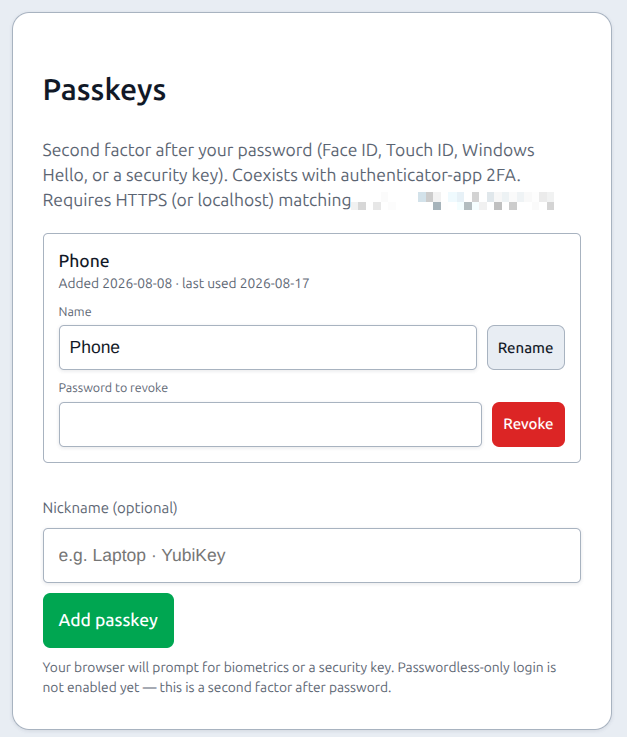
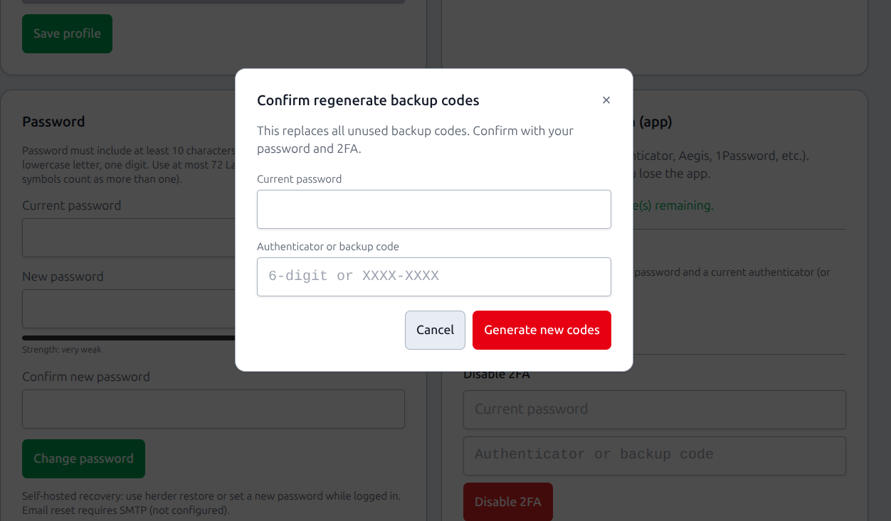

# 2FA & force 2FA

## What this is

Optional **second-factor** authentication for user accounts:

| Factor | Notes |
|--------|--------|
| **TOTP** (authenticator app) | Google Authenticator, Aegis, 1Password, etc. + one-time **backup codes** |
| **Passkeys** (WebAuthn) | Face ID / Touch ID / Windows Hello / security keys — **after password** (not passwordless yet) |

Plus an admin **force 2FA** policy that requires everyone to enrol **either** factor before using the fleet UI. Template secrets still use a **separate step-up** TOTP even after login 2FA.

**Available from v1.2.0:** passkeys as a second factor (register / list / revoke on Account; login step-up). **SSO / OIDC** login uses the **same** PiHerder 2FA gates — see [SSO / OpenID Connect](sso-oidc.md).

## Why it exists

Password-only access to a fleet control plane is risky on shared or exposed URLs. 2FA raises the bar for stolen passwords; force 2FA is for households/teams that want a policy floor. Step-up for secrets limits how long cleartext passwords stay on screen after a unlocked session.

---

## End-to-end: protect the instance

1. As a user: **Account** → enable TOTP **and/or** add a **passkey** → if using TOTP, store **backup codes** offline.  
2. Optional **trusted device** (default **30 days**, from `TRUSTED_DEVICE_DAYS`) if you accept that trade-off — only on machines you control.  
3. As admin: **Settings → Security policy → Who must enrol 2FA** (everyone, operators+, or admins). Optional **grace 0–60 days**.  
4. Users in scope without any second factor hit `/auth/force-2fa` after password **or SSO** login (password change-on-first still first if required), then **Set up 2FA on Account**.  
5. For templates, enable **Require 2FA for template deploy & secrets** if operators should not deploy without TOTP.

---

## Optional per-user 2FA

**Account** (`/auth/account`) — profile, password, avatar, **passkeys**, enable TOTP, save **backup codes**, **trusted devices** (revocable), and push preferences.

### Passkeys (WebAuthn)

**Account → Passkeys** (`#account-passkeys`):

1. Click **Add passkey** (optional nickname).  
2. Complete the browser prompt (biometrics or security key).  
3. At next login, after password **or SSO**, choose **Use passkey** (or still enter a TOTP/backup code if enrolled).

| Requirement | Detail |
|-------------|--------|
| **RP ID** | From `PIHERDER_HOSTNAME` (or host of `PIHERDER_PUBLIC_URL`) |
| **Origin** | From `PIHERDER_PUBLIC_URL` (must match the URL in the browser bar) |
| **HTTPS** | Required except `localhost` — LAN HTTP without matching RP/origin will fail registration |
| **Limit** | Up to 10 passkeys per user |
| **Revoke** | **v1.3:** any enrolled 2FA (passkey step-up, TOTP, or backup code). Password only when no 2FA is enrolled. SSO-only users can revoke without a local password. |

<figure class="ph-figure" markdown>
  
  <figcaption>Account → Passkeys — named credentials and Add passkey.</figcaption>
</figure>

Passkeys satisfy **force 2FA** the same way TOTP does. Passwordless (discoverable credential only, no password) is **not** enabled in v1.2.

### Authenticator app (TOTP)

**Account → Two-factor authentication** (`#account-2fa`).

**Regenerate backup codes** (Account → Two-factor):

1. Click **Generate new codes…**  
2. Confirm modal: **current password** + **authenticator code** (or one unused backup code).  
3. On success, new codes are shown **once** (delivered via an HttpOnly flash cookie — **not** in the URL); old unused codes are invalidated; trusted devices are revoked.

Password alone is **not** enough — this is a deliberate step-up so a stolen session password cannot mint recovery codes.

### Trusted devices

On the 2FA login screen you may **trust this device** for N days (Settings / env default **30**). While trusted, that browser skips the second-factor prompt after password **or SSO** login.

- **Sign out does not clear trust** — you still need the password, but not the authenticator, until the cookie expires or you revoke it.  
- Cookie is **per account** (`trusted_device_{user_id}`) so two logins on one browser do not overwrite each other.  
- Checking “Trust this device” again on an already-trusted browser **refreshes** the same entry instead of adding a duplicate.

**Account → Trusted devices** shows each row with:

| Field | Source |
|-------|--------|
| **Display / friendly name** | Optional rename (e.g. “Work laptop”) — save per row (✎ Edit, not always-open form) |
| **Device type** | Summarised from the browser user-agent |
| **Last IP** | Last seen client IP for that trust cookie |
| **Last used / expires** | App timezone timestamps |

<figure class="ph-figure" markdown>
  
  <figcaption>Account — 2FA, backup codes, trusted devices (type, last IP, rename).</figcaption>
</figure>
| **Revoke** | One device or **Revoke all** |

| Risk | Mitigation |
|------|------------|
| Stolen laptop with a trusted cookie | Revoke under **Account → Trusted devices**; password change / **Revoke all** clears trust |
| Shared kiosk | Never enable trust |

Cookies are **HttpOnly**, **SameSite=Lax**, `path=/`, and **Secure** when `PIHERDER_PUBLIC_URL` is `https://…` (or `COOKIE_SECURE=true`).

### Login rate limits

Rough production defaults (in-process; disabled when `PIHERDER_DISABLE_AUTH_RATE_LIMIT` is on for E2E):

| Surface | Limit (approx.) |
|---------|-----------------|
| Password login | 10 attempts / 5 minutes / IP |
| SSO login start | Same order of magnitude per IP |
| 2FA code | 12 attempts / 5 minutes / IP |
| Registration | 8 attempts / 10 minutes / IP |

## Force 2FA (who must enrol)

**Where:** **Settings** → **Security policy**. **Available from v1.3.**

| Setting | Effect |
|---------|--------|
| **Who must enrol** | Off · **admins** · **operators and admins** · **everyone**. Users in scope without TOTP **or** a passkey go to `/auth/force-2fa`. |
| **Grace** | 0–60 days after you turn the policy on (home-lab). 0 = immediate. |
| **Trusted device skips login 2FA** | Default **on** (same as v1.2). |
| **Trusted device skips the enrol wall** | Default **off**. |
| **Step-up windows** | Account / secrets / **console grant** minutes. |
| **Allowed factors** | Per surface (login, account, secrets, console) × TOTP / passkey / backup. Console backup codes stay **off** by default. |
| **Console 2FA extras** | Every-new-shell, prefer/require passkey — same card. Timeouts live under [Settings → Console](../operations/settings.md#console). |

Password change-on-first-login still runs first if required. Applies after **password and SSO** identity proof.

Stored in PostgreSQL (`appsetting`) — travels with DB dumps and self-backup.

### Lost factors / sole admin

If force 2FA is on and the only admin lost TOTP and passkeys, use host recovery — not this Settings page:

→ **[Locked out / sole admin recovery](../troubleshooting/locked-out.md)** (`./scripts/recover-admin.sh`)

## SSO login and 2FA

| Entry path | PiHerder 2FA |
|------------|--------------|
| Password | Existing step-up when TOTP/passkey enrolled |
| **SSO (OIDC)** | **Same helpers** — IdP is first factor only; enrolled 2FA still required; Force 2FA enroll wall still applies |
| Account link / unlink / remove password | Re-check 2FA when enrolled ([SSO page](sso-oidc.md)) |

IdP multi-factor does **not** replace PiHerder 2FA unless an admin enables **IdP MFA satisfies PiHerder login 2FA** (default **off**). Missing or unknown `amr` / `acr` values fail closed. That option never skips Account, secrets, or console step-up.

## Template step-up

Viewing cleartext template secrets requires a **separate** TOTP unlock (step-up), even if you already completed login 2FA. See [Template secrets](../service-templates/secrets.md).

Optional: **Require 2FA for template deploy & secrets** in Security policy.
