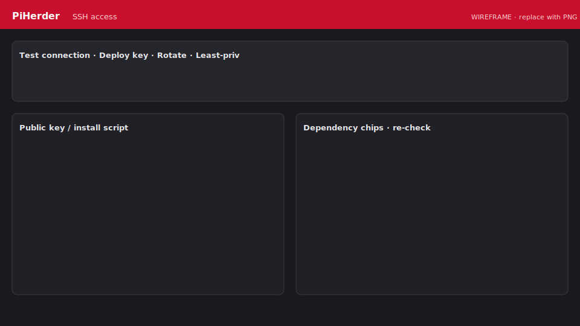
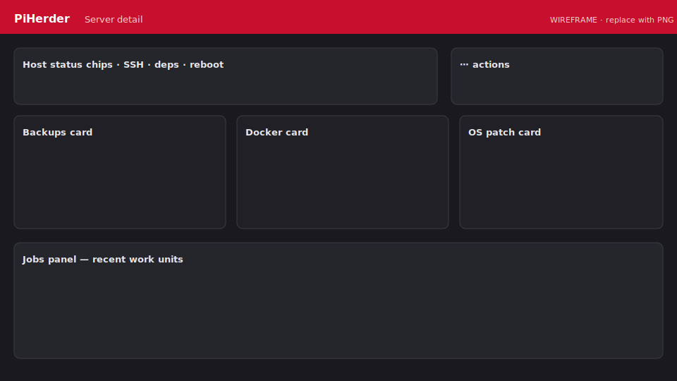

# Add a server

## Steps

1. **Servers → Add server** (or equivalent CTA).  
2. Enter **name**, **hostname/IP**, SSH port/user.  
3. **Generate** a keypair (recommended) or upload a private key.  
4. Optionally store a **one-time SSH password** only to bootstrap key deploy.  
5. Save, open the server → **SSH access**.

<figure class="ph-figure" markdown>
  
  <figcaption>SSH access: deploy key, test, rotate, least-priv, dependency chips. wireframe</figcaption>
</figure>

## SSH access panel

| Action | What it does |
|--------|----------------|
| **Test connection** | Verifies key (or password) login, then refreshes **host dependency** probes when login succeeds |
| **Check dependencies** | Probes `rsync` / docker / apt for **enabled** features only (SSH already works) |
| **Deploy key** | Installs public key into `authorized_keys`; verifies key-only login |
| **Rotate key** | New keypair, deploy, swap only after verify succeeds |
| **Least-priv user** | Optional `piherder` user + limited sudoers (Pi OS / Ubuntu) |

Dependency chips on the server page are **read-only** snapshots; re-check from **SSH access** (onboarding lives there).

!!! tip "Clear stored passwords"
    After key auth works, clear any stored SSH password so secrets stay keys-only (encrypted at rest with `PIHERDER_MASTER_KEY`).

### Least-privilege user (Debian / Pi OS / Ubuntu)

- Creates e.g. `piherder` with key-only login  
- Optional `docker` group  
- Sudoers for rsync/test and optional apt/reboot (`visudo -cf` before install)  
- **Run on host** re-points `ssh_username` after verify  
- **HAOS / specialised:** instructions only — not automated  

### Docker base dir (Option B)

If stacks live under another user’s home (e.g. `/home/bjorn/docker`):

1. Set **Docker base dir** to that **absolute** path (not `~/docker` after switching to the `piherder` user).  
2. Run the **Option B ACL script** from SSH access so the service user can traverse the tree.

`~/docker` expands to the **SSH** user’s home and breaks restart/build/logs after re-pointing to `piherder`.

## Server detail layout

After onboarding, the server page uses the shared **ops-hero** plus equal **destination cards** (desktop grid): **Backups**, **Docker**, **Services**, optional **Grafana** / **SSH (Uptime Kuma)**, and **Host status** (⋯ actions). Host dependency chips stay above as a snapshot; full SSH onboarding stays under **SSH access**. Child pages (Backups, Docker, Services) reuse the same hero width and card rhythm.

## Feature flags

**Edit → Features** — enable only what you need:

| Flag | Unlocks |
|------|---------|
| Backups | rsync backup/restore UI + schedules |
| OS patch | apt check/apply |
| Docker / containers | Docker page, container patch, templates deploy targets |

Disabled features are **hard-hidden** from dest cards and ⋯ menus.

On the **Servers** list, bulk actions (check/upgrade OS, check/patch containers, backup) only queue hosts with the matching flag enabled — see [Bulk actions](updates-and-patching.md#bulk-actions-servers-list).

## Schedules

**Edit → Schedules** — update **checks** (safe) and optional **apply** (real upgrades). See [Updates & patching](updates-and-patching.md).

## Host dependency check

After key deploy / least-priv / test, PiHerder stores a dependency snapshot. Failures show install/privilege **hints only** — nothing is auto-installed on the remote.

## Host status / diagnostics

From server detail **Host status** (⋯) or related chips, PiHerder can show a short **system info** snapshot over SSH (OS/kernel, reboot-pending, disk free — cached briefly). This is read-only diagnostics, not continuous monitoring (use Kuma for uptime).

<figure class="ph-figure" markdown>
  
  <figcaption>Server detail with status chips and feature cards. wireframe</figcaption>
</figure>
