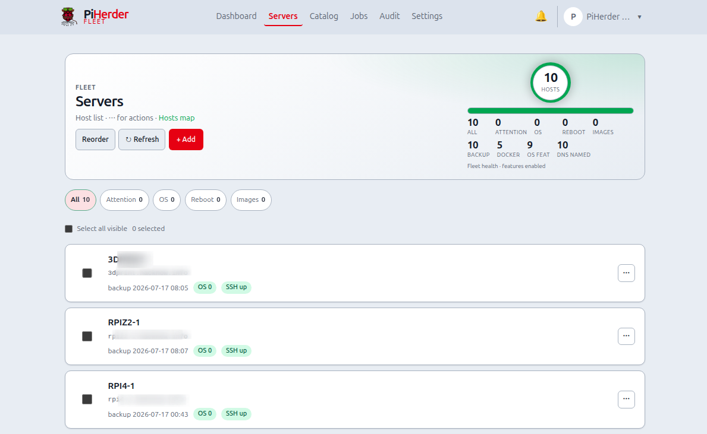
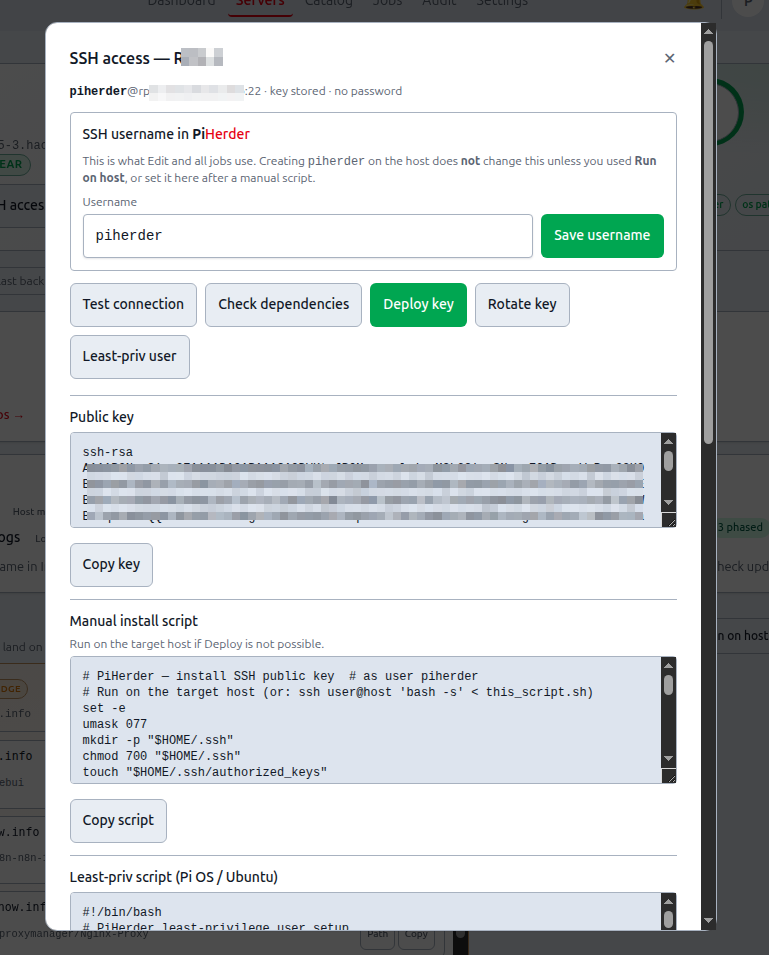
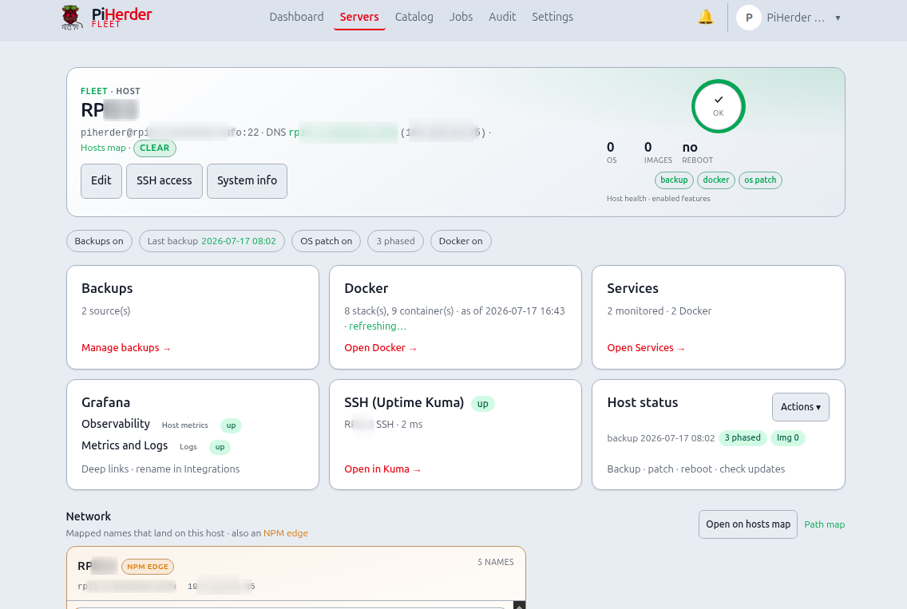

# Add a server

## What this is

A **server** in PiHerder is one fleet host (Raspberry Pi, Debian/Ubuntu box, or specialised OS like HAOS) that the control plane reaches over **SSH**. Everything else — backups, apt, Docker, templates — hangs off this record.

## Why it exists

Without a server record you have no place to store the encrypted SSH key, feature flags, schedules, or job history. Adding a server is the bridge from “I have a Pi on the LAN” to “PiHerder can act on it safely and repeatedly.”

## When to use it

- First host after install  
- Every new Pi / VM / metal box you want under the same dashboard  
- Replacing a host: often **add new** then [remove](remove-server.md) the old one after cutover  

<figure class="ph-figure" markdown>
  
  <figcaption>Servers list — filter chips, status from last checks, bulk bar when selected, ⋯ per host.</figcaption>
</figure>

---

## End-to-end: first Pi (wizard — primary path)

**Servers → + Add** opens the **guided wizard** (`/servers/new`). Prefer this for a new host.

1. **Identity** — display name, hostname/IP, SSH user and port.  
2. **Trust** — generate a keypair (recommended), or upload a key; optional **one-time password** only to bootstrap key deploy.  
3. **Connect** — **view/copy the public key** (or install script) if you install by hand, or **Deploy key** with an optional one-time password → **Test connection** until login succeeds → **Clear stored password** when key-only works.  
4. **Privilege** — optional least-priv user on Pi OS / Ubuntu; **skip automated least-priv on HAOS** (copy explains).  
5. **Features** — enable Backups / OS patch / Docker only as needed.  
6. **Schedules** — prefer **check-only** schedules first; deep edit stays on the server page.  
7. **Network** — optional FQDN / Pi-hole A later on the host or Catalog.  
8. **Done** — open the server, run a first backup or update check when ready.

**Save & exit** at any step after Identity leaves a partial host on the fleet; open the server or resume via  
`/servers/new?step=connect&server_id=…` (or the next incomplete step).

**Done when:** Test connection succeeds; dependency chips match enabled features; password bootstrap is gone.

!!! tip "Advanced form"
    Prefer the wizard. For a one-shot form, use **Advanced form** on the wizard page (`/servers/new/advanced`) or legacy `/servers/add` — same create engine, no step chrome.

---

## Wizard steps (reference)

| Step | What you set | Notes |
|------|----------------|-------|
| Identity | Name, host, SSH user/port | Creates the server row |
| Trust | Generate / upload key; optional password | Secrets encrypted with `PIHERDER_MASTER_KEY` |
| Connect | Deploy key, test, clear password | Uses the same SSH services as the detail panel |
| Privilege | Least-priv guidance | Automated least-priv on Debian/Pi OS only |
| Features | Backups / OS / Docker toggles | Can change later on the server |
| Schedules | Guidance for checks-only | Full cron UI on server **Edit** |
| Network | Optional DNS / maps | Needs Pi-hole (or fabric) when you want A records |
| Done | Summary + next job CTAs | Add another host or open Docker if enabled |

<figure class="ph-figure" markdown>
  
  <figcaption>SSH access on the server page: deploy key, test, rotate, least-priv, dependency chips (also linked from the wizard Connect step).</figcaption>
</figure>

## SSH access panel (detail)

The wizard Connect step covers deploy / test / clear password. The full **SSH access** panel on the server page also has rotate key, least-priv scripts, and dependency re-check.

| Action | What it does | Why |
|--------|----------------|-----|
| **Test connection** | Verifies key (or password) login, then refreshes **host dependency** probes when login succeeds | Proves the path before you queue jobs |
| **Check dependencies** | Probes `rsync` / docker / apt for **enabled** features only | Failures become hints, not silent job fails later |
| **Deploy key** | Installs public key into `authorized_keys`; verifies key-only login | Stops depending on passwords |
| **Rotate key** | New keypair, deploy, swap only after verify succeeds | Safe rotation if a key may have leaked |
| **Least-priv user** | Optional `piherder` user + limited sudoers (Pi OS / Ubuntu) | Limits blast radius of the herder account |

!!! tip "Clear stored passwords"
    After key auth works, clear any stored SSH password (wizard Connect or server edit) so secrets stay keys-only.

### Least-privilege user (Debian / Pi OS / Ubuntu)

**Why:** Running every job as your personal `pi`/`ubuntu` user mixes human logins with automation. A dedicated user with narrow sudoers is easier to reason about and revoke.

- Creates e.g. `piherder` with key-only login  
- Optional `docker` group  
- Sudoers for rsync/test and optional apt/reboot (`visudo -cf` before install)  
- **Run on host** re-points `ssh_username` after verify  
- **HAOS / specialised:** instructions only — not automated  

### Docker base dir (Option B)

If stacks live under another user’s home (e.g. `/home/bjorn/docker`):

1. Set **Docker base dir** to that **absolute** path (not `~/docker` after switching to the `piherder` user).  
2. Run the **Option B ACL script** from SSH access so the service user can traverse the tree.

`~/docker` expands to the **SSH** user’s home and breaks restart/build/logs after re-pointing to `piherder`.

## Server detail layout

After onboarding, the server page uses the shared **ops-hero** plus equal **destination cards** (desktop grid): **Backups**, **Docker**, **Services**, optional **Grafana** / **SSH (Uptime Kuma)**, and **Host status** (⋯ actions). Host dependency chips stay above as a snapshot; full SSH onboarding stays under **SSH access**. Child pages (Backups, Docker, Services) reuse the same hero width and card rhythm.

## Feature flags

**Wizard Features** or **Edit → Features** — enable only what you need:

| Flag | Unlocks | Why a flag |
|------|---------|------------|
| Backups | rsync backup/restore UI + schedules | Hosts without files to protect stay quiet |
| OS patch | apt check/apply | Skips apt probes on non-Debian hosts |
| Docker / containers | Docker page, container patch, templates deploy targets | HAOS or bare metal without Docker stay simple |

Disabled features are **hard-hidden** from dest cards and ⋯ menus.

On the **Servers** list, bulk actions (check/upgrade OS, check/patch containers, backup) only queue hosts with the matching flag enabled — see [Bulk actions](updates-and-patching.md#bulk-actions-servers-list).

## Schedules

Prefer **check-only** schedules first. **Edit → Schedules** on the server for cron detail. See [Updates & patching](updates-and-patching.md).

**Why start with checks only:** scheduled apply is powerful; quiet weekly checks build trust before you automate upgrades.

## Host dependency check

After key deploy / least-priv / test, PiHerder stores a dependency snapshot. Failures show install/privilege **hints only** — nothing is auto-installed on the remote (so a production host never gets surprise packages).

## Host status / diagnostics

From server detail **Host status** (⋯) or related chips, PiHerder can show a short **system info** snapshot over SSH (OS/kernel, reboot-pending, disk free — cached briefly). This is read-only diagnostics, not continuous monitoring (use Kuma for uptime).

<figure class="ph-figure" markdown>
  
  <figcaption>Server detail with status chips and feature cards.</figcaption>
</figure>

## Later onboarding depth

Richer bootstrap scripts, first-boot enrollment, and optional Web SSH remain later host-lifecycle phases — [FEATURE_PLAN_HOST_LIFECYCLE.md](https://github.com/bjorngluck/piherder/blob/main/docs/FEATURE_PLAN_HOST_LIFECYCLE.md). Ship plan: [PLAN_v0.7.0.md](https://github.com/bjorngluck/piherder/blob/main/docs/PLAN_v0.7.0.md).

## Related

- [Remove a server](remove-server.md) — UI teardown + optional host cleanup  
- [Backups](backups.md) · [Updates](updates-and-patching.md) · [Docker](../docker/overview.md)  
- Journey A: [Operator scenarios](../getting-started/operator-scenarios.md#journey-a)  
