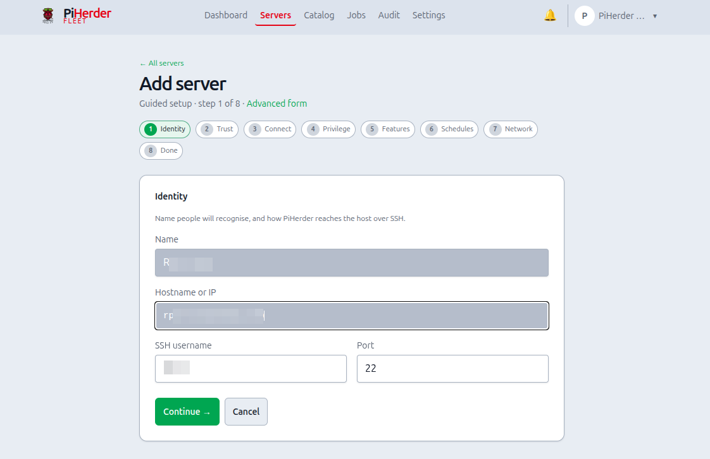
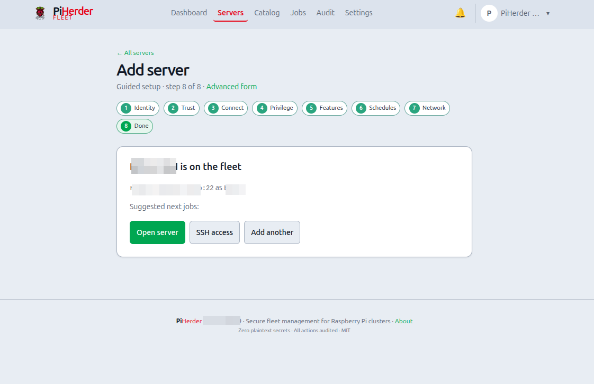

# Add a server

## What this is

A **server** in PiHerder is one fleet host (Raspberry Pi, Debian/Ubuntu box, or specialised OS like HAOS) that the control plane reaches over **SSH**. Everything else — backups, apt, Docker, templates — hangs off this record.

## Why it exists

Without a server record you have no place to store the encrypted SSH key, feature flags, schedules, or job history. Adding a server is the bridge from “I have a Pi on the LAN” to “PiHerder can act on it safely and repeatedly.”

## When to use it

- First host after install  
- Every new Pi / VM / metal box you want under the same dashboard  
- Replacing a host: often **add new** then [remove](remove-server.md) the old one after cutover  

<figure class="ph-figure" markdown>
  
  <figcaption>Servers list — filter chips, status from last checks, bulk bar when selected, ⋯ per host.</figcaption>
</figure>

---

## End-to-end: first Pi (wizard — primary path)

**Servers → + Add** opens the **guided wizard** (`/servers/new`). Prefer this for a new host.

<figure class="ph-figure" markdown>
  
  <figcaption>Add-host wizard — multi-step onboarding (Identity through Done). v0.9 micro-copy: Connect is install key → test → clear password; Features explain HAOS / rsync. Recapture in progress if figure looks older.</figcaption>
</figure>

!!! note "Screenshots"
    Wizard and Done PNGs are on the **v0.9 recapture list** (operator testing). Until replaced, captions describe current UI; the image may still match an earlier pack — [screenshots README](https://github.com/bjorngluck/piherder/blob/main/wiki/assets/screenshots/README.md).

1. **Identity** — display name, hostname/IP, SSH user and port (creates the fleet row).  
2. **Trust** — generate a keypair (recommended), upload a key, or password-only (discouraged); optional **one-time password** only to bootstrap key deploy. Private material is encrypted at rest and never re-shown.  
3. **Connect** — ordered path: **install public key** (copy / install script / Deploy) → **Test connection** → **Clear stored password** when key-only works.  
4. **Privilege** — optional least-priv user on Pi OS / Ubuntu; **skip automated least-priv on HAOS** (wizard copy explains).  
5. **Features** — enable Backups / OS updates / Docker only as needed. OS updates = apt/dnf on Linux, or HA Core/OS/Supervisor via `ha` CLI on HAOS; leave Docker off on pure HAOS.  
6. **Schedules** — prefer **check-only** schedules first (counts without apply); deep edit stays on the server page.  
7. **Network** — optional FQDN / Pi-hole A later; safe to skip.  
8. **Done** — summary + next steps (HAOS-aware when the host was detected as HAOS).

**Save & exit** at any step after Identity leaves a partial host on the fleet; open the server or resume via  
`/servers/new?step=connect&server_id=…` (or the next incomplete step).

**Done when:** Test connection succeeds; dependency chips match enabled features; password bootstrap is gone.

!!! tip "Advanced form"
    Prefer the wizard. For a one-shot form, use **Advanced form** on the wizard page (`/servers/new/advanced`) or legacy `/servers/add` — same create engine, no step chrome.

---

## Wizard steps (reference)

| Step | What it means | What you set | Notes |
|------|---------------|--------------|-------|
| **Identity** | Who is this host on the fleet? | Name, hostname/IP, SSH user/port | Creates the server row. Hostname must resolve from the PiHerder container. HAOS: match SSH add-on user/port. |
| **Trust** | How will PiHerder authenticate? | Generate keypair (recommended), upload key, or password-only | Secrets encrypted with `PIHERDER_MASTER_KEY`. Private key is never shown again after save. Optional one-time password only for key bootstrap. |
| **Connect** | Prove SSH works; prefer keys-only | 1) Install public key · 2) Test connection · 3) Clear stored password | Copy key / install script / Deploy key. Test refreshes dependency chips (Docker, rsync, HAOS). |
| **Privilege** | Optional least-privilege user | Open least-priv on server, or skip | Automated least-priv on Debian/Pi OS only; **skip on HAOS** (keep the add-on user). |
| **Features** | What should PiHerder manage here? | Backups · OS updates · Docker | OS updates = apt/dnf **or** HA Core/OS/Supervisor via `ha` CLI. HAOS: enable HA updates + backups; leave Docker off — [HAOS hosts](haos-hosts.md). |
| **Schedules** | When do checks/applies run? | Guidance only; deep edit on server | Prefer **check-only** first (counts without apply). Safe to skip. |
| **Network** | Optional DNS / Pi-hole A records | Open host DNS fields, or skip | Needs Pi-hole (or fabric) when you want A records. Does not block SSH/backups. |
| **Done** | Host is on the fleet | Summary + next CTAs | HAOS-aware tips when detected; open server, SSH access, add another. |

**Save & exit** after Trust keeps a partial host; reopen the wizard with `server_id` or continue from the server page.

<figure class="ph-figure" markdown>
  
  <figcaption>Wizard Done step — summary and next CTAs.</figcaption>
</figure>

<figure class="ph-figure" markdown>
  
  <figcaption>SSH access on the server page: deploy key, test, rotate, least-priv, dependency chips (also linked from the wizard Connect step).</figcaption>
</figure>

## SSH access panel (detail)

The wizard Connect step covers deploy / test / clear password. The full **SSH access** panel on the server page also has rotate key, least-priv scripts, and dependency re-check.

| Action | What it does | Why |
|--------|----------------|-----|
| **Test connection** | Verifies key (or password) login, then refreshes **host dependency** probes when login succeeds | Proves the path before you queue jobs |
| **Check dependencies** | Probes `rsync` / docker / apt for **enabled** features only | Failures become hints, not silent job fails later |
| **Deploy key** | Installs public key into `authorized_keys`; verifies key-only login | Stops depending on passwords |
| **Rotate key** | New keypair, deploy, swap only after verify succeeds | Safe rotation if a key may have leaked |
| **Least-priv user** | Optional `piherder` user + limited sudoers (Pi OS / Ubuntu) | Limits blast radius of the herder account |

!!! tip "Clear stored passwords"
    After key auth works, clear any stored SSH password (wizard Connect or server edit) so secrets stay keys-only.

### Least-privilege user (Debian / Pi OS / Ubuntu)

**Why:** Running every job as your personal `pi`/`ubuntu` user mixes human logins with automation. A dedicated user with narrow sudoers is easier to reason about and revoke.

- Creates e.g. `piherder` with key-only login  
- Optional `docker` group  
- Sudoers for rsync/test and optional apt/reboot (`visudo -cf` before install)  
- **Run on host** re-points `ssh_username` after verify  
- **HAOS / specialised:** instructions only — not automated  

### Home Assistant OS (HAOS)

For a full HAOS appliance (SSH add-on + `ha` CLI + optional rsync):

1. Add the host as a server (SSH user often `root`).  
2. Set **Host profile → Home Assistant OS** under Edit → General (or let an OS check auto-mark).  
3. Enable **HA updates** (OS patch flag) and **Backups** as needed; leave Docker fleet off.  

Full checklist, System info, and update behaviour: **[HAOS hosts](haos-hosts.md)**.

### Docker base dir (Option B)

If stacks live under another user’s home (e.g. `/home/bjorn/docker`):

1. Set **Docker base dir** to that **absolute** path (not `~/docker` after switching to the `piherder` user).  
2. Run the **Option B ACL script** from SSH access so the service user can traverse the tree.

`~/docker` expands to the **SSH** user’s home and breaks restart/build/logs after re-pointing to `piherder`.

## Server detail layout

After onboarding, the server page uses the shared **ops-hero** plus equal **destination cards** (desktop grid): **Backups**, **Docker**, **Services**, optional **Grafana** / **SSH (Uptime Kuma)**, and **Host status** (⋯ actions). Host dependency chips stay above as a snapshot; full SSH onboarding stays under **SSH access**. Child pages (Backups, Docker, Services) reuse the same hero width and card rhythm.

## Feature flags

**Wizard Features** or **Edit → Features** — enable only what you need:

| Flag | Unlocks | Why a flag |
|------|---------|------------|
| **Backups** | rsync backup/restore UI + schedules | Hosts without files to protect stay quiet; needs `rsync` on the host (incl. HAOS SSH add-on) |
| **OS updates** (UI: OS patch / **HA updates** on HAOS) | Debian: apt check/apply. **HAOS:** Core / OS / Supervisor via `ha` CLI | Same feature flag; backend branches on host profile |
| **Docker / containers** | Docker page, container patch, template deploy targets | Leave **off** on pure HAOS — add-ons are not fleet Compose stacks |

Disabled features are **hard-hidden** from dest cards and ⋯ menus.

On the **Servers** list, bulk actions (check/upgrade OS, check/patch containers, backup) only queue hosts with the matching flag enabled — see [Bulk actions](updates-and-patching.md#bulk-actions-servers-list).

## Schedules

Prefer **check-only** schedules first. **Edit → Schedules** on the server for cron detail. See [Updates & patching](updates-and-patching.md).

**Why start with checks only:** scheduled apply is powerful; quiet weekly checks build trust before you automate upgrades.

## Host dependency check

After key deploy / least-priv / test, PiHerder stores a dependency snapshot. Failures show install/privilege **hints only** — nothing is auto-installed on the remote (so a production host never gets surprise packages).

## Host status / diagnostics

From server detail **Host status** (⋯) or related chips, PiHerder can show a short **system info** snapshot over SSH (OS/kernel, reboot-pending, disk free — cached briefly). This is read-only diagnostics, not continuous monitoring (use Kuma for uptime).

If the host is **linked** to a LAN Discovery device, a **LAN** link-style pill appears with the discovery IP (and open-port count when known). Open it to edit map name / type / role; **Save or Cancel returns to this server** (not the Integrations shell). Details: [LAN Discovery — edit modal](../integrations/lan-discovery.md#edit-modal-network--devices).

<figure class="ph-figure" markdown>
  
  <figcaption>Server detail with status chips and feature cards.</figcaption>
</figure>

## Later onboarding depth

Richer bootstrap scripts, first-boot enrollment, and optional Web SSH remain later host-lifecycle phases — [FEATURE_PLAN_HOST_LIFECYCLE.md](https://github.com/bjorngluck/piherder/blob/main/docs/FEATURE_PLAN_HOST_LIFECYCLE.md). Tagged baseline: [RELEASE_v0.8.0.md](https://github.com/bjorngluck/piherder/blob/main/docs/RELEASE_v0.8.0.md); active train: [PLAN_v0.9.0.md](https://github.com/bjorngluck/piherder/blob/main/docs/PLAN_v0.9.0.md).

## Related

- [HAOS hosts](haos-hosts.md) — appliance profile, System info, HA updates  
- [Remove a server](remove-server.md) — UI teardown + optional host cleanup  
- [Backups](backups.md) · [Updates](updates-and-patching.md) · [Docker](../docker/overview.md)  
- Journey A: [Operator scenarios](../getting-started/operator-scenarios.md#journey-a) · Journey C2: [HAOS](../getting-started/operator-scenarios.md#journey-c2)
