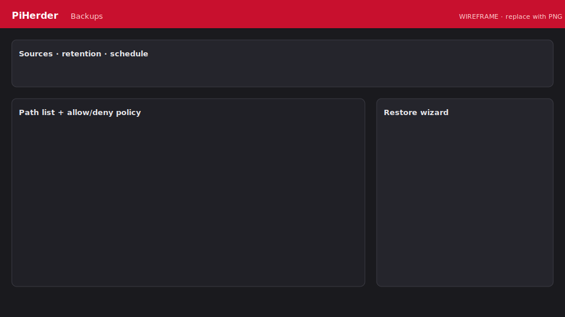

# Backups & restore

Per-server **rsync over SSH** to the PiHerder backup volume. Runs on **Celery** (not inside the web request).

## Enable backups

1. Server **Edit → Features** → enable **Backups**.  
2. Open the server’s **Backups** page (ops-hero + source cards — same width as other host pages).  
3. Add **source paths** on the remote host (configure form lists current sources; empty only when none are set).  
4. Optional: destination override, retention, cron schedule.  
5. **Path allow/deny** — default deny of OS roots; optional prefixes.

<figure class="ph-figure" markdown>
  
  <figcaption>Sources, policy, schedule, restore wizard. wireframe</figcaption>
</figure>

## How success is decided

- Each source must finish with `rc == 0` and no error classification.  
- Failed runs: status **failed**, audit error details, **`last_backup_at` not updated**.  
- Successful backups resolve open `backup_failed` notifications.

### rsync path

- Default: `--rsync-path "sudo -n rsync"` (or local sudo).  
- **Root user / HAOS:** plain `rsync` is auto-probed and used.

## Schedules

Enable + cron on the Backups page. Same server never runs two backups at once ([Redis mutex](../operations/multi-worker.md)); different hosts can run in parallel.

From the **Servers** list you can multi-select hosts and run **Backup** in bulk (only hosts with backups enabled) — [Bulk actions](updates-and-patching.md#bulk-actions-servers-list).

## Restore wizard

1. Backups page → restore for a source.  
2. **Dry-run** reverse rsync (preview).  
3. Confirm to apply.  
4. Path policy enforced; audit action `backup_restore`.

!!! warning "Restore is privileged"
    You are writing back onto the remote host. Prefer dry-run first.

## Retention

Retention cleanup is a separate job type (`retention`) driven by configured keep rules.

## Not the same as PiHerder self-backup

| | Server backups | Herder self-backup |
|--|----------------|--------------------|
| Data | Files from fleet hosts | PiHerder DB config, users, keys… |
| UI | Server → Backups | Settings → PiHerder backup |
| Volume | `/backups` | `/herder_backups` |

See [Self-backup & DR](../operations/self-backup.md).

## Troubleshooting

[Backups stuck or failing](../troubleshooting/backups.md)
