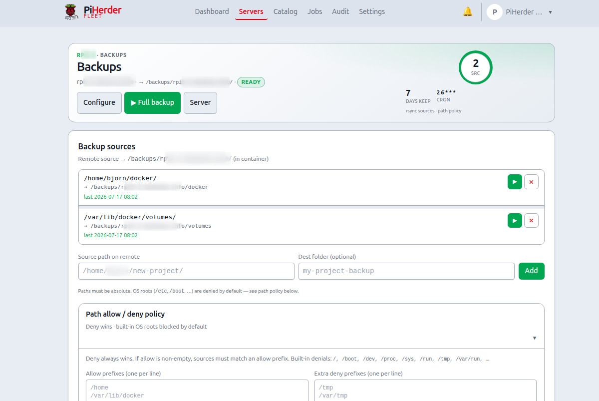

# Backups & restore

## What this is

**Server backups** copy chosen directories from a fleet host into the PiHerder host’s backup volume using **rsync over SSH**. Runs are **jobs** on **Celery** (not inside a web request), so a long rsync does not freeze the UI.

## Why it exists

Homelab hosts hold compose data, configs, and media that are painful to rebuild. PiHerder makes backup **repeatable, scheduled, audited, and restorable** without maintaining a separate cron library on every Pi. You choose **paths** and **policy**; the control plane handles queueing and history.

## What it is *not*

| Server backups (this page) | PiHerder self-backup |
|----------------------------|----------------------|
| Files from **fleet** hosts | Config of the **herder** itself (DB, users, keys…) |
| Server → **Backups** UI | Settings → **PiHerder backup** |
| Volume `/backups` (or host map) | Volume `/herder_backups` |

See [Self-backup & DR](../operations/self-backup.md) for the control plane.

---

## End-to-end: first backup you trust

1. On the server: **Edit → Features** → enable **Backups**.  
2. Open **Backups** → add at least one **source path** that exists on the remote (e.g. a compose data directory).  
3. Confirm path policy is not blocking that prefix.  
4. **Run backup** (manual) once.  
5. Watch [Jobs](jobs-audit-notifications.md) until **success**; open Audit for size summary.  
6. On the herder host, confirm files under the backup volume ([Volumes](../operations/volumes.md)).  
7. Restore wizard → **dry-run** for that source (no write).  
8. Only then enable a **cron schedule**.

**Done when:** success updates `last_backup_at`; you know how to reverse with dry-run first.

Full journey: [Operator scenarios — Journey B](../getting-started/operator-scenarios.md#journey-b).

---

## Enable backups

1. Server **Edit → Features** → enable **Backups**.  
2. Open the server’s **Backups** page (ops-hero + source cards — same width as other host pages).  
3. Use header **Configure** for schedule, destination paths, and sources (there is no second “Full configure” under sources).  
4. Add **source paths** on the remote host (configure form lists current sources; empty only when none are set).  
5. Optional: destination override, retention, cron schedule.  
6. **Path allow/deny** — default deny of OS roots; optional prefixes.

<figure class="ph-figure" markdown>
  
  <figcaption>Sources, policy, schedule, restore wizard.</figcaption>
</figure>

## How success is decided

| Outcome | Meaning |
|---------|---------|
| Success | Each source finishes with `rc == 0` and no error classification; `last_backup_at` updates |
| Failed | Status **failed**, audit error details, **`last_backup_at` not updated** |
| After success | Open `backup_failed` notifications resolve |

### rsync path

- Default: `--rsync-path "sudo -n rsync"` (or local sudo) so a least-priv user can still read protected trees.  
- **Root user / HAOS:** plain `rsync` is auto-probed and used when sudo is not available.

## Schedules

Enable + cron on the Backups page. Same server never runs two backups at once ([Redis mutex](../operations/multi-worker.md)); different hosts can run in parallel.

**Why a mutex:** overlapping rsync to the same destination corrupts snapshots and confuses retention.

From the **Servers** list you can multi-select hosts and run **Backup** in bulk (only hosts with backups enabled) — [Bulk actions](updates-and-patching.md#bulk-actions-servers-list).

## Restore wizard

**Why dry-run first:** restore **writes onto the remote host**. A preview reverse rsync shows what would change without committing.

1. Backups page → restore for a source.  
2. **Dry-run** reverse rsync (preview).  
3. Confirm to apply.  
4. Path policy enforced; audit action `backup_restore`.

!!! warning "Restore is privileged"
    You are writing back onto the remote host. Prefer dry-run first. Prefer restoring to a test path when learning.

## Retention

Retention cleanup is a separate job type (`retention`) driven by configured keep rules. **Why separate:** deleting old trees is independent of “did tonight’s rsync succeed?”

## Troubleshooting

[Backups stuck or failing](../troubleshooting/backups.md)
