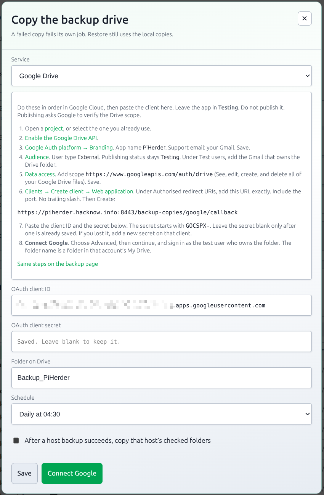
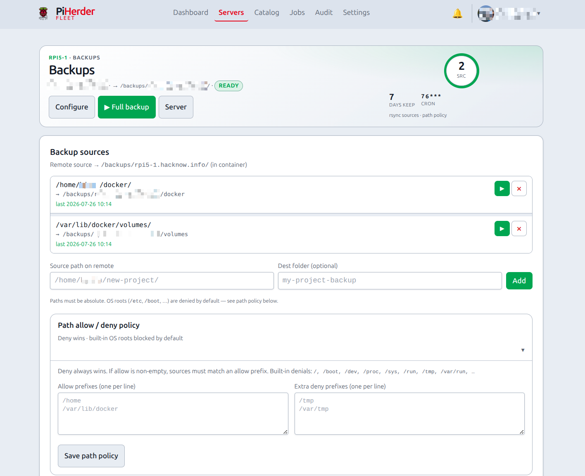

# Backups & restore

## What this is

**Server backups** copy chosen directories from a fleet host into the PiHerder host’s backup volume using **rsync over SSH**. Runs are **jobs** on **Celery** (not inside a web request), so a long rsync does not freeze the UI.

## Why it exists

Homelab hosts hold compose data, configs, and media that are painful to rebuild. PiHerder makes backup **repeatable, scheduled, audited, and restorable** without maintaining a separate cron library on every Pi. You choose **paths** and **policy**; the control plane handles queueing and history.

## What it is *not*

| Server backups (this page) | PiHerder self-backup |
|----------------------------|----------------------|
| Files from **fleet** hosts | Config of the **herder** itself (DB, users, keys…) |
| Server → **Backups** UI | Settings → **PiHerder backup** |
| Volume `/backups` (or host map) | Volume `/herder_backups` |

See [Self-backup & DR](../operations/self-backup.md) for the control plane.

### Copy to Google Drive (v1.8 train)

**Settings → PiHerder backup** has a card under the self-backup cards, titled **Copy the backup drive**. It ships in **1.8.0**. The **1.7.0** image has no such card.

<figure class="ph-figure" markdown>
  
  <figcaption>Copy the backup drive — signed in, folder Backup_PiHerder, daily at 04:30. Test checks the folder. The tree ticks what rclone copies. Copy now starts that job.</figcaption>
</figure>

| | |
|--|--|
| What it copies | Checked folders on the herder backup drive (`/backups`), not one host’s source list |
| Service | **Google Drive** can be saved. **OneDrive** and **LAN NAS / SMB** are in the list and cannot be selected |
| Account | A Google sign-in from this PiHerder. New files are owned by that Google account. A service account cannot store them on a personal Drive |
| Schedule | The same presets as other schedules, **Copy now**, and an optional copy after a host backup succeeds |
| Browser | Folder tree on the left, the open folder on the right. A ticked folder stays ticked inside. Untick a child to leave it behind |
| Job | **Drive copy** (`backup_replicate`) on the existing Celery worker. It may run for up to 7 days. Host backups stay on the 2-hour worker limit. A task failure, including the 7-day limit, marks the row failed so **Copy now** can run again. A hard kill of the worker process can leave the row **running**, and **Copy now** then returns that row until it is marked failed. Files already uploaded stay. A failure fails that job only. The host backup time stays |
| Restore | Still the local tree. The demo does not upload |

Pull `bjorngluck/piherder:1.8.0` before a real copy. rclone is in that image. Design: [FEATURE_PLAN_BACKUP_DESTINATIONS.md](https://github.com/bjorngluck/piherder/blob/v1.8.0/docs/FEATURE_PLAN_BACKUP_DESTINATIONS.md).

## Set up Google Drive

**Where in PiHerder:** Settings → **PiHerder backup** → **Copy the backup drive**. Pick **Google Drive**. OneDrive and a LAN share are listed and cannot be selected.

PiHerder opens Google, you approve access, and PiHerder stores that sign-in. Each new archive is created by your Google account inside a folder you own. rclone still uploads only files that are new or changed.

A self-hosted PiHerder cannot ship one Google client. Google only redirects to a URL registered on a client in your project, and the Drive scope is restricted. Leave the app in **Testing** and add your Gmail as a test user. Do not publish the app. Publishing asks Google to verify that scope, which a homelab does not need.

The redirect URL is shown in the PiHerder dialog. It is the address you use in the browser plus `/backup-copies/google/callback`. If that address is wrong, set `PIHERDER_PUBLIC_URL` to the same origin and reload.

1. Open [Google Cloud Console](https://console.cloud.google.com/) and select a project, or [create one](https://console.cloud.google.com/projectcreate).
2. [Enable the Google Drive API](https://console.cloud.google.com/apis/library/drive.googleapis.com) on that project.
3. Open [Google Auth platform → Branding](https://console.cloud.google.com/auth/branding). App name: **PiHerder**. User support email: your Gmail. Save. A logo is optional.
4. Open [Audience](https://console.cloud.google.com/auth/audience). User type: **External**. Publishing status stays **Testing**. Under **Test users**, add the Gmail that owns the Drive folder. Save. Only those users can approve the app while it is in testing.
5. Open [Data access](https://console.cloud.google.com/auth/scopes). **Add or remove scopes**. Add `https://www.googleapis.com/auth/drive`, shown as **See, edit, create, and delete all of your Google Drive files**. Update, then Save. This is the scope PiHerder requests. A narrower scope cannot see a folder you created yourself.
6. Open [Clients](https://console.cloud.google.com/auth/clients). **Create client**. Application type: **Web application**. Name it PiHerder. Under **Authorised redirect URIs**, add the URL from the PiHerder dialog. It includes the port when you use one, for example `https://piherder.example:8443/backup-copies/google/callback`. Do not add a trailing slash. JavaScript origins can stay empty. Create.
7. Copy the client ID and the client secret into the PiHerder dialog. The secret starts with `GOCSPX-`. Google shows it once. If you lose it, add a new secret on that client. Leave the secret box blank only after a secret is already saved. Set **Folder on Drive** to a folder in that Gmail’s My Drive, for example `Backup_PiHerder`. The folder does not need to be shared with anyone else.
8. **Connect Google**. PiHerder shows **Continue to Google**, then Google’s account page. Google says the app is not verified. Choose **Advanced**, then **Go to PiHerder (unsafe)**. Sign in as the test user and allow access. The summary line then shows that Gmail address. The secret and the sign-in are not shown again.
9. Tick the backup folders. **Test** checks the sign-in and the folder and does not copy. **Copy now** uploads files that are not already there. A later copy uploads only new and changed names. The same folder path on the herder is created under the Drive folder.

A service account cannot store these files on a personal Gmail Drive. It has no storage quota. Do not use one for this copy.

**Done when:** the Drive copy job succeeds, and the ticked trees are in that Gmail account’s Drive folder.

<figure class="ph-figure" markdown>
  
  <figcaption>Edit — Google Drive, the Cloud steps, the redirect URL, a saved secret left blank, folder Backup_PiHerder, and Daily at 04:30. Save keeps the form. Connect Google opens the sign-in.</figcaption>
</figure>

---

## End-to-end: first backup you trust

1. On the server: **Edit → Features** → enable **Backups**.  
2. Open **Backups** → add at least one **source path** that exists on the remote (e.g. a compose data directory).  
3. Confirm path policy is not blocking that prefix.  
4. **Run backup** (manual) once.  
5. Watch [Jobs](jobs-audit-notifications.md) until **success**; open Audit for size summary.  
6. On the herder host, confirm files under the backup volume ([Volumes](../operations/volumes.md)).  
7. Restore wizard → **dry-run** for that source (no write).  
8. Only then enable a **cron schedule**.

**Done when:** success updates `last_backup_at`; you know how to reverse with dry-run first.

Full journey: [Operator scenarios — Journey B](../getting-started/operator-scenarios.md#journey-b).

### Busy sources (vanished files)

On Frigate/NVR-style trees, rsync may hit **code 24** (vanished files). From **v1.2**, PiHerder **retries** and can mark the source **soft-OK** instead of failing the whole job. Details: [Troubleshooting — vanished files](../troubleshooting/backups.md#vanished-files-busy-sources).

---

## Enable backups

1. Server **Edit → Features** → enable **Backups**.  
2. Open the server’s **Backups** page (ops-hero + source cards — same width as other host pages).  
3. Use header **Configure** for schedule, destination paths, and sources (there is no second “Full configure” under sources).  
4. Add **source paths** on the remote host (configure form lists current sources; empty only when none are set).  
5. Optional: destination override, retention, cron schedule (UI shows **plain English** next to the expression, e.g. “Daily at 02:00”).  
6. **Path allow/deny** — default deny of OS roots; optional prefixes.

<figure class="ph-figure" markdown>
  
  <figcaption>Sources, policy, schedule, restore wizard.</figcaption>
</figure>

## How success is decided

| Outcome | Meaning |
|---------|---------|
| Success | Each source finishes with `rc == 0` and no error classification; `last_backup_at` updates |
| Failed | Status **failed**, audit error details, **`last_backup_at` not updated** |
| After success | Open `backup_failed` notifications resolve |

### rsync path

- Default: `--rsync-path "sudo -n rsync"` (or local sudo) so a least-priv user can still read protected trees.  
- **Root user / HAOS:** plain `rsync` is auto-probed and used when sudo is not available.

## Schedules

Enable + cron on the Backups page. Same server never runs two backups at once ([Redis mutex](../operations/multi-worker.md)); different hosts can run in parallel.

**Why a mutex:** overlapping rsync to the same destination corrupts snapshots and confuses retention.

From the **Servers** list you can multi-select hosts and run **Backup** in bulk (only hosts with backups enabled) — [Bulk actions](updates-and-patching.md#bulk-actions-servers-list).

## Restore wizard

**Why dry-run first:** restore **writes onto the remote host**. A preview reverse rsync shows what would change without committing.

1. Backups page → restore for a source.  
2. **Dry-run** reverse rsync (preview).  
3. Confirm to apply.  
4. Path policy enforced; audit action `backup_restore`.

!!! warning "Restore is privileged"
    You are writing back onto the remote host. Prefer dry-run first. Prefer restoring to a test path when learning.

## Retention

Retention cleanup is a separate job type (`retention`) driven by configured keep rules. **Why separate:** deleting old trees is independent of “did tonight’s rsync succeed?”

## Troubleshooting

[Backups stuck or failing](../troubleshooting/backups.md)

Success/fail over time and dest-size growth: [Reports](reports.md).

Named-volume copy during [Move a service](../docker/service-migration.md) uses the same Mountpoint rsync privilege as backing up `/var/lib/docker/volumes`. That is a Job, not a backup restore.
