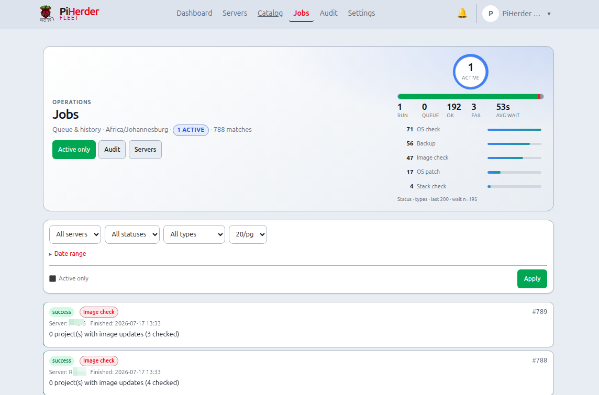

# Jobs, audit & notifications

## What this is

Three related systems — do not confuse them:

| System | Purpose | Think of it as… |
|--------|---------|-----------------|
| **Jobs** | Queue + live progress of work units | *What is running right now?* |
| **Audit** | Immutable history (who / what / when / **client IP** / snippet) | *Who did that last Tuesday?* |
| **Notifications** | Dismissible inbox (updates pending, failed backup, …) | *What still needs my eyes?* |

Open notifications via the **bell** icon (no separate Alerts nav link).

## Why they exist

Long SSH work must not block the browser (jobs). Homelab and multi-operator setups need accountability (audit). Noise should not bury failures (notifications + optional Web Push). Together they replace “did that cron fire?” shell archaeology.

---

## End-to-end: follow one backup through all three

1. Start a backup from a server Backups page.  
2. **Jobs** → row goes `pending` → `running` → `success` / `failed`; open detail for log tail.  
3. **Audit** → filter that server / backup actions; see request → queued → running → complete phases and client IP.  
4. If it failed earlier, a **notification** may open; on success, related open alerts can auto-resolve (optional push: `Resolved: …`).  
5. Dismiss the inbox item when you have acted.

---

<figure class="ph-figure" markdown>
  
  <figcaption>Fleet Jobs with filters and detail modal.</figcaption>
</figure>

## Jobs

**Where:** nav **Jobs** (`/jobs`) · compact panel on each server detail.

### Job types (examples)

| Type | Typical trigger | Runner |
|------|-----------------|--------|
| `backup` | Manual or backup cron | **Celery** |
| `os_patch` / `container_patch` | Manual or apply schedule | Web background |
| `os_update_check` / `container_update_check` | Manual or check schedule | Web background |
| `docker_stack_check` / `docker_stack_deploy` | Stack ⋯ Check updates / Deploy | Web background |
| `docker_stack_stop` / `_start` / `_restart` | Project ⋯ Stop/Start/Restart all | Web background |
| `template_deploy` / `template_redeploy` | Catalog template confirm / Save & redeploy | Web background |
| `template_drift_check` | Deployment **Check drift** (live log) | Web background |
| `retention` | Retention cleanup | As configured |
| `herder_backup` | PiHerder self-backup | As configured |

Statuses: `pending` → `running` → `success` / `failed`.

### Exclusive jobs (one per type per host)

These types do not stack on the same server while already **pending** or **running**:

- `os_patch`, `container_patch`  
- `os_update_check`, `container_update_check`  
- Stack lifecycle + template deploy/redeploy (shared **stack mutation** lane on the host)  
- `template_drift_check` (one drift job at a time per host; not a stack write)  

A second start reuses the existing job (UI follows it; REST **409** with `already_active` / existing `job`). Backups use a separate rule: per-host Redis mutex + Celery (see [Multi-worker](../operations/multi-worker.md)).

**Why exclusive:** two apt upgrades at once on one host is a recipe for lock conflicts and opaque failure.

### Fleet Jobs UI

- **Ops hero** at the top: dual-line pulse (running / queue / ok / fail + type chips) and app timezone caption  
- Filters: server, status, type, **date range** with **7d / 30d / 90d / Clear** presets, per-page  
- Date presets use the **Settings timezone** calendar day (not the browser’s local midnight)  
- **Active only** — pending + running  
- Row → detail modal (summary, log tail, scheduled flag)  
- **Cancel** works from list and modal (where applicable)  
- Link to **Audit** for historical trail  

### Live progress

JobHold / progress modals poll status and log lines for OS/container patch and similar work. If a job was already active, the modal notes that and tracks the existing `job_id`.

### Bulk fleet queue

From the **Servers** list, multi-select hosts and queue the same job type across eligible servers (feature flags apply). See [Updates & patching — Bulk actions](updates-and-patching.md#bulk-actions-servers-list).

## Audit

**Where:** nav **Audit** (`/audit`). Also from:

- Server detail footer: **All logs**, **Backup logs**, **Docker logs**, **OS audit logs** (filtered by host)  
- **Notifications** → **Audit log**  
- **Jobs** panel links  

Actors may be:

- Session user (display name + email)  
- **API token name + id** (automation)  
- **system / scheduler** for cron jobs  

**Client IP (v0.5.0):** every request-driven audit row stores the source IP.

| Path | What you see |
|------|----------------|
| Via Caddy (`:8888` / `:8443`) | True browser/API client (`X-Forwarded-For` / `X-Real-IP` overwritten by Caddy) |
| Direct app `:8000` | TCP peer (often a Docker network IP) — production should not expose this |
| Scheduler / cron only | **—** (no HTTP request) |
| Job finish (Celery etc.) | IP **snapshotted when the job was queued** |

Also audited with IP: **login** / **login failed** / **2FA**, and **API token** create/update/rotate/revoke. Free-text search matches IPs. Detail modal shows **IP**.

Filter by user, server, token, action, status, **date range** (same **7d / 30d / 90d** presets as Jobs — app timezone), or free-text (includes IP).

The Audit page uses the same **ops-hero** pattern: status bars, top action-type chips (as filter links), and the active timezone in the subtitle. On dense filter layouts the pulse can be **collapsed** (Hide pulse) so the filter row stays primary; detail rows open a branded **detail modal** (summary + snippet).

### Backup lifecycle events

Each backup job writes append-only phases:

| Phase | Action | Meaning |
|-------|--------|---------|
| request | `backup_request` | User / schedule / bulk asked for a backup |
| queued | `backup_queued` | Waiting for a Celery worker |
| running | `backup_running` | Worker started rsync |
| complete | `backup` | Terminal success or failure |

**Completed backups** show a summary line with source count and total size (e.g. `2 sources · 1.5 MB`), duration, and a detail modal with per-source sizes. Incomplete/running noise can be hidden with **Hide incomplete runs**.

### Timezone display

All event times are **stored in UTC** and **rendered in the app timezone** from **Settings → timezone** (e.g. `Africa/Johannesburg` / SAST). The Audit header shows the active zone. Jobs and Notifications use the same rule.

## Notifications

- Bell icon → open / dismiss  
- Deep links into the relevant server or page  
- Optional **Web Push** for new open notifications — [PWA & Web Push](../account-security/pwa-push.md)  
- When an alert **auto-resolves** (e.g. backup succeeds, updates clear), a push may fire as `Resolved: …` using the **same** type preference as the original alert  
- Dismiss is **idempotent** if already closed  

**Why an inbox separate from Audit:** Audit is forever; the inbox is a short “todo” list for open problems.

## API

Automation can list/trigger jobs with Bearer tokens — [API tokens](../operations/api-tokens.md).
