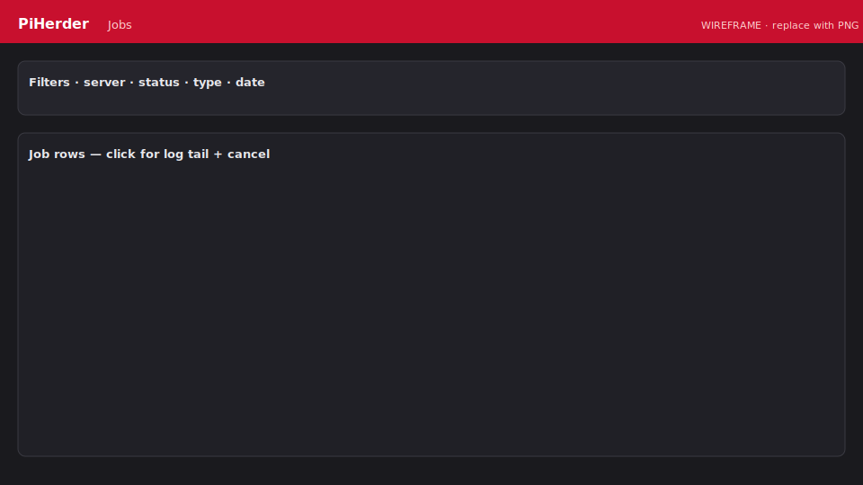

# Jobs, audit & notifications

Three related systems — do not confuse them.

| System | Purpose |
|--------|---------|
| **Jobs** | Queue + live progress of work units |
| **Audit** | Immutable history (who / what / when / snippet) |
| **Notifications** | Dismissible inbox (updates pending, failed backup, …). Open via the **bell** icon (no separate Alerts nav link). |

<figure class="ph-figure" markdown>
  
  <figcaption>Fleet Jobs with filters and detail modal. wireframe</figcaption>
</figure>

## Jobs

**Where:** nav **Jobs** (`/jobs`) · compact panel on each server detail.

### Job types (examples)

| Type | Typical trigger |
|------|-----------------|
| `backup` | Manual or backup cron → Celery |
| `os_patch` / `container_patch` | Manual or apply schedule |
| `os_update_check` / `container_update_check` | Manual or check schedule |
| `retention` | Retention cleanup |
| `herder_backup` | PiHerder self-backup |

Statuses: `pending` → `running` → `success` / `failed`.

### Exclusive jobs (one per type per host)

These types do not stack on the same server while already **pending** or **running**:

- `os_patch`, `container_patch`  
- `os_update_check`, `container_update_check`  

A second start reuses the existing job (UI follows it; REST **409** with `already_active` / existing `job`). Backups use a separate rule: per-host Redis mutex + Celery (see [Multi-worker](../operations/multi-worker.md)).

### Fleet Jobs UI

- Filters: server, status, type, date range, per-page  
- **Active only** — pending + running  
- Row → detail modal (summary, log tail, scheduled flag)  
- **Cancel** works from list and modal (where applicable)  
- Link to **Audit** for historical trail  

### Live progress

JobHold / progress modals poll status and log lines for OS/container patch and similar work. If a job was already active, the modal notes that and tracks the existing `job_id`.

### Bulk fleet queue

From the **Servers** list, multi-select hosts and queue the same job type across eligible servers (feature flags apply). See [Updates & patching — Bulk actions](updates-and-patching.md#bulk-actions-servers-list).

## Audit

**Where:** nav **Audit** (`/audit`). Also from:

- Server detail footer: **All logs**, **Backup logs**, **Docker logs**, **OS audit logs** (filtered by host)  
- **Notifications** → **Audit log**  
- **Jobs** panel links  

Actors may be:

- Session user (display name + email)  
- **API token name + id** (automation)  
- **system / scheduler** for cron jobs  

Filter by user, server, token, action, status, date range.

### Backup lifecycle events

Each backup job writes append-only phases:

| Phase | Action | Meaning |
|-------|--------|---------|
| request | `backup_request` | User / schedule / bulk asked for a backup |
| queued | `backup_queued` | Waiting for a Celery worker |
| running | `backup_running` | Worker started rsync |
| complete | `backup` | Terminal success or failure |

**Completed backups** show a summary line with source count and total size (e.g. `2 sources · 1.5 MB`), duration, and a detail modal with per-source sizes. Incomplete/running noise can be hidden with **Hide incomplete runs**.

### Timezone display

All event times are **stored in UTC** and **rendered in the app timezone** from **Settings → timezone** (e.g. `Africa/Johannesburg` / SAST). The Audit header shows the active zone. Jobs and Notifications use the same rule.

## Notifications

- Bell icon → open / dismiss  
- Deep links into the relevant server or page  
- Optional **Web Push** for new open notifications — [PWA & Web Push](../account-security/pwa-push.md)  
- Dismiss is **idempotent** if already closed  

## API

Automation can list/trigger jobs with Bearer tokens — [API tokens](../operations/api-tokens.md).
