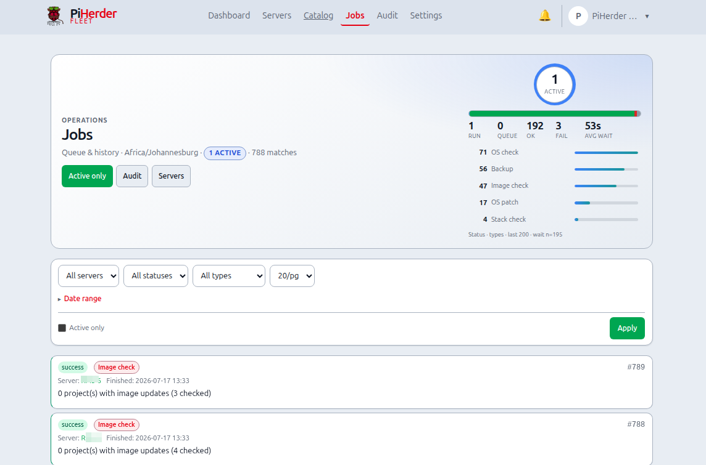

# Jobs, audit & notifications

## What this is

Three related systems — do not confuse them:

| System | Purpose | Think of it as… |
|--------|---------|-----------------|
| **Jobs** | Queue + live progress of work units | *What is running right now?* |
| **Audit** | Immutable history (who / what / when / **client IP** / snippet) | *Who did that last Tuesday?* |
| **Notifications** | Dismissible inbox (updates pending, failed backup, …) | *What still needs my eyes?* |

Open notifications via the **bell** icon (no separate Alerts nav link).

## Why they exist

Long SSH work must not block the browser (jobs). Homelab and multi-operator setups need accountability (audit). Noise should not bury failures (notifications + optional Web Push). Together they replace “did that cron fire?” shell archaeology.

---

## End-to-end: follow one backup through all three

1. Start a backup from a server Backups page.  
2. **Jobs** → row goes `pending` → `running` → `success` / `failed`; open detail for the log tail. A host that sends files straight out names the destination in that detail: Google Drive or OneDrive and the folder, or the LAN host, share, and path, plus each source folder on that destination. The sign-in is not in the row.  
3. **Audit** → filter that server / backup actions; see request → queued → running → complete phases and client IP. The completed row for a straight-out host names the same destination.  
4. If it failed earlier, a **notification** may open; on success, related open alerts can auto-resolve (optional push: `Resolved: …`).  
5. Dismiss the inbox item when you have acted.

---

<figure class="ph-figure" markdown>
  
  <figcaption>Fleet Jobs with filters and detail modal.</figcaption>
</figure>

## Jobs

**Where:** nav **Jobs** (`/jobs`) · compact panel on each server detail.

### Job types (examples)

| Type | Typical trigger | Runner |
|------|-----------------|--------|
| `backup` | Manual or backup cron. A host that sends files straight out uses this same type for **Backup now** and its schedule | **Celery**. The finished detail names the destination: **Google Drive** or **OneDrive** and the folder, or **LAN NAS / SMB** with the host, share, and path. Each source row adds the folder on that destination. The sign-in is not stored. The audit row for that run names the same place |
| `backup_replicate` | Settings → PiHerder backup → **Copy now**, its schedule, the follow-up after a host backup, or a self-backup archive when that destination is set to copy it (v1.8 train, not in the 1.7.0 image). **Copy now** or the schedule for a host that sends files straight out uses this same type | **Celery** (default queue). Label **Backup copy** for a host-folder hop, **Direct copy** when the row sends a host's files straight out, or **Self-backup copy** when the row is one herder archive. **Backup now** on the host stays the **Backup** job. A running archive hop does not block **Copy now**. A running folder hop and a running direct hop share one slot on that destination, so a second **Copy now** returns the active row. A running folder hop does not block the archive hop. When the ticked list has both a folder on `/backups` and a direct host, the folder hop runs, then the direct hop starts. The row does not store the destination sign-in or the temp rclone config. May run for 7 days. A task failure marks the row failed so **Copy now** can run again. A failed self-backup copy leaves the local archive in place. A hard kill of the worker can leave that row **running**. Does not take the per-host backup lock. Not on the token or MCP job list |
| `os_patch` / `container_patch` | Manual or apply schedule | **Celery** (default queue). SSH down: stays pending and retries. Recycle **web** is safe. Recycle **worker** while it is running **fails** the job |
| `host_reboot` | Server **Reboot** or the Home Assistant host card | **Celery** (default queue). Refused while an OS patch, container patch, or backup is active on that host. SSH down: stays pending. Recycle **web** is safe. Recycle **worker** while it is running **fails** the job |
| `os_update_check` / `container_update_check` | Manual or check schedule | **Celery** (default queue) |
| `docker_stack_check` / `docker_stack_deploy` | Stack ⋯ Check updates / Deploy | **Celery** (default queue) |
| `docker_stack_stop` / `_start` / `_restart` | Project ⋯ Stop/Start/Restart all | **Celery** (default queue) |
| `service_migrate` | Docker **Move to another host…** (flag `PIHERDER_SERVICE_MIGRATE`) | **Celery** (same worker as backups). Recycle **web** is safe. Recycle **worker** mid-copy **fails** the job (staging kept; **Start source stack** when copy/dest-up had begun). JobHold stays until Close. |
| `service_migrate_undo` | **Undo move** on a Move that failed after names flipped (cutover / rebind / validate). Preview, then confirm | **Celery**, same dual-host lock. Stops dest (`compose stop`, not `down -v`) and starts source. A green Move has no Undo. Recycle **worker** mid-undo fails that undo and leaves the dest tree |
| `service_migrate_dest_recover` | **Inspect destination** on a Move that died while starting dest. Then **Stop dest and start source** | **Celery**, same dual-host lock. `compose stop` on dest, then start source. DNS and NPM stay. A green Move does not offer it |
| `template_deploy` / `template_redeploy` | Catalog template confirm / Save & redeploy | **Celery** (default queue, stack-mutation lane) |
| `template_drift_check` | Deployment **Check drift** (live log) | **Celery** (default queue) |
| `retention` | Per-server backup file retention | **Celery** (default queue). No host exclusive slot. Recycle **web** is safe. Recycle **worker** while it is running **fails** the job |
| `stale_data_cleanup` | Opt-in Jobs / Audit / nmap-run purge | Scheduler or Settings → Run now |
| `nmap_discover` / `nmap_inventory` / `nmap_detailed` / `nmap_host_deep` | LAN Discovery scans | **celery-worker-nmap** (`-Q nmap`) |
| `nmap_vuln_db_update` | Download / refresh vuln pack | nmap worker |
| `herder_backup` | PiHerder self-backup | **Celery** (default queue). No host. One at a time. Settings → Run opens the job. Recycle **web** is safe. Recycle **worker** while it is running **fails** the job. A row still **pending** after **30 minutes** is failed and raises a **critical** alert |

Statuses: `pending` → `running` → `success` / `failed`.

**Web restart:** retention, the herder’s own backup, host facts, OS/container patch, host reboot, update checks, stack jobs, template jobs, backups, nmap, and Move are Celery — a web recycle does **not** fail them. Recycle **celery-worker** while one of those is **running** **fails** that job (it is not resumed mid-flight). If SSH is down at the start of a patch or stack job, the row stays **pending** and is probed again until the host answers or the wait limit (Settings → General → Jobs, default 30 minutes). A Kuma “host down” alert or a `last_seen` older than 15 minutes can show **waiting on host** on that pending job. Those are labels. The job resumes only when SSH works, and they do not fail it. See [Multi-worker](../operations/multi-worker.md).

### Exclusive jobs (one per type per host)

These types do not stack on the same server while already **pending** or **running**:

- `os_patch`, `container_patch`, `host_reboot` (also waits for a patch or backup, and those wait for a reboot)  
- `os_update_check`, `container_update_check`  
- Stack lifecycle + template deploy/redeploy (shared **stack mutation** lane on the host)  
- `service_migrate`, `service_migrate_undo`, and `service_migrate_dest_recover` — exclusive with backup **and** stack mutation on **both** source and dest  
- `template_drift_check` (one drift job at a time per host; not a stack write)  
- `host_facts` (one snapshot job at a time per host)  

A second start reuses the existing job (UI follows it; REST **409** with `already_active` / existing `job`). Backups use a separate rule: per-host Redis mutex + Celery (see [Multi-worker](../operations/multi-worker.md)). [Move a service](../docker/service-migration.md) also refuses a migrate while either host is busy.

**Why exclusive:** two apt upgrades at once on one host is a recipe for lock conflicts and opaque failure.

### Fleet Jobs UI

- **Ops hero** at the top: dual-line pulse (running / queue / ok / fail + type chips) and app timezone caption  
- Filters: server, status, type, **date range** with **7d / 30d / 90d / Clear** presets, per-page **10 / 20 / 50 / 100** (cookie `ph_per_page` shared with Servers / Docker / discovery)  
- Date presets use the **Settings timezone** calendar day (not the browser’s local midnight)  
- **Active only** — pending + running  
- Row → detail modal (summary, log tail, scheduled flag)
- **Worker** on each row and in the detail modal: the Celery nodename (`celery@…`, `nmap@…`) once a worker has claimed the job, **not claimed** while it is still queued, **web** for demo simulation. Two workers show two different names. JobHold’s status line includes the same name  
- **Cancel** works from list and modal (where applicable)  
- Link to **Audit** for historical trail  

### Live progress

JobHold / progress modals poll status and log lines for OS/container patch, **nmap** scans (including vuln DB update), and similar work. If a job was already active, the modal notes that and tracks the existing `job_id`. When a job **finishes**, the modal stays open with a done banner (no forced full-page reload) so you can read the log.

**Stale data cleanup** is configured under [Settings → General](../operations/settings.md#stale-data-cleanup) — separate from per-server backup `retention` jobs.

### Bulk fleet queue

From the **Servers** list, multi-select hosts and queue the same job type across eligible servers (feature flags apply). See [Updates & patching — Bulk actions](updates-and-patching.md#bulk-actions-servers-list).

## Audit

**Where:** nav **Audit** (`/audit`). Also from:

- Server detail footer: **All logs**, **Backup logs**, **Docker logs**, **OS audit logs** (filtered by host)  
- **Notifications** → **Audit log**  
- **Jobs** panel links  

Actors may be:

- Session user (display name + email)  
- **API token name + id** (automation)  
- **system / scheduler** for cron jobs  

**Client IP (v0.5.0):** every request-driven audit row stores the source IP.

| Path | What you see |
|------|----------------|
| Via Caddy (`:8888` / `:8443`) | True browser/API client (`X-Forwarded-For` / `X-Real-IP` overwritten by Caddy) |
| Direct app `:8000` | TCP peer (often a Docker network IP) — production should not expose this |
| Scheduler / cron only | **—** (no HTTP request) |
| Job finish (Celery etc.) | IP **snapshotted when the job was queued** |

Also audited with IP: **login** / **login failed** / **2FA**, and **API token** create/update/rotate/revoke. Free-text search matches IPs. Detail modal shows **IP**.

Filter by user, server, token, action, status, **date range** (same **7d / 30d / 90d** presets as Jobs — app timezone), or free-text (includes IP). Per-page is the same **10 / 20 / 50 / 100** cookie as Jobs.

The Audit page uses the same **ops-hero** pattern: status bars, top action-type chips (as filter links), and the active timezone in the subtitle. On dense filter layouts the pulse can be **collapsed** (Hide pulse) so the filter row stays primary; detail rows open a branded **detail modal** (summary + snippet).

### Console command transcripts (v1.3)

When **Settings → Console → Command audit** is on, each finished web shell can attach a **command timeline** (Fernet-encrypted, not in Audit search). Open the `ssh_console_close` event: operator+ can expand the timeline, open `/audit/console/{id}`, or download `.txt`. Viewers see counts only (“transcript hidden”). Demo never stores bodies. Retention drops the ciphertext and keeps the fact that a transcript existed. See [Web SSH console](web-ssh-console.md#command-audit-v13).

### Backup lifecycle events

Each backup job writes append-only phases:

| Phase | Action | Meaning |
|-------|--------|---------|
| request | `backup_request` | User / schedule / bulk asked for a backup |
| queued | `backup_queued` | Waiting for a Celery worker (snapshot, `info`) |
| running | `backup_running` | Worker started rsync (snapshot, `info`) |
| complete | `backup` | Terminal success or failure |

**Completed backups** show a summary line with source count and total size (e.g. `2 sources · 1.5 MB`), duration, and a detail modal with per-source sizes. A host that sends files straight out adds the destination on that line, for example `2 sources · LAN NAS / SMB · 192.168.86.42/piherder-test/PiHerder`. The detail keeps the same place on each source. The sign-in is not in the row. Queued and running phase rows are noise: **Hide incomplete runs** hides them, and they are left out of the Audit **active** pulse. Older rows that still say `running` are treated the same way.

### Timezone display

All event times are **stored in UTC** and **rendered in the app timezone** from **Settings → timezone** (e.g. `Africa/Johannesburg` / SAST). The Audit header shows the active zone. Jobs and Notifications use the same rule.

## Notifications

- Bell icon → open / dismiss  
- Deep links into the relevant server or page  
- Optional **Web Push** for new open notifications — [PWA & Web Push](../account-security/pwa-push.md)  
- When an alert **auto-resolves** (e.g. backup succeeds, updates clear), a push may fire as `Resolved: …` using the **same** type preference as the original alert  
- Dismiss is **idempotent** if already closed  

**Why an inbox separate from Audit:** Audit is forever; the inbox is a short “todo” list for open problems.

Job, nmap-run, and console-open **history** is aggregated on [Reports](reports.md) (backups, OS patches, LAN live, Docker deploys, console sessions).

## API

Automation can list and trigger jobs with Bearer tokens — [API tokens](../operations/api-tokens.md). Hosted MCP uses that same list and the same **409** when a job is already active — [Agents (MCP)](../operations/mcp.md). Compose stack actions and Move stay in the browser.
