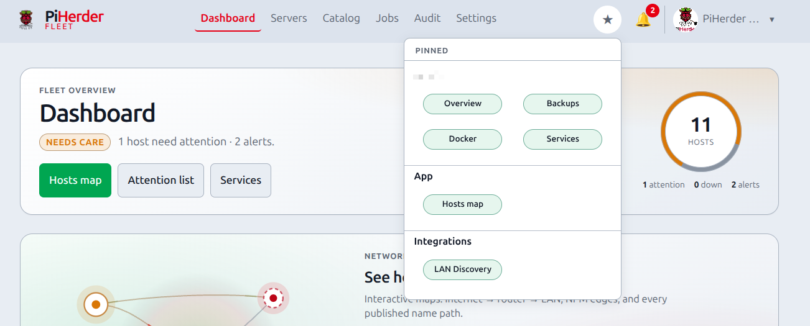
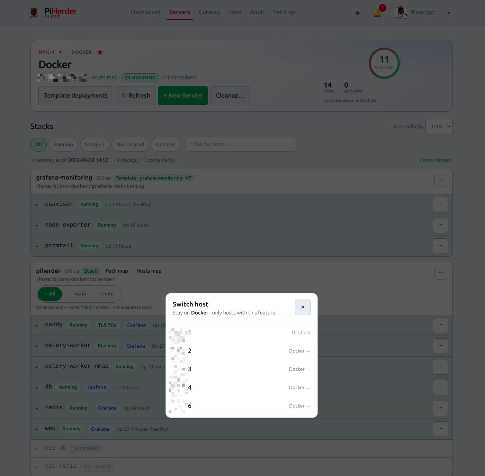

# Pins, ★ menu & host jump

## What this is

**Pins** (favourites) and **host jump** are operator shortcuts for multi-host fleets:

| Feature | What it does |
|---------|----------------|
| **Pin ★** | Save a host feature, app page, or Catalog integration to the header **★** menu |
| **★ menu** | One-tap jump to your pins — grouped **Host · App · Integrations** |
| **Host jump** | On Overview / Docker / Backups / Services / **Files**: switch to the **same feature** on another host |

Pins are **per user** (stored in Postgres). They are not shared fleet settings.

## Why it exists

With many Pis, operators bounce between “this host’s Docker”, “Hosts map”, and “Pi-hole detail”. Pins and jump cut that path without filling the hamburger with noise.

---

## End-to-end: pin what you use every day

1. Open a host **Docker** (or Backups / Services / Files / Overview) page.  
2. Click the **star** next to the feature title to pin.  
3. Open **Catalog → Network** and pin **Hosts map** / **Path map** (star on the hub card or map chrome).  
4. Optional: pin a Catalog integration (star next to the integration name).  
5. Open the header **★** → confirm groups and open a pin.  

**Done when:** ★ opens the map **graph** (SVG), not only the list; host pins land on the right feature page.

<figure class="ph-figure" markdown>
  
  <figcaption>Header ★ menu — Host / App / Integrations groups (per-user pins).</figcaption>
</figure>

<figure class="ph-figure" markdown>
  
  <figcaption>Host jump — same feature on another fleet host.</figcaption>
</figure>

---

## Pin kinds (allowlist)

| Kind | Examples | Where to pin |
|------|----------|--------------|
| **Host feature** | Overview, Docker, Backups, Services | Star next to the feature name on the host page |
| **App page** | Hosts map, Path map, Certificates, Jobs, Templates, Fleet services | Network hub map cards · map chrome · (allowlisted keys) |
| **Integration** | LAN Discovery, Pi-hole, NPM, Kuma, Grafana | Star next to the integration title on the detail page |

Maximum **24** pins per user. There is no free-form URL pin (security).

### Map pins must open the graph

Hosts map and Path map pages are **list-first** on many viewports. Working deep links (same as dashboard / Network cards) include the fragment:

| Page | Pin / menu href |
|------|-----------------|
| Hosts map | `/dns/physical#map` |
| Path map | `/dns/logical#map` |

Without `#map`, the browser lands on the list only. Pin storage and the ★ JSON always use the canonical `#map` hrefs for those pages.

---

## ★ header menu

- Desktop and mobile: **★** in the top bar (not a count badge; empty state explains how to pin).  
- Groups: **per host** (feature pills) · **App** · **Integrations**.  
- Pills are compact (two columns where space allows).  
- Pins are **not** duplicated in the hamburger drawer.

---

## Host jump (cross-host)

On host **Overview**, **Docker**, **Backups**, and **Services**:

| Control | Behaviour |
|---------|-----------|
| **Host name** (link) | Always goes to that host’s **Overview** |
| **▾ Jump host** | Same feature on another fleet host |

Jump list is **feature-aware**:

| Feature | Who appears in the list |
|---------|-------------------------|
| Overview / Services | All fleet hosts |
| Docker | Hosts with **container patch / Docker** enabled |
| Backups | Hosts with **Backups** enabled |

If only one host has that feature, jump is hidden.

---

## Related

- [Dashboard & Services](dashboard-and-services.md)  
- [Network maps](../integrations/dns-fabric.md) — deep links and map chrome  
- [Add a server](add-server.md) — feature flags that drive jump filtering  
