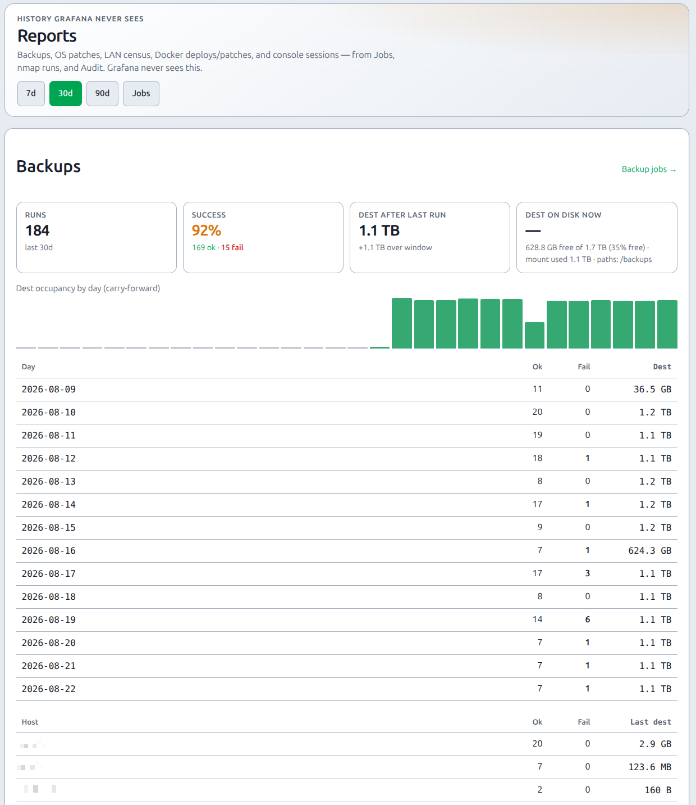

# Reports

## What this is

**Reports** (`/reports`) is PiHerder’s own **history**: how backups, OS patches, the LAN census, Docker deploys, and the web console actually went over the last **7 / 30 / 90** days.

Grafana will never know this. It never sees rsync dest size, backup success/fail, apt apply counts, nmap `hosts_up`, compose deploys, or console session time.

It is **not** a second status dashboard and **not** a set of jump-chips. Open [Dashboard](dashboard-and-services.md) for “what needs care right now.” Open Reports for “how did this week / month go?”

## Why it exists

| Question | Where |
|----------|--------|
| Host CPU, disk, container graphs | [Grafana](../integrations/grafana.md) chips on the host |
| Who needs patches or has a service down **today** | [Dashboard](dashboard-and-services.md) |
| Backups succeeded vs failed? Is dest **growing**? | **Reports → Backups** |
| OS patches applied per host per week / month / year? | **Reports → OS patches** |
| How many LAN devices were **live each day**? | **Reports → LAN live** |
| Docker deploys / image patches ok vs fail? | **Reports → Docker** |
| How much web console was used (sessions, privileged, duration)? | **Reports → Console** |

Sources: **Jobs** (and the JSON each job stored), **nmap scan runs** (`hosts_up`), and **Audit** (`ssh_console_open` / `close`). No SSH and no `du` on page load.

## Where

Header **Reports** (after **Catalog**). Phone: hamburger. **Viewer+**. No writes.

Windows: **7 / 30 / 90** days in the [app timezone](../operations/settings.md). Some averages still scan up to 365 days of leftover rows.

<figure class="ph-figure" markdown>
  
  <figcaption>Reports — 7 / 30 / 90 day windows and history tabs (Backups, OS patches, LAN live, Docker, Console).</figcaption>
</figure>

Tables keep numeric columns right-aligned. On a **phone**, the Day / host column is not clipped — swipe the table sideways to see dates and dest sizes.

## Backups

| Figure | Meaning |
|--------|---------|
| Runs / success % | Finished `backup` jobs in the window |
| Dest after last run | Sum of each host’s last successful **dest tree size** (rsync destination after the run — **not** bytes transferred; unchanged files still count) |
| Dest occupancy by day | Same dest sizes, **carried forward** so a quiet day does not drop to zero — that is the growth sparkline |
| Dest on disk now | Last Settings → **Status** tree/`du` if one exists |
| Per host | Ok / fail / last dest → host Backups |

## OS patches

| Figure | Meaning |
|--------|---------|
| Applies | Successful `os_patch` **apply** jobs (not update-checks) |
| Packages | Parsed from apt `N upgraded, M newly installed` when that line is in the job payload. Missing on HAOS and many older jobs |
| Average per host | Successful applies (and packages when known) ÷ hosts with **OS patch** enabled, for week (7d) / month (30d) / year (365d) |

## LAN live

| Figure | Meaning |
|--------|---------|
| Live (last scan day) | `hosts_up` from the last successful **nmap scan run** that day (all LAN integrations summed) |
| By day | Same count **carried forward** when no scan ran |
| Average live | Mean / min / max of that daily occupancy for week / month / year |
| Catalog now | Current devices: live (`new`/`known`/`linked`) vs offline (`stale`) vs ignored — a snapshot, not history |
| First seen | Devices whose `first_seen_at` falls in the window |

Quiet days keep yesterday’s census. Overlapping CIDRs on two nmap integrations can double-count.

## Docker

| Figure | Meaning |
|--------|---------|
| Stack deploys | `docker_stack_deploy` plus stop/start/restart and template deploy/redeploy |
| Image patches | `container_patch` apply jobs |
| Running now | Last Docker **inventory snapshot** (running / total / stacks) — not a daily census; we do not store container counts per day |
| Per day / host | Ok vs fail for deploys and patches |

## Console

| Figure | Meaning |
|--------|---------|
| Sessions | `ssh_console_open` audit rows (works even when command audit is **off**) |
| Privileged | Opens whose identity is `privileged:…` |
| Duration | Sum of `duration_sec` on `ssh_console_close` |
| Denied | `ssh_console_denied` |
| Commands logged | `ConsoleTranscript.command_count` — only when Settings → Console **audit** is on |

## Limits

- **Job retention** ([Settings → Cleanup](../operations/settings.md#stale-data-cleanup)) deletes old Jobs. Default **off**; if you purge at 30 days, year averages only see 30 days.  
- **Audit purge** (same Cleanup card) trims console session history.  
- **nmap run purge** is a separate Cleanup switch (default **off**). LAN live uses `NmapScanRun`, not Jobs.  
- No time-series database. This is a scan of existing rows.  
- Not Grafana: no PromQL, no host CPU/RAM, no custom SQL, no export this freeze.

## Related

- [Dashboard & Services](dashboard-and-services.md)  
- [Jobs, audit & notifications](jobs-audit-notifications.md)  
- [Backups & restore](backups.md)  
- [Updates & patching](updates-and-patching.md)  
- [Docker overview](../docker/overview.md)  
- [Web SSH console](web-ssh-console.md)  
- [LAN discovery](../integrations/lan-discovery.md)  
- [Grafana](../integrations/grafana.md)  
- [Settings — Cleanup](../operations/settings.md#stale-data-cleanup)
