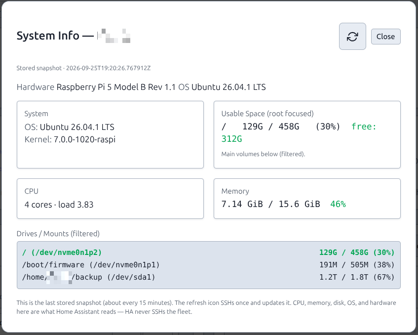

# System Info (host snapshot)

## What this is

Each server stores a **host-facts snapshot**: pretty OS, hardware, CPU cores/load, memory, and disk. **System Info** on the host page shows that snapshot. Home Assistant and `GET /api/v1` read the **same columns** — they never SSH the fleet.

## Why (v1.6)

Path 2 (HACS on HA) may poll every 30 seconds. That poll is **database only**. Live SSH from HA, or SSH on every System Info open, would hammer hosts and still leave HA showing “debian” / empty CPU.

So this train:

1. **Persist** what System Info used to fetch live (`os_pretty`, hardware, arch — Alembic **044**).
2. **Persist** CPU / memory / disk as columns so the Lovelace fleet card can sum the fleet (Alembic **045**).
3. **Stop** opening the modal from SSH-ing by default. A scheduler (~**15 minutes**) plus the modal **refresh icon** write the DB.
4. **Do not** add a second host-page “Refresh facts” button. Refresh is the icon in System Info. An extra action 500’d and duplicated the modal.

One snapshot, three consumers: this modal, `/api/v1/servers` + `/api/v1/summary`, and the **PiHerder fleet** card.

## What you see

| Field | Source |
|-------|--------|
| Hardware | Pi device-tree, DMI, or HAOS chassis/machine — not the `os_type` dropdown |
| OS | `PRETTY_NAME` (Ubuntu 24.04, Home Assistant OS, …) |
| Kernel / reboot pending | Snapshot |
| CPU | `nproc` + `/proc/loadavg` |
| Memory | `/proc/meminfo` (MemTotal / MemAvailable) |
| Usable space + drives | `df` (HAOS: `ha host info` when present) |
| HAOS Core / OS / Supervisor | `ha` CLI (path 1), still in the same snapshot |

Container **count** on the HA card comes from Docker inventory meta, not this snapshot.

Opening the modal does **not** SSH. The header **refresh icon** SSHs once (`/servers/{id}/diagnostics?force=1`) and writes the row. Footer text says so.

<figure class="ph-figure" markdown>
  
  <figcaption>Stored CPU, memory, and disk. The header refresh icon is the SSH. Opening the modal does not SSH.</figcaption>
</figure>

`system-info-haos.png` stays the path-1 shot.

## After upgrade

Recreate **web** so Alembic **044** and **045** apply (`SELECT version_num FROM alembic_version;` should include `045_host_resources`). Then click the refresh icon once per host (or wait ~15 minutes). Empty CPU/memory on the HA card means this snapshot has not been written yet.

## Related

- [Add a server](add-server.md) · [HAOS hosts](haos-hosts.md)  
- [Home Assistant → PiHerder](../integrations/home-assistant.md) (path 2 reads these columns)
