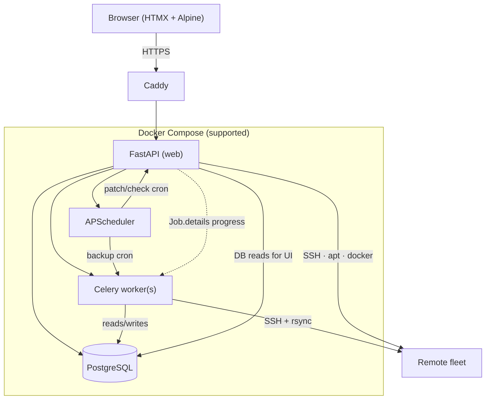

# Architecture

## Job execution paths

| Work | Runs on | Concurrency rule |
|------|---------|------------------|
| Backups | Celery | Parallel across hosts; one backup per host (Redis mutex) |
| OS/container patch & update checks | Web (`BackgroundTasks` / thread pools) | One active job of that type per host |
| Bulk fleet actions | Web → same enqueue paths | Feature-flag skip + exclusive rules |

## Key modules (pointers)

| Concern | Location |
|---------|----------|
| Roles / middleware | `app/security/auth.py` |
| Password policy | `app/services/password_policy.py` |
| Jobs / progress / exclusive types | `app/services/jobs.py` |
| Per-server backup lock | `app/services/server_job_lock.py` |
| Scheduler | `app/services/scheduler.py` |
| Backup | `app/services/backup.py` (+ progress, profiles) |
| Docker inventory | `app/services/docker_inventory.py` |
| Templates | `app/services/service_templates/` |
| Integrations (domain) | `app/services/integrations/` |
| Integrations (HTTP) | `app/routers/integrations.py` + `integrations_common` / `_pihole` / `_npm` |
| Network maps | `app/services/dns_fabric/` (`core`, `mesh_physical`, `mesh_logical`) · `app/routers/dns.py` |
| Ops-hero pulse helpers | `app/services/ops_pulse.py` |
| Push | `app/services/push.py` |
| API tokens | `app/services/api_tokens.py`, `app/routers/api_v1.py` |
| Herder backup | `app/services/herder_backup.py` |
| Metrics | `app/services/metrics.py` |
| Bulk server actions | `app/routers/servers.py` (`POST /servers/bulk`) |
| Theme / map / ops CSS | `app/static/css/themes.css`, `fabric.css`, `ops.css` |
| Map client | `app/static/js/fabric-mesh.js` (`PiHerderFabric.refreshLayout` on orient) |
| App timezone display | `app/services/app_settings.describe_timezone` · Settings General card |

## Frontend stack

- **Server-rendered** Jinja2 + HTMX fragments + Alpine for small widgets  
- Vendored Tailwind / HTMX / Alpine (no runtime CDN)  
- Progressive enhancement vanilla JS for Network maps, job hold, push, compose editor  
- Shared ops-hero grid contract (`ops.css`): full main content width; desktop title left · viz right (≥768px); mobile viz under title  
- Mobile orientation reflow in `base.html`; service rows stack actions on narrow viewports  
- Auth pages (login/register + force-password / 2FA) use shared `auth-stage` chrome  
- Empty DB → first register is admin; no default password user; then registration closes  
- Session cookies set `Secure` when `PIHERDER_PUBLIC_URL` is `https://` (or `COOKIE_SECURE=true`)  

## Design principles

- Privileged actions audited (incl. client IP)  
- Secrets encrypted at rest; decrypt only in memory for jobs  
- Offline/air-gapped ready once built (vendored assets)  
- External/dangerous actions opt-in: preview → confirm → audit  
- One exclusive OS/container job type per host (no silent double SSH)  
- Thin routers where practical; domain logic in `app/services/`  
- Compose-first deployment; DB-first operational settings  
- Integrations optional — core fleet never depends on Kuma/Grafana/NPM/Pi-hole
