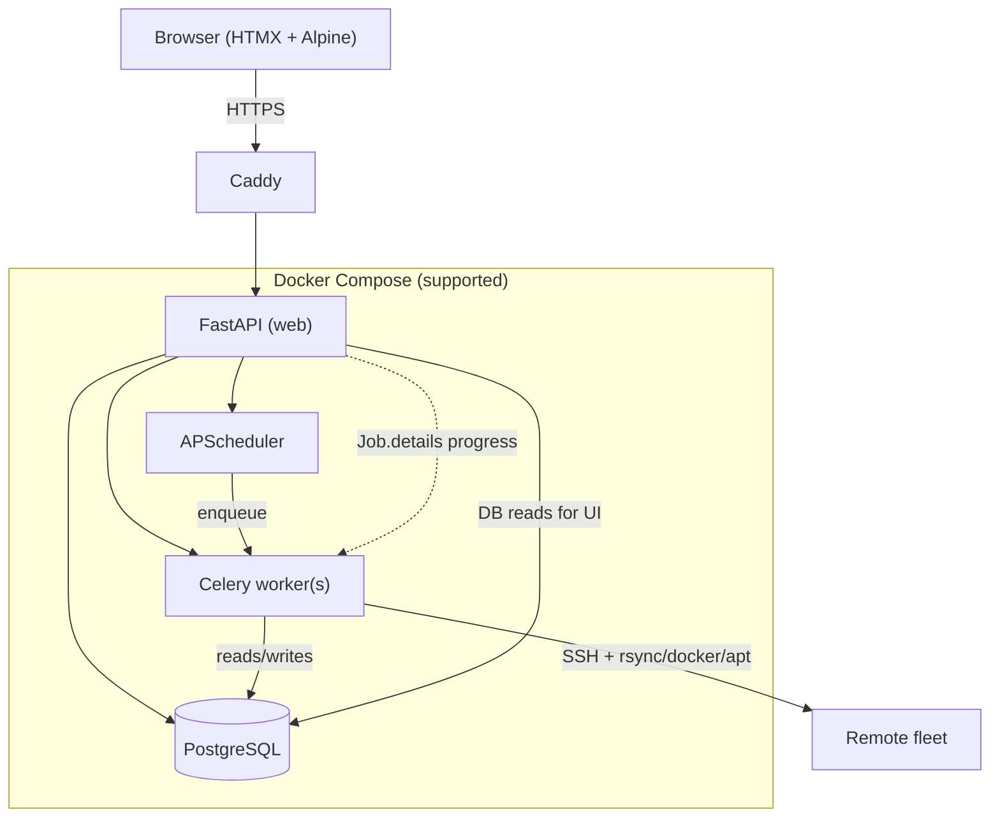

# Architecture

## Key modules (pointers)

| Concern | Location |
|---------|----------|
| Roles / middleware | `app/security/auth.py` |
| Password policy | `app/services/password_policy.py` |
| Jobs / progress | `app/services/jobs.py` |
| Scheduler | `app/services/scheduler.py` |
| Backup | `app/services/backup.py` (+ progress, profiles) |
| Docker inventory | `app/services/docker_inventory.py` |
| Templates | `app/services/service_templates/` |
| Integrations | `app/services/integrations/` |
| Push | `app/services/push.py` |
| API tokens | `app/services/api_tokens.py`, `app/routers/api_v1.py` |
| Herder backup | `app/services/herder_backup.py` |
| Metrics | `app/services/metrics.py` |

## Design principles

- Privileged actions audited  
- Secrets encrypted at rest; decrypt only in memory for jobs  
- Offline/air-gapped ready once built (vendored assets)  
- External/dangerous actions opt-in: preview → confirm → audit  
