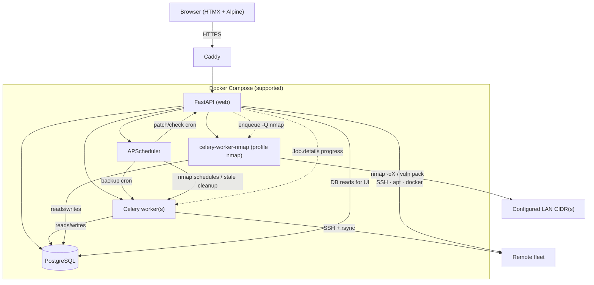

# Architecture

## Job execution paths

| Work | Runs on | Concurrency rule |
|------|---------|------------------|
| Backups | Celery | Parallel across hosts; one backup per host (Redis mutex) |
| OS/container patch & update checks | Web (`BackgroundTasks` / thread pools) | One active job of that type per host |
| Bulk fleet actions | Web → same enqueue paths | Feature-flag skip + exclusive rules |
| LAN nmap scans / vuln pack update | **celery-worker-nmap** (`-Q nmap`, concurrency 1) | Opt-in profile; host network; `PIHERDER_NMAP_WORKER=1` only here |
| Stale Jobs/Audit/nmap-run purge | Celery (default queue) | Opt-in Settings schedule |

**Nmap privilege boundary:** web + main celery set `PIHERDER_NMAP_WORKER=0` in compose; tasks call `worker_guard` and refuse if marker is off or `nmap` is missing. Never put queue `nmap` on the main worker. See [env reference](../operations/env-reference.md#lan-discovery-nmap--opt-in) · [`.env.example`](https://github.com/bjorngluck/piherder/blob/main/.env.example).

## Key modules (pointers)

| Concern | Location |
|---------|----------|
| Roles / middleware | `app/security/auth.py` |
| Password policy | `app/services/password_policy.py` |
| Jobs / progress / exclusive types | `app/services/jobs/` (`service.py`; package preserves `patch.object` surface) |
| Docker unused cleanup HTML | `app/services/docker_unused_html.py` |
| Per-server backup lock | `app/services/server_job_lock.py` |
| Scheduler | `app/services/scheduler.py` |
| Backup | `app/services/backup.py` (+ progress, profiles) |
| Docker inventory | `app/services/docker_inventory.py` |
| Templates | `app/services/service_templates/` |
| Integrations (domain) | `app/services/integrations/` |
| Integrations (HTTP) | `integrations.py` + `integrations_common` / `_kuma` / `_grafana` / `_pihole` / `_npm` / `_nmap` |
| LAN nmap (scan/parse/schedules/vuln) | `app/services/nmap/` (`worker_guard`, `scan`, `device_ops`, `fabric_projection`, …) · router `integrations_nmap.py` · image `Dockerfile.nmap` |
| Stale data cleanup | `app/services/stale_data_cleanup.py` · Settings General |
| Templates (HTTP) | `templates_common` + `templates_svc` (catalog) + `templates_deploy` |
| Auth (HTTP) | `auth.py` + `auth_users.py` (admin users) |
| Network maps | `app/services/dns_fabric/` (`core`, `mesh_physical`, `mesh_logical`) · `app/routers/dns.py` |
| Ops-hero pulse helpers | `app/services/ops_pulse.py` |
| Push | `app/services/push.py` |
| API tokens | `app/services/api_tokens.py`, `app/routers/api_v1.py` |
| Herder backup | `app/services/herder_backup.py` |
| Metrics | `app/services/metrics.py` |
| Bulk server actions | `app/routers/servers.py` (`POST /servers/bulk`) |
| Server SSH / patch sub-routers | `server_ssh.py`, `server_patch.py`, `server_common.py` (mounted under `/servers`) |
| Docker UI | `server_docker.py` + `server_docker_compose.py` (editor/versions) |
| Theme / map / ops CSS | `themes.css`, `fabric.css`, `ops.css`, `ops-auth.css`, `ops-pages.css` |
| Map client | `app/static/js/fabric-mesh.js` (`PiHerderFabric.refreshLayout` on orient) |
| App timezone display | `app/services/app_settings.describe_timezone` · Settings General card |
| Large templates | Prefer `partials/` — e.g. `server_detail_*_modals`, `docker_modals`, `settings_{tab}` |

## Frontend stack

- **Server-rendered** Jinja2 + HTMX fragments + Alpine for small widgets  
- Vendored Tailwind / HTMX / Alpine (no runtime CDN)  
- Progressive enhancement vanilla JS for Network maps, job hold, push, compose editor  
- Shared ops-hero grid contract (`ops.css`): full main content width; desktop title left · viz right (≥768px); mobile viz under title  
- Mobile orientation reflow in `base.html`; service rows stack actions on narrow viewports  
- Auth pages (login/register + force-password / 2FA) use shared `auth-stage` chrome  
- Empty DB → first register is admin; no default password user; then registration closes  
- Session cookies set `Secure` when `PIHERDER_PUBLIC_URL` is `https://` (or `COOKIE_SECURE=true`)  

## Design principles

- Privileged actions audited (incl. client IP)  
- Secrets encrypted at rest; decrypt only in memory for jobs  
- Offline/air-gapped ready once built (vendored assets)  
- External/dangerous actions opt-in: preview → confirm → audit  
- One exclusive OS/container job type per host (no silent double SSH)  
- Thin routers where practical; domain logic in `app/services/`  
- Compose-first deployment; DB-first operational settings  
- Integrations optional — core fleet never depends on Kuma/Grafana/NPM/Pi-hole
