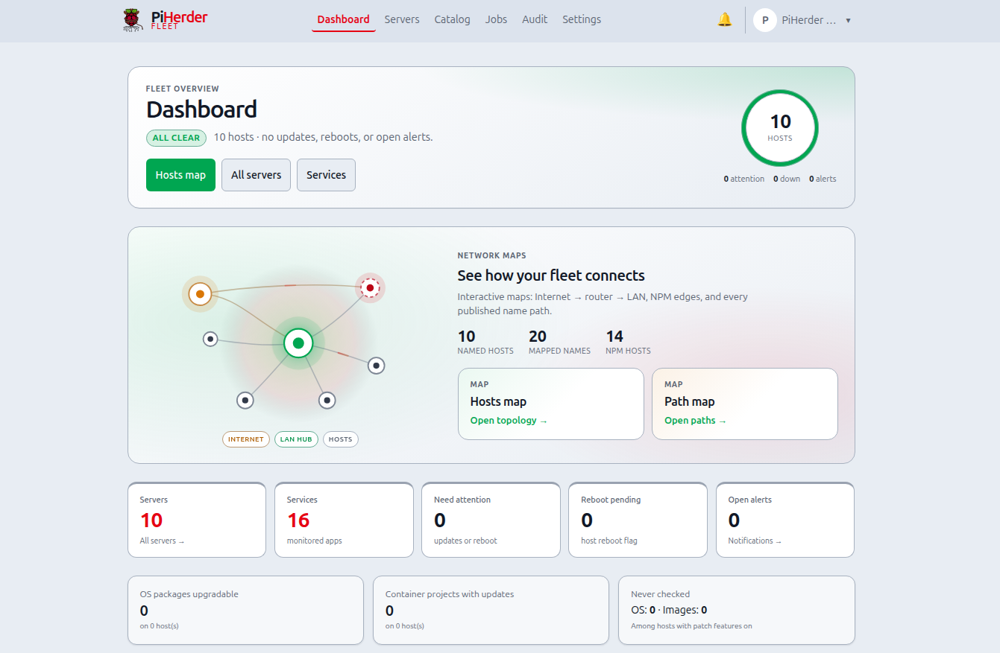

# Contributing to this wiki

Docs are **Markdown in git** under `wiki/`, built with **MkDocs Material**, published to **GitHub Pages**.

## Edit flow (text)

1. Edit or add pages under `wiki/`.  
2. Register new pages in root `mkdocs.yml` → `nav:`.  
3. Preview locally:

   ```bash
   pip install -r requirements-docs.txt
   mkdocs serve
   # http://127.0.0.1:8000
   ```

4. Strict check: `mkdocs build --strict`.  
5. Commit, push, merge to `main`.  
6. **Docs** workflow deploys Pages automatically on `main` when `wiki/**` or `mkdocs.yml` change.

!!! tip "Live docs"
    **[https://bjorngluck.github.io/piherder/](https://bjorngluck.github.io/piherder/)**  
    `edit_uri` on each page opens the file on GitHub — fine for small text fixes; use a **local clone** for screenshots and multi-file work.

## Screenshots (best practice)

**Use a local clone of the repo, save PNGs under `wiki/assets/screenshots/`, update Markdown, preview with `mkdocs serve`, then commit and push.**

That is the supported path for RC documentation with images.

### Why local + git

| Benefit | Detail |
|---------|--------|
| Preview | Material theme, nav, figure captions as operators see them |
| Batch | Many captures in one PR without fighting the web UI |
| Quality gate | `mkdocs build --strict` catches missing files and bad links |
| History | Binaries versioned with the prose that references them |

### Step-by-step

1. Run PiHerder (compose) and open the UI in a desktop browser.  
2. Set **light** theme (default for docs).  
3. Capture the page (OS tool or browser). Crop as needed.  
4. Save as e.g. `wiki/assets/screenshots/dashboard.png`.  
5. In the matching `.md`, use:

   ```markdown
   <figure class="ph-figure" markdown>
     
     <figcaption>Fleet summary and attention table.</figcaption>
   </figure>
   ```

6. Remove any `<span class="ph-wireframe-badge">wireframe</span>` once the real image is live.  
7. `mkdocs serve` → confirm the image.  
8. `mkdocs build --strict`.  
9. `git add` PNG + markdown → commit → push → merge.

### Conventions

- **Default:** light + desktop (~1400–1600px).  
- **Optional:** one dark showcase (`*-dark.png`), one mobile only where layout differs (`*-mobile.png`).  
- **Not required:** four variants of every screen.  
- Inventory + tips: [`wiki/assets/screenshots/README.md`](https://github.com/bjorngluck/piherder/blob/main/wiki/assets/screenshots/README.md).  
- Operator-facing theme notes: [Appearance](../getting-started/appearance.md).

### What not to do

- Do not paste multi‑megabyte full-desktop PNGs without cropping.  
- Do not commit secrets visible in UI (API tokens, PEM previews — those should not appear in UI anyway).  
- Do not edit only the built `site/` or `gh-pages` tree by hand — always edit `wiki/` sources.

## Style

- Short pages, one job each (not another 750-line ADMIN).  
- Prefer numbered steps + tables + admonitions.  
- Code blocks for every command an operator must run.  
- Link **scenarios** from [Operator scenarios](../getting-started/operator-scenarios.md).  
- Do **not** put `PLAN_*` / `FEATURE_PLAN_*` / SPEC checklists in the user nav — link out to GitHub blob if needed.

## Mermaid

Fenced `mermaid` blocks render in Material (architecture and flows).

## Build strictness

```bash
mkdocs build --strict
```

Fix warnings (broken links, missing files) before merge.
