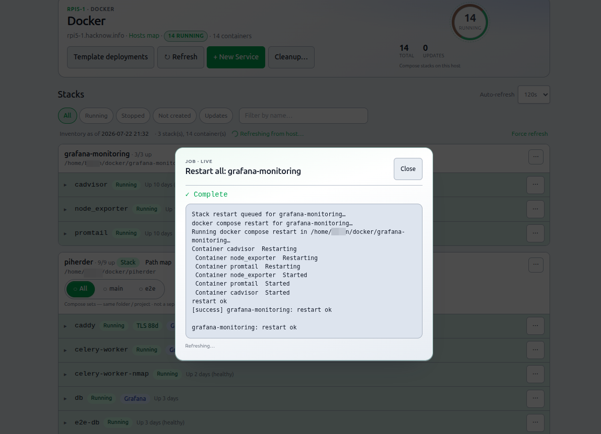

# Docker on hosts

## What this is

When **Docker / containers** is enabled for a server, PiHerder can list compose projects, stream logs, edit multi-file compose, build, check/update images, and redeploy — all over SSH as the server’s configured user.

## Why it exists

Homelab hosts often run many stacks. SSHing into each machine for `docker compose ps` does not scale, and ad-hoc edits leave no version history. The Docker UI is the day-to-day surface for free-form stacks; [templates](../service-templates/overview.md) cover desired-state managed stacks.

<figure class="ph-figure" markdown>
  
  <figcaption>Docker dest card on server detail.</figcaption>
</figure>

---

## End-to-end: open a stack and redeploy

1. Enable **Docker / containers**; set **Docker base dir** correctly.  
2. Confirm dependency check for docker is green ([SSH access](../day-to-day/add-server.md)).  
3. Open **Docker** — inventory snapshot appears immediately ([Inventory](inventory.md)).  
4. Expand a project; open logs if needed.  
5. **Check updates** vs **Deploy** when you want pull-only vs pull+up ([Updates](../day-to-day/updates-and-patching.md)).  
6. For compose edits, use [Compose edit](compose-edit.md) (quick modal or full editor with history).  

---

## Prerequisites

1. Feature flag **Docker / containers** on.  
2. Remote `docker` usable by the SSH user (group/socket).  
3. **Docker base dir** set correctly (absolute path if using least-priv).  
4. Dependency check green for docker — [SSH troubleshooting](../troubleshooting/ssh-rsync.md).

## What you can do

| Action | Notes |
|--------|--------|
| Browse projects / containers | From inventory snapshot ([Inventory](inventory.md)) |
| Runtime stack / Path map | Project **Stack** / **Path map** pills → Network stack panel + map expand ([Network maps](../integrations/dns-fabric.md#runtime-stack-detail-altitude)) |
| Logs | Per container / service (live stream on full log page) |
| **Stop / Start / Restart all** | Project ⋯ menu → confirm → **Job** with live log (`docker_stack_stop` / `_start` / `_restart`) |
| Container start / stop / restart | Row ⋯ on a single service (immediate; not a full-stack job) |
| Quick edit / Full editor | ⋯ menu — modal vs multi-file page — [Compose edit](compose-edit.md) |
| Multi-file compose edit | primary compose + override + `.env` + Dockerfile + **compose sets** |
| **Compose sets** | Extra `docker-compose.<name>.yml` in the **same** project folder — see below |
| Version history | Snapshots; rollback |
| Build / redeploy | Wait for job / progress UI |
| Check updates vs Deploy | Pull-only vs pull+up as **Jobs** — [Updates](../day-to-day/updates-and-patching.md) |
| Cleanup unused | List dangling images / exited containers (escaped HTML); optional prune |
| New project wizard | Create a stack on the host |
| Template-managed stacks | Badge + gated full editor — [Templates](../service-templates/overview.md) |

### Compose sets (same folder, one project card) {#compose-sets-same-folder-one-project-card}

One **directory** under the Docker base dir is still **one** project in the Docker list. You may keep more than one compose file there:

| File | Role |
|------|------|
| `docker-compose.yml` / `compose.yml` | **Primary** (main set) |
| `docker-compose.override.yml` | Compose auto-merge — multi-file editor, not a separate set |
| `docker-compose.<name>.yml` | **Compose set** (e.g. `docker-compose.e2e.yml` → set **e2e**) |

**UI:** under the project header, pills **All · main · e2e · …** filter which services are listed. This is **not** a second stack card.

**Deploy:** project ⋯ → **Deploy** runs the whole project (default Compose resolution). **Deploy \<set\> set** runs `docker compose -f <that-file> up -d` still under the **same** project name / directory.

**vs fabric view groups:** compose sets are **files on disk / deploy slices**. Network **view groups** (Main / custom) are **presentation only** on the stack panel and map — [Network maps](../integrations/dns-fabric.md#visual-service-stacks--view-groups).

### Project lifecycle (stop, start, restart all) {#project-lifecycle-stop--start--restart-all}

From a compose project **⋯** menu:

1. Choose **Stop all services…**, **Start all services…**, or **Restart all services…**  
2. Confirm — host + project name; **Stop** uses danger styling.  
3. A **Job** runs `docker compose stop|start|restart` over SSH with a live log (same JobHold pattern as Deploy).  
4. Success refreshes inventory; **Jobs** / **Audit** record `docker_stack_stop` / `_start` / `_restart`.  

Only **one** stack mutation runs at a time per host (shared lane with Deploy and template deploy/redeploy). Operator+ only. Single-container start/stop/restart stay on the **service row** ⋯ menu.

<figure class="ph-figure" markdown>
  
  <figcaption>Project ⋯ Stop / Start / Restart all — confirm then Job with live log.</figcaption>
</figure>

!!! note "Host lifecycle (H2.75)"
    **Add-host wizard** shipped in **v0.7.0** — [Add a server](../day-to-day/add-server.md). **LAN Discovery (nmap)** shipped in **v0.8.0** — [LAN Discovery](../integrations/lan-discovery.md) · [RELEASE_v0.8.0.md](https://github.com/bjorngluck/piherder/blob/main/docs/RELEASE_v0.8.0.md). **v0.9.0** operator UX polish — [PLAN_v0.9.0.md](https://github.com/bjorngluck/piherder/blob/main/docs/PLAN_v0.9.0.md). Later: host stats / allowlisted commands, bootstrap scripts, optional web SSH — [FEATURE_PLAN_HOST_LIFECYCLE.md](https://github.com/bjorngluck/piherder/blob/main/docs/FEATURE_PLAN_HOST_LIFECYCLE.md).

## Template vs free-form stacks

| Kind | Edit path | Why |
|------|-----------|-----|
| **Template-managed** | Desired state / redeploy on deployment page; compose editor gated | Template is source of truth |
| **Free-form** | Full compose multi-file editor | Bring-your-own stacks |

## Related

- [Inventory cache](inventory.md)  
- [Compose edit & deploy](compose-edit.md)  
- [Service templates](../service-templates/overview.md)  
