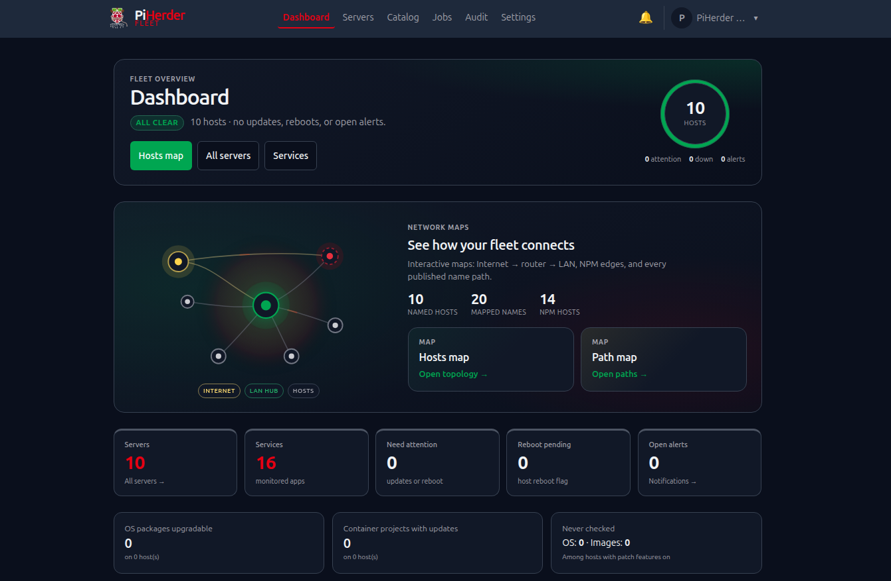

# Appearance (light & dark)

## What this is

Built-in **light and dark** themes (Raspberry Pi red / green accents), shared **ops-hero** layout chrome, and theme-aware brand marks. There is **no** operator custom logo or colour branding in current releases — that is a far-horizon idea only.

## Why it exists

Operators work in bright workshops and dark server rooms. Theme is a **local browser preference**, not a fleet setting, so one instance can look right for everyone without admin policy.

---

## How to switch

| Where | Action |
|-------|--------|
| Header / avatar menu | **Toggle theme** |
| First visit | Follows **system** preference when possible |

Your choice is stored in the browser (local preference). It does not change other operators’ views.

## Light vs dark structure

Both themes use the same layout; contrast is **token-driven**. Stylesheets (loaded from `base.html`, query-busted):

| File | Role |
|------|------|
| `app/static/css/themes.css` | Colour tokens, header/nav, cards, buttons, shared chrome |
| `app/static/css/fabric.css` | Network maps (mesh SVG, focus, mobile list-first, map fullscreen) + dashboard hero |
| `app/static/css/ops.css` | Ops heroes, compact filters, catalog tab bar, Settings/Account/Users core |
| `app/static/css/ops-auth.css` | Login / register / force-password / 2FA stage |
| `app/static/css/ops-pages.css` | Services, Docker, host/backup heroes, detail modals, streams |

| Role | Light | Dark |
|------|-------|------|
| **Page canvas** (`--color-bg`) | Cool grey so white cards separate | Deep navy |
| **Cards / panels** (`--color-surface`) | White + border + light elevation | Elevated grey + border |
| **borders / chrome** (`--color-border`) | Medium grey (readable on white) | Mid-grey on dark panels |
| **Secondary buttons** | Canvas-tinted fill + border (not ghost-white) | Recessed panel + border |

If light mode ever looks like “one flat white screen”, borders or canvas grey have slipped too close to pure white — fix tokens, not per-page CSS.

### Brand logos (light & dark)

The product mark and About wordmark use **theme-aware PNGs** (no operator custom branding):

| Asset | Light UI | Dark UI |
|-------|----------|---------|
| Header / login mark | Black-ink mascot (`piherder-mark*.png`) | Same art, ink recolored light (`piherder-mark-dark*.png`) |
| About / docs hero | Transparent wordmark (`piherder-about.png`) | Light-ink wordmark (`piherder-about-dark.png`) |

Toggle theme swaps the image `src` in the browser. Asset inventory: [`app/static/images/README.md`](https://github.com/bjorngluck/piherder/blob/main/app/static/images/README.md) (mirrored under `wiki/assets/` for this site).

Live docs URL (custom domain only): **[piherder-docs.hacknow.info](https://piherder-docs.hacknow.info/)**. Example hostnames in guides use **`*.example.com`**.

### About & updates

Avatar menu → **About** shows the project story, wordmark (theme-aware), running version, and links to GitHub / docs / releases.
If a newer **GitHub release** is available, a dismissible banner appears under the header (per browser).
**Check for updates** on the About page forces a refresh (wait modal). Disable checks with `PIHERDER_UPDATE_CHECK=false` (air-gapped).

### Ops-hero UI (v0.5.0)

Fleet ops pages share a compact **ops-hero**: primary orb + dual-line stats + optional type chips. Used on:

| Area | Pages |
|------|--------|
| Fleet | **Servers**, **Jobs**, **Audit**, **Notifications** (bell), fleet **Services** |
| Catalog | **Integrations** / **Certificates** / **Templates** / **Network** |
| Host | **Server detail**, host **Docker**, **Backups**, host **Services** |
| Access | **Settings**, **Account**, **Users** |

Dashboard keeps a distinct showcase hero plus a **Network maps** entry panel (constellation mesh). Login / register use a related mesh treatment (not the ops pulse).

**Layout contract (all ops-heroes + dashboard hero):**

| Viewport | Layout |
|----------|--------|
| **&lt; 768px** | Title / actions first · compact pulse strip under it |
| **≥ 768px** | Title **left** · pulse / viz **right** (fixed grid column) |

Heroes and body cards use the **full main content width** (Account is not clamped narrower than Servers/Jobs). Catalog always draws the viz shell (placeholder if a detail page has no stats) so switching Integrations → Certificates → Templates → Network does not jump chrome height.

Supporting chrome: compact filters (`ph-subhead`), branded detail modals (`ph-detail-modal`), mobile service rows that **stack** actions instead of squashing.

### Mobile navigation

- Desktop and mobile menus share one `nav_items` / `secondary_items` source in `base.html` (no drift).  
- The hamburger **slide-out is portaled to `body`** so fixed positioning is not trapped by page overflow (especially Network maps).  
- **Z-index contract:** map fullscreen `100000` · menu backdrop `100090` · menu panel `100100`. Opening **☰** exits map fullscreen cleanly (label, aria, and viewport listeners).  
- **Portrait ↔ landscape:** the app recomputes `--app-vh` / `--app-vw`, closes the drawer if open, and forces a short reflow so pages rescale without navigating away. Network maps also call `PiHerderFabric.refreshLayout` (reset map zoom, clear sticky sizes).

### Theme CSS not updating after a deploy

PiHerder registers a **service worker** (PWA / push). Older builds cache-first’d CSS, so the browser could keep serving **stale** tokens until the SW cache was replaced.

Current behaviour: CSS/JS is **network-first**; shell cache is versioned (`piherder-shell-v3+`). Stylesheet links are query-busted (`themes.css?v=…`, `fabric.css?v=…`, `ops.css?v=…`).

If a tab still looks unchanged after a theme fix:

1. Hard reload once (or close all PiHerder tabs and reopen).  
2. Or DevTools → Application → Service Workers → **Unregister**, then reload.  
3. Or Application → Cache Storage → delete `piherder-shell-*`.

## What theme does *not* affect

- Server data, jobs, or audits  
- Self-backup / restore  
- API tokens or REST behaviour  

## Documentation screenshots

The **public wiki** uses **light theme + desktop** captures by default (print-friendly, consistent).

| Kind | When |
|------|------|
| **Default** | One light desktop PNG per feature page |
| **Optional showcase** | One dark desktop and/or one mobile shot only where layout differs (e.g. Network maps, PWA) |
| **Not required** | Full matrix of light×dark×mobile for every page |

<figure class="ph-figure" markdown>
  
  <figcaption>Optional dark desktop showcase (dashboard).</figcaption>
</figure>

Capture conventions: [`wiki/assets/screenshots/README.md`](https://github.com/bjorngluck/piherder/blob/main/wiki/assets/screenshots/README.md) · edit flow: [Contributing docs](../developers/contributing-docs.md#screenshots-best-practice).

## Related

- [PWA & Web Push](../account-security/pwa-push.md) — install to home screen (theme still toggles in-app)  
- [Network maps](../integrations/dns-fabric.md) — map chrome and mobile list-first  
- Theme sandbox (developers): `/static/theme-test.html` on a running instance  
