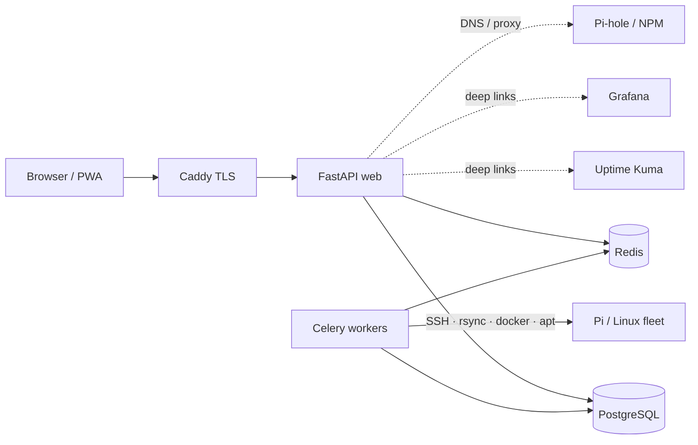
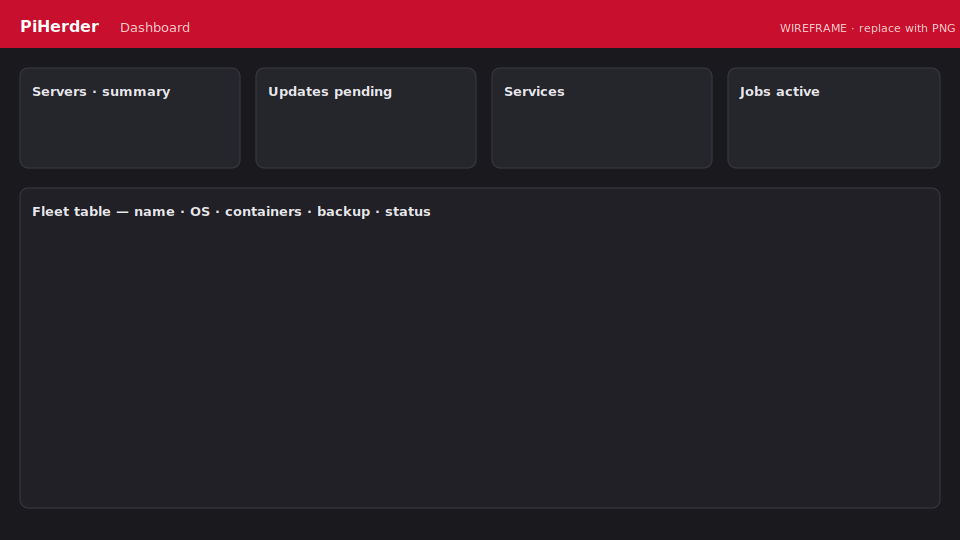

# PiHerder documentation

<figure class="ph-hero-logo" markdown>
  { width="280" }
</figure>

**Secure fleet management for Raspberry Pi and Linux hosts** — backups, patching, Docker control, and service templates with secrets encrypted at rest.

| | |
|---|---|
| **Latest release** | [v0.4.0](https://github.com/bjorngluck/piherder/releases/tag/v0.4.0) |
| **In development** | [v0.5.0 plan](https://github.com/bjorngluck/piherder/blob/main/docs/PLAN_v0.5.0.md) (QA / RC prep) |
| **Source** | [github.com/bjorngluck/piherder](https://github.com/bjorngluck/piherder) |
| **Docs (this site)** | [bjorngluck.github.io/piherder](https://bjorngluck.github.io/piherder/) |
| **License** | [MIT](https://github.com/bjorngluck/piherder/blob/main/LICENSE) (open source) |

---

## Start here

-   :material-rocket-launch:{ .lg .middle } **Install in ~15 minutes**

    ---

    Docker Compose, master key, first admin user.

    [:octicons-arrow-right-24: Install guide](getting-started/install.md)

-   :material-server:{ .lg .middle } **Add your first Pi**

    ---

    SSH key deploy, least-priv user, feature flags.

    [:octicons-arrow-right-24: Add a server](day-to-day/add-server.md)

-   :material-package-variant:{ .lg .middle } **Deploy a service template**

    ---

    NPM, Uptime Kuma, Pi-hole, Grafana — wizard + secrets.

    [:octicons-arrow-right-24: Templates](service-templates/overview.md)

-   :material-map-search:{ .lg .middle } **Operator scenarios**

    ---

    “I want to…” → the right page for every common task.

    [:octicons-arrow-right-24: Scenario index](getting-started/operator-scenarios.md)

---

## What PiHerder does

- **Fleet ops:** rsync backups, apt OS patch, Docker compose projects, bulk actions  
- **Safety:** Fernet-encrypted SSH keys & certs, audit trail (+ client IP), RBAC, optional 2FA + Web Push  
- **Templates:** versioned stacks, desired state, drift, step-up secrets  
- **Catalog (optional):** Kuma, Grafana, Pi-hole, NPM, **Certificates**, **Network maps**  

Core fleet work **never** requires Kuma, Grafana, NPM, or templates.

---

## Documentation map

| Section | For |
|---------|-----|
| [Getting started](getting-started/index.md) | Install, HTTPS, [appearance](getting-started/appearance.md), [scenarios](getting-started/operator-scenarios.md) |
| [Day to day](day-to-day/dashboard-and-services.md) | Dashboard, Services, servers, backups, updates, jobs |
| [Docker](docker/overview.md) | Host containers & compose |
| [Templates](service-templates/overview.md) | Catalog → Templates (deploy / from-host / secrets / drift) |
| [Integrations](integrations/overview.md) | Catalog → Integrations · Certificates · Network |
| [Account & security](account-security/roles.md) | RBAC, users, 2FA, PWA |
| [Operations](operations/settings.md) | Settings, env, DR, metrics, API |
| [Troubleshooting](troubleshooting/index.md) | Common failures |
| [Developers](developers/index.md) | Code, tests, locks, [screenshots](developers/contributing-docs.md) |

Maintainer roadmaps and release plans stay in the **repo** under [`docs/`](https://github.com/bjorngluck/piherder/tree/main/docs) — not in this user-facing tree.

---

## Screenshots

<figure class="ph-figure" markdown>
  
  <figcaption>Dashboard — fleet summary and attention table. wireframe Replace with a real capture when ready — local git workflow in <a href="developers/contributing-docs.md#screenshots-best-practice">Contributing docs</a>.</figcaption>
</figure>

Default: **light + desktop**. Optional dark/mobile showcases only. Capture inventory: [screenshots README](https://github.com/bjorngluck/piherder/blob/main/wiki/assets/screenshots/README.md).

---

## Quick links

- Interactive API (on your instance): **`/docs`** (OpenAPI, tag `api-v1`)  
- Security policy: [SECURITY.md](https://github.com/bjorngluck/piherder/blob/main/SECURITY.md)  
- Report issues: [GitHub Issues](https://github.com/bjorngluck/piherder/issues)  
