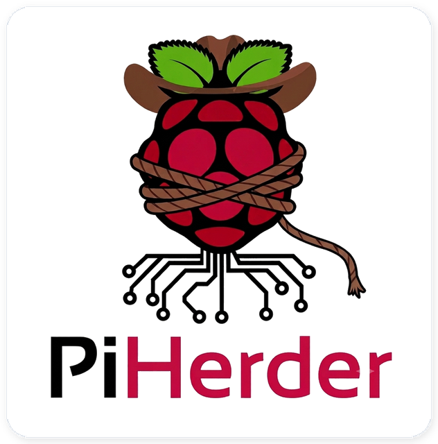
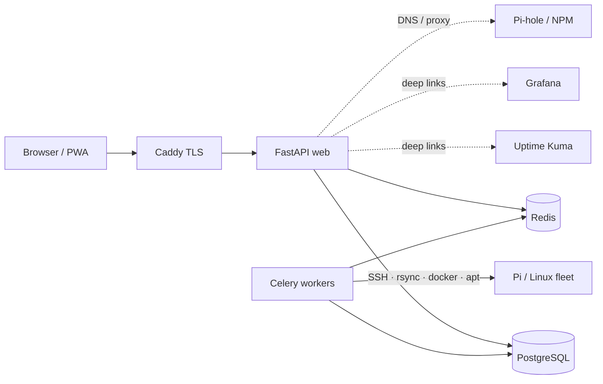

# PiHerder documentation

<figure class="ph-hero-logo" markdown>
  { width="300" }
</figure>

**Secure fleet management for Raspberry Pi and Linux hosts** — backups, patching, Docker control, and service templates with secrets encrypted at rest.

## Release Candidate 1 (RC1) {#rc1}

!!! warning "Please read first"
    This site documents **PiHerder’s first release candidate** (the **0.5.x** line on the road to **1.0.0**).

    | What to expect | Detail |
    |----------------|--------|
    | **Product** | Core fleet workflows work; some surfaces may still be rough, incomplete, or not optimal on every host type |
    | **Documentation** | Written for operators in plain language, but still a **working guide** — not the final polished 1.0 manual |
    | **Screenshots** | Many figures are still **wireframes** or placeholders; real captures will land as the UI freezes |
    | **Production bar** | **v1.0.0** is the intended first refined production release (behaviour + docs) |

    If something is unclear, missing, or wrong in practice, open a [GitHub Issue](https://github.com/bjorngluck/piherder/issues) or amend the wiki after you review a page with your own screenshots and notes.

| | |
|---|---|
| **Current line** | **v0.5.0** RC1 / `main` (package `0.5.0.dev0` until freeze) |
| **Previous tag** | [v0.4.0](https://github.com/bjorngluck/piherder/releases/tag/v0.4.0) (templates foundation) |
| **Ship plan** | [PLAN_v0.5.0.md](https://github.com/bjorngluck/piherder/blob/main/docs/PLAN_v0.5.0.md) |
| **Source** | [github.com/bjorngluck/piherder](https://github.com/bjorngluck/piherder) |
| **Docs (this site)** | [piherder-docs.hacknow.info](https://piherder-docs.hacknow.info/) |
| **License** | [MIT](https://github.com/bjorngluck/piherder/blob/main/LICENSE) (open source) |

---

## What is PiHerder?

PiHerder is a **web app you run once** (usually with Docker Compose) that becomes the **control panel for many Raspberry Pis and Linux hosts**.

Instead of SSHing into each machine separately for backups, package updates, Docker stacks, and certificates, you work from one browser UI. The app reaches hosts over **SSH**, runs work in the background, keeps an **audit trail**, and stores secrets **encrypted** — not in plain text on disk.

### Why it exists

Homelab and small fleet operators typically end up with:

- Cron scripts and ad-hoc rsync that only the original author understands  
- Different “how we patch this Pi” recipes on every host  
- Compose stacks edited by hand with secrets living in shell history  
- No single place that answers *what needs attention right now?*

PiHerder turns those habits into **repeatable, audited UI actions** so you can focus on running services, not babysitting SSH sessions.

### What it is *for* (and what it is not)

| PiHerder **is for** | PiHerder is **not** |
|---------------------|---------------------|
| Managing a **fleet of hosts you own** (lab, home, small team) | A multi-tenant SaaS or public cloud control plane |
| Backups, OS/container updates, Docker compose, templates | Replacing specialised tools (Kuma, Grafana, Pi-hole, NPM) |
| Optional **deep links / adapters** into those tools | Embedding every vendor API end-to-end |
| Operators who accept SSH-based remote control | Agent-based or air-gapped fleets with no SSH path |

Core fleet work (SSH, backups, patch, Docker) **never** requires Catalog integrations or templates. Those are optional accelerators.

---

## Start here

-   :material-rocket-launch:{ .lg .middle } **Install in ~15 minutes**

    ---

    Docker Compose, master key, first admin user.

    [:octicons-arrow-right-24: Install guide](getting-started/install.md)

-   :material-server:{ .lg .middle } **Add your first Pi**

    ---

    SSH key deploy, least-priv user, feature flags.

    [:octicons-arrow-right-24: Add a server](day-to-day/add-server.md)

-   :material-package-variant:{ .lg .middle } **Deploy a service template**

    ---

    NPM, Uptime Kuma, Pi-hole, Grafana — wizard + secrets.

    [:octicons-arrow-right-24: Templates](service-templates/overview.md)

-   :material-map-search:{ .lg .middle } **Operator scenarios**

    ---

    “I want to…” → end-to-end journeys for common work.

    [:octicons-arrow-right-24: Scenario index](getting-started/operator-scenarios.md)

---

## How the system fits together

| Capability | What it does for you | Why it matters |
|------------|----------------------|----------------|
| **Fleet ops** | rsync backups, apt OS patch, Docker projects, bulk actions | One UI instead of N SSH sessions |
| **Safety** | Encrypted keys/certs, audit (+ client IP), RBAC, optional 2FA + push | You can prove *who did what* and limit blast radius |
| **Templates** | Versioned stacks, desired state, drift, step-up secrets | Repeatable deploy without copying compose by hand |
| **Catalog (optional)** | Kuma, Grafana, Pi-hole, NPM, certificates, network maps | Homelab topology and status in one place |

---

## Documentation map

Use this table when you already know the area; use [Operator scenarios](getting-started/operator-scenarios.md) when you only know the goal.

| Section | What you’ll learn |
|---------|-------------------|
| [Getting started](getting-started/index.md) | Install, first admin, HTTPS, appearance, RC context |
| [Day to day](day-to-day/dashboard-and-services.md) | Dashboard, servers, backups, updates, jobs, remove host |
| [Docker](docker/overview.md) | Host containers, inventory cache, compose edit |
| [Templates](service-templates/overview.md) | Catalog templates: deploy, from-host, secrets, drift |
| [Integrations](integrations/overview.md) | Catalog products, certs, network maps |
| [Account & security](account-security/roles.md) | RBAC, users, 2FA, PWA |
| [Operations](operations/settings.md) | Settings, env, DR, metrics, API |
| [Troubleshooting](troubleshooting/index.md) | Common failures and where to look |
| [Developers](developers/index.md) | Code, tests, docs/screenshot workflow |

!!! tip "Reviewing docs with screenshots"
    As you walk each page in a running instance, replace wireframes with real light-desktop captures and add notes where the UI or “why” still feels thin. Capture conventions: [Contributing docs](developers/contributing-docs.md#screenshots-best-practice).

Maintainer roadmaps stay in the **repo** under [`docs/`](https://github.com/bjorngluck/piherder/tree/main/docs) — not in this user-facing tree.

---

## Screenshots

<figure class="ph-figure" markdown>
  
  <figcaption>Dashboard — fleet summary and attention table. wireframe Replace with a real capture when ready — local git workflow in <a href="developers/contributing-docs.md#screenshots-best-practice">Contributing docs</a>.</figcaption>
</figure>

Default: **light + desktop**. Optional dark/mobile showcases only. Capture inventory: [screenshots README](https://github.com/bjorngluck/piherder/blob/main/wiki/assets/screenshots/README.md).

---

## Quick links

- Interactive API (on your instance): **`/docs`** (OpenAPI, tag `api-v1`)  
- Security policy: [SECURITY.md](https://github.com/bjorngluck/piherder/blob/main/SECURITY.md)  
- Report issues: [GitHub Issues](https://github.com/bjorngluck/piherder/issues)  
