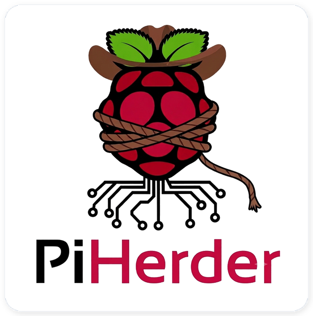
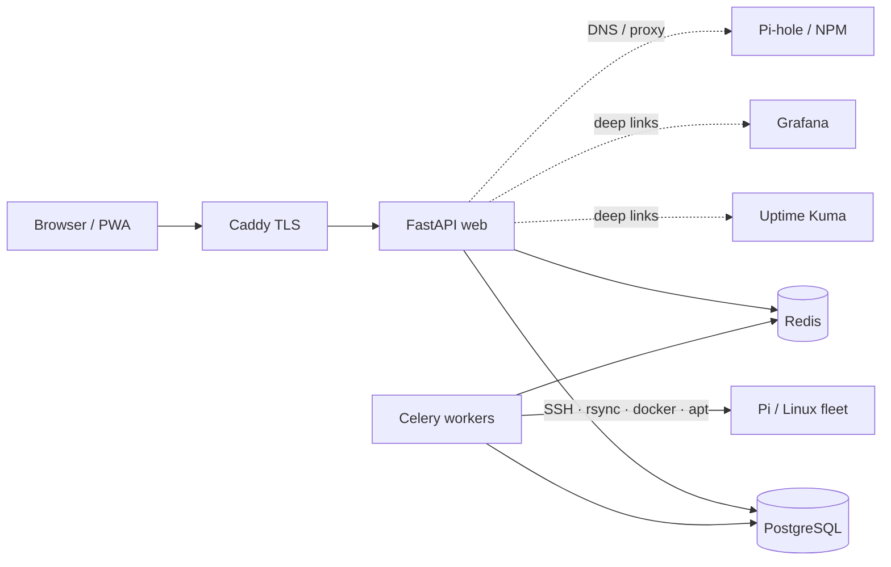
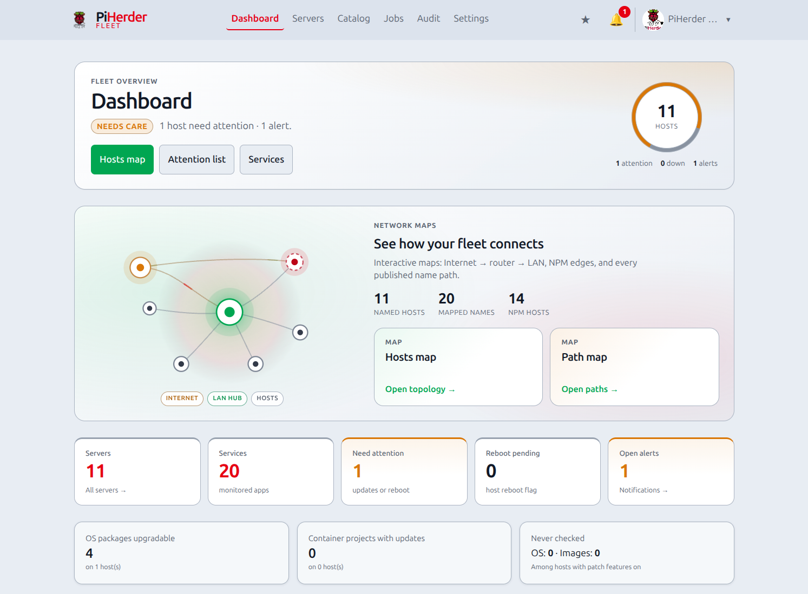
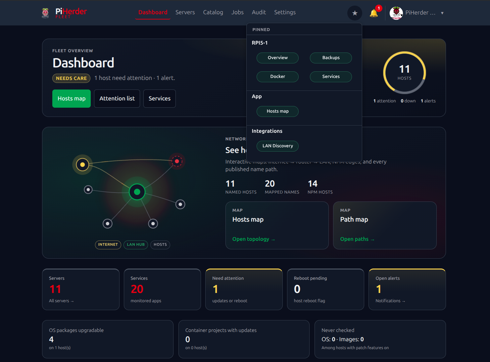

# PiHerder documentation

<figure class="ph-hero-logo" markdown>
  { width="300" }
</figure>

**Secure fleet management for Raspberry Pi and Linux hosts** — backups, patching, Docker control, and service templates with secrets encrypted at rest.

## Release status {#release-status}

| | |
|---|---|
| **Current release** | **[v1.1.0](https://github.com/bjorngluck/piherder/blob/main/docs/RELEASE_v1.1.0.md)** — elevate production |
| **Image** | `bjorngluck/piherder:1.1.0` · `1.1` · `latest` (multi-arch amd64 + arm64; `1.0` / `1.0.x` pins remain valid) |
| **Release notes** | [RELEASE_v1.1.0.md](https://github.com/bjorngluck/piherder/blob/main/docs/RELEASE_v1.1.0.md) · prior [v1.0.0](https://github.com/bjorngluck/piherder/blob/main/docs/RELEASE_v1.0.0.md) |
| **Known issue** | Busy-source rsync vanish (**KI-rsync-vanished**) — [troubleshooting](troubleshooting/backups.md#vanished-files-busy-sources) |
| **Next train** | [PLAN_v1.2.0.md](https://github.com/bjorngluck/piherder/blob/main/docs/PLAN_v1.2.0.md) (WebAuthn · [SSO](account-security/sso-oidc.md) · webshell · demo) on `v1.2.0-dev` |
| **Source** | [github.com/bjorngluck/piherder](https://github.com/bjorngluck/piherder) |
| **Docs (this site)** | [piherder-docs.hacknow.info](https://piherder-docs.hacknow.info/) |
| **License** | [MIT](https://github.com/bjorngluck/piherder/blob/main/LICENSE) (open source) |

If something is unclear or wrong, open a [GitHub Issue](https://github.com/bjorngluck/piherder/issues).

---

## What is PiHerder?

PiHerder is a **web app you run once** (usually with Docker Compose) that becomes the **control panel for many Raspberry Pis and Linux hosts**.

Instead of SSHing into each machine separately for backups, package updates, Docker stacks, and certificates, you work from one browser UI. The app reaches hosts over **SSH**, runs work in the background, keeps an **audit trail**, and stores secrets **encrypted** — not in plain text on disk.

### Why it exists

Homelab and small fleet operators typically end up with:

- Cron scripts and ad-hoc rsync that only the original author understands  
- Different “how we patch this Pi” recipes on every host  
- Compose stacks edited by hand with secrets living in shell history  
- No single place that answers *what needs attention right now?*

PiHerder turns those habits into **repeatable, audited UI actions** so you can focus on running services, not babysitting SSH sessions.

### What it is *for* (and what it is not)

| PiHerder **is for** | PiHerder is **not** |
|---------------------|---------------------|
| Managing a **fleet of hosts you own** (lab, home, small team) | A multi-tenant SaaS or public cloud control plane |
| Backups, OS/container updates, Docker compose, templates | Replacing specialised tools (Kuma, Grafana, Pi-hole, NPM) |
| Optional **deep links / adapters** into those tools | Embedding every vendor API end-to-end |
| Operators who accept SSH-based remote control | Agent-based or air-gapped fleets with no SSH path |

Core fleet work (SSH, backups, patch, Docker) **never** requires Catalog integrations or templates. Those are optional accelerators.

---

## Start here

-   :material-rocket-launch:{ .lg .middle } **Install in ~15 minutes**

    ---

    Docker Compose, master key, first admin user.

    [:octicons-arrow-right-24: Install guide](getting-started/install.md)

-   :material-server:{ .lg .middle } **Add your first Pi**

    ---

    SSH key deploy, least-priv user, feature flags.

    [:octicons-arrow-right-24: Add a server](day-to-day/add-server.md)

-   :material-package-variant:{ .lg .middle } **Deploy a service template**

    ---

    NPM, Uptime Kuma, Pi-hole, Grafana — wizard + secrets.

    [:octicons-arrow-right-24: Templates](service-templates/overview.md)

-   :material-map-search:{ .lg .middle } **Operator scenarios**

    ---

    “I want to…” → end-to-end journeys for common work.

    [:octicons-arrow-right-24: Scenario index](getting-started/operator-scenarios.md)

---

## How the system fits together

```mermaid
flowchart LR
  You[Browser / PWA] --> Caddy[Caddy TLS]
  Caddy --> Web[FastAPI web]
  Web --> DB[(PostgreSQL)]
  Web --> Redis[(Redis)]
  Celery[Celery workers] --> DB
  Celery --> Redis
  Celery -->|SSH · rsync · docker · apt| Fleet[Pi / Linux fleet]
  Web -.->|deep links| Kuma[Uptime Kuma]
  Web -.->|deep links| GF[Grafana]
  Web -.->|DNS / proxy| PH[Pi-hole / NPM]
```

| Capability | What it does for you | Why it matters |
|------------|----------------------|----------------|
| **Fleet ops** | rsync backups, apt OS patch (or **`ha` CLI** on HAOS), Docker projects, bulk actions | One UI instead of N SSH sessions |
| **Safety** | Encrypted keys/certs, audit (+ client IP), RBAC, optional 2FA + push | You can prove *who did what* and limit blast radius |
| **Templates** | Versioned stacks, OOTB vs **Yours** badges, from-host (+ sidecar configs), desired state, drift, step-up secrets | Repeatable deploy without copying compose by hand |
| **Catalog (optional)** | Kuma, Grafana, Pi-hole, NPM, certificates, network maps, LAN discovery | Homelab topology and status in one place |

---

## Documentation map

Use this table when you already know the area; use [Operator scenarios](getting-started/operator-scenarios.md) when you only know the goal.

| Section | What you’ll learn |
|---------|-------------------|
| [Getting started](getting-started/index.md) | Install, first admin, HTTPS, appearance |
| [Day to day](day-to-day/dashboard-and-services.md) | Dashboard, servers, backups, updates, jobs, remove host |
| [Docker](docker/overview.md) | Host containers, inventory cache, compose edit |
| [Templates](service-templates/overview.md) | Catalog templates: deploy, from-host, secrets, drift |
| [Integrations](integrations/overview.md) | Catalog products, certs, network maps |
| [Account & security](account-security/roles.md) | RBAC, users, 2FA, PWA |
| [Operations](operations/settings.md) | Settings, env, DR, metrics, API |
| [Troubleshooting](troubleshooting/index.md) | Common failures and where to look |
| [Developers](developers/index.md) | Code, tests, contributing |

---

## Screenshots

<figure class="ph-figure" markdown>
  
  <figcaption>Dashboard — fleet summary and attention table.</figcaption>
</figure>

<figure class="ph-figure" markdown>
  
  <figcaption>Same surface in dark theme.</figcaption>
</figure>

---

## Quick links

- Interactive API (on your instance): **`/docs`** (OpenAPI, tag `api-v1`)  
- Security policy: [SECURITY.md](https://github.com/bjorngluck/piherder/blob/main/SECURITY.md)  
- Report issues: [GitHub Issues](https://github.com/bjorngluck/piherder/issues)  
