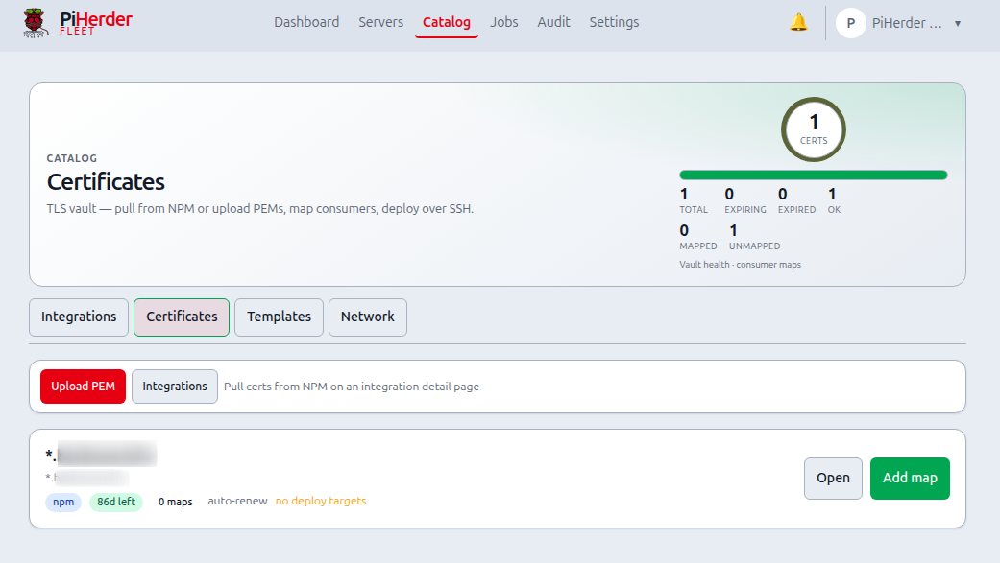

# Managed certificates

## What this is

PiHerder stores TLS **fullchain + private key** encrypted (Fernet / `PIHERDER_MASTER_KEY`) and **deploys** them to fleet hosts over SSH via **service maps** (path, layout, permissions, optional restart command).

## Why it exists

One Let’s Encrypt cert often feeds NPM, UniFi, reverse proxies, and app containers. Copying PEMs by hand is error-prone and expires on different schedules. The vault is a single encrypted store; maps describe each consumer; renew/redeploy keeps them aligned.

<figure class="ph-figure" markdown>
  
  <figcaption>Catalog → Certificates: vault list with expiry and deploy entry points.</figcaption>
</figure>

---

## End-to-end: vault → host files

Guided path: **Catalog → Certificates → First-cert setup** (`/certificates/setup`).

1. **Get material in** — NPM pull or **Upload PEM**.  
2. **Optional — this PiHerder instance:** **Apply to this PiHerder** writes PEMs into compose `./certs` and reloads Caddy (no SSH, no map).  
3. **Fleet:** open the cert → **Add service map** — preset + **write mode** (direct SFTP or **stage + sudo install** for least-priv).  
4. **Deploy** that map (or all maps).  
5. Confirm files on the host and that the app reloaded.  
6. Enable auto-renew for NPM-sourced certs if desired.  

Map cards show **in sync** when the last deploy fingerprint matches the vault (redeploy is a no-op unless you force), or **stale** after vault material changes.

### Write modes (fleet maps)

| Mode | When | How |
|------|------|-----|
| **Direct SFTP** | SSH user owns the target directory (e.g. under `~/`) | Write PEMs in place; optional chown |
| **Stage + sudo install** | Root-owned paths (`/etc/ssl`, Docker volume data dirs) | SFTP into `~/.piherder/cert-stage/<map-id>/`, then `sudo install` for mkdir/mode/owner |

The map form shows a **suggested sudoers** drop-in for stage_sudo (install only). Post-deploy restarts may need `systemctl` lines or membership in group `docker` — not free-form root shell.

---

## Mental model

| Piece | What it is |
|-------|------------|
| **Vault** | One certificate identity in PiHerder (domains, expiry, encrypted PEMs) |
| **Service map** | One consumer of that cert: host + directory + layout/filenames + mode/owner + optional post-deploy command |
| **Deploy** | SSH write files → chmod/chown → run restart command |

Typical flow:

1. **Get material in** — NPM → Certificates → Pull, or **Upload PEM**
2. **Map consumers** — on the cert detail page, add a **service map** per app (NPM volume, UniFi PFX path, Docker bind-mount, …)
3. **Deploy** — per map or “Deploy all maps”; renew/auto-renew re-deploys maps after a successful NPM renew

PiHerder does **not** reconfigure the app’s TLS settings. Point the service at the files you wrote (or the volume that mounts them).

!!! tip "Two different TLS stories"
    - **PiHerder’s own HTTPS** (Caddy / `certs/` on the herder host) → [Trusted HTTPS & TLS](../getting-started/https-tls.md)  
    - **Fleet vault** (this page) — distribute LE/NPM/upload PEMs to **any** SSH host (Docker **not** required)

## Where to find it

**Catalog → Certificates** (`/certificates`) — same Catalog tabs as Integrations / Templates / Network.

List shows expiry chips, source (npm / upload), map count, host names, and deploy status. Certs with **no maps** get an **Add map** shortcut; unmapped first certs can use **First-cert setup**.

## Sources

1. **NPM pull** — Catalog → Integrations → NPM → Certificates → Pull  
2. **PEM upload** — Catalog → Certificates → **Upload PEM** (cleartext paste; encrypted immediately; never shown again)

## Service maps (deploy targets)

Each map answers: *for this service, where and how should the cert land?*

| Field | Purpose |
|-------|---------|
| **Label** | Human name (“NPM custom SSL”, “UniFi”) |
| **Host** | PiHerder server (SSH) |
| **Directory** | Remote path (`~/certs` or absolute, e.g. `/opt/stacks/npm/certs`) |
| **Layout** | Which files to write (see below) |
| **Filenames** | Exact names the app expects |
| **Mode / owner** | `chmod` + optional `chown` |
| **Post-deploy** | Shell command after write (e.g. `docker compose … restart`) |

### Layouts

| Layout | Files written |
|--------|----------------|
| **pair** | `fullchain.pem` + `privkey.pem` (defaults; rename as needed) |
| **combined** | One PEM: private key then fullchain |
| **pair_and_combined** | Both |
| **pair_and_pfx** | Pair + PKCS#12 via host `openssl pkcs12` |
| **pair_combined_pfx** | All three |

Presets in the UI fill common patterns; always adjust path and restart for your stack.

### How deploy writes files

1. SSH as the host’s configured user (`ssh_username` — e.g. `piherder` or `bjorn`).  
2. **SFTP** write into **Directory** (expand `~` to that user’s home).  
3. `chmod` / optional `chown` (chown may use `sudo`).  
4. Optional **post-deploy** shell command (also as that user; use `sudo` when needed).

**Implication:** writing straight into `/etc/ssl/…` usually fails for a least-priv user. Prefer a **staging directory** under the service user’s home, then **`sudo install` / `sudo cp`** in post-deploy into the system path.

Docker is **not** required. Hosts with only OS features (or none) still work as long as SSH + post-deploy sudo rules allow the install/restart.

### Example: NPM custom cert on a Docker host

- Label: `NPM custom SSL`
- Directory: `/opt/stacks/npm/certs` (bind-mounted into the container if needed)
- Layout: **pair** → `fullchain.pem`, `privkey.pem`
- Mode: `600`, owner `root:root`
- Post-deploy: `docker compose -f /opt/stacks/npm/docker-compose.yml restart`

Then configure NPM (or the proxy) to use those files.

### Cookbook: OctoPi / HAProxy host (no Docker, least-priv `piherder`)

Use when a host runs **OctoPrint / OctoPi** (or similar) with **HAProxy** TLS and stock **`/etc/ssl/snakeoil.pem`**, and the PiHerder SSH user is the dedicated **`piherder`** account (not full-sudo `bjorn`).

**Combined layout** builds one PEM (private key, then fullchain) — same idea as OctoPi’s snakeoil file.

#### 1. One-time host prep (as root or a full-sudo admin)

Stock least-priv sudoers does **not** allow writing under `/etc/ssl` or restarting HAProxy. Add a tight drop-in:

```bash
# Paths assume service user piherder and staging dir below
cat <<'EOF' | sudo tee /etc/sudoers.d/piherder-certs
# PiHerder cert deploy — OctoPi HAProxy (review before install)
piherder ALL=(root) NOPASSWD: /usr/bin/install -o root -g root -m 644 /home/piherder/certs/snakeoil.pem /etc/ssl/snakeoil.pem
piherder ALL=(root) NOPASSWD: /bin/systemctl restart haproxy, /usr/bin/systemctl restart haproxy
EOF
sudo chmod 440 /etc/sudoers.d/piherder-certs
sudo visudo -cf /etc/sudoers.d/piherder-certs

sudo -u piherder mkdir -p /home/piherder/certs
```

Verify non-interactive sudo (must not prompt for a password):

```bash
sudo -u piherder -H bash -lc 'sudo -n true && echo sudo-ok'
# After a file exists at staging path, also:
# sudo -u piherder -H bash -lc 'sudo -n install -o root -g root -m 644 /home/piherder/certs/snakeoil.pem /etc/ssl/snakeoil.pem'
# sudo -u piherder -H bash -lc 'sudo -n systemctl restart haproxy'
```

Optional: backup the current system cert before first deploy:

```bash
sudo cp -a /etc/ssl/snakeoil.pem /etc/ssl/snakeoil.pem.backup
```

#### 2. PiHerder server row

| Setting | Value |
|---------|--------|
| SSH user | `piherder` |
| Key auth | **Test connection** succeeds |
| Docker feature | Off is fine |

#### 3. Service map (Catalog → Certificates → cert detail)

| Field | Value |
|--------|--------|
| **Label** | `OctoPi HAProxy` |
| **Host** | your OctoPi server (e.g. `3dprint`) |
| **Directory** | `/home/piherder/certs` |
| **Layout** | **combined** |
| **Combined filename** | `snakeoil.pem` |
| **Mode** | `600` |
| **Owner / group** | leave empty |
| **Post-deploy** | (command below) |

**Post-deploy command** (paste as one line):

```bash
sudo install -o root -g root -m 644 /home/piherder/certs/snakeoil.pem /etc/ssl/snakeoil.pem && sudo systemctl restart haproxy
```

#### 4. Deploy and check

1. Save the map → **Deploy** (or **Deploy all maps**).  
2. On the host:

   ```bash
   ls -l /home/piherder/certs/snakeoil.pem /etc/ssl/snakeoil.pem
   systemctl is-active haproxy
   ```

3. Browser: `https://3dprint.local` (or the FQDN that matches the cert SANs).

#### Using a full-sudo user (`bjorn`) instead

Same map, but Directory can still be staging under that user’s home (`/home/bjorn/certs`) and post-deploy uses the same `sudo install … && sudo systemctl restart haproxy` pattern. Full sudo means you may not need a separate `piherder-certs` drop-in — still prefer **not** relying on interactive password prompts (`sudo -n` must work for automation).

!!! note "Refine later"
    **UI presets (v0.6):** map form includes **OctoPi / HAProxy**, **Grafana volume**, **NPM custom SSL**, **Docker bind**, and **UniFi PFX**. Paths and post-deploy commands are starting points — edit for your host and sudoers.

### Cookbook: Grafana TLS into a Docker named volume

Use when Grafana expects PEMs **inside its data volume**, e.g. in-container:

```text
/var/lib/grafana/fullchain.pem
/var/lib/grafana/privkey.pem
```

(host path often `/var/lib/docker/volumes/grafana_grafana_data/_data/…`).

#### Why Grafana crashed after a “successful” deploy

Official `grafana/grafana` runs as **UID 472**. Installing PEMs as **`root:root` mode `600`** makes them unreadable:

```text
could not load SSL certificate: open /var/lib/grafana/fullchain.pem: permission denied
```

→ crash loop (`Restarting (1)`). Deploy “success” only means SSH + commands exited 0, not that Grafana can read the files.

**Fix on a broken host** (SSH user in `docker` group):

```bash
docker run --rm -v grafana_grafana_data:/data alpine:3.20 \
  sh -c 'chown 472:0 /data/fullchain.pem /data/privkey.pem && \
         chmod 644 /data/fullchain.pem && chmod 600 /data/privkey.pem'
cd /home/bjorn/docker/grafana && docker compose restart grafana   # adjust path
```

#### Service map (recommended — no sudo)

| Field | Value |
|--------|--------|
| **Label** | `Grafana TLS` |
| **Host** | Grafana host |
| **Directory** | `~` (home of SSH user, e.g. `/home/piherder`) |
| **Layout** | **pair** |
| **Write mode** | **Direct SFTP** |
| **Filenames** | `fullchain.pem` / `privkey.pem` |
| **Mode** | `600` on staging only |
| **Owner** | leave empty |
| **Post-deploy** | (command below) |

```bash
docker run --rm \
  -v grafana_grafana_data:/data \
  -v /home/piherder:/src:ro \
  alpine:3.20 \
  sh -c 'cp /src/fullchain.pem /src/privkey.pem /data/ && \
         chown 472:0 /data/fullchain.pem /data/privkey.pem && \
         chmod 644 /data/fullchain.pem && chmod 600 /data/privkey.pem' && \
cd /home/bjorn/docker/grafana && docker compose restart grafana
```

Adjust:

- `/home/piherder` if the SSH user differs  
- `grafana_grafana_data` (`docker volume ls \| grep -i grafana`)  
- compose project path (`/home/bjorn/docker/grafana` on this lab host)

SSH user needs the **`docker`** group (not root for volume path).

#### Avoid

```bash
# BAD for Grafana — process cannot read the certs
sudo install -o root -g root -m 600 … /var/lib/docker/volumes/…/_data/
```

If you insist on `sudo install` into the volume, use **`-o 472 -g 0`** (not root) and matching sudoers; the docker-copy method above is simpler when Docker feature is on.

#### One-time host notes

1. **Volume name** — `docker volume ls | grep -i grafana`  
2. **Grafana config** — `cert_file` / `cert_key` under `/var/lib/grafana/…` if that is the volume mount. PiHerder does not edit `grafana.ini`.  
3. **Fingerprint sidecar** — may appear under home (`~/.piherder-cert-fp`); harmless.

#### Deploy and check

1. Save map → **Deploy**.  
2. On the host:

   ```bash
   sudo ls -l /var/lib/docker/volumes/grafana_grafana_data/_data/*.pem
   cd ~/docker/grafana && docker compose ps
   ```

3. Hit Grafana over HTTPS with a cert SAN that matches the hostname.

## Troubleshooting: deploy / post-deploy

### Post-deploy sudo denied {#cert-sudo-denied}

**Symptom in PiHerder:** `deploy_failed — post deploy failed: sudo: I'm sorry piherder. I'm afraid I can't do that` (any SSH user name in the message).

**Meaning:** SSH and the SFTP write usually succeeded (staging PEMs under the user’s home). The **post-deploy** shell ran `sudo …` and **sudoers denied** it. This is a host permission issue, not a PiHerder vault bug. Stock least-priv only grants backup/rsync (and optional apt/docker) — **not** `/etc/ssl` or `/var/lib/docker/volumes/…`.

**Fix:**

1. Confirm staging files exist after deploy (example user `piherder`):

   ```bash
   ls -l /home/piherder/fullchain.pem /home/piherder/privkey.pem
   # or OctoPi:
   # ls -l /home/piherder/certs/snakeoil.pem
   ```

2. Install a **NOPASSWD** drop-in whose command line **exactly** matches post-deploy (sudo is strict about args). Examples above: [OctoPi](#cookbook-octopi--haproxy-host-no-docker-least-priv-piherder), [Grafana volume](#cookbook-grafana-tls-into-a-docker-named-volume).

3. Validate and dry-run **non-interactively** (`-n` must not ask for a password):

   ```bash
   sudo visudo -cf /etc/sudoers.d/piherder-grafana-certs   # or piherder-certs
   sudo -u piherder -H bash -lc '
     sudo -n install -o root -g root -m 600 \
       /home/piherder/fullchain.pem /home/piherder/privkey.pem \
       /var/lib/docker/volumes/grafana_grafana_data/_data/ && echo install-ok
   '
   ```

   - Still “can’t do that” / password prompt → path, flags, or volume name still mismatch sudoers.  
   - `install-ok` but `docker compose` fails → add user to **`docker`** group (or a sudo rule for compose), then new SSH session.  
   - Both OK → re-**Deploy** the map in PiHerder (use force / deploy all if fingerprint skip leaves an old status).

4. Prefer **absolute paths** in both the map’s post-deploy and sudoers (`/home/piherder/…`), not only `~/…`.

### Other common failures

| Symptom | Likely cause |
|---------|----------------|
| `mkdir failed` / write error under `/etc/ssl` or `/var/lib/docker` | Directory is not writable by SSH user — stage under home, install in post-deploy |
| Post-deploy fails only on `docker compose` | Not in `docker` group; passwordless sudo only fixed the `install` half |
| `skip — already deployed same fingerprint` | Success earlier; change cert or force redeploy |
| Renew OK but maps stale | Upload-sourced certs do not auto-renew; NPM-sourced need auto-renew + maps enabled |

## Auto-renew

Every **6 hours**: NPM-sourced certs with auto-renew and expiry within the window → renew orchestration → deploy all enabled maps. Failures raise notifications (`cert_expiring`, `cert_renew_failed`).

## Herder self-backup

Certificate rows and maps are included. Restore requires the **same** master key.

## Security notes

- Prefer `600` mode and a dedicated remote directory  
- Post-deploy commands are operator-supplied and audited — treat like any remote shell privilege  
- Least-priv `piherder` needs **explicit sudoers** for system paths / Docker volumes; full-sudo users still need `sudo -n` (no TTY password)  
- PFX export uses host `openssl pkcs12` (empty or stored export password)
- Removing a map does **not** delete files already on the host
