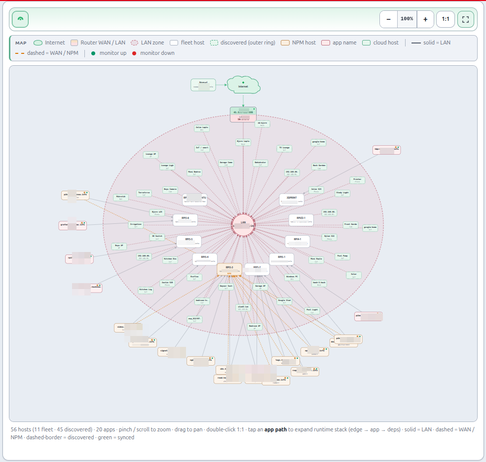
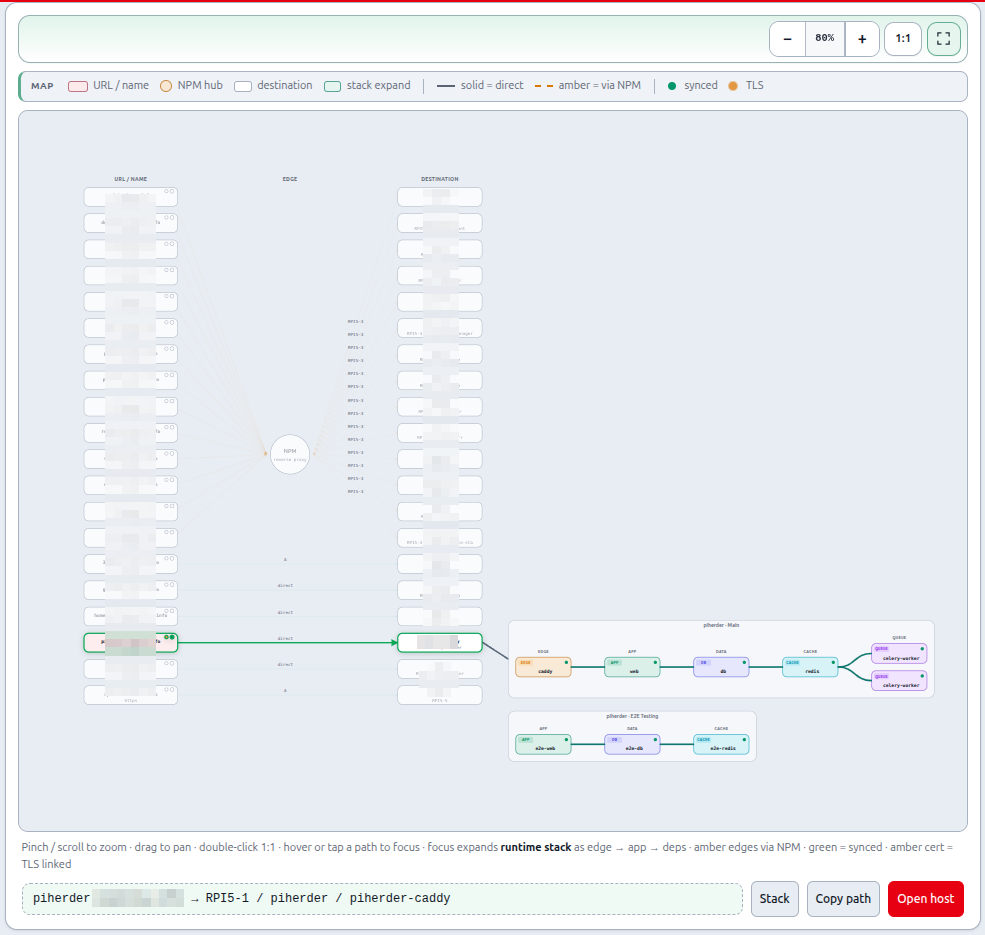
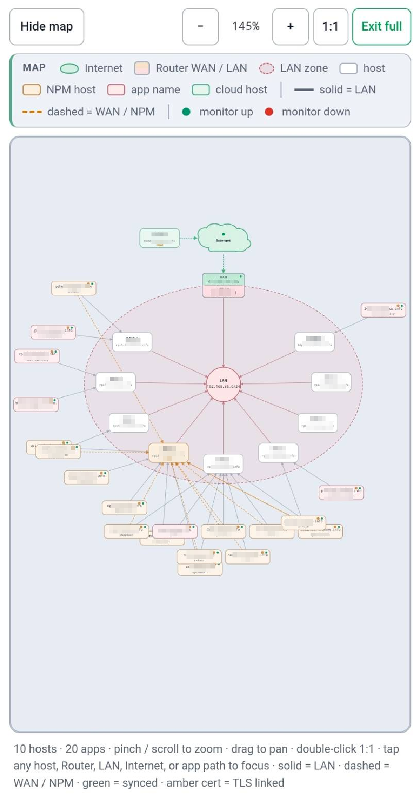

# Network (hosts ↔ apps ↔ proxy ↔ internet)

## What this is

**Network** is PiHerder’s view of how **names** reach **hosts** and **apps**: Pi-hole records, fleet FQDNs, NPM edges, LAN/gateway/public IP, optional Kuma status, and Docker project links — shown as path cards and topology maps.

It is **not** a Kubernetes-style service mesh. It is a homelab **map** of DNS + proxy + inventory.

**UI label:** **Catalog → Network** (URL slug remains `/dns` for compatibility).

**Pages:** Network hub · Hosts map · Path map · **Kuma coverage** (`/dns/coverage`)

## Why it exists

After a few years of “this CNAME points somewhere,” operators lose the picture of *name → proxy? → host → container*. Network maps rebuild that picture so you can answer “where does `grafana.example.com` go?” without opening three admin UIs.

---

## End-to-end: first useful Hosts map

1. Connect [Pi-hole](pihole.md); set host FQDNs + manage A where appropriate.  
2. On the Network hub, set **LAN subnet**, **gateway**, and public IP (or Lookup).  
3. Optional: bind Router / Public IP Kuma monitors.  
4. **Import all from Pi-hole** or Adopt candidates.  
5. Open **Hosts map** — confirm home ring vs cloud hosts.  
6. Open **Path map** for a specific FQDN flow.  

Journey: [Operator scenarios — Journey E](../getting-started/operator-scenarios.md#journey-e).

<figure class="ph-figure" markdown>
  
  <figcaption>Hosts map — home ring vs cloud hosts (light desktop).</figcaption>
</figure>

<figure class="ph-figure" markdown>
  
  <figcaption>Path map — name → proxy → host → service flow.</figcaption>
</figure>

<figure class="ph-figure" markdown>
  
  <figcaption>Optional mobile showcase — Hosts map list-first layout.</figcaption>
</figure>

---

## Mental model — entities & relationships

One published **name** maps through optional layers:

```text
name  →  [NPM]  →  host  →  [service/project]  →  [container]
```

| Entity | Example | Notes |
|--------|---------|--------|
| **Name** | `grafana.example.com` | CNAME, or **host identity A** when name = host FQDN |
| **NPM** | RPI5-3 | Only when proxied (edge host) |
| **Host** | RPI5-6 | Fleet server + A record |
| **Service** | `grafana` | Compose project (Kuma / NPM / deploy) |
| **Container** | `grafana` | Runtime container |

### Path kinds

| Kind | Meaning |
|------|---------|
| **host_identity** | Name **is** the host A record (e.g. `3dprint.example.com`) — **no CNAME** |
| **app** | CNAME → host → Docker project/container (e.g. Grafana) |
| **npm_host** | CNAME → NPM edge → host |
| **npm_app** | CNAME → NPM → host → project/container (e.g. qBittorrent) |

---

## Network map settings

On the **Network hub** (`/dns`), configure home topology used by the Hosts map:

| Field | Example | Used for |
|-------|---------|----------|
| **LAN subnet** | `192.168.86.0/24` | Home host ring; IPs **outside** CIDR → **cloud** |
| **Gateway / router IP** | `192.168.86.1` | Router node between Internet and LAN |
| **Public (WAN) IP** | looked up or manual | Shown on Internet / Public IP nodes |
| **Lookup public IP now** | — | Outbound check from the PiHerder host |
| **Router Kuma monitor** | optional | Status chip + deep link on **Router** |
| **Public IP Kuma monitor** | optional | Status on **Public IP** / Internet |

### Hosts map layout

```text
Internet (☁) ── WAN ── Router ── LAN ── home hosts (RFC1918 / in subnet)
     │
     └── WAN ── cloud hosts (public IP / outside subnet, e.g. Nomad VPS)
```

- **Spine always drawn** when fleet hosts exist (even if LAN/gateway settings are empty).
- Without a LAN CIDR: **RFC1918 / CGNAT** addresses stay on LAN; other addresses are **cloud**.
- LAN hosts sit on a ring with a **clear top gap** so nothing covers the Router → LAN link.
- Cloud hosts sit beside the Internet cloud (not on the LAN ring).

---

## Map pages

| Page | URL | Shows |
|------|-----|--------|
| **Network hub** | `/dns` | Path cards · filters · network settings · adopt/import · host A table · external checklist |
| **Hosts map** | `/dns/physical` | Rack cards (mobile-first) + fleet SVG (Internet → Router → LAN → hosts + apps) |
| **Path map** | `/dns/logical` | Flow list (mobile-first) + SVG (URL → NPM hub → destination) |

### Focus, zoom & mobile

- **Tap or hover** any **host** (including Nomad with no mapped services), **Router**, **LAN**, **Internet**, **Public IP**, or **app path** to highlight and show a callout.
- Hosts **without** mapped services are still selectable (node focus). App satellites focus the service **path**.
- **Open host** / **Open in Kuma** appears when the focused node has a link (same-tab for fleet hosts; new tab for external Kuma).
- **Copy path** copies the callout route string.
- **Clear focus** / tap the same node again to clear.
- Maps: **pinch** / scroll-wheel zoom up to **500%** (SVG **viewBox** — stays sharp), **drag** to pan, **+/− / 1:1**, **Full screen** (Esc or **Exit full** to leave), double-click reset. Hover preview is mouse/stylus only; finger tap locks focus without navigating.
- Status dots: **green** = last Pi-hole sync ok · **amber** partial · **red** error · small amber ring = managed cert linked · Kuma **up/down** on Router / Public IP when bound.  
- Path cards also show **Kuma coverage** (see below).
- Deep links: `/dns/physical?focus=<service_id|#map>` and `/dns/logical?focus=…#map` (also from each path card / dashboard / Docker **Path map** pills). Deep links **auto-open** the SVG on mobile.
- On **narrow screens**, maps default to the **list** (racks / flows). Use **View full map** for the SVG; use **Hide map** on the graph toolbar to return to list-first density.
- **Hamburger while fullscreen:** the slide-out menu is portaled to `body` and sits **above** map fullscreen. Opening **☰** fully exits fullscreen (label, listeners, and viewport sizes reset) so the drawer is never painted off-screen.
- **Portrait ↔ landscape:** maps call `PiHerderFabric.refreshLayout` (with the global viewport reflow) so SVG heights, zoom, and page width rescale without leaving the page. Path hop chips **wrap** within each card (no horizontal swipe per card).
- Hub and path map support **search** and path-type filters (All / Via NPM / Direct / Host identity).
- **Adopt candidates** load after the hub paints (HTMX → `/dns/candidates`) so a slow or down Pi-hole does not block path cards / host DNS.
- Hosts map caps app satellites per host (then a **+N more** marker); full app list stays on rack cards.
- **Docker UI:** project **Path map** links use a cheap, **case-insensitive** project index (no full access-path resolve on HTMX stack polls).

### Light / dark theme

Infrastructure nodes (Internet cloud, Router, LAN, NPM hub) use theme-aware fills (no default black SVG fill). Zoom chrome stays readable in light mode.

---

## Setup

1. **Base domain** (optional) on Catalog → Network (e.g. `example.com`) for name suggestions.  
2. **Network map** — set LAN CIDR, gateway, public IP (or **Lookup**); optionally bind Router / WAN Kuma monitors (poll Kuma first so the dropdown is populated).  
3. **Host DNS** — each server **Edit → General**: FQDN + IP; tick **Manage A on all Pi-holes** (creates/updates A; duplicates treated as success).  
4. **Import existing names** — Catalog → Network → **Import all from Pi-hole** (or Adopt per row after candidates load). Existing CNAMEs are mapped; Pi-hole is **not** recreated when the record already exists.  
5. **Host identity** — when the app name equals the host A name (Kuma host-level service, no Docker), use **Map host identity** (A only).  
6. **Template deployments** — Service DNS card attaches an inferred plan (one FQDN field when needed).  
7. **External DNS** — checklist on the hub for Cloudflare/etc. (not automated in 0.5.0).

---

## Pi-hole behaviour

| Action | Behaviour |
|--------|-----------|
| Host A / service CNAME create | Fans out to **all enabled** Pi-holes |
| Record already present | Treated as **success** (adopt / re-sync safe) |
| Remove service **CNAME** mapping | Deletes CNAME on Pi-holes when managed |
| Remove **host identity** mapping | Does **not** delete host A (owned by server Host DNS) |

Audit actions include `dns_host_*`, `dns_service_cname_sync`, `dns_service_a_sync`, `dns_service_delete`.

---

## Uptime Kuma coverage (v0.6+)

**Catalog → Network → Kuma coverage** (`/dns/coverage`) is a **dedicated page** (not the whole hub — keeps maps + paths scannable).

The hub shows a **teaser card** with path/dep gap counts. Full audit, binds, filters, and stack dependencies live on the coverage page.

| Status | Meaning |
|--------|---------|
| **Covered** | Service-role binding matches FQDN / Docker project (or a clear host-scoped service monitor) |
| **Partial** | Host has SSH reachability only, or a weak/label-only match |
| **Gap (none)** | No useful Kuma binding on the backend host for this name |

Path cards show a small **Kuma** / **Kuma·** / **no Kuma** chip.

### Binding from the gaps table

For each gap (operators only):

1. **Poll** Kuma on the integration if the monitor list is empty.  
2. Choose a **Suggested** (or other) HTTP monitor — ranked by FQDN / name / URL.  
3. Click **Bind** — creates a service binding on the **backend host** with the path’s Docker project when known, then returns to Network coverage.  
4. **Advanced…** opens the full Kuma “Add service binding” form with server / project pre-filled.

This does **not** create monitors inside Kuma — only **links** an existing monitor to a fleet host/project. Create the HTTP check in Kuma first ([Uptime Kuma](uptime-kuma.md)).

### Stack dependencies (Docker inventory)

Below path coverage, **Stack dependencies** lists **compose containers** from host Docker inventory (not only published FQDNs):

| Status | Meaning |
|--------|---------|
| **Bound** | Kuma service bind matches project (and container when set) |
| **Suggest bind** | No bind — pick TCP/HTTP monitor; host ports shown when published |
| **Muted / infra** | Postgres, Redis, MySQL, Mongo, … (name/image heuristics) **or** operator **Mute** |

**Show infra** toggles whether DB/cache roles appear as suggestions (default **hidden** — they are not public path monitors; a TCP/Postgres check needs a port reachable from Kuma).

**Path gap filters:** All · Hard gaps · Public/apps · Strict (drops host-identity partial noise).

### Monitoring Postgres (example)

1. Ensure Kuma can reach the DB (publish port carefully, or put Kuma on the same Docker network).  
2. Create a **TCP** or **Postgres** monitor in Kuma (connection string stays in Kuma).  
3. Network → coverage → **Show infra** if needed → **Bind** to `project` / `db` container.  
4. Or keep DB muted and rely on app HTTPS + host SSH.

!!! note "Availability"
    Coverage audit + dependency suggest: **v0.6.0+**. Requires enabled Uptime Kuma + Docker inventory on hosts.

---

## Data model (summary)

| Setting / field | Storage | Notes |
|-----------------|---------|--------|
| `network_lan_subnet` | App settings | CIDR |
| `network_gateway_ip` | App settings | Router internal IP |
| `network_public_ip` (+ checked_at) | App settings | WAN IP |
| `network_gateway_kuma_external_id` | App settings | Kuma monitor id/name |
| `network_public_kuma_external_id` | App settings | Optional WAN monitor |
| `network_kuma_integration_id` | App settings | Empty = first enabled Kuma |
| **Server** | `dns_name`, `dns_manage_a`, `dns_ip_override` | Host A |
| **ServiceDnsRecord** | FQDN, `record_type` (`cname` \| `a`), servers, project, NPM, sync | Service path |

Resolution also uses Pi-hole inventory, NPM poll cache + proxy_host binds, Kuma service binds, and stack deployments.

**Code:** package `app/services/dns_fabric/` (`core`, `mesh_physical`, `mesh_logical`, `kuma_coverage`) · `app/routers/dns.py` · `app/static/js/fabric-mesh.js` · `app/static/css/fabric.css` · templates `dns_*.html`  
**Tests:** `tests/test_dns_fabric.py` · `tests/test_kuma_coverage.py`

---

## Related

- [Pi-hole](pihole.md)  
- [NPM](npm.md)  
- [Uptime Kuma](uptime-kuma.md)  
- [Certificates](certificates.md)  
- [v0.5.0 plan § F.1](https://github.com/bjorngluck/piherder/blob/main/docs/PLAN_v0.5.0.md)  
- Roadmap H2.5 + runtime topology plan (expand stack, suggest/manual deps): [FEATURE_PLAN_RUNTIME_TOPOLOGY.md](https://github.com/bjorngluck/piherder/blob/main/docs/FEATURE_PLAN_RUNTIME_TOPOLOGY.md) · [ROADMAP_ECOSYSTEM.md](https://github.com/bjorngluck/piherder/blob/main/docs/ROADMAP_ECOSYSTEM.md)
