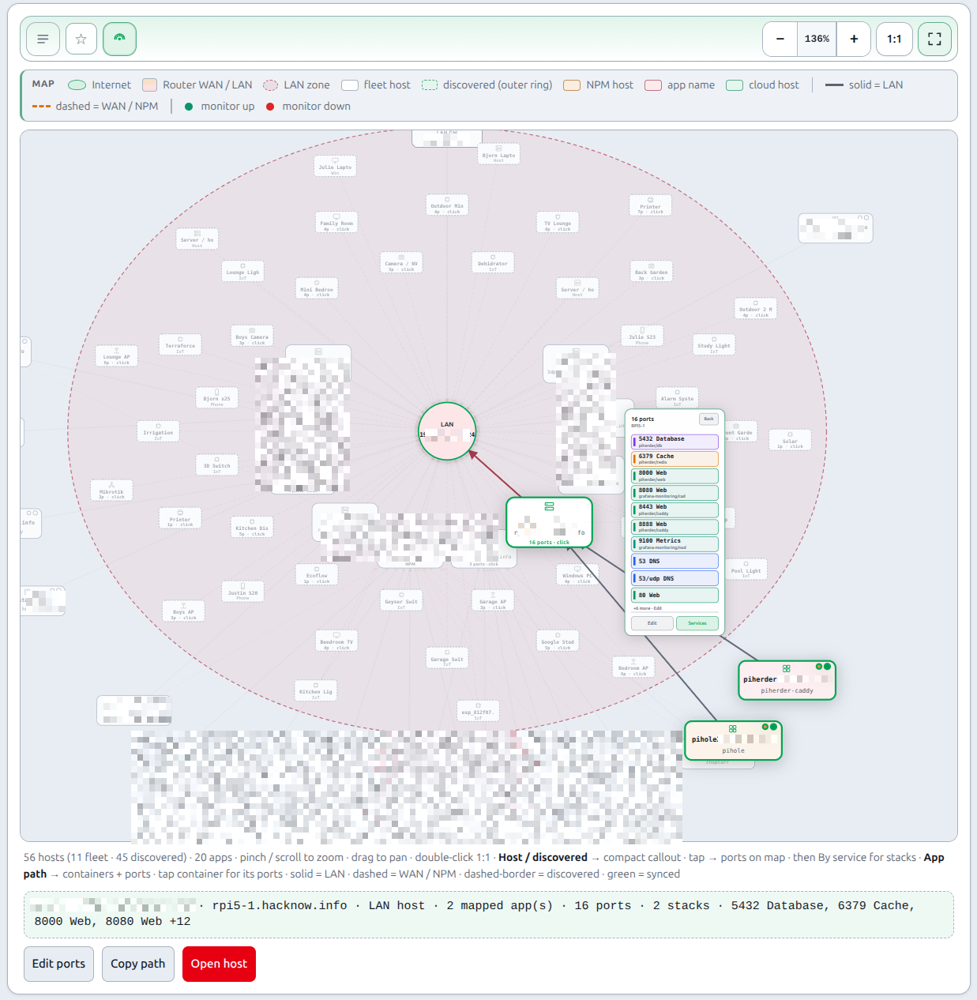
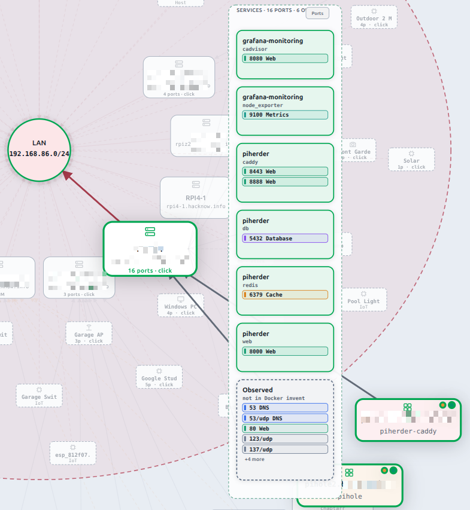
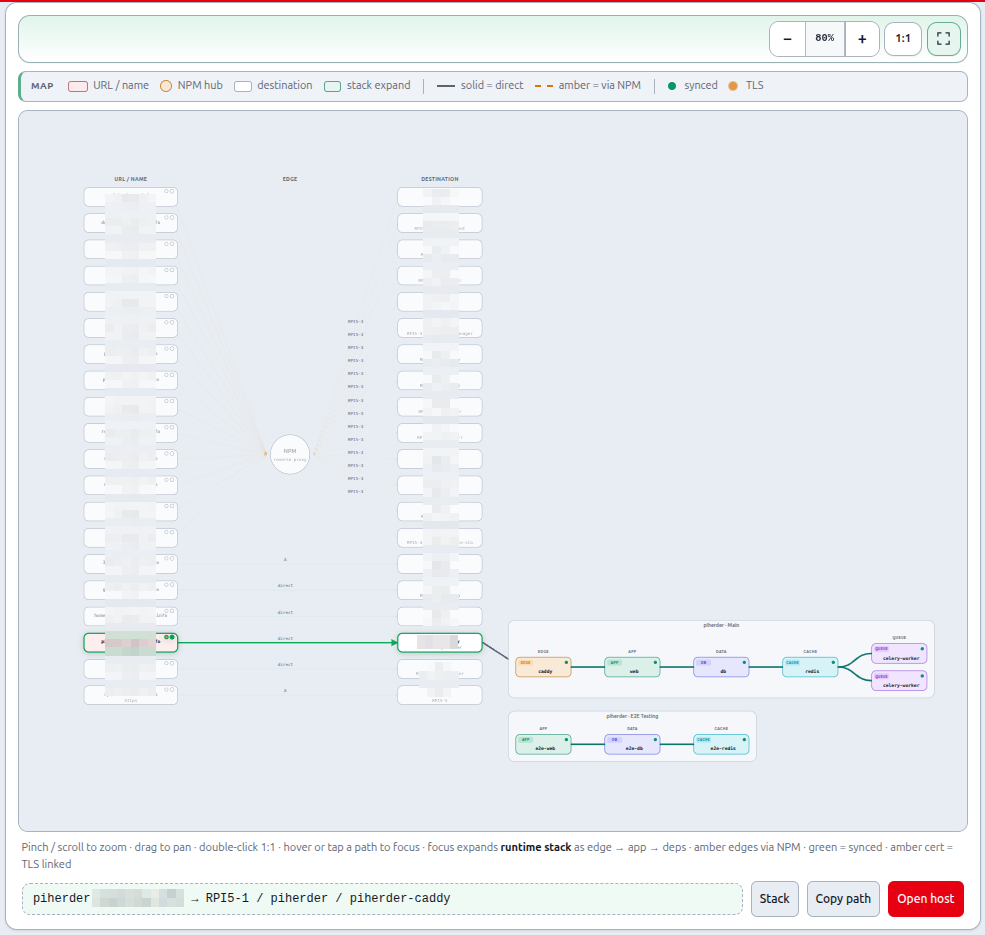
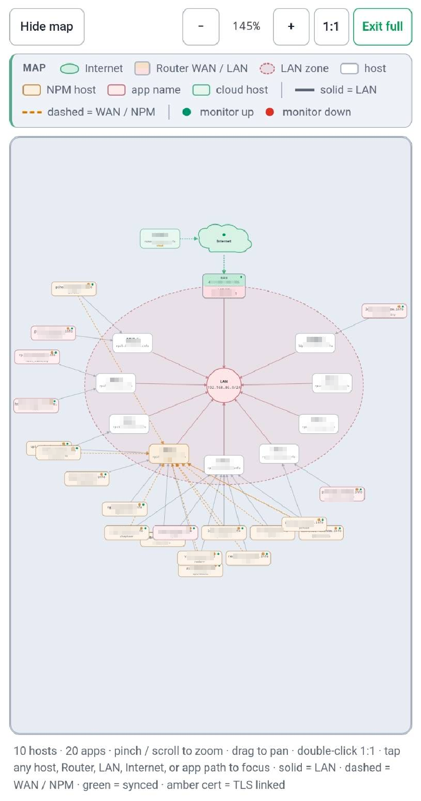
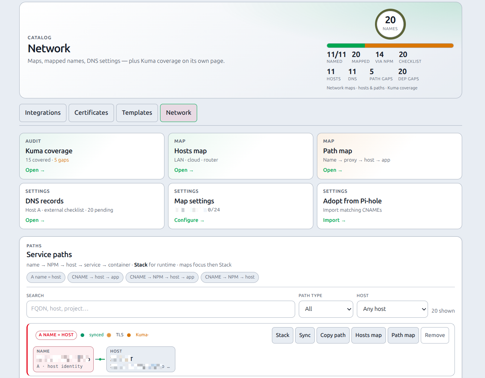
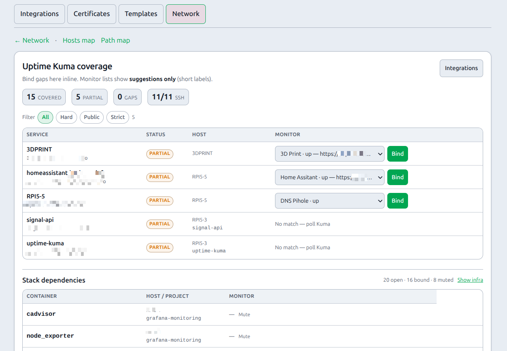
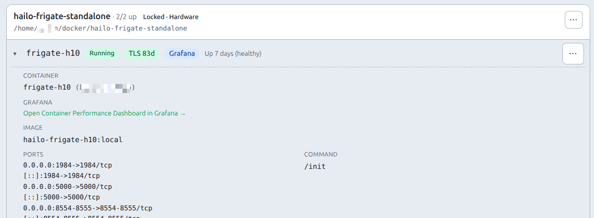

# Network (hosts ↔ apps ↔ proxy ↔ internet)

## What this is

**Network** is PiHerder’s view of how **names** reach **hosts** and **apps**: Pi-hole records, fleet FQDNs, NPM edges, LAN/gateway/public IP, optional Kuma status, and Docker project links — shown as path cards and topology maps.

It is **not** a Kubernetes-style service mesh. It is a homelab **map** of DNS + proxy + inventory.

**UI label:** **Catalog → Network** (URL slug remains `/dns` for compatibility).

**Pages:** Network hub · Hosts map · Path map · **Kuma coverage** (`/dns/coverage`)

## Why it exists

After a few years of “this CNAME points somewhere,” operators lose the picture of *name → proxy? → host → container*. Network maps rebuild that picture so you can answer “where does `grafana.example.com` go?” without opening three admin UIs.

---

## End-to-end: first useful Hosts map

1. Connect [Pi-hole](pihole.md); set host FQDNs + manage A where appropriate.  
2. On the Network hub, set **LAN subnet**, **gateway**, and public IP (or Lookup).  
3. Optional: bind Router / Public IP Kuma monitors (these can raise **map infra** alerts when down).  
4. **Import all from Pi-hole** or Adopt candidates.  
5. Open **Hosts map** — confirm home ring vs cloud hosts.  
6. Open **Path map** for a specific FQDN flow.  

Journey: [Operator scenarios — Journey E](../getting-started/operator-scenarios.md#journey-e).

<figure class="ph-figure" markdown>
  
  <figcaption>Hosts map — kind icons, home ring vs cloud hosts (light desktop).</figcaption>
</figure>

<figure class="ph-figure" markdown>
  
  <figcaption>Hosts map — progressive host ports (compact → ports-only → by-service).</figcaption>
</figure>

<figure class="ph-figure" markdown>
  
  <figcaption>Path map — URL → NPM hub → destination. Selecting the **NPM** hub highlights all proxied paths and their connector lines.</figcaption>
</figure>

<figure class="ph-figure" markdown>
  
  <figcaption>Hosts map on a phone — host list first; **Show map** / **Hide map** use the same chrome as desktop (graph defaults open on wide screens).</figcaption>
</figure>

<figure class="ph-figure" markdown>
  
  <figcaption>Catalog → Network hub — path cards, By path type stats, host DNS and map settings.</figcaption>
</figure>

<figure class="ph-figure" markdown>
  
  <figcaption>Kuma coverage — dense bind table on desktop; stacked cards on narrow viewports. Mute/Unmute use matching accent controls.</figcaption>
</figure>

<figure class="ph-figure" markdown>
  
  <figcaption>Path map stack panel — host→container port chips and runtime topology.</figcaption>
</figure>

---

## Mental model — entities & relationships

One published **name** maps through optional layers:

```text
name  →  [NPM]  →  host  →  [service/project]  →  [container]
```

| Entity | Example | Notes |
|--------|---------|--------|
| **Name** | `grafana.example.com` | CNAME, or **host identity A** when name = host FQDN |
| **NPM** | RPI5-3 | Only when proxied (edge host) |
| **Host** | RPI5-6 | Fleet server + A record |
| **Service** | `grafana` | Compose project (Kuma / NPM / deploy) |
| **Container** | `grafana` | Runtime container |

A path only fans a container on the Hosts map when a **compose project is linked** (`ServiceDnsRecord.docker_project`), usually from Kuma / NPM / adopt — or explicitly from **Stack → Use this project**.

### Path kinds

| Kind | UI label (hub stats) | Meaning |
|------|----------------------|---------|
| **host_identity** | **Host** | Name **is** the host A record (e.g. `3dprint.example.com`) — **no CNAME** |
| **app** | **App** | CNAME → host → Docker project/container (e.g. Grafana) |
| **npm_host** / **npm_app** | **NPM** | CNAME → NPM edge → host (and optional project/container) |

On the Network hub stat strip, **By path type** shows counts for Host / App / NPM (how published names reach a host). Hover the card for a short definition. Service path filters still use the finer path-kind chips (All / Via NPM / Direct / Host identity).

---

## Network hub layout

The hub (`/dns`) is **path-first**: destination **cards** + DNS/settings **cards**, then the long service-path list. Host A / service CNAME / external records share one **DNS records** modal (filter **All** by default). Map settings and Pi-hole adopt open in their own modals.

| Block | What it is |
|-------|------------|
| **Destination cards** | Jump to Kuma coverage, Hosts map, Path map (same compact card language as the rest of Catalog) |
| **DNS & settings cards** | **DNS records** (Host A · CNAME · External), **Map settings**, **Adopt** |
| **Service paths** | Searchable path cards (name → layers → Stack / maps) |

| Modal | Content |
|-------|---------|
| **DNS records** | Unified list with filters: **All** (default) · **Host A** · **CNAME** · **External** — see [record types](#dns-records-types) |
| **Map settings** | LAN CIDR, gateway, public IP, optional Kuma binds (formerly “Network map” / “LAN map”) |
| **Adopt** | Import / candidates from Pi-hole |

### DNS records — three different things {#dns-records-types}

The **DNS records** modal opens from the hub settings card. It is easy to confuse three kinds of “DNS”:

| Filter | What it means | Where you edit it |
|--------|----------------|-------------------|
| **Host A** | Fleet host **FQDN → LAN IP**. Badge **Pi-hole A** = PiHerder pushes that A to all Pi-holes; **manual** = you maintain the A outside; **unset** = no FQDN yet | Server **Edit → General** (deep link **Edit host DNS →** on each row) |
| **CNAME** | **Service path** names (`grafana.example.com` → host or NPM). **Pi-hole** badge when PiHerder manages the CNAME; **mapped** when the path exists in PiHerder only | Path card on this hub, **Sync**, or **Adopt from Pi-hole**; deep links to path card / Path map / host |
| **External** | Public DNS (Cloudflare, registrar, …) — **checklist only**, not automated | Operator checklist + base domain field for name suggestions |

Maps (Hosts / Path) still support **second click to clear focus** on desktop (same as mobile toggle).

!!! note "Runtime stack reorder"
    On Hosts / Path maps, open the stack panel and drag the **⋮⋮** handle to reorder containers.
    One **Pointer Events** path (mouse, pen, and touch) — handle has `touch-action: none` so the list can still scroll elsewhere.

---

## Network map settings

On the **Network hub** (`/dns`), configure home topology used by the Hosts map:

| Field | Example | Used for |
|-------|---------|----------|
| **LAN subnet** | `192.168.86.0/24` | Home host ring; IPs **outside** CIDR → **cloud** |
| **Gateway / router IP** | `192.168.86.1` | Router node between Internet and LAN |
| **Public (WAN) IP** | looked up or manual | Shown on Internet / Public IP nodes |
| **Lookup public IP now** | — | Outbound check from the PiHerder host |
| **Router Kuma monitor** | optional | Status chip + deep link on **Router** |
| **Public IP Kuma monitor** | optional | Status on **Public IP** / Internet |

### Hosts map layout

```text
Internet (☁) ── WAN ── Router (on zone rim)
                         │
                    LAN badge (centre)
                   /  |  |  \
            fleet hosts on a **fan / circle**   ← compact zone
         · · · discovered chips on outer rings · · ·  ← expands when “Network / discovered” is on

Mapped apps fan **outside** the zone from fleet hosts.
```

- **Spine always drawn** when fleet hosts exist (even if LAN/gateway settings are empty).
- Without a LAN CIDR: **RFC1918 / CGNAT** addresses stay on LAN; other addresses are **cloud**.
- **Fleet fan** — managed hosts on a ring around the LAN badge (size scales with fleet count).
- **Discovered (radar) toggle** — **off** = compact zone (fleet only); **on** = zone expands to outer rings of discovery chips. Internet / Router sit on the **active** zone rim; fleet fan positions stay fixed.
- Cloud hosts sit beside the Internet cloud (not on the LAN fan).

---

## Map pages

| Page | URL | Shows |
|------|-----|--------|
| **Network hub** | `/dns` | Path cards · **By path type** stats · filters · DNS/settings cards · adopt · unified DNS records modal |
| **Hosts map** | `/dns/physical` | Host **list** + optional SVG (Internet → Router → **LAN fan** + apps); **Show map** / **Hide map** same on all widths; graph defaults open on desktop |
| **Path map** | `/dns/logical` | Path **list** + optional SVG (URL → **NPM hub** → destination); same open/closed map chrome; hub multi-path focus |

### LAN discovery on Hosts map {#lan-discovery-on-hosts-map}

After **[LAN Discovery](lan-discovery.md)** has scanned, **unlinked** devices appear on the Hosts map **automatically**. You do **not** need to link each device to a Server for it to show — that is the whole-LAN end-to-end view.

| Topic | Behaviour |
|-------|-----------|
| **Toggle** | **Radar** icon in the one-line map chrome (next to zoom / full screen), default **on**; browser `localStorage`. Count is in the **footer** + tooltip, not a toolbar badge |
| **Layout** | Fleet on compact fan; toggle expands zone to outer discovery rings; apps / spine dual-layout with the zone |
| **Labels** | Operator **map name** (e.g. `cctv1`) → scan hostname → IP — set in LAN Discovery **edit modal** (Devices List or Map) |
| **Kind** | Heuristic or **operator override** badge (printer, Pi, camera, …) — never auto-promotes |
| **Gateway** | Device map role **Gateway / router** labels the Router spine and sets network gateway IP; that IP is not double-drawn as a LAN chip |
| **Dedup** | Same IP as a fleet server, already **linked**, or map-role gateway / network gateway IP → not a second discovery chip |
| **Ignored** | Stay off the map |
| **Tap** | Opens LAN Discovery edit modal with **← Hosts map** return after save/close |
| **Requires** | nmap integration + devices from a scan |
| **Stack expand** | Tap an **app path** to expand runtime containers/deps; fan anchors to the **visible** service chip (including when Discovered radar is **off** / compact layout) |

LAN Discovery’s **Devices → Map** view remains a discovery-only subnet browser (**Show unlinked** ≠ Hosts radar). Device naming / type / known / ignore: [LAN Discovery — edit modal](lan-discovery.md#edit-modal-network--devices).

### Map chrome (Hosts + Path)

List and graph share **one** open/closed model (`.is-open`) — not separate mobile-only vs desktop-always UIs.

| Control | What it does |
|---------|----------------|
| **Show map** | Open the SVG panel (always available; hidden while the map is already open) |
| **Hide map** | Close the SVG panel; list stays (defaults closed on narrow screens; open on desktop / deep links) |
| **Pin ★** | Pin Hosts map or Path map to the header **★** menu (opens with `#map` so the graph appears) — [Pins & host jump](../day-to-day/navigation-pins.md) |
| **Discovered** (Hosts only, radar) | Outer discovery chips on/off + compact vs full LAN zone |
| **− / % / +** | Zoom out · level · zoom in (SVG viewBox) |
| **1:1** | Fit map to the window. Hosts + discovered **off**: fits the **compact** fleet (fills the pane). Discovered **on** / Path map: designed full canvas. Double-click map = same |
| **Full screen** | Expand map; Esc or control again to leave |

### Focus, zoom & mobile

- **Hover** (mouse/stylus) any **host** (including hosts with no mapped services), **Router**, **LAN**, **Internet**, **Public IP**, **NPM hub**, or **app path** to **preview** highlight (stroke emphasis only).
- **Click / tap** to **lock** focus — the primary node **pops out** (~**1.30×** scale; stack chips ~1.23×) and the path stays highlighted when the pointer leaves. Hover stays stroke-only (no flicker).
- **Path map — NPM hub:** selecting the centre **NPM** node focuses **all** via-proxy paths at once (URL + destination nodes **and** the amber **connector lines** into/out of the hub), not only the first path.
- **Click the same node again** or **Clear focus** to unlock (desktop and mobile).
- Hosts **without** mapped services are still selectable (node focus). App satellites focus the service **path**.
- **Open host** / **Open in Kuma** appears when the focused node has a link (same-tab for fleet hosts; new tab for external Kuma).
- **Copy path** copies the callout route string.
- Maps: **pinch** / scroll-wheel zoom up to **500%** (SVG **viewBox** — stays sharp), **drag** to pan; see chrome table above.
- Status dots: **green** = last Pi-hole sync ok · **amber** partial · **red** error · small amber ring = managed cert linked · Kuma **up/down** on Router / Public IP when bound.
- Path cards also show **Kuma coverage** (see below).
- Deep links: `/dns/physical#map`, `/dns/logical#map`, and `/dns/physical?focus=…#map` (also from path cards / dashboard / Docker **Path map** pills / **★** pins). Fragment **`#map`** (or `map=1` / focus) **auto-opens** the SVG — bare `/dns/physical` stays list-first.
- On **narrow screens**, maps default to the **list** (racks / flows). Use **View full map** for the SVG; use **Hide map** on the graph toolbar to return to list-first density.
- **Hamburger while fullscreen:** the slide-out menu is portaled to `body` and sits **above** map fullscreen. Opening **☰** fully exits fullscreen (label, listeners, and viewport sizes reset) so the drawer is never painted off-screen.
- **Portrait ↔ landscape:** maps call `PiHerderFabric.refreshLayout` (with the global viewport reflow) so SVG heights, zoom, and page width rescale without leaving the page. Path hop chips **wrap** within each card (no horizontal swipe per card).
- Hub and path map support **search** and path-type filters (All / Via NPM / Direct / Host identity).
- **Adopt candidates** load after the hub paints (HTMX → `/dns/candidates`) so a slow or down Pi-hole does not block path cards / host DNS.
- Hosts map caps app satellites per host (then a **+N more** marker); full app list stays on rack cards.
- **Docker UI:** project **Path map** links use a cheap, **case-insensitive** project index (no full access-path resolve on HTMX stack polls).

### Runtime stack (detail altitude)

Maps stay **customer-facing** by default. For **one** focused service (or host project), open the **Stack** panel and/or map **expand** to see containers, categories, tags, Kuma binds, and runtime links.

| Surface | What you get |
|---------|----------------|
| **Stack panel** | Modal/drawer: containers (category, tags, running, Kuma, **published ports** as `host→container` chips), **view group** pills, detail expand, suggested/confirmed edges, accept/dismiss/**manual link** (including **cross-host** project/container), **Refresh** inventory, deep links to Server / Service / Docker / maps |
| **Map expand** | On Path map or Hosts map focus: sideways fan to the right of the path — **not** a fleet-wide container mesh. With **All** view groups and 2+ groups populated, one fan per group. |

**Device icons:** Hosts map cards and rack titles show a **canned glyph** from discovery/device kind (Pi, NAS, printer, camera, …). Fleet hosts default to a server glyph; override the kind on the discovery device to change the icon.

**Ports:** inventory publish strings are parsed into structured chips (e.g. `8080→80/tcp`). Chips also show a **role hint** when known (DNS, Web, Database, Cache, …) — e.g. Pi-hole **53 · DNS** and **443 · Web**. Internal-only containers show a short “internal” summary rather than a fake host mapping. Sources: Docker published · nmap open · sticky operator **roles** (`PortAnnotation`).

### Ports on the Hosts map (progressive expand)

Depth is **on the canvas**, not a drawer-first flow. Lock a **fleet host** or **discovered device** (camera, printer, … — any nmap chip with open ports).

```text
  Lock host / cam
       │
       ▼
  ┌ compact callout ┐     summary + a few chips
  │  N ports · name  │     whole box is the hit target (mobile-friendly)
  │  Tap for ports ▸ │
  └────────┬────────┘
           │ tap box
           ▼
  ┌ ports-only list ┐     full port rows on the map (role · owner hint)
  │  Back            │     hairline footer chrome
  │  [Edit] [Services]│    Services only when compose stacks own ports
  └────────┬────────┘
           │ Services
           ▼
  ┌ by-service fan  ┐     previous service-card fan (project → ports)
  │  Ports (back)    │
  └──────────────────┘
```

| Step | What you see | Touch / click |
|------|----------------|---------------|
| **1 · Compact** | Small callout to the right of the host: count, name, up to ~4 chips, **Tap for ports** | Tap **anywhere on the callout** (not a tiny button). Empty → opens edit table. |
| **2 · Ports** | Ports-only panel: larger rows, port number + role, optional owner line | **Back** → compact. **Edit** → sticky-role table. **Services** → step 3 (when stacks exist). Discovered-only devices get **Edit** only. |
| **3 · Services** | Service/stack fan (compose project cards with ports inside) | **Ports** → back to ports-only list. Click a service card → edit table focused on that project. |

**Discovered devices:** same progressive flow using nmap open ports (no Docker owners → Observed / Edit). Chips can show a short `Np · click` port hint when scan data exists.

**App path / containers:**

| You want… | Click | What appears **on the map** |
|-----------|-------|------------------------------|
| **Containers & deps** | An **app path** satellite (or Path map node) | **Stack fan** (edge/app/db columns) + dependency edges; containers list **published ports** when inventory has them. |
| **One container’s ports** | A stack container that publishes ports | Scoped **compact → ports** callout for that container / project. Containers without published ports still open **Stack detail**. |

Nothing is fleet-wide spaghetti by default — depth expands **for the focused host, device, or path**.

**Edit ports table** (panel): sticky roles, hide/noise toggle (e.g. SSH), Docker∪nmap union. Open via callout **Edit**, toolbar **Edit ports**, or double-click/tap a port row. Fleet: `?server_id=`; discovered: `?nmap_device_id=`.

**Manual edges:** when accepting or adding a link, the picker can target containers on **another fleet host** (cross-host topology), not only the focused compose project.

Compose **project** identity is exact (case-insensitive) for annotation storage. Soft substring match (e.g. conflating unrelated project names) is not used.

Summary chips: **depends_on** means inventory parsed compose `depends_on` (feeds suggested links). If suggestions exist, the chip jumps to **Suggested links** in the panel — it is not a separate page.

#### Labels (category + tags)

| Label | Rules |
|-------|--------|
| **Category** | One per container; drives **map columns**. Fixed list (edge, app, queue, cache, data, tooling, …). Default = heuristic from name/image; override in panel detail → **Save labels**. |
| **Tags** | Multi chips from a fixed list (web, db, worker, proxy, test, …). Not free text. Add new entries via `POST /dns/vocab` (operator). |

#### Visual service stacks and view groups {#visual-service-stacks--view-groups}

Under **one compose project**, create **view groups** (e.g. **Main** vs a custom group) and **move** containers between them. Deploy / stop / start still act on the **whole compose project** (or a [compose set](../docker/overview.md#compose-sets-same-folder-one-project-card) on the Docker page) — view groups are **presentation only**.

Panel pills: **All** · **Main** (unassigned) · (your groups). Compact segmented control styling. Map expand respects the same filter; **All** draws multiple fans when more than one group has members.

**Main** = containers with no view-group assignment. Assigning every container to a named group leaves Main empty (expected).

**vs Docker compose sets:** compose sets = files on disk under one folder. View groups = labels for how you look at containers on Network maps.

#### Map expand layout

```text
  focused path ──►  edge → app → queue → cache → data → tooling  (enabled categories that have containers)
```

- Column order follows **category vocabulary** sort order (empty columns hidden).  
- Role colors + type chips on boxes; confirmed dependency curves; soft structure lines between **adjacent** columns only.  
- Published ports appear on container boxes when known (up to a few chips + “+N”).  
- **No Server / Service / Docker chips on the map** — use the Stack panel for navigation.  
- Click a container **with ports** → on-map ports callout for that unit; otherwise Stack panel focused on that container.

#### Reorder containers (operators)

1. Open **Stack** for the service/project (optionally filter to a **view group** first).  
2. **Desktop:** drag the **⋮⋮** handle. **Mobile:** long-press a row, then drag.  
3. Order is saved in the DB (`containerannotation.sort_index`) and dual-written to `stack_container_order_json` for compatibility.  

**View groups keep independent order:** reordering while **Main** or a named group is selected only updates that list — it does **not** wipe the other group. Reordering under **All** replaces the full project order. Separate compose projects (`piherder` vs `piherder-e2e`) never share order keys.

**Effect on the map:** with a custom order, **column left→right** can follow that order (by earliest container in each category). Example: put **celery last** in the panel → **queue column moves right**.

### Light / dark theme

Infrastructure nodes (Internet cloud, Router, LAN, NPM hub) use theme-aware fills (no default black SVG fill). Zoom chrome stays readable in light mode.

---

## Setup

1. **Base domain** (optional) on Catalog → Network (e.g. `example.com`) for name suggestions.  
2. **Network map** — set LAN CIDR, gateway, public IP (or **Lookup**); optionally bind Router / WAN Kuma monitors (poll Kuma first so the dropdown is populated).  
3. **Host DNS** — each server **Edit → General**: FQDN + IP; tick **Manage A on all Pi-holes** (creates/updates A; duplicates treated as success).  
4. **Import existing names** — Catalog → Network → **Import all from Pi-hole** (or Adopt per row after candidates load). Existing CNAMEs are mapped; Pi-hole is **not** recreated when the record already exists.  
5. **Host identity** — when the app name equals the host A name (Kuma host-level service, no Docker), use **Map host identity** (A only).  
6. **Template deployments** — Service DNS card attaches an inferred plan (one FQDN field when needed).  
7. **External DNS** — checklist on the hub for Cloudflare/etc. (not automated in 0.5.0).

### Direct TLS (no NPM)

When a container terminates TLS itself (e.g. Frigate on `rpi5-4.hacknow.info`) and the CNAME target is the **host** — not the NPM edge:

1. Pi-hole CNAME (or host A) must point at the backend host FQDN. Leftover NPM proxy hosts in inventory are **not** treated as the path edge.  
2. Bind the Kuma HTTP monitor to that host **and** the compose project / container (not “host service”). Prefer the monitor URL to be the published HTTPS name.  
3. Open **Stack** on the path. If it says **no Docker project linked**, click the compose project (e.g. `frigate`) — that **persists** the association so Hosts / Path maps show the container satellite. Preview-only chips do not write the path.

Without a linked project the Hosts map shows the host only; stack expand has nothing to fan.

---

## Pi-hole behaviour

| Action | Behaviour |
|--------|-----------|
| Host A / service CNAME create | Fans out to **all enabled** Pi-holes |
| Record already present | Treated as **success** (adopt / re-sync safe) |
| Remove service **CNAME** mapping | Deletes CNAME on Pi-holes when managed |
| Remove **host identity** mapping | Does **not** delete host A (owned by server Host DNS) |

Audit actions include `dns_host_*`, `dns_service_cname_sync`, `dns_service_a_sync`, `dns_service_delete`.

---

## Uptime Kuma coverage (v0.6+)

**Catalog → Network → Kuma coverage** (`/dns/coverage`) is a **dedicated page** (not the whole hub — keeps maps + paths scannable).

The hub shows a **teaser card** with path/dep gap counts. Full audit, binds, filters, and stack dependencies live on the coverage page.

| Status | Meaning |
|--------|---------|
| **Covered** | Service-role binding matches FQDN / Docker project (or a clear host-scoped service monitor) |
| **Partial** | Host has SSH reachability only, or a weak/label-only match |
| **Gap (none)** | No useful Kuma binding on the backend host for this name |

Path cards show a small **Kuma** / **Kuma·** / **no Kuma** chip.

### Binding from the gaps table

Coverage is a **dense table** (not a wall of large cards). For each gap (operators only):

1. **Poll** Kuma on the integration if the monitor list is empty.  
2. Choose a **Suggested** monitor from the constrained select (short labels; ranked by FQDN / name / URL).  
3. Click green **Bind** — the button is **inside** the form (posts correctly); creates a service binding on the **backend host** with the path’s Docker project when known, then reloads coverage (`next=` honoured when set).  
4. **Advanced…** opens the full Kuma “Add service binding” form with server / project pre-filled.

This does **not** create monitors inside Kuma — only **links** an existing monitor to a fleet host/project. Create the HTTP check in Kuma first ([Uptime Kuma](uptime-kuma.md)).

Path/dep gap tables stack as cards on narrow screens.

### Stack dependencies (Docker inventory)

Below path coverage, **Stack dependencies** lists **compose containers** from host Docker inventory (not only published FQDNs):

| Status | Meaning |
|--------|---------|
| **Bound** | Kuma service bind matches project (and container when set) |
| **Suggest bind** | No bind — pick TCP/HTTP monitor; host ports shown when published |
| **Muted / infra** | Postgres, Redis, MySQL, Mongo, … (name/image heuristics) **or** operator **Mute** |

**Show infra** toggles whether DB/cache roles appear as suggestions (default **hidden** — they are not public path monitors; a TCP/Postgres check needs a port reachable from Kuma).

**Path gap filters:** All · Hard gaps · Public/apps · Strict (drops host-identity partial noise).

### Monitoring Postgres (example)

1. Ensure Kuma can reach the DB (publish port carefully, or put Kuma on the same Docker network).  
2. Create a **TCP** or **Postgres** monitor in Kuma (connection string stays in Kuma).  
3. Network → coverage → **Show infra** if needed → **Bind** to `project` / `db` container.  
4. Or keep DB muted and rely on app HTTPS + host SSH.

!!! note "Availability"
    Coverage audit + dependency suggest: **v0.6.0+**. Requires enabled Uptime Kuma + Docker inventory on hosts.

---

## Data model (summary)

| Setting / field | Storage | Notes |
|-----------------|---------|--------|
| `network_lan_subnet` | App settings | CIDR |
| `network_gateway_ip` | App settings | Router internal IP |
| `network_public_ip` (+ checked_at) | App settings | WAN IP |
| `network_gateway_kuma_external_id` | App settings | Kuma monitor id/name |
| `network_public_kuma_external_id` | App settings | Optional WAN monitor |
| `network_kuma_integration_id` | App settings | Empty = first enabled Kuma |
| **Server** | `dns_name`, `dns_manage_a`, `dns_ip_override` | Host A |
| **ServiceDnsRecord** | FQDN, `record_type` (`cname` \| `a`), servers, project, NPM, sync | Service path |
| **RuntimeEdge** | Confirmed/manual/suggested stack dependency edges | Panel + map expand; herder backup |
| **TopologyCategory / TopologyTag** | Fixed vocab for category + tags | Seeded; operator can add |
| **VisualServiceStack** | Visual group under one compose project | Presentation only |
| **ContainerAnnotation** (+ tags) | Category override, visual stack, order, tag set | Herder backup |
| `stack_container_order_json` | App settings | Dual-write fallback for order |
| `stack_inventory_down_alerts` | App settings | Optional alert when Kuma-bound container is down in inventory (same flag as Alert policy → Inventory) |

**Alerts (v1.3):** Kuma **SSH** binds raise `host_down` with a Hosts-map focus (`?focus=n:host-{id}#map`). Service monitors stay `integration_monitor_down`. Gateway/WAN chips raise `map_infra_down`. Discovered-device focus is `n:host-d-{id}`. Tune or mute under [Settings → Alerts](../operations/alerts-email-webhooks.md) — herder does not ping hosts itself.

Resolution also uses Pi-hole inventory, NPM poll cache + proxy_host binds, Kuma service binds, Docker inventory (compose graph v2), and stack deployments.

---

## Related

- [LAN Discovery (nmap)](lan-discovery.md) — whole-LAN devices, map identity (name / type / gateway), Hosts map overlay  
- [Pi-hole](pihole.md)  
- [NPM](npm.md)  
- [Uptime Kuma](uptime-kuma.md)  
- [Certificates](certificates.md)
