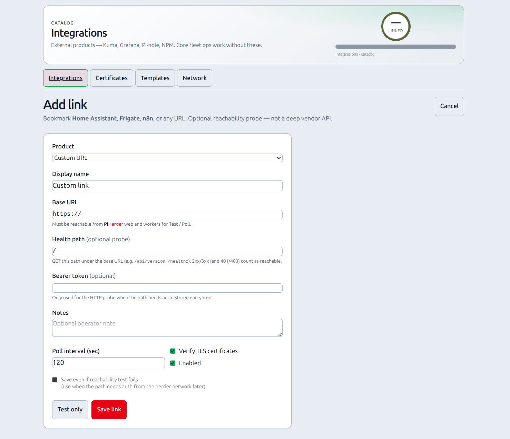

# Generic links (HA · Frigate · n8n · custom)

## What this is

A **bookmark + reachability probe** under Catalog → Integrations (**+ Link**).

Use it when you want PiHerder to remember a URL for **Home Assistant**, **Frigate**, **n8n**, or any other product **without** a deep adapter (inventory, API write, etc.).

| Capability | Supported |
|------------|-----------|
| Name + base URL + product preset | Yes |
| Optional health path + bearer for probe | Yes |
| Test / scheduled Poll (HTTP GET) | Yes |
| Pin in header ★ menu | Yes |
| Bind to fleet host / Docker → Services chips | Yes |
| Full product control / create resources | **No** — prefer [API tokens](../operations/api-tokens.md) from n8n/HA |

Deep Frigate / HA product surfaces (if ever) are **post–v1.1** — see plan stream **I** residual / [PLAN_v1.2.0](https://github.com/bjorngluck/piherder/blob/main/docs/PLAN_v1.2.0.md).

<figure class="ph-figure" markdown>
  
  <figcaption>Generic link — HA / Frigate / n8n / custom with health probe.</figcaption>
</figure>

## Add a link

1. Catalog → **Integrations** → **+ Link** (or empty-state **Add link**).  
2. Pick **Product** (sets a sensible name + default health path).  
3. Enter **Base URL** reachable from the PiHerder web/worker containers.  
4. Adjust **Health path** if needed (`/` · `/api/version` · `/healthz` · …).  
5. Optional **Bearer token** only if the probe needs auth (stored encrypted).  
6. **Test only** or **Save link** (save can skip a failing probe if you check the box).

Presets:

| Product | Default health path |
|---------|---------------------|
| Home Assistant | `/` |
| Frigate | `/api/version` |
| n8n | `/healthz` |
| Custom URL | `/` |

**Probe rules:** HTTP **2xx/3xx** = reachable. **401/403** still counts as reachable (auth required). Other 4xx/5xx or network errors = fail.

## Show on host Services

On the link detail page → **Show on host Services**:

1. Pick a fleet **server** (e.g. HAOS host or the Pi that runs Frigate).  
2. Optional path override (blank = base URL).  
3. Optional Docker project/container for stack-scoped chips.  
4. **Add binding**.

Chips appear on:

- Per-server **Services**  
- Fleet **Services** icon grid  

Same surface as Kuma **host service** bindings — open in a new tab.

## When *not* to use this

| Need | Prefer |
|------|--------|
| Up/down + TLS days for a URL | [Uptime Kuma](uptime-kuma.md) |
| Metrics / logs dashboards | [Grafana](grafana.md) |
| Automate PiHerder (backup jobs, …) from n8n/HA | [API tokens](../operations/api-tokens.md) |
| Manage HAOS as a fleet host | [HAOS hosts](../day-to-day/haos-hosts.md) (SSH path) |

## Related

- [Catalog overview](overview.md)  
- [API tokens](../operations/api-tokens.md)  
- [Operator scenarios](../getting-started/operator-scenarios.md)  
