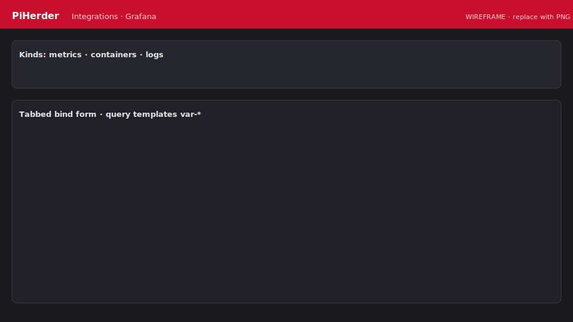

# Grafana

Read-mostly deep links into an existing Grafana. PiHerder does **not** have to deploy Grafana (you may still use the Grafana template for a new instance).

<figure class="ph-figure" markdown>
  
  <figcaption>Kinds + tabbed bindings. <span class="ph-wireframe-badge">wireframe</span></figcaption>
</figure>

## Connect

1. Grafana → **Administration → Service accounts** — Viewer token (`glsa_…`) recommended.  
2. Probe:

   ```bash
   curl -sS -H "Authorization: Bearer $GRAFANA_TOKEN" "https://grafana.example.com/api/health"
   curl -sS -H "Authorization: Bearer $GRAFANA_TOKEN" \
     "https://grafana.example.com/api/search?type=dash-db" | head
   ```

3. PiHerder → **Catalog → Integrations → + Grafana** — base URL, optional token, **query templates** (`var-` prefix).  
4. **Poll / Test** stores health + inventory (with token).  
5. **Bind** with a **kind**:

| Kind | Surfaces |
|------|----------|
| Host metrics / Host logs | Server detail Grafana card |
| Containers (host) | Server detail Grafana card |
| Containers + container name | Docker page chip / ⋯ / expand |

### Preferred name (Inventory) & remove (bindings)

Chip labels can differ from Grafana’s dashboard title:

- **Preferred name** — set on the **Inventory** tab (one field per dashboard UID). Stored on the Grafana integration (`config_json.display_names[uid]`).  
  - Applies to **all existing** host binds of that UID and **any new** binds later.  
  - Survives **Poll** (Grafana title kept as reference).  
  - Blank + **Save** clears the preferred name → chips follow the Grafana title again.  
- **Binding tabs** (Host metrics / Containers / Host logs) — **Clone** / **Remove** only (no rename).  
- **Remove** deletes that host/container link only; preferred name stays for other hosts and future binds.  

### Placeholders

`{hostname}`, `{hostname_short}`, `{container}`, `{project}`, `{ip}`, …  
Grafana variables need the **`var-`** prefix (`var-job=…`).

### Docker UX

- **Grafana** chip (tap opens filtered dashboard)  
- Container **⋯** menu  
- Expanded row links (mobile-friendly)

Without a token you can still deep-link by pasting dashboard UIDs; inventory list will be empty.
