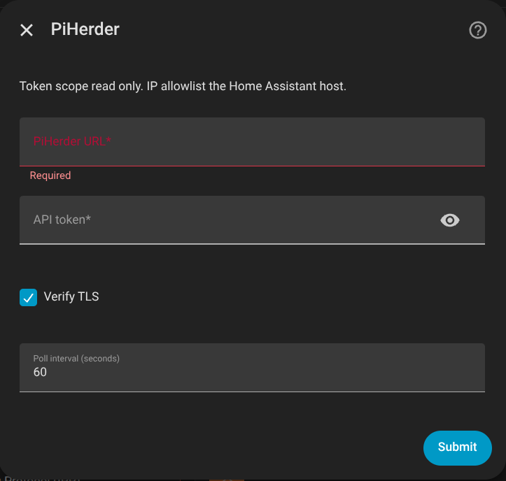
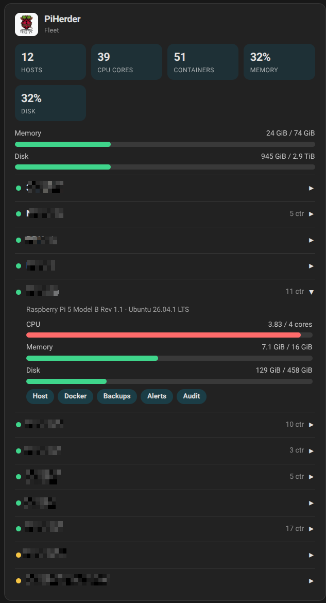
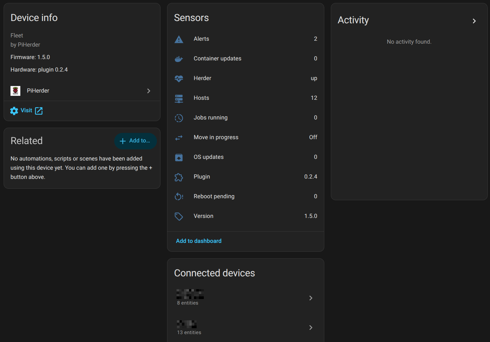
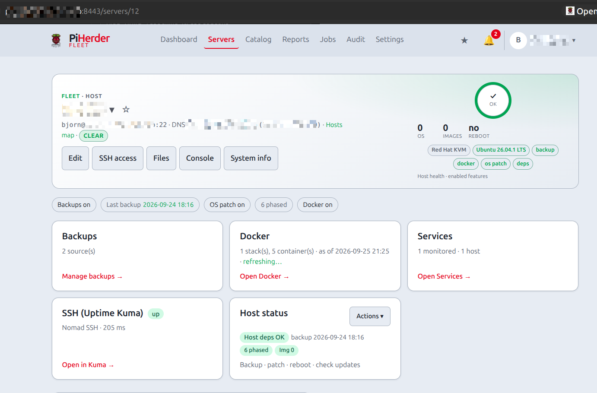
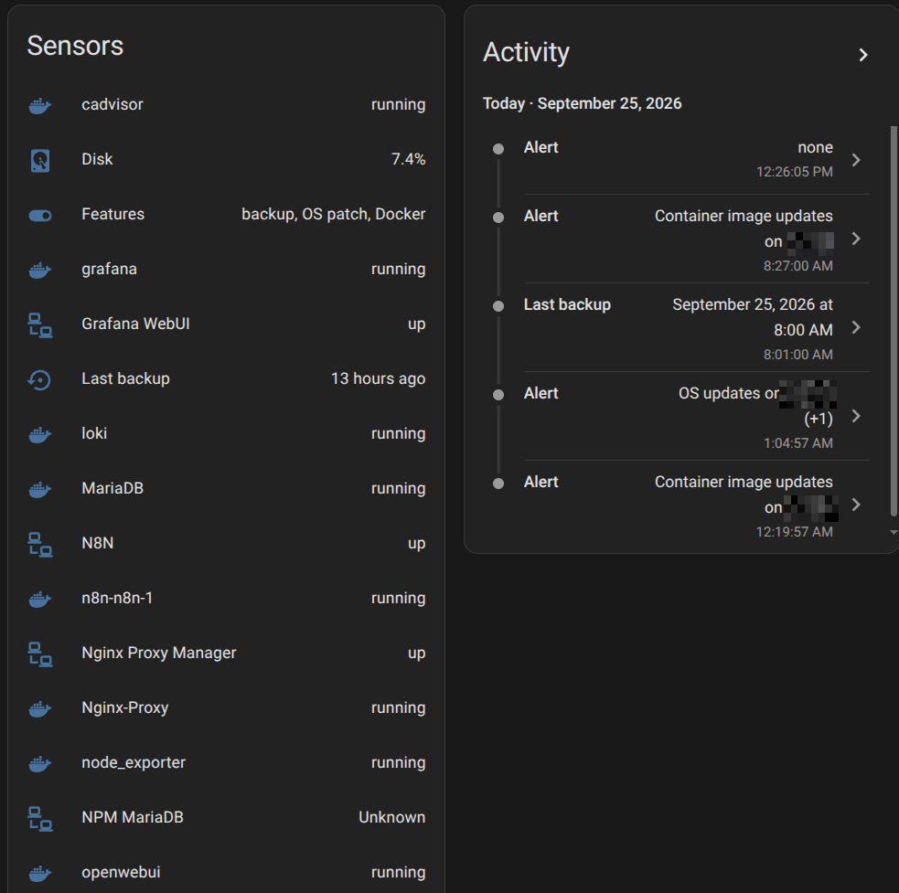

# Home Assistant → PiHerder (HACS)

## What this is

A **HACS integration that runs on Home Assistant** and **observes** your PiHerder fleet over `/api/v1`. It is **not** the same as [HAOS hosts](../day-to-day/haos-hosts.md) (PiHerder managing the appliance over SSH).

| Arrow | Where it lives | What it does |
|-------|----------------|--------------|
| Path 1 | This PiHerder image | SSH + `ha` CLI on an HAOS **server** |
| Path 2 (this page) | Separate HACS repo | HA polls PiHerder snapshots; **Visit** opens the herder |

The plugin is **not** inside the PiHerder Docker image. GitHub: [bjorngluck/piherder-ha](https://github.com/bjorngluck/piherder-ha) (plugin **0.2.4**, Release `v0.2.4`). The HACS repo README and the integration’s Documentation link point at this page. The public site [piherder-docs.hacknow.info](https://piherder-docs.hacknow.info/) is built from `main`.

Agent tools (Cursor, Grok, Claude, Codex) are a different client of the same token API: [bjorngluck/piherder-mcp](https://github.com/bjorngluck/piherder-mcp) **0.1.0**. That process is also outside this image. [Agents (MCP)](../operations/mcp.md).

## Why it exists

YAML `rest` sensors against an API token already work. Path 2 is that, first-class: config flow, fleet sensors, one HA device per host. The door back to PiHerder on the **device page** is HA’s single **Visit** (the host page). Home Assistant only allows **one** Visit URL per device for custom integrations — Docker / Backups / Alerts / Audit are **not** extra Visit links there. Those shortcuts live on the **PiHerder fleet** Lovelace card. Status sensors are status only — not fake “open” / “press here” buttons (those opened HA history, not PiHerder).

## Install (Slice 1)

1. In PiHerder: Settings → **API management** → create a token with **`read` only**. Set the **IP allowlist** to the HA host (HAOS ≈ appliance LAN IP; a container HA may egress as a Docker/bridge IP).  
2. HACS → custom repository → **Integration** → `https://github.com/bjorngluck/piherder-ha`.  
3. Add **PiHerder**: base URL (your herder origin, including scheme), token `ph_…`, TLS verify, poll interval. A bad URL or token keeps the fields filled (plugin ≥ 0.1.3).  
4. Confirm fleet **Plugin** is **0.2.4**. Device page **Visit** is still the host. For totals and per-host links, add the **PiHerder fleet** card (below). Container, service, and disk sensors sit on that same host device (Slice 1b). They are status only — not start/stop.

HACS does **not** auto-refresh custom repos. New GitHub Release: HACS → PiHerder → **⋮ → Redownload** (pick the tag) → **restart Home Assistant**. Reload of the config entry is not enough for new files.

Token without `read`, a bad secret, or a mismatched allowlist **fails closed**.

## What it reads

`GET /api/v1/health`, `GET /api/v1/summary`, `GET /api/v1/servers`, `GET /api/v1/jobs?active_only=true`, plus Slice 1b snapshots `GET /api/v1/inventory` and `GET /api/v1/services`. A herder older than this train answers 404 on those two; the plugin keeps the Slice 1 sensors.

Poll is **database snapshots only**. It never SSH’s the fleet on the HA interval. “Host down” is **`last_seen` age**, not a live ping.

Host **hardware**, **OS**, CPU, memory, and disk come from PiHerder **[System Info](../day-to-day/system-info.md)** (v1.6 host-facts). That snapshot exists **so HA does not SSH**: the herder writes columns on a ~15 minute job (or the System Info refresh icon), then HA and the fleet card read SQL. Recreate **web** so Alembic **044** and **045** apply, then refresh System Info once per host (or wait ~15 minutes).

## Fleet card (dashboard)

The built-in HA **device page** only has one Visit link. For fleet totals and per-host shortcuts, add the **PiHerder fleet** Lovelace card:

1. HACS plugin **0.2.4**, **restart Home Assistant**, then **hard-refresh the browser** (Ctrl+Shift+R). Reload of the config entry is not enough.  
2. Dashboard **⋮ → Resources** — delete any `/api/piherder/…` or older `/local/piherder-dashboard-card.js?v=0.2.2` or `?v=0.2.3` card URL. You want **one** resource:

   - URL: `/local/piherder-dashboard-card.js?v=0.2.4`  
   - Type: **JavaScript module** (not JavaScript)

   After setup, the integration copies the card into HA `config/www/` so `/local/…` works.  
3. Dashboard → Add card → **Manual** YAML (the picker may still not list it):

```yaml
type: custom:piherder-dashboard-card
```

The custom-tag field (if you use it) wants `piherder-dashboard-card` **without** the `custom:` prefix.  
4. Hard-refresh again. “Custom element doesn’t exist” means the resource is missing, still type “JavaScript” (not module), or the browser has a cached `/api/piherder/…` URL.

The card header is the PiHerder logo and the name **PiHerder**. Under that it shows **hosts, CPU cores, containers, memory %, disk %** for the whole fleet, then each host. Expand a host for CPU/memory/disk bars and chips: Host, Docker, Backups, Alerts, Audit. Those chips are real `<a href>` links into PiHerder.

Numbers come from the same **[System Info](../day-to-day/system-info.md)** snapshot the herder modal shows (CPU cores, memory, disk). Recreate **web** so Alembic **045** is applied, then the System Info refresh icon once per host (or wait for the scheduler). Empty CPU/memory/disk on the card means the herder has not stored a resource snapshot yet — not a card bug.

<figure class="ph-figure" markdown>
  
  <figcaption>Config flow — herder base URL and a read token (mask the token in any copy of this shot).</figcaption>
</figure>

<figure class="ph-figure" markdown>
  
  <figcaption>Lovelace card — logo and name, fleet totals, one host expanded, chips into PiHerder.</figcaption>
</figure>

<figure class="ph-figure" markdown>
  
  <figcaption>Fleet device and one host device.</figcaption>
</figure>

<figure class="ph-figure" markdown>
  
  <figcaption>Device **Visit** opens that host in PiHerder. One link, no extra buttons.</figcaption>
</figure>

<figure class="ph-figure" markdown>
  
  <figcaption>Container, service, and disk sensors on the host device. Status only — no start/stop.</figcaption>
</figure>

## What you see in HA

| Surface | Meaning |
|---------|---------|
| Fleet device | Counts, herder version, **Plugin** version, Visit = herder origin |
| Host device | One per PiHerder server. **Visit** = host page only. Hardware / OS from the stored snapshot |
| Fleet Lovelace card | Fleet sums + expand host + chips to Host / Docker / Backups / Alerts / Audit |
| Sensors | OS, features, alert, last seen, reboot, last backup, **disk %**, plus one sensor per container (running / image / uptime text) and one per monitored service (up/down). All on the host device. Tapping a sensor opens HA history, not PiHerder |

## What it will not do

No start/stop, Move, compose write, Files, console, OS apply, or backup-from-HA. Slice 1b only **reads** the last Docker inventory and service-monitor rows. YAML `rest:` remains possible.

## Related

- [API tokens](../operations/api-tokens.md) · [Agents (MCP)](../operations/mcp.md) · [API.md](https://github.com/bjorngluck/piherder/blob/main/docs/API.md)  
- [System Info](../day-to-day/system-info.md) (why the snapshot exists) · [HAOS hosts](../day-to-day/haos-hosts.md) (path 1) · [Add a server](../day-to-day/add-server.md)  
- Maintainer: [PLAN_v1.6.0.md](https://github.com/bjorngluck/piherder/blob/v1.6.0-dev/docs/PLAN_v1.6.0.md) · [FEATURE_PLAN_HOME_ASSISTANT.md](https://github.com/bjorngluck/piherder/blob/v1.6.0-dev/docs/FEATURE_PLAN_HOME_ASSISTANT.md) §7  
