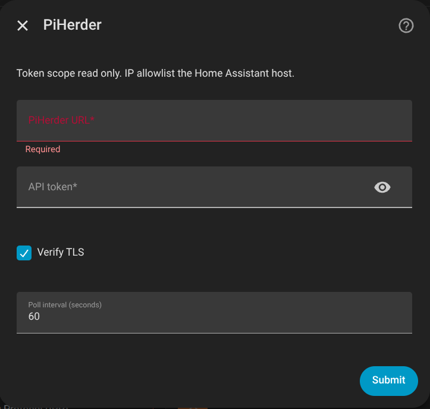
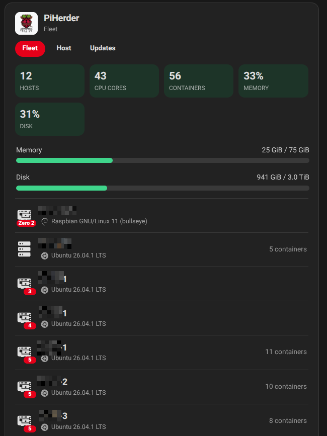
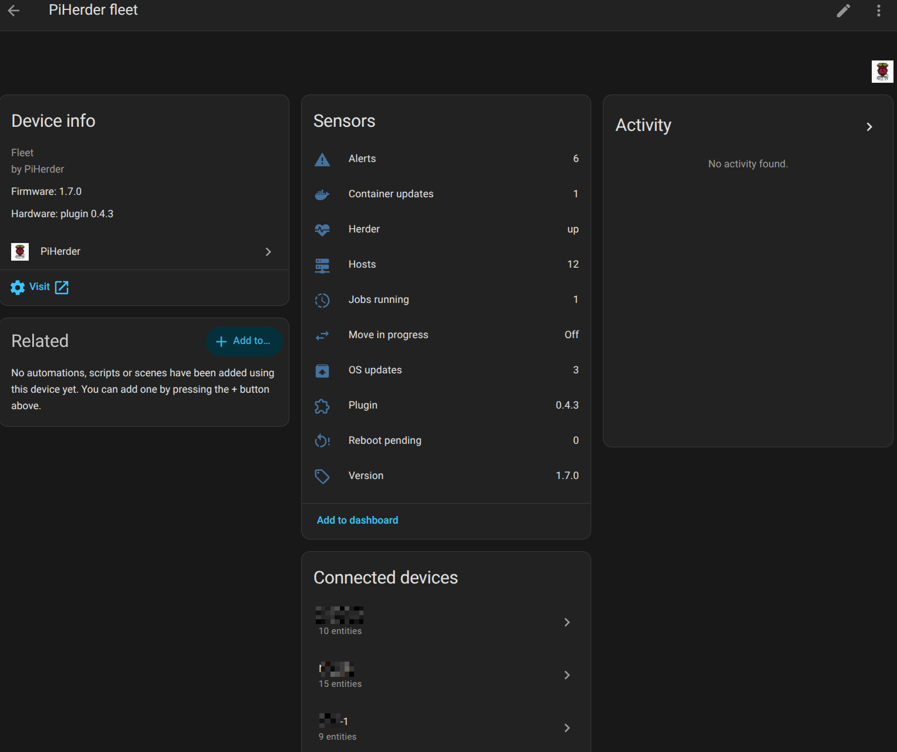
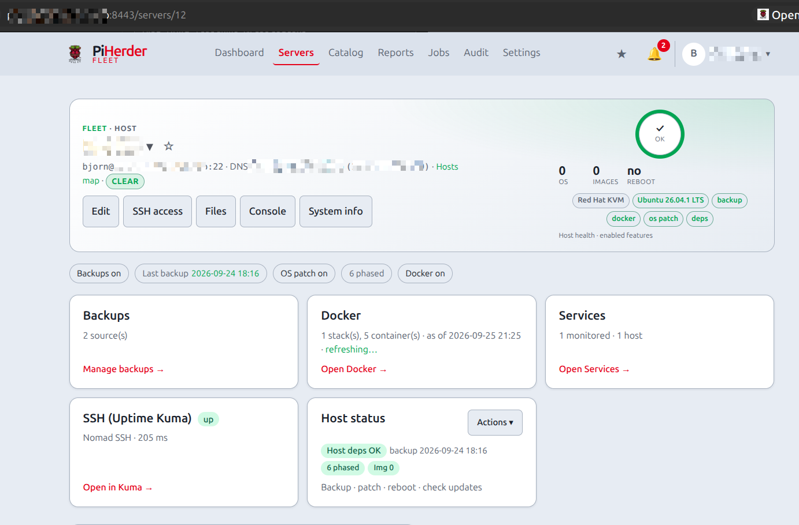
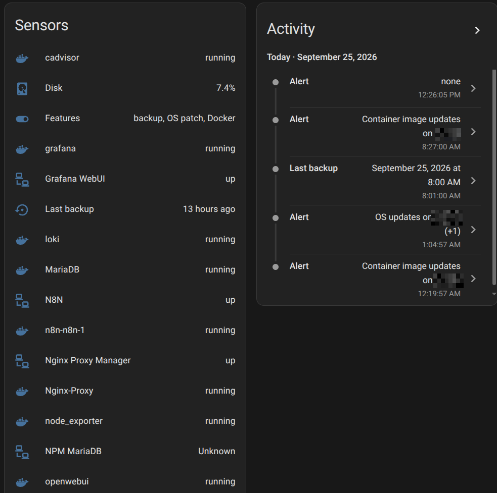
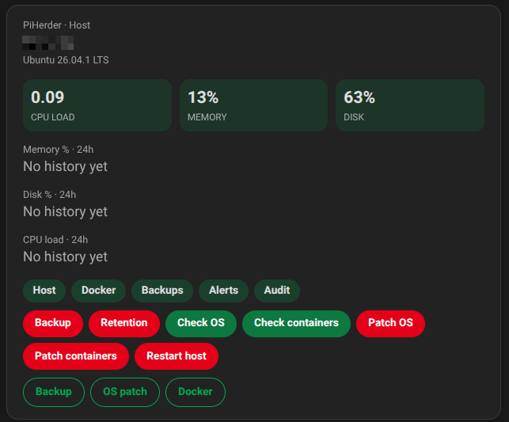
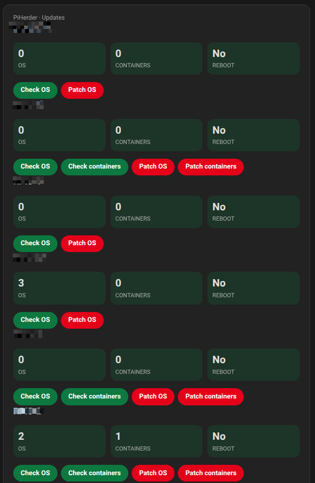
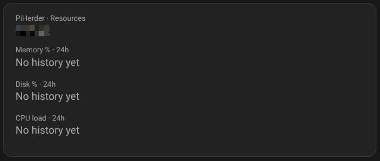
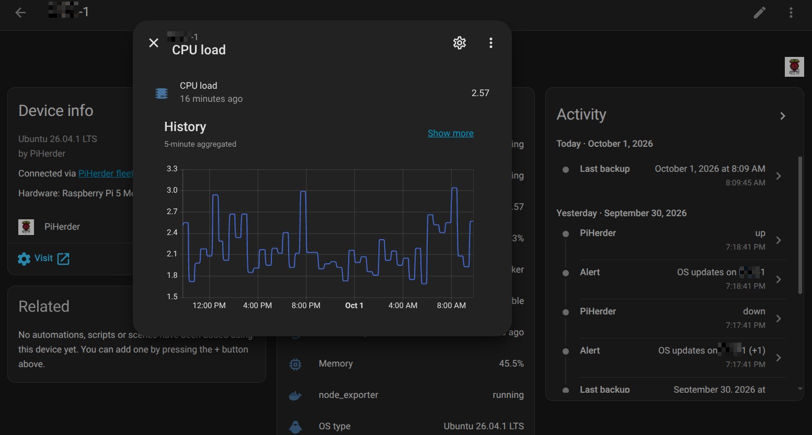

# Home Assistant → PiHerder (HACS)

## What this is

A **HACS integration that runs on Home Assistant** and **observes** your PiHerder fleet over `/api/v1`. It is **not** the same as [HAOS hosts](../day-to-day/haos-hosts.md) (PiHerder managing the appliance over SSH).

| Arrow | Where it lives | What it does |
|-------|----------------|--------------|
| Path 1 | This PiHerder image | SSH + `ha` CLI on an HAOS **server** |
| Path 2 (this page) | Separate HACS repo | HA polls PiHerder snapshots; **Visit** opens the herder |

The plugin is **not** inside the PiHerder Docker image. GitHub: [bjorngluck/piherder-ha](https://github.com/bjorngluck/piherder-ha). This branch documents plugin **0.5.0**. 0.4.0 was the one-card pass. 0.4.1 adds Start and Stop for one compose service. 0.4.2 keeps the tab, the selected host, and open sections when the card redraws. 0.4.3 writes the update counts in full, colors a container name when an image update is due, and adds Restart and Update for that one service. 0.4.4 is that same card, with the resource query bumped. **0.5.0** adds Move, fleet-jail Files, and stop project. The card stays poll-only. It does not call a herder webhook. The public site [piherder-docs.hacknow.info](https://piherder-docs.hacknow.info/) is built from PiHerder `main` and still describes **0.3.0** until this train merges. The card pictures below were captured 2026-10-01 on plugin **0.4.3**. They do not show Move, Files, or Stop project. The Google Drive copy is a separate herder screen: [Backups](../day-to-day/backups.md#copy-to-google-drive-v18-train).

Agent tools (Cursor, Grok, Claude, Codex) are a different client of the same token API: hosted **`/mcp`** on the herder. [bjorngluck/piherder-mcp](https://github.com/bjorngluck/piherder-mcp) is the optional stdio fallback. [Agents (MCP)](../operations/mcp.md).

## Why it exists

YAML `rest` sensors against an API token already work. Path 2 is that, first-class: config flow, fleet sensors, one HA device per host. The door back to PiHerder on the **device page** is HA’s single **Visit** (the host page). Home Assistant only allows **one** Visit URL per device for custom integrations — Docker / Backups / Alerts / Audit are **not** extra Visit links there. Those shortcuts live on the **PiHerder fleet** Lovelace card. Status sensors are status only — not fake “open” / “press here” buttons (those opened HA history, not PiHerder).

## Install (Slice 1)

1. In PiHerder: Settings → **API management** → create a token with **`read`**. Add **`jobs`** and **`edit`** if you want the confirm buttons and feature toggles. Set the **IP allowlist** to the HA host (HAOS ≈ appliance LAN IP; a container HA may egress as a Docker/bridge IP).  
2. HACS → custom repository → **Integration** → `https://github.com/bjorngluck/piherder-ha`.  
3. Add **PiHerder**: base URL (your herder origin, including scheme), token `ph_…`, TLS verify, poll interval. A bad URL or token keeps the fields filled (plugin ≥ 0.1.3).  
4. Confirm fleet **Plugin** is **0.5.0** after you redownload this build. Device page **Visit** is still the host. Add the **PiHerder** card below. Memory, disk, and CPU load sensors sit on that same host device, plus one sensor per container and monitored service. The sensors stay status. Start, stop, restart, update, and stop project are on the card’s Host tab, under **Containers**, and only when the token has `jobs` and Docker is on. Move uses that same gate plus the herder Move flag. Files needs the `files` scope. Job buttons show only if the token has `jobs`.

HACS does **not** auto-refresh custom repos. New GitHub Release: HACS → PiHerder → **⋮ → Redownload** (pick the tag) → **restart Home Assistant**. Reload of the config entry is not enough for new files.

Token without `read`, a bad secret, or a mismatched allowlist **fails closed**.

## What it reads

`GET /api/v1/health`, `GET /api/v1/summary`, `GET /api/v1/servers`, `GET /api/v1/jobs?active_only=true`, plus Slice 1b snapshots `GET /api/v1/inventory` and `GET /api/v1/services`. A herder older than this train answers 404 on those two; the plugin keeps the Slice 1 sensors.

Poll is **database snapshots only**. It never SSH’s the fleet on the HA interval. “Host down” is **`last_seen` age**, not a live ping.

Host **hardware**, **OS**, CPU, memory, and disk come from PiHerder **[System Info](../day-to-day/system-info.md)** (v1.6 host-facts). That snapshot exists **so HA does not SSH**: the herder writes columns on a ~15 minute job (or the System Info refresh icon), then HA and the fleet card read SQL. Recreate **web** so Alembic **044** and **045** apply, then refresh System Info once per host (or wait ~15 minutes).

## Fleet card (dashboard)

The built-in HA **device page** only has one Visit link. For fleet totals and per-host shortcuts, add the **PiHerder fleet** Lovelace card:

1. HACS plugin **0.5.0**, **restart Home Assistant**, then **hard-refresh the browser** (Ctrl+Shift+R). Reload of the config entry is not enough.  
2. Dashboard **⋮ → Resources** — delete any `/api/piherder/…` or older `/local/piherder-dashboard-card.js?v=0.2.2`, `?v=0.2.3`, `?v=0.2.4`, `?v=0.3.0`, `?v=0.4.0`, `?v=0.4.1`, `?v=0.4.2`, `?v=0.4.3`, or `?v=0.4.4` card URL. You want **one** resource:

   - URL: `/local/piherder-dashboard-card.js?v=0.5.0`  
   - Type: **JavaScript module** (not JavaScript)

   After setup, the integration copies the card into HA `config/www/` so `/local/…` works.  
3. Dashboard → Add card → **Manual** YAML (the picker may still not list it):

```yaml
type: custom:piherder-dashboard-card
```

The custom-tag field (if you use it) wants `piherder-dashboard-card` **without** the `custom:` prefix.  
4. Hard-refresh again. “Custom element doesn’t exist” means the resource is missing, still type “JavaScript” (not module), or the browser has a cached `/api/piherder/…` URL.

The card header is the PiHerder logo and the name **PiHerder**, then tabs for **Fleet**, **Host**, and **Updates**. Fleet shows **hosts, CPU cores, containers, memory %, disk %**, then one row per host with a model icon and an OS icon. Click a row to open that host. **Open host** goes to PiHerder. Docker, Backups, Alerts, and Audit are under **Also**. On **Host**, **Containers** lists the last inventory. A container with an image update has a gold name. **Start**, **Stop**, **Restart**, and **Update** each confirm, then run `docker compose` for that one service. **Update** pulls and recreates it. A 1.7 herder does not have those job types. The fleet picture is that tab.

Numbers come from the same **[System Info](../day-to-day/system-info.md)** snapshot the herder modal shows (CPU cores, memory, disk). Recreate **web** so Alembic **045** is applied, then the System Info refresh icon once per host (or wait for the scheduler). Empty CPU/memory/disk on the card means the herder has not stored a resource snapshot yet — not a card bug.

<figure class="ph-figure" markdown>
  
  <figcaption>Config flow — herder base URL and a read token (mask the token in any copy of this shot).</figcaption>
</figure>

<figure class="ph-figure" markdown>
  
  <figcaption>Fleet tab on plugin 0.4.3. Totals, then one row per host with a model icon and the OS. Click a row to open that host.</figcaption>
</figure>

<figure class="ph-figure" markdown>
  
  <figcaption>Fleet device on plugin 0.4.3. Hardware reads plugin 0.4.3, the Plugin sensor reads 0.4.3, and Visit opens the herder. Connected hosts are listed under the sensors.</figcaption>
</figure>

<figure class="ph-figure" markdown>
  
  <figcaption>Device **Visit** opens that host in PiHerder. One link, no extra buttons.</figcaption>
</figure>

<figure class="ph-figure" markdown>
  
  <figcaption>Container, service, and disk sensors on the host device. Status only — no start/stop.</figcaption>
</figure>

## What you see in HA

| Surface | Meaning |
|---------|---------|
| Fleet device | Counts, herder version, **Plugin** version, Visit = herder origin |
| Host device | One per PiHerder server. **Visit** = host page only. Hardware / OS from the stored snapshot |
| Lovelace card | Fleet, Host, and Updates tabs. Host strip, model and OS icons. Click a stat for Home Assistant history. **Containers** starts, stops, restarts, or updates one service, and can stop a project. **Move** and **Files** (fleet jail) are on the Host tab when the token allows them |
| Sensors | OS, features, alert, last seen, reboot, last backup, **memory %**, **disk %**, **CPU load**, plus one sensor per container (running / image / uptime text) and one per monitored service (up/down). All on the host device. Tapping a sensor opens HA history, not PiHerder |

## The card (plugin 0.5.0)

One card, three tabs: **Fleet**, **Host**, **Updates**. The same file still registers the 0.3.0 names, so an existing dashboard does not go blank. Dashboard **⋮ → Resources**: one URL, `/local/piherder-dashboard-card.js?v=0.5.0`. Delete an older `?v=0.3.0` through `?v=0.4.4` entry if it is still there. Restart Home Assistant, then hard-refresh. The card keeps the tab, the selected host, and open sections across its own redraw. The pictures below were captured on **0.4.3**.

```yaml
type: custom:piherder-dashboard-card
```

```yaml
type: custom:piherder-host-card
server_id: 1
```

```yaml
type: custom:piherder-updates-card
```

```yaml
type: custom:piherder-resources-card
```

Leave `server_id` off to get the host strip. Set it to pin one host and hide the strip. `piherder-resources-card` opens on the Host tab at the bars.

The host chip shows a Raspberry Pi icon with a short model (`5`, `4`, `400`, `Zero`, `CM4`, `CM5`) when the stored hardware string says so, and an OS icon for Ubuntu, Home Assistant, or Debian / Raspberry Pi OS. Anything else is a plain server and a Linux icon.

Click **memory**, **disk**, or **CPU load** and Home Assistant opens that sensor’s history. The card draws a thin 24-hour sparkline from those same sensors (about every 15 minutes, not a live SSH chart). The sparkline stays empty until the recorder has points. Reboot and last backup open the same way when those sensors exist.

**Backup** is the button on the face. **Actions** holds Retention, Check OS, Check containers, Patch OS, Patch containers, and Restart host. Restart names the host and reboots the machine. It will not start while an OS patch, a container patch, or a backup is already running. **Containers** lists the last inventory. The summary shows how many need an update, and those names are gold. A running service has **Stop** and **Restart**. A stopped service has **Start**. A service with an image update also has **Update**, which pulls and recreates that service only. Each asks first. Other containers in the project stay as they are. A row with no compose directory or service name has no button. This needs the v1.8 herder. A 1.7 herder answers 400. **Features** (backup, OS patch, Docker) is collapsed. Turning one off asks first. **Open host** is the link. Docker, Backups, Alerts, and Audit are under **Also**.

Updates is one row per host. The counts are written out (for example **2 OS updates** and **1 container update**), in gold when something is due, or **Up to date**. The row opens that host and does not repeat the buttons.

<figure class="ph-figure" markdown>
  
  <figcaption>Host tab on plugin 0.4.3. The strip picks the host. A gold pill names the OS updates. Containers is open: a running service has Stop and Restart. This frame has no container waiting on an image update, so no name is gold.</figcaption>
</figure>

<figure class="ph-figure" markdown>
  
  <figcaption>Updates tab on plugin 0.4.3. Each row writes the count out: Up to date, OS updates, or container updates. Gold means something is due. The row has no buttons.</figcaption>
</figure>

<figure class="ph-figure" markdown>
  
  <figcaption>Memory, disk, and CPU load on the Host tab, with the 24-hour sparkline.</figcaption>
</figure>

<figure class="ph-figure" markdown>
  
  <figcaption>Click CPU load and Home Assistant opens that sensor’s history. Memory and disk open the same dialog.</figcaption>
</figure>

A token with only `read` keeps the fleet card and the sensors and shows no buttons. `jobs` shows the confirms, including Start, Stop, Restart, Update, Stop project, and Move. `files` shows the fleet jail. `edit` shows the toggles. `feature:os` is required for patch, OS check, and host restart. `feature:backup` for backup and retention. `feature:docker` for container check, patch, the one-service buttons, Stop project, and Move. The host’s own feature flag must be on as well. Move also needs the herder flag (`service_migrate` on health).

**Stop project** asks first. It runs `docker compose stop` for that compose directory (`docker_stack_stop`). It does not remove containers or volumes.

**Move** asks first, then stops the project on this host, copies it, and starts it on the destination. The source is left stopped. A finished Move has no Undo on the card. The card does not remove the source project.

**Files** is the fleet jail only. The same token scope as the Files API. Delete asks first and removes one file or an empty directory. It does not install Home Assistant `/config`, and it does not open a privileged path.

The buttons call Home Assistant services (`piherder.trigger_job`, `piherder.set_features`, `piherder.start_move`, and the files actions). The token stays on the integration. An automation can call those services without the card’s confirm dialog.

## What it will not do

No console, no compose editor, no token admin, no nmap, and no herder webhook. Job-finished events still come from the poll. Files stay in the fleet jail. Stop project is not `docker compose down`. The sensor list still only reads the last inventory. YAML `rest:` remains possible. The poll still reads stored snapshots and does not SSH.

## Related

- [API tokens](../operations/api-tokens.md) · [Agents (MCP)](../operations/mcp.md) · [API.md](https://github.com/bjorngluck/piherder/blob/main/docs/API.md)  
- [System Info](../day-to-day/system-info.md) (why the snapshot exists) · [HAOS hosts](../day-to-day/haos-hosts.md) (path 1) · [Add a server](../day-to-day/add-server.md)  
- Maintainer: [PLAN_v1.9.0.md](https://github.com/bjorngluck/piherder/blob/v1.9.0-dev/docs/PLAN_v1.9.0.md) · [PLAN_v1.8.0.md](https://github.com/bjorngluck/piherder/blob/v1.8.0/docs/PLAN_v1.8.0.md) · [FEATURE_PLAN_HOME_ASSISTANT.md](https://github.com/bjorngluck/piherder/blob/v1.9.0-dev/docs/FEATURE_PLAN_HOME_ASSISTANT.md) §7  
