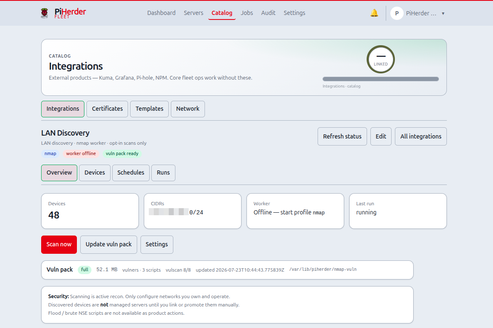
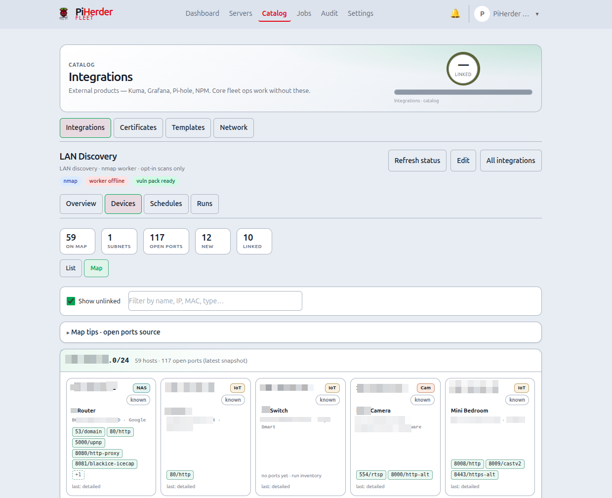
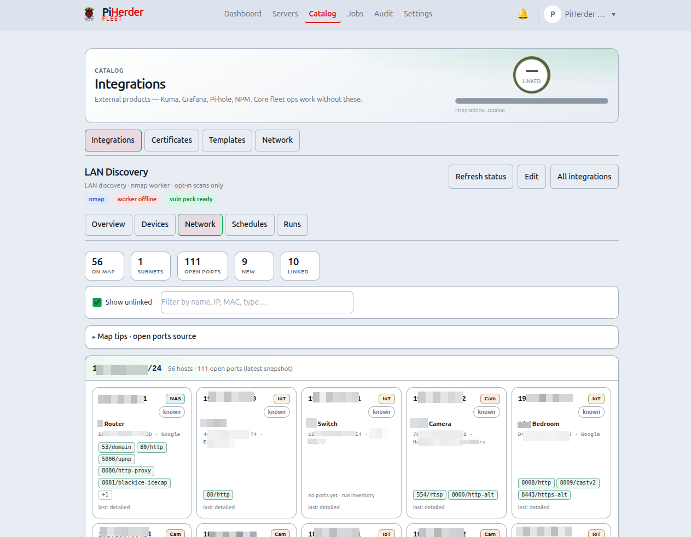
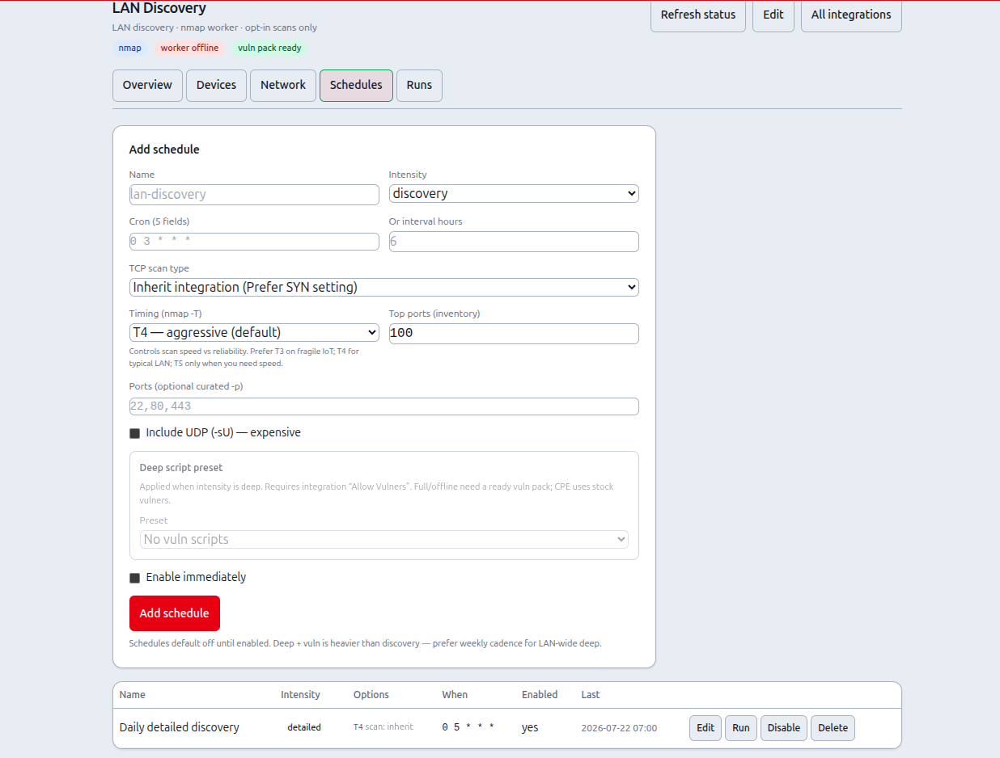
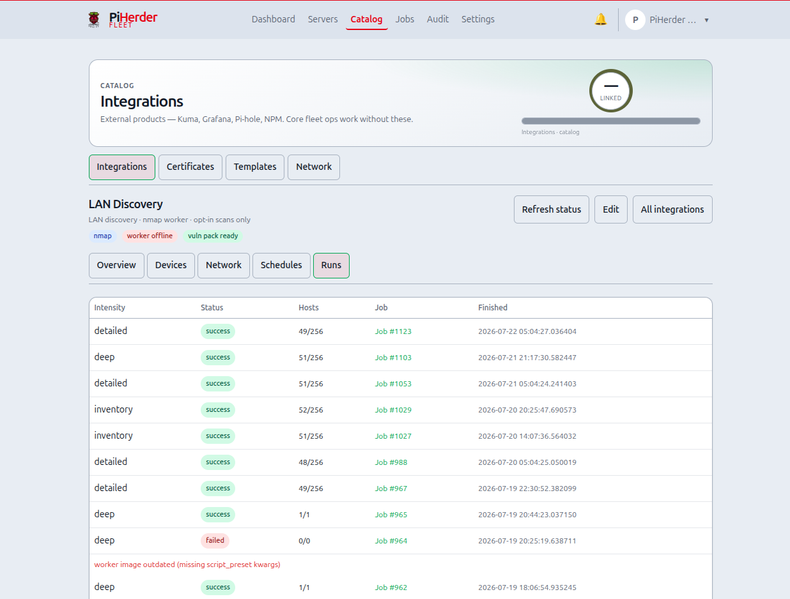
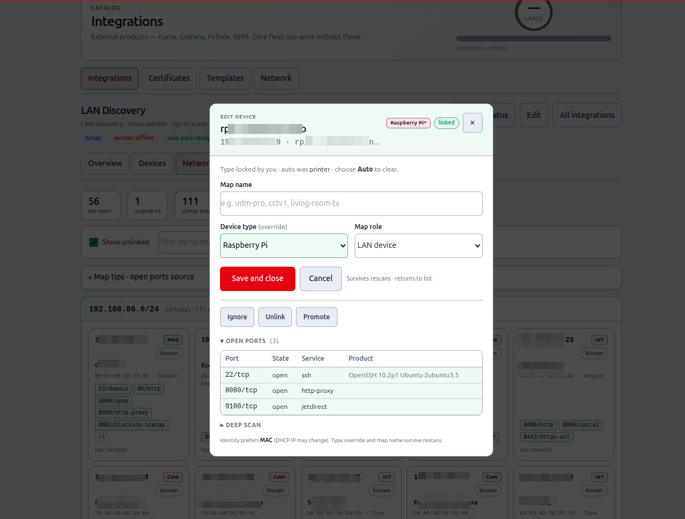

# LAN Discovery (nmap)

## What this is

**LAN Discovery** is an **opt-in** Catalog integration that scans your configured **CIDR(s)** with **nmap**, auto-creates **discovered device** records, and feeds an **end-to-end Hosts map** of the whole LAN — **without** linking every device to a managed Server.

Devices are **not** managed fleet servers until you **link** or **promote** them. Naming, kind badges, and Hosts map chips are for orientation; promote only when you want SSH/backups/Docker management.

**Where:** Catalog → **Integrations** → add / open **LAN Discovery** (`/integrations/{id}?tab=…`).

**Hosts map (whole network):** Catalog → **Network** → **Hosts map** (`/dns/physical`) — fleet servers **and** unlinked discoveries together. See [Network maps](dns-fabric.md#lan-discovery-on-hosts-map).

<figure class="ph-figure" markdown>
  
  <figcaption>LAN Discovery Overview — worker status, CIDRs, vuln pack, curated scan actions.</figcaption>
</figure>

## Why it exists

PiHerder already manages hosts you onboarded. Discovery answers: *what else is on my LAN, and which of those do I want to manage?* Scans never run silently: you configure CIDRs and start work manually or via **schedules you enable**.

---

## Prerequisites

| Requirement | Notes |
|-------------|--------|
| **nmap worker** | Compose **profile `nmap`** — not started by default |
| **nmap image** | Build: `docker build -f Dockerfile.nmap -t piherder:nmap-local .` |
| **Start worker** | `docker compose --profile nmap up -d celery-worker-nmap` |
| **Worker fence** | Compose sets `PIHERDER_NMAP_WORKER=0` on web/main celery and `=1` on the nmap worker. Tasks refuse when marker is 0 or `nmap` is missing. **Usually not in `.env`** — see [env reference](../operations/env-reference.md#lan-discovery-nmap--opt-in) · [`.env.example`](https://github.com/bjorngluck/piherder/blob/main/.env.example) |
| **Vuln pack volume** | Host dir `./piherder_nmap_vuln` (or `PIHERDER_NMAP_VULN_PATH`) mounted into web (ro) + nmap worker (rw) |
| **Host networking** | Worker uses **host network** so ARP/MAC and LAN reachability work; Postgres/Redis must listen on host loopback (`127.0.0.1`) as in stock compose |

Without the worker, Overview shows **scanner offline**. Without the vuln pack, deep **vuln scripts** stay gated. Never add `-Q nmap` to the main celery-worker.

!!! warning "Active recon"
    Scans are intentional reconnaissance on **your** networks only. Stay inside configured CIDRs. Do not point PiHerder at networks you do not own.

---

## End-to-end: first discovery week

1. Build and start the nmap worker (commands above).  
2. Catalog → Integrations → **Add** → **LAN Discovery** → set **CIDR(s)** (e.g. `192.168.1.0/24`) and optional excludes.  
3. Optional: enable **vuln scripts** on the integration when you want deep scans to use NSE vuln packs.  
4. **Overview** → download / update **vulnerability database** if you plan deep vuln scans (Jobs page shows progress).  
5. Run **Discovery** (who is up), then **Inventory** (ports — top N or **all ports**) so chips and kind heuristics have data.  
6. **Devices** tab — **List** or **Map** view — click a host → **edit modal**: **map name**, fix **device type**, mark **gateway** if the row is your router, **Mark known** for reviewed noise.  
7. Open **Catalog → Network → Hosts map** — fleet + discovered together (**no per-device link required**). Use the **radar** toggle for outer chips; **1:1** fits the window (tight when discovered is off).  
8. Link or promote only hosts you want to **manage**.  
9. Optional: **Schedules** — discovery daily / inventory weekly; leave **disabled** until manual runs look good.

Journey: [Operator scenarios — Journey H](../getting-started/operator-scenarios.md#journey-h).

---

## Tabs

| Tab | Purpose |
|-----|---------|
| **Overview** | Worker status, CIDRs, vuln pack strip; **Scan now** / **Update vuln pack** modals; **Settings** link |
| **Devices** | **List** and **Map** views (toggle): host list + filters, or subnet-grouped discovery cards; edit modal |
| **Schedules** | Multiple named schedules — list-first; **card actions** on mobile; add/edit modal |
| **Runs** | Scan history — **cards** on mobile, table on desktop; intensity, status, hosts, ports, Job link (no run ID) |

!!! tip "List + Map in one place (v0.9)"
    Devices and the old **Network** tab are **one Devices tab** with a **List | Map** toggle.
    Bookmarks to `?tab=network` still open **Map** view.  
    Overview no longer duplicates tab shortcuts (Devices / Network / Jobs buttons removed).

<figure class="ph-figure" markdown>
  
  <figcaption>Devices list — hostname/MAC/ports with kind and lifecycle filters.</figcaption>
</figure>

<figure class="ph-figure" markdown>
  
  <figcaption>Devices → Map view — subnet-grouped discovery cards (Show unlinked).</figcaption>
</figure>

<figure class="ph-figure" markdown>
  
  <figcaption>Schedules — list-first with create/edit modal.</figcaption>
</figure>

<figure class="ph-figure" markdown>
  
  <figcaption>Runs history — intensity, status, hosts, ports, Job link (no run ID column).</figcaption>
</figure>

There are **two** maps:

| Map | URL | What it shows |
|-----|-----|----------------|
| **LAN Discovery → Devices → Map** | `/integrations/{id}?tab=devices&view=map` (legacy `?tab=network`) | Discovery-only subnet cards (scanned devices) |
| **Catalog → Network → Hosts map** | `/dns/physical` | **End-to-end**: Internet → router → LAN → **fleet + unlinked discoveries** + app paths |

---

## Scan intensities

| Profile | Intent | Typical use |
|---------|--------|-------------|
| **Discovery** | Who is alive | Frequent light sweeps (`-sn`-class) |
| **Inventory** | Ports + services | Daily top-ports or all-ports + version detect |
| **Detailed** | Broader map | Weekly wider ports / OS-ish depth |
| **Deep** | Single-host full audit | Manual or scheduled; optional **script preset** + SYN |

**On-demand:** scan network now; scan **this device** (deep); curated options (timing, top-ports, UDP, port list, script preset) — **no free-form nmap flags**.

### Deep script presets

| Preset | What runs | When to use |
|--------|-----------|-------------|
| **none** | No NSE vuln scripts | Inventory-like deep ports only |
| **cpe** | Stock `vulners` (CPE/version, online API) | Quieter version triage |
| **offline** | Pack **vulscan** only | Offline tables; needs pack |
| **full** | Stock `vuln` category + vulscan + helpers | Noisy; many clear/error rows expected |

Device detail **classifies** script rows: **finding** · **clear** · **script error** · **info**. Each finding shows the **port/service** it ran on (or was inferred for from CPE/product). Ports with issues are **highlighted** in the port table. Errors mean the probe failed (often irrelevant apps), not “unknown vulnerability”. Version/CPE matches still need human verification.

### Timing (nmap `-T`)

| Value | Meaning | When |
|-------|---------|------|
| **T3** | Normal — slower, quieter | Fragile IoT, WAN edges |
| **T4** | Aggressive — default | Typical home/lab LAN |
| **T5** | Insane — fastest | Speed over thoroughness; may miss or stress hosts |

### Port scope (inventory / detailed / deep)

| Mode | nmap shape | Notes |
|------|------------|--------|
| **Top ports** | `--top-ports N` (default 100) | Fast inventory of common services |
| **All ports** | `-p-` | Full TCP 1–65535 — slower; use when top-N is not enough |
| **Custom list** | `-p 22,80,443` or ranges | Curated only (digits, commas, hyphens) |

**Detailed** and **deep** default to all ports unless you pick top or custom.

### Targets & excludes

- **Scan now** pre-fills **configured LAN CIDR(s)** so you do not re-type the subnet.
- **Always exclude** — every intensity (including discovery).
- **Exclude from port/vuln scans** — inventory / detailed / deep skip these hosts; **discovery still finds them**.
- **Exclude from deep only** — inventory can still map ports; deep/vuln skips them.

Excludes are passed as nmap `--exclude` so a single IP does not block scanning the rest of the CIDR.

---

## Map identity (name, type, gateway)

Any discovered device (Pi, printer, IoT, router, TV…) can be labelled for the Hosts map — **not only** fleet-manageable hosts. You do **not** need to promote a Server just to name a chip.

| Field | Purpose |
|-------|---------|
| **Map name** | Chip / spine label (e.g. `cctv1`, `udm-pro`) |
| **Device type** | Override busted heuristics (e.g. auto **Printer** → **Raspberry Pi**) |
| **Map role** | Default LAN device, or **Gateway / router** for the Hosts map spine |

| | |
|--|--|
| **Set** | **Devices** (List or Map) → click host → **centered edit modal** → name / type / role → **Save and close** |
| **Survives** | Re-scans (nmap **hostname** may still update separately; override stays) |
| **Shown on** | Hosts map chips, Devices list, Map cards; gateway → **Router** spine |
| **Name priority** | **display name** → scan hostname → IP |
| **Save side-effect** | Saving map identity also **marks New → Known** (reviewed) |

Clear the name field and save to fall back to hostname/IP. Kind **Auto** returns to the heuristic.

### Gateway / router role

Mark the device that is your LAN gateway (router IP). That:

1. Sets **Network map → gateway IP** to this device’s IP (if different).  
2. Labels the Hosts map **Router** spine node with the map name (or hostname).  
3. **Hides** that IP as a separate LAN discovery chip (avoids double-draw on the rim).

Only one device is gateway at a time. You can still set gateway IP manually under Catalog → Network map settings.

---

## Device type (looks like + override)

PiHerder **guesses** a device kind from:

| Signal | Source |
|--------|--------|
| **MAC vendor** | nmap `address@vendor` when MAC is seen (same L2 / host-network worker) |
| **OUI prefix** | Small curated table (Pi, Espressif, printers, Ubiquiti, …) — not full IEEE |
| **Open ports / services** | e.g. 9100+631 → printer; 5000/5001 → NAS; 554 → camera; 445+3389 → Windows |
| **Hostname / OS** | e.g. `pi-*`, `DiskStation`, “Windows …” |

Shown as a **kind badge** on Devices list, edit modal, Map cards, Hosts map chips, and linked server soft-embed. Heuristic is **advisory only** — never auto-links or promotes.

When discovery is wrong (e.g. OUI says printer but the box is a Pi), set **Device type** in the edit modal. Override is sticky across rescans; the auto guess is still shown as “auto was …”. An asterisk on the kind badge means **operator override**.

Run **inventory** (or detailed/deep) so ports feed the classifier; discovery alone often only yields MAC vendor when available.

**Roadmap:** icons / shapes on Hosts map by device kind; optional named labels for individual open services (ports) beyond host-level map name.

---

## Edit modal (Devices List + Map) {#edit-modal-network--devices}

Click a **Map** card or a **List** row to open a **centered floating modal** (same shell as jobs / wait modals — not a bottom sheet). Stays on Devices (same view); no full-page jump.

| Control | What it does |
|---------|----------------|
| **Map name** | Label for Hosts map chip / list title |
| **Device type** | Sticky kind override, or **Auto** to clear |
| **Map role** | **LAN device** (default) or **Gateway / router** |
| **Save and close** | Writes identity, marks **Known** if was New, closes modal (return path below) |
| **Cancel / ✕** | Close without save — follows the same return path |
| **Mark known** | New/Stale → Known; **closes modal** |
| **Mark new** | Known → New; closes modal (not for Linked — unlink first) |
| **Ignore / Unignore** | Hide from maps / restore; closes modal |
| **Link / Unlink** | Soft-attach to Server / detach; closes modal |
| **Promote** | Add-host wizard **prefilled** with device IP (+ name when set) — still manual create |
| **← Back to server** | When opened from a **fleet server** LAN chip (`return=server:{id}`) — Save/close returns to that host |
| **← Hosts map** | When opened from Hosts chip (`return=hosts`); Save/lifecycle can return to `/dns/physical` |
| **Open ports / findings** | Expandable detail (latest port snapshot + classified scripts) |

### Where you land after close

| Opened from | `return` query | After Save / Cancel / ✕ |
|-------------|----------------|-------------------------|
| Devices List or Map | *(none)* | Same Devices view (list or map), focus flash when applicable |
| Hosts map chip | `hosts` | Catalog → Hosts map |
| **Server detail LAN chip / strip** | `server:{id}` | **That fleet host** (`/servers/{id}`) — not Integrations |

Operators can mutate; viewers see read-only identity. Map view restores scroll after save so long subnet grids do not jump to the top.

---

## Devices → Map view {#devices-map-view}

- Hosts grouped by **/24** (or IPv6 /64), with search filter.
- **List | Map** toggle on the Devices toolbar (shared stats strip).
- **Click a host card** → edit modal (above). Stays on Map view.
- **Show unlinked** (default on): include unlinked hosts (`new` / `known` / `stale`). Uncheck to keep only **linked** devices. Preference is browser-local (separate from Hosts map radar).
- Toolbar shows counts (on map / subnets / open ports / new / linked).
- Port chips show the **latest snapshot per host** (from the last inventory/detailed/deep that recorded ports), **not** a merge of all historical scans.
- Card titles use **map name** when set.

### Devices → List view

- Shared filter bar: All / New / Known / Linked / Ignored / **Offline** (stale) + search.
- Click a row → same edit modal.
- Empty states when filters hide every host.

---

## Hosts map (Catalog → Network)

Unlinked discoveries appear **automatically** on the end-to-end Hosts map:

| Behaviour | Detail |
|-----------|--------|
| **No link required** | Do not link 50 devices just to “see” them |
| **Layout** | Fleet hosts keep the **inner fan**. Discovered devices sit on **outer multi-rings** as **small chips** when the radar is on |
| **Dual layout** | Discovered **off** = compact zone (fleet fan, router on compact rim). **On** = expanded zone + outer chips; Internet / Router / apps shift with the zone |
| **Dedup** | Same IP as a fleet server, already **linked**, or map-role gateway → fleet / spine only |
| **Ignored** | Stay off the map |
| **Label** | Map name → hostname → IP |
| **Tap chip** | Opens LAN Discovery device edit modal (`return=hosts`) |

### Fleet server LAN chip

On **server detail**, a linked discovery device shows as a **link-style LAN pill** (accent border + arrow — not an inert status chip). Opening it loads the edit modal with **← Back to server**; Save / Cancel / ✕ return to that host.

### Hosts map toolbar (what each control does)

One-line chrome at the top of the map (no horizontal scroll on typical phones):

| Control | Action |
|---------|--------|
| **Hide map** (list icon, mobile) | Leave SVG → host list first |
| **Discovered** (radar icon) | **On** (accent) = show outer discovery chips + expanded LAN zone. **Off** (muted) = compact fleet-only fan. Count lives in the **footer** + tooltip, not a “Disc. 45” badge. Preference: `localStorage` |
| **− / % / +** | Zoom out · current zoom · zoom in (SVG viewBox, stays sharp) |
| **1:1** | **Fit map to window.** With discovered **on** = designed full canvas. With discovered **off** = tight fit around the compact fleet so content fills the map pane (not a tiny cluster in empty space). Double-click the map does the same |
| **Full screen** (corners icon) | Expand map; Esc / icon again to exit. Hamburger exits fullscreen so the drawer is usable |

Also: pinch / scroll-wheel zoom, drag to pan. Footer shows fleet · discovered counts and map legend (solid LAN, dashed WAN/NPM, dashed-border chips = discovered).

Full layout notes: [Network maps — LAN discovery](dns-fabric.md#lan-discovery-on-hosts-map).

---

## Devices & onboarding

### Lifecycle states

| State | Meaning |
|-------|---------|
| **New** | Unreviewed inbox — first seen (or re-flagged). Rescans **keep** New until you act. |
| **Known** | Reviewed / acknowledged — still not a managed Server. Filter out of the New inbox. |
| **Linked** | Soft-attached to an existing fleet **Server** |
| **Ignored** | Hidden from active discovery focus and Hosts map |
| **Stale** | Not seen for **14 days** (auto on Devices/Network list); next resight → **Known** |

| Action | Meaning |
|--------|---------|
| **Mark known** | Reviewed — leave the New filter (also auto when you **Save and close** map identity) |
| **Mark new** | Put back in the inbox (not for linked devices — unlink first) |
| **Map identity** | Name / type / gateway role (not a Server) |
| **Ignore / dismiss** | Hide from active discovery focus |
| **Link** | Attach discovered device to an **existing** Server row (soft embed) |
| **Promote** | Add-host wizard prefilled with IP (+ name) — still **manual**; no silent SSH enable |

Discovery ≠ fleet membership. Hostnames and MACs depend on scan privileges and host-network worker mode.

### Identity & DHCP

| Rule | Detail |
|------|--------|
| **Stable key** | Prefer **MAC** (`mac:AA:BB:…`); if no MAC yet, fall back to **IP** (`ip:…`) |
| **IP churn** | Same MAC at a new DHCP address **updates** `ip_address` on the same row — map name, kind override, notes, and state stay |
| **First MAC** | When a previously IP-only row is later seen with a MAC at that IP, it is upgraded to MAC identity |
| **No MAC ever** | Pure IP identity can fork if the host moves IP before a MAC is learned — host-network worker helps MACs appear |

Ignore/link/map name survive IP updates when identity is MAC-based.

### Soft embed (fleet)

Linked discovery devices appear on **Servers** list (LAN chip) and **server detail** (ports, kind, script summary + links back to Devices / Network view).

---

## Schedules

- All schedules are **off by default**.  
- Intensities: discovery · inventory · detailed · **deep** (deep may set **vuln scripts** and SYN override).  
- Provide **cron** (5 fields, app timezone) **or** **interval hours**.  
- **Create** and **Edit** (list → Edit → same form prefilled → Save).  
- Options stored per schedule (`options_json`): script preset, timing, top-ports, UDP, port list, SYN vs inherit.  
- Changes resync APScheduler; audit records configure/scan actions.

!!! note "UX polish (v0.9)"
    Filter chrome on Devices/Network, Overview density (Scan now / vuln in modals), and Schedules list-first + ⋯ / modal form are tracked for **v0.9.0** — [PLAN_v0.9.0.md](https://github.com/bjorngluck/piherder/blob/main/docs/PLAN_v0.9.0.md). Product behaviour above stays the same for 0.8.

<figure class="ph-figure" markdown>
  
  <figcaption>Server detail soft embed — linked discovery device with ports (when nmap is enabled).</figcaption>
</figure>

---

## Runs

History of completed/failed scan jobs for this integration.

| Column | Notes |
|--------|--------|
| **Intensity** | discovery · inventory · detailed · deep |
| **Status** | success / failed / … |
| **Hosts** | up / total from that run |
| **Ports** | open count (hidden on very narrow viewports) |
| **Job** | Link into fleet [Jobs](../day-to-day/jobs-audit-notifications.md) (live log while running) |
| **Finished** | Finished (or started) timestamp |

There is **no run ID column** — use the **Job** link for correlation. On mobile, the table scrolls **inside** its card (not the whole page). Optional Settings → [Stale data cleanup](../operations/settings.md#stale-data-cleanup) can purge old run rows + XML.

---

## Vulnerability pack

| Item | Detail |
|------|--------|
| Location | Host volume → `/var/lib/piherder/nmap-vuln` in containers |
| Update | Overview → **Update vulnerability database** → Job `nmap_vuln_db_update` on the **nmap** queue |
| Progress | Jobs page detail (log lines / progress), same pattern as OS updates |
| Gate | Deep vuln scripts need pack **READY** + integration vuln enablement |

---

## Jobs

| Job type | Runner |
|----------|--------|
| `nmap_discover` / `nmap_inventory` / `nmap_detailed` / `nmap_host_deep` | **celery-worker-nmap** (`-Q nmap`) |
| `nmap_vuln_db_update` | nmap worker |

Web only **enqueues**. Cancel and progress follow the fleet Jobs UI (finished jobs keep the modal open with a done banner instead of forcing a full page reload).

---

## Security & ops notes

- RBAC: **operator+** mutate; **viewer** read.  
- Targets outside configured CIDRs are refused.  
- SYN / raw scans need appropriate privileges in the nmap container (stock image runs as root with caps for reliable LAN + inventory). Connect-scan (`-sT`) is the fallback.  
- Default install: **no** nmap worker, **no** vuln DB in image layers.  
- **Worker fence:** `PIHERDER_NMAP_WORKER` is compose-owned (`0` web / `1` nmap worker); `worker_guard` refuses misrouted tasks.  
- Detailed/deep whole-LAN **Scan now** asks for browser confirm (blast-radius).  
- CI never live-scans real networks (fixtures / mock XML only).

---

## Related

- [Network maps (Hosts map + discovery overlay)](dns-fabric.md)  
- [Environment reference — nmap](../operations/env-reference.md#lan-discovery-nmap--opt-in)  
- [Integrations overview](overview.md)  
- [Add a server](../day-to-day/add-server.md) — promote path  
- [Jobs, audit & notifications](../day-to-day/jobs-audit-notifications.md)  
- [Settings — Stale data cleanup](../operations/settings.md#stale-data-cleanup) — optional purge of old nmap runs  
- [Volumes](../operations/volumes.md)  
- Design: [FEATURE_PLAN_LAN_NMAP.md](https://github.com/bjorngluck/piherder/blob/main/docs/FEATURE_PLAN_LAN_NMAP.md) · ship plan [PLAN_v0.8.0.md](https://github.com/bjorngluck/piherder/blob/main/docs/PLAN_v0.8.0.md) · follow-up UX [PLAN_v0.9.0.md](https://github.com/bjorngluck/piherder/blob/main/docs/PLAN_v0.9.0.md)
