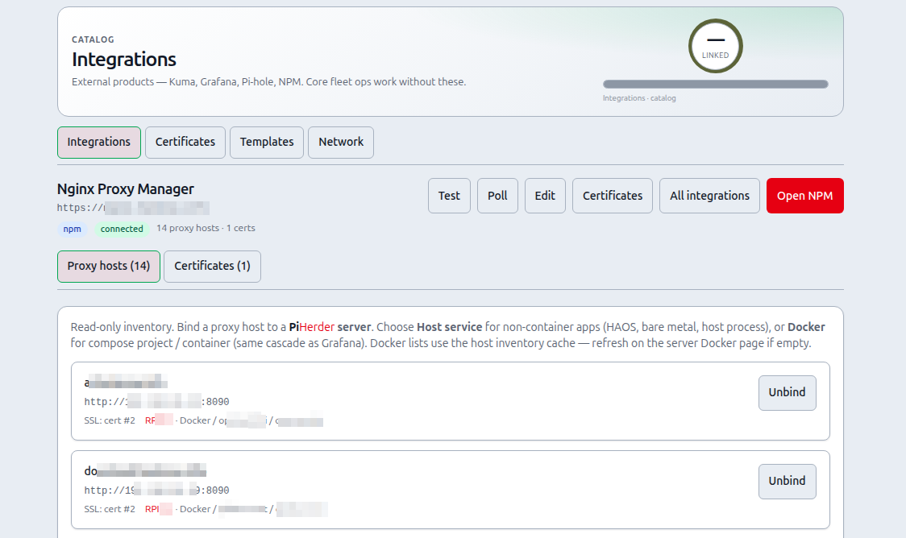

# Nginx Proxy Manager integration

## What this is

Connect an existing **Nginx Proxy Manager** instance for **proxy host inventory** (read-only in PiHerder) and **TLS certificate pull** into the encrypted cert vault.

## Why it exists

NPM is often the edge of a homelab. Operators need to see which hostnames are proxied, bind them to fleet servers, and pull cert material for redistribution — without re-implementing NPM’s full proxy editor inside PiHerder.

<figure class="ph-figure" markdown>
  
  <figcaption>NPM detail: proxy host inventory and certificate pull.</figcaption>
</figure>

---

## End-to-end: inventory + pull a cert

1. Connect NPM (base URL + admin email/password).  
2. Poll / open detail → browse **proxy hosts**.  
3. Optionally **bind** a proxy host to a PiHerder server (and Docker project).  
4. **Certificates** section → **Pull into PiHerder**.  
5. Open **Catalog → Certificates** → add **service maps** → Deploy to targets that need the PEMs.  

---

## Connect

1. Catalog → **Integrations** → **+ NPM**  
2. Base URL (e.g. `https://nginx.example.com`)  
3. Admin **identity** (email) + password  
4. Save & connect (PiHerder obtains a short-lived API token per request)

## Proxy hosts (read-only)

- Inventory from `GET /api/nginx/proxy-hosts`  
- **Bind** a host to a PiHerder server (optional Docker project/container)  
- Create/edit/delete of proxy hosts stays in the NPM UI for this release  
- Proxy host **binding** UI is card-based (mobile-friendly selects; host service or Docker cascade)

**Why read-only proxy edit:** RC1 focuses on inventory + certs; full proxy CRUD stays in NPM to avoid half-baked edge configs.

## Certificates

From the NPM integration detail **Certificates** section:

1. **Pull into PiHerder** — downloads the NPM zip, stores fullchain + private key **encrypted**  
2. Manage deploy targets under **Catalog → Certificates** (`/certificates`)

You can also **upload PEM** fullchain + key without NPM: **Catalog → Certificates → Upload PEM**.

### Renew

- NPM-sourced certs with **auto-renew** are checked every 6 hours  
- When ≤ **21 days** (configurable) remain: re-pull → if still stale, `POST …/renew` → poll → redistribute to targets  
- Manual **Renew (NPM)** on the certificate detail page  

### Deploy layouts

| Layout | Files |
|--------|--------|
| pair | `fullchain.pem` + `privkey.pem` |
| combined | single file (privkey then fullchain) |
| pair_and_combined | both |
| pair_and_pfx | pair + OpenSSL PKCS#12 on the host |
| pair_combined_pfx | all three |

Optional owner/group, mode (`600` default), and post-deploy shell command (e.g. service restart).

## Related

- Deploy NPM via [Templates](../service-templates/overview.md)  
- Full cert vault behaviour: [Certificates](certificates.md)  
