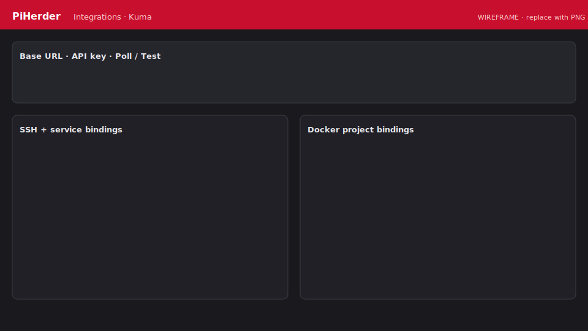

# Uptime Kuma

You can **deploy** Kuma via [Templates](../service-templates/overview.md), then connect the integration for status and bindings.

<figure class="ph-figure" markdown>
  
  <figcaption>Connect + bind SSH/services/Docker. <span class="ph-wireframe-badge">wireframe</span></figcaption>
</figure>

## Connect

1. In Kuma: **Settings → API Keys** — create a key (copy once).  
2. From a host that can reach Kuma:

   ```bash
   curl -sS -u ":$KUMA_API_KEY" "https://uptime.example.com/metrics" | head
   ```

3. PiHerder → **Catalog → Integrations → + Uptime Kuma** — base URL + API key → Save.  
4. **Optional (recommended on Kuma 1.23):** username/password for dashboard ID map (`/dashboard/{id}`). Metrics often omit `monitor_id`.  
5. Poll interval default **60s**; **Test** / **Poll now**.

## Binding scopes

| Scope | Where you see it |
|-------|------------------|
| **SSH** reachability | Server chips, detail, Services |
| **Host service** (no Docker) | Server detail, Services — e.g. HAOS |
| **Docker** project/container | Docker chips + Services |

- **Suggest matches** maps unbound servers to TCP/SSH monitors.  
- HTTP monitors expose **TLS valid** + **days remaining**.  
- Down transitions → in-app notifications (+ optional Web Push: **Integration monitor down**).

## Services UI

| Path | Purpose |
|------|---------|
| `/integrations` | Connect + bind |
| `/servers/{id}/services` | Per-host services |
| `/services` | Fleet icon grid — filter **All / Up / Down / TLS issue**, search by name/host/location, App / Kuma / Host / Docker links |
| Dashboard | Services count tile → `/services` |

Empty fleet grid explains how to bind Kuma monitors. Prefer fixing **down** or **TLS** filters first when something looks wrong.

### Logos

Auto favicon fetch + manual upload under `DATA_ROOT/service_logos/` (`./piherder_data`).
