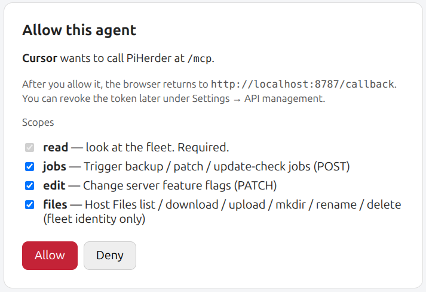

# Agents (MCP)

## What this is

PiHerder speaks [MCP](https://modelcontextprotocol.io) on the **same host and port** as the web app. The path is **`/mcp`**. Paste a `ph_` Bearer token, or sign in in the browser and approve the agent's scopes. There is no second process to run. Browser sign-in applies only to this hosted URL.

The older stdio program [bjorngluck/piherder-mcp](https://github.com/bjorngluck/piherder-mcp) is still there for an air-gapped laptop that cannot open HTTP to the herder. It is optional. It is not in the PiHerder image. It does not use the browser sign-in. It still needs `PIHERDER_TOKEN`.

## Why hosted

Operators were starting `uvx` on every agent machine and keeping `PIHERDER_URL` in sync. The herder is already up. `POST /mcp` uses the token API that already exists.

**Transport:** [Streamable HTTP](https://modelcontextprotocol.io/specification/2025-03-26/basic/transports) (the remote MCP transport Cursor, Claude Code, VS Code, and Codex use in 2026). The server is **stateless**. Each call is one `POST` and a JSON body. `GET /mcp` returns **405** — there is no long-lived SSE listen channel. A client that only speaks the old HTTP+SSE transport should use the stdio fallback.

**Auth (hosted `/mcp` only):** paste an `Authorization: Bearer ph_…` token, or let the agent sign in in the browser. Same scopes, same IP allowlist, same expiry. The token is a header. It is not a query parameter.

A call to `/mcp` with no token gets `401` and a `resource_metadata` URL. The agent registers itself, opens a browser, and you approve the scopes while logged in as an admin. PiHerder then issues an access token for one hour and a refresh token for 30 days. That access token is stored as an API token so you can revoke it under Settings → API management. It works on `POST /mcp` only. `/api/v1` returns `401` for it, including Move and the files routes. A rejected pasted `ph_` token does not include the discovery URL, so Cursor keeps the header you configured.

This browser sign-in is only for a client whose URL is `https://your-herder/mcp`. `uvx piherder-mcp` never calls that path. It calls `/api/v1` with `PIHERDER_TOKEN` and does not open a browser or refresh a token. Mint a long-lived `ph_` token for it. The one-hour `ph_oa_` access token is rejected on `/api/v1`, and the refresh token is not a secret you can put in `PIHERDER_TOKEN`.

The public demo does not complete the hosted sign-in. Clients that still cannot reach the herder use the stdio fallback below.

## Mint

Admin → Settings → **API management** → Create new token → **MCP agent**.

The name fills in as `mcp-…` and only **read** stays checked. Add **jobs**, **edit**, or **files** if this agent should do more than look. Leave the IP allowlist empty for a roaming laptop.

After create or rotate, the banner shows the secret **once** and a **hosted** client config (URL + Bearer). Copy that. The collapsed **Local / air-gapped** block is `uvx piherder-mcp` if you need it. The plaintext is not shown again.

Set `PIHERDER_PUBLIC_URL` so the snippet uses your real origin (include `:8443` when that is how you publish). If it is empty, the snippet uses `https://piherder.example.com`, the copy block starts with a warning, and the Settings banner says the host is a placeholder. Replace it before pasting. An empty public URL is easy to miss: a browser `Origin` is then allowed only when it matches the request `Host`.

**Browser Origin.** Clients that omit `Origin` (Cursor, Codex, Claude Code, curl) are unchanged. `Origin: null` is rejected. An `http` or `https` `Origin` must match the request `Host` or the host in `PIHERDER_PUBLIC_URL`. A Bearer token does not bypass that. Non-http origins (an editor’s app scheme) are allowed. Production should set `PIHERDER_PUBLIC_URL` to the origin operators actually open.

## Client config

Replace the host. Keep the secret in the client’s secret store. Do not commit it. Do not put it in the URL.

**Cursor and Grok** — `.cursor/mcp.json` (Grok imports this file when Cursor MCP import is on):

```json
{
  "mcpServers": {
    "piherder": {
      "type": "http",
      "url": "https://piherder.example.com/mcp",
      "headers": {
        "Authorization": "Bearer ph_…"
      }
    }
  }
}
```

`type` is `http` so Claude Code accepts the same block. Cursor uses `url` and sends the header.

**Browser sign-in in Cursor.** Cursor shows one HTTP server for each URL. A second entry that points at the same `/mcp` address does not appear. For the browser path, keep one entry and leave `Authorization` off:

```json
{
  "mcpServers": {
    "piherder": {
      "type": "http",
      "url": "https://piherder.example.com/mcp"
    }
  }
}
```

Reload the window. Cursor opens the browser. Sign in as an admin and approve the scopes. The tools then list. `health` is the first check. A pasted `ph_` header skips this sign-in, and Cursor keeps that header.

<figure class="ph-figure" markdown>
  
  <figcaption>Allow this agent. Cursor wants to call /mcp. read is required. jobs, edit, and files are checked. The auth code is not in the frame.</figcaption>
</figure>

**Browser sign-in in Grok.** In `~/.grok/config.toml`, set `url` and do not set a header. Open `/mcps`, press `r`, then `i` on that server. Grok opens the same consent page. An imported Cursor server that still has a header skips the browser.

The access token starts with `ph_oa_`. It works on `POST /mcp` only. Revoke it under Settings → API management. This walk was signed 2026-10-04 in Cursor.

**Claude Code** — project `.mcp.json` or the user `mcpServers` entry, same JSON. Claude Desktop’s remote connector can use the browser sign-in above instead of a pasted Bearer header. Leave the URL as `https://your-herder/mcp` and do not set a header.

**Codex** — `~/.codex/config.toml`. The env var is the **raw** `ph_…` secret. Codex adds `Bearer` itself.

```toml
[mcp_servers.piherder]
url = "https://piherder.example.com/mcp"
bearer_token_env_var = "PIHERDER_TOKEN"
```

```bash
export PIHERDER_TOKEN='ph_…'
```

Call the herder through the published HTTPS port (Caddy **8443**, or **8888** for HTTP), not an unpublished app port, so the token’s IP allowlist sees your address.

## What a token can do

Tool names match adapter **[0.4.2](https://github.com/bjorngluck/piherder-mcp/blob/v0.4.2/docs/RELEASE_v0.4.2.md)**, including `start_move`, `read_discovery`, and `start_discovery`. Adapter **[0.3.1](https://github.com/bjorngluck/piherder-mcp/releases/tag/v0.3.1)** does not list those three. Hosted `trigger_job` accepts the four one-service types below. Adapter **0.3.1** and **0.4.0** both send those four. `uvx` at **0.2.0** still refuses them. Tools appear only for scopes on the token. A token **without `read` fails closed**: initialize returns an error and no tools are listed.

| Scope | Tools |
|-------|--------|
| `read` | `health`, `summary`, `list_servers`, `get_server`, `inventory`, `services`, `list_jobs`, `get_job`, `read_discovery`, `list_discovery_devices` |
| `jobs` | `trigger_job`, `start_move`, `start_discovery`, `scan_discovery_device` |
| `edit` | `set_features`, `rename_discovery_device`, `set_discovery_device_state`, `link_discovery_device`, `unlink_discovery_device`, `purge_discovery_device`, `purge_stale_discovery_devices` |
| `files` | `list_files`, `read_file`, `write_file`, `mkdir`, `rename_file`, `delete_file` |

### Tools

| Tool | Scope | What it does |
|------|--------|----------------|
| `health` | `read` | Token health, scopes, and allowed features. |
| `summary` | `read` | Fleet heartbeat from the database. Does not SSH. Call this before a change. |
| `list_servers` | `read` | Servers. `q` filters. `limit` defaults to 100 and caps at 100. `offset` pages. |
| `get_server` | `read` | One server, including its feature flags. |
| `inventory` | `read` | Stored Docker inventory. Omit `server_id` for the fleet. Does not SSH. |
| `services` | `read` | Stored service up/down chips. Does not poll Uptime Kuma or Nginx Proxy Manager. |
| `list_jobs` | `read` | Jobs. Optional `server_id`, `status_filter`, `job_type`, `active_only`, `limit`, `offset`. |
| `get_job` | `read` | One job. `detail` true includes a longer log tail. |
| `trigger_job` | `jobs` | Start one job type from the table below. |
| `start_move` | `jobs` | Start a stop-first Move. `confirm` must be true. The source stack is left stopped. There is no undo. |
| `read_discovery` | `read` | Read saved LAN Discovery ranges and recent scans. |
| `start_discovery` | `jobs` | Start a scan of those saved ranges. `confirm` must be true. |
| `list_discovery_devices` | `read` | Page devices. Optional `state`, `limit`, and `offset`. |
| `scan_discovery_device` | `jobs` | Scan one device inside those ranges. `confirm` must be true. |
| `rename_discovery_device` | `edit` | Set the operator name. Kind and map role stay. |
| `set_discovery_device_state` | `edit` | Set `known`, `new`, or `ignored`. |
| `link_discovery_device` | `edit` | Link a device to a fleet server. |
| `unlink_discovery_device` | `edit` | Unlink a device. It becomes known. |
| `purge_discovery_device` | `edit` | Delete one device. `confirm` must be true. A linked device is refused. |
| `purge_stale_discovery_devices` | `edit` | Delete offline devices. `confirm` must be true. Linked devices stay. |
| `set_features` | `edit` | Toggle `backup`, `os_patch`, or `docker`. Omit a field to leave it unchanged. |
| `list_files` | `files` | List a fleet-jail directory. `p` is jail-relative. `""` is the jail root. |
| `read_file` | `files` | Download one fleet-jail file. Capped around 256 KiB. The result says when it was cut. |
| `write_file` | `files` | Upload text. `p` is the directory, `name` is the basename. Cap 256 KiB. |
| `mkdir` | `files` | Create a directory. `p` is the parent, `name` is the new directory. |
| `rename_file` | `files` | Rename inside the current directory. `p`, `src`, `dest`. |
| `delete_file` | `files` | Delete one file or an empty directory. Not recursive. |

### Job types

`trigger_job` takes `server_id` and `job_type`. `source_filter` and `os_steps` are optional except where the table says they are required. The host feature flag and any `feature:*` scope still apply. One-service jobs also need the `jobs` scope, `feature:docker` when the token is feature-restricted, and the server docker flag.

| `job_type` | Host feature | Arguments |
|------------|----------------|-----------|
| `backup` | backup | `source_filter` is the backup source name. |
| `retention` | backup | Prune backups. |
| `os_patch` | os_patch | `os_steps` is the optional step list. |
| `os_update_check` | os_patch | Check for OS package updates. |
| `host_reboot` | os_patch | Reboot the host. |
| `container_patch` | docker | Update containers. |
| `container_update_check` | docker | Check for container image updates. |
| `container_start` | docker | `service` (one compose service) and `source_filter` (compose project directory) are required. The rest of the project stays up. |
| `container_stop` | docker | Same as `container_start`. |
| `container_restart` | docker | Same as `container_start`. |
| `container_redeploy` | docker | Same arguments. Redeploy is `docker compose up -d --no-deps --pull always` for that service. |
| `docker_stack_check` | docker | `source_filter` is the compose project path. |
| `docker_stack_deploy` | docker | `source_filter` is the compose project path. |
| `docker_stack_stop` | docker | `source_filter` is the compose project path. |
| `docker_stack_start` | docker | `source_filter` is the compose project path. |
| `docker_stack_restart` | docker | `source_filter` is the compose project path. |
| `template_deploy` | docker | On this list because the jobs POST accepts it. This call has no template slug or variable values, so a catalog deploy still starts from the template UI. |
| `template_redeploy` | docker | Same as `template_deploy`. |

A second start of an exclusive job returns **409** with the job that is already running. The tool result includes `http_status` and `already_active`. Poll `get_job`. Do not start another.

These four one-service jobs are on hosted `trigger_job` ([DECISION_MCP_SVC.md](https://github.com/bjorngluck/piherder/blob/main/docs/DECISION_MCP_SVC.md) · [PLAN_v1.9.0.md](https://github.com/bjorngluck/piherder/blob/v1.9.0-dev/docs/PLAN_v1.9.0.md)). There is no confirm dialog. The Home Assistant card still has one. Published adapter **[0.3.1](https://github.com/bjorngluck/piherder-mcp/releases/tag/v0.3.1)** accepts the same four. Herder image **1.8.1** already accepts them. `uvx` at **[0.2.0](https://github.com/bjorngluck/piherder-mcp/releases/tag/v0.2.0)** still refuses them.

Not accepted on `trigger_job`: `docker_stack_down`, `docker_stack_remove`, `template_drift_check`, Move (`service_migrate`), undo (`service_migrate_undo`), dest-up recover (`service_migrate_dest_recover`), nmap job types, the console, token admin, stale-data cleanup, and removing a backup destination. A Move is `start_move`, not this tool. A LAN Discovery scan is `read_discovery` and `start_discovery`, not this tool.

### Move

`start_move` takes `server_id` (the source), `dest_server_id`, `project` (the compose project name, not a directory), and `confirm: true`. The source stack is left stopped. There is no undo, no source remove, and no port or bind overrides. The herder Move flag still gates it. A token that is feature-restricted needs `feature:docker`, and both hosts need the docker flag. **409** means a stack, Move, or backup is already running. Poll `get_job`. Adapter **0.4.0** lists `start_move`. Adapter **0.3.1** does not. The Home Assistant card still uses `POST /api/v1/servers/{id}/moves`.

### LAN Discovery

`read_discovery` lists saved ranges and the latest scan. Pass `integration_id` for recent scans and a short device list, or `integration_id` and `run_id` for one scan. Credentials, script output, and the scan file path stay out.

`start_discovery` takes `integration_id` and `confirm: true`. Optional `intensity` is `discovery`, `inventory`, `detailed`, or `deep`. The scan uses the ranges saved on that integration. The agent does not choose the ranges. Vulnerability scripts stay off. Schedules, the vuln pack, and the console stay in the PiHerder UI.

`list_discovery_devices` pages devices. `state` is `new`, `known`, `linked`, `ignored`, or `stale`. `rename_discovery_device` sets the operator name and leaves kind and map role alone. A new or offline device becomes known when it is named. `set_discovery_device_state` sets `known`, `new`, or `ignored`. A linked device cannot be marked new. `link_discovery_device` takes `server_id`. `unlink_discovery_device` makes the device known. `purge_discovery_device` and `purge_stale_discovery_devices` need `confirm: true`. A linked device cannot be purged. Offline purge removes only `stale` rows. There is no undo. `scan_discovery_device` scans one device whose address sits inside the saved ranges. Default intensity is `deep`. Vulnerability scripts stay off. The audit row stores the token and the client IP.

Adapter **0.4.2** lists these device tools and sends `confirm=true` on the two purge calls. Adapter **0.4.1** lists the tools and omits that query, so purge returns 400 on this train. Adapter **0.4.0** lists `read_discovery` and `start_discovery` and does not list the device tools. Adapter **0.3.1** does not list the scan tools either. `uvx piherder-mcp` installs **0.4.2**. A cached **0.4.1** needs `uvx --refresh piherder-mcp`.

Read tools set `readOnlyHint`. `set_features`, `trigger_job`, `start_move`, `start_discovery`, `scan_discovery_device`, `rename_discovery_device`, `set_discovery_device_state`, `link_discovery_device`, `unlink_discovery_device`, `purge_discovery_device`, `purge_stale_discovery_devices`, `write_file`, `mkdir`, `rename_file`, and `delete_file` set `destructiveHint`.

## What stays out

SSH, the web console, Move undo, DNS, certificates, Settings, token create/revoke, stale data cleanup, and removing a Drive or SMB destination. `docker_stack_down`, `docker_stack_remove`, and `template_drift_check` stay off `trigger_job`. Privileged Files, zip, chmod, and recursive delete stay in the browser. Fleet-jail Files tools stay. The public demo is not a target (API tokens are off there, so `/mcp` is too). The PiHerder UI still owns the console, the full Move wizard (port maps, source remove, undo), privileged Files, token admin, LAN Discovery schedules, and vulnerability scripts. Hosted `/mcp` and adapter **0.4.2** can start the stop-first Move, read or start a scan of the saved ranges, and rename, mark, link, or purge a device. Adapter **0.4.1** omits `confirm=true` on purge. Adapter **0.4.0** does not list the device tools. Adapter **0.3.1** does not list `start_move`, `read_discovery`, or `start_discovery`.

## Local / air-gapped fallback

This path does not use the browser sign-in above. `uvx piherder-mcp` is a stdio program. It talks to `/api/v1` with the bearer in `PIHERDER_TOKEN`. There is no OAuth discovery, no consent page, and no refresh. Create the token under Settings → API management and paste that `ph_…` secret.

On the computer that runs the agent, when that computer cannot reach `/mcp`:

```bash
export PIHERDER_URL='https://piherder.example.com'
export PIHERDER_TOKEN='ph_…'
uvx piherder-mcp
```

`uvx piherder-mcp` installs the latest release on PyPI, adapter **[0.4.2](https://pypi.org/project/piherder-mcp/0.4.2/)** (tag **[v0.4.2](https://github.com/bjorngluck/piherder-mcp/releases/tag/v0.4.2)**). It sends `confirm=true` on purge. **[0.4.1](https://pypi.org/project/piherder-mcp/0.4.1/)** lists the device tools and omits that query. A machine that cached **0.4.1** or **0.4.0** needs `uvx --refresh piherder-mcp`. A machine that still has **0.3.1** cached does not send `start_move`, `read_discovery`, or `start_discovery`. A machine that still has **0.2.0** cached does not send the four one-service types.

Git pin, when you need a commit that is not the PyPI release:

```bash
uvx --from git+https://github.com/bjorngluck/piherder-mcp.git piherder-mcp
```

**Cursor** stdio shape:

```json
{
  "mcpServers": {
    "piherder": {
      "command": "uvx",
      "args": ["piherder-mcp"],
      "env": {
        "PIHERDER_URL": "https://piherder.example.com",
        "PIHERDER_TOKEN": "ph_…"
      }
    }
  }
}
```

`${PIHERDER_TOKEN}` in older samples is a human placeholder. Many hosts do **not** expand it. Paste the real secret, or set it in the environment the host already inherits.

Adapter **0.4.0** matches this hosted list, including `start_move`, `read_discovery`, and `start_discovery`. Adapter **0.3.1** offers the four one-service job types and does not list those three. A token without `read` makes the stdio process exit on stderr.

## Operating note

Copy into the client that needs a short rule (Cursor rule, Grok skill, `CLAUDE.md`, Codex `AGENTS.md`):

Call `summary` before changing anything. `trigger_job` for the jobs POST types listed above (`host_reboot`, the one-service `container_*` actions, the `docker_stack_*` actions on that list, and template deploy or redeploy included). For a stack job, `source_filter` is the compose project path. For `container_start`, `container_stop`, `container_restart`, and `container_redeploy`, `service` and `source_filter` are required. On **409**, poll `get_job`. `start_move` starts a stop-first Move (`confirm` true; the source is left stopped; no undo). `read_discovery` reads saved LAN Discovery ranges and recent scans. `start_discovery` scans those saved ranges (`confirm` true; no caller targets; vulnerability scripts stay off). Files stay in the fleet jail. Do not invent SSH, undo, a console, `docker_stack_down`, or `docker_stack_remove`. A token without `jobs`, `edit`, or `files` has no such tool. Adapter **0.4.0** lists `start_move`, `read_discovery`, and `start_discovery`. Adapter **0.3.1** does not.

## Known follow-up

The Settings create and rotate redirect still puts the new secret in `token_secret` on the query string so the one-time banner can render. That predates hosted MCP. The page removes it from the address bar on copy. It can still show up in the access log for that redirect. The MCP URL does not carry the token. Moving that flash off the query string is a separate change.

## Related

- [API tokens](api-tokens.md) · [Host Files](../day-to-day/host-files.md) · [Jobs](../day-to-day/jobs-audit-notifications.md)
- [Home Assistant](../integrations/home-assistant.md) is a different client (HACS, runs on HA).
- Public demo: [demo site](demo-site.md) — no API tokens, no MCP
