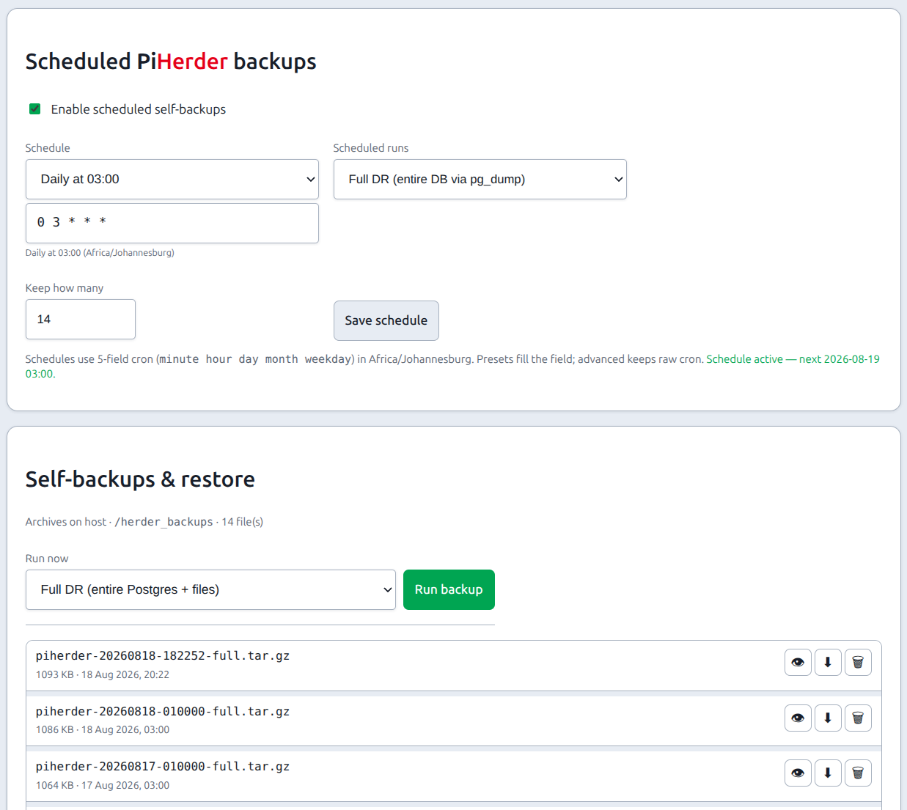
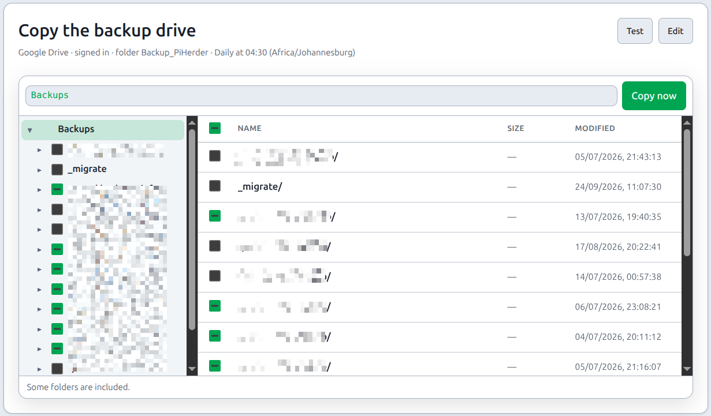
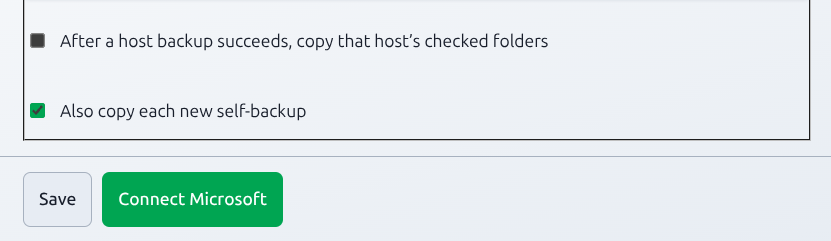
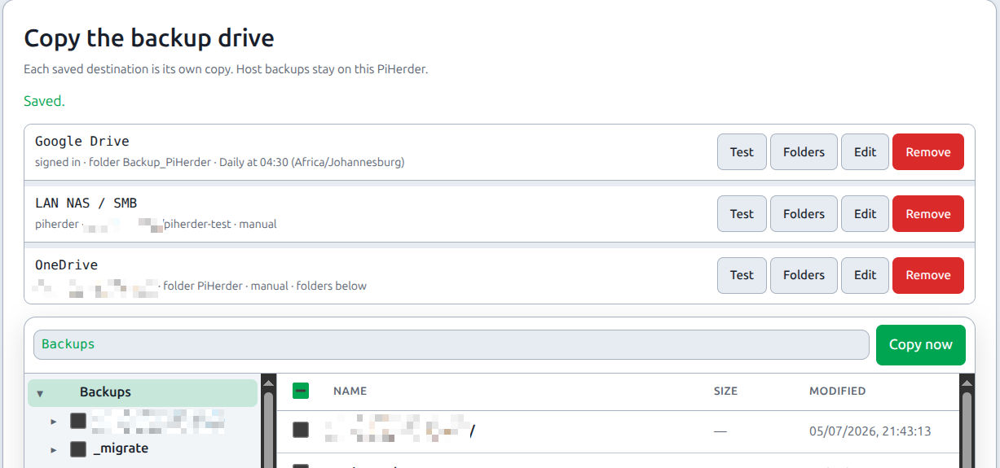

# Self-backup & DR

## What this is

**PiHerder self-backup** archives the **control plane** (and, from **v1.2.0**, a **full Postgres dump** in Full mode) into `.tar.gz` files under the herder backup volume.

It is **admin only**. **Where:** **Settings → PiHerder backup**.

It is **not** a replacement for:

| Not this | That is… |
|----------|----------|
| Per-server **rsync** of docker/media trees | [Server backups](../day-to-day/backups.md) on the `/backups` volume |
| Copy of that backup drive to Google Drive | Same Settings tab, the card **Copy the backup drive**, on the v1.8 train only. It copies checked folders from `/backups` after the host rsync. It is not this archive. [Backups](../day-to-day/backups.md#copy-to-google-drive-v18-train) |
| A VM/disk image of the herder host | You still install compose + image on the new machine |

Journey: [Operator scenarios — Journey F](../getting-started/operator-scenarios.md#journey-f).

<figure class="ph-figure" markdown>
  
  <figcaption>Settings → PiHerder backup — Full DR schedule, run now, and archives.</figcaption>
</figure>

<figure class="ph-figure" markdown>
  
  <figcaption>Same tab, under the self-backup cards — Copy the backup drive. This copies checked folders from /backups. It is not the Full DR archive above. Setup: [Backups](../day-to-day/backups.md#set-up-google-drive).</figcaption>
</figure>

## Copy the archive off this host

The `.tar.gz` stays under `/herder_backups` first. A saved Google Drive, OneDrive, or LAN share can also receive that file.

On **Copy the backup drive**, turn on **Also copy each new self-backup** for the destination, then save. The next successful self-backup queues a copy of that one archive. **Copy** on an archive row sends a file that is already on disk. The copy lands in a `herder/` folder on that destination, beside the host backup folders. Jobs labels that row **Self-backup copy**. It does not block **Copy now** of the host folders, and a host-folder copy does not block it.

A failed copy fails the copy job. It does not delete the local archive. The public demo does not upload. Restore still reads the local file, not Drive, OneDrive, or the share.

<figure class="ph-figure" markdown>
  
  <figcaption>On the destination form, Also copy each new self-backup is checked. Connect Microsoft keeps the OneDrive sign-in.</figcaption>
</figure>

<figure class="ph-figure" markdown>
  
  <figcaption>Copy the backup drive after a save. Google Drive, the LAN share, and OneDrive are separate rows. The self-backup copy uses the destination that has Also copy each new self-backup checked.</figcaption>
</figure>

---

## Version matrix (read this before trusting an archive)

| Product version | Self-backup “Full” reality | Suitable as sole DB DR? |
|-----------------|----------------------------|-------------------------|
| **&lt; v1.2.0** (v1.0.x · **v1.1.x**) | **JSON row snapshots** only — **not** a full database dump | **No** — see [limitations before v1.2.0](#limitations-before-v120) |
| **≥ v1.2.0** | **Full** = `pg_dump -Fc` of **entire Postgres** + `DATA_ROOT` files (avatars/logos) | **Yes** for all DB tables (jobs, audit, everything) |
| Any version | **Config only** = light JSON control-plane snapshot | **No** — intentional light pack |

!!! warning "Pre-v1.2 archives"
    Archives made on **v1.0 / v1.1** (and early v1.2 JSON “full” before pg_dump) **cannot** reconstruct a complete historical DB after wipe. Prefer **≥ v1.2.0 Full DR** archives for disaster recovery. Keep an offline **`PIHERDER_MASTER_KEY`** with every archive.

---

## Limitations before v1.2.0

Self-backup on **v1.0.x** and **v1.1.x** (and any archive whose `manifest` is JSON-only **v1–v5** without `database.dump`) had these **by design** limits. They still apply when **restoring those old files** on a newer image.

| Limitation | Detail |
|------------|--------|
| **Not a full DB dump** | Selective **JSON row snapshot** of durable tables — not `pg_dump` of every table |
| **Jobs excluded** | Job queue / job **history never** stored or restored |
| **Audit capped** | “Full” mode only added audit, and only a **capped** recent window (e.g. ~5000 rows) |
| **Notifications capped** | Recent alerts only (not unbounded history) |
| **Nmap scan runs excluded** | Device inventory/schedules restored; **scan run** rows / XML under `DATA_ROOT/nmap` not |
| **No password-reset tokens** | Short-lived; not DR-relevant |
| **No rsync trees** | Host file backups remain a separate product |
| **No external product DBs** | Kuma / Grafana / Frigate media etc. only as PiHerder connection config |

**Practical impact:** a “full” self-backup from **&lt; v1.2.0** is a **control-plane recovery pack**, not a complete historical database. After a hard wipe, **Jobs UI history** and full **audit** depth from those archives **cannot** be brought back.

**Operator stance for 1.0 / 1.1:** keep self-backup + master key for **fleet identity and secrets**; treat Jobs/audit history as **best-effort** (export/screenshot if you need long retention). Move scheduled mode to **Full DR** after upgrading to **v1.2.0**.

---

## v1.2.0+ modes

| Mode | Contents | Use |
|------|----------|-----|
| **Full DR** (recommended) | **`database.dump`** (`pg_dump -Fc` of **entire** `DATABASE_URL`) + avatars/logos under `data/` · manifest `kind=pg_dump_full` · format **v6** | Sole DR for the herder database |
| **Config only** | Lightweight **JSON** control-plane snapshot (not every table at unlimited depth) | Quick config copy / lab; **not** sole DR |

Image requires **`postgresql-client-16`** (matches compose `postgres:16`) so Full can run `pg_dump` / `pg_restore`.

**Restore (Full DR):** extracts `database.dump` → `pg_restore --clean` into the live DB, then `data/` files. Same **`PIHERDER_MASTER_KEY`**. Prefer dry-run when the UI offers it; expect a short outage while sessions to Postgres are terminated for clean restore.

**Restore (JSON / pre-v1.2):** row upserts by id/email (older behaviour). Missing tables (e.g. jobs) stay empty.

---

## Honest DR scenarios (v1.2.0+)

### Scenario A — Full DR pack (recommended)

**Keep offline:** latest **Full** `.tar.gz` + **`PIHERDER_MASTER_KEY`**.

**On a new machine:**

1. Fresh [Install](../getting-started/install.md).  
2. Same master key in `.env`.  
3. Settings → PiHerder backup → restore **Full** archive (or `pg_restore` of `database.dump`).  
4. Restart web/celery.  
5. Smoke: login, hosts, Jobs list (history present if it was in the dump), one fleet action.

### Scenario B — Control plane + fleet file archives

Also keep the **server rsync** volume (`PIHERDER_BACKUP_HOST_PATH` / `/backups`) — [Volumes](volumes.md).

### Scenario C — Comfort pack

| Offline | Purpose |
|---------|---------|
| `PIHERDER_MASTER_KEY` | Decrypt Fernet secrets after restore |
| Latest **Full** self-backup | Entire herder DB + logos/avatars |
| Copy of `.env` (non-secret notes OK) | Faster rebuild |
| Edge `./certs` if self-managed | Herder HTTPS |
| Host rsync backup disk | Fleet file DR |

### Still outside self-backup

| Expectation | Reality |
|-------------|---------|
| Host docker/media trees | Server rsync / host disks |
| Nmap raw XML under `DATA_ROOT/nmap` | Re-scan if needed |
| External Kuma/Grafana data | Their own backups |
| Redis / in-flight Celery | Ephemeral |

---

## Why older archives looked “small”

JSON + gzip of **selected** tables (often dominated by capped audit + logos) typically lands around **~1–2 MB**. That did **not** mean the whole DB was inside. **v1.2 Full** archives contain a real **`database.dump`**; size grows with real table data (jobs, audit, etc.).

---

## End-to-end: first DR pack (v1.2+)

1. Store **`PIHERDER_MASTER_KEY` offline**.  
2. Settings → **PiHerder backup** → **Full DR** → Run (or schedule **Full**). Run queues a job and opens Jobs. It does not block the page, and a web restart does not stop the archive. Only one self-backup is active at a time. If that row is still **pending** after **30 minutes**, PiHerder stops it and raises a **critical** alert (**PiHerder self-backup failed**). The next run can then start. A backup that is already **running** is left to finish.  
3. Copy the archive **off** the herder host.  
4. Lab restore with the **same** master key; smoke test.  

---

## Related

| Topic | Page |
|-------|------|
| Host path mounts | [Volumes](volumes.md) |
| Per-host file backups | [Backups](../day-to-day/backups.md) |
| Env secrets | [Env reference](env-reference.md) |
| Upgrades (backup first) | [Upgrades](upgrades.md) |
| Who may restore | [Roles](../account-security/roles.md) (admin) |
| Operator journey | [Journey F](../getting-started/operator-scenarios.md#journey-f) |
| Maintainer detail | [ADMIN.md](https://github.com/bjorngluck/piherder/blob/main/docs/ADMIN.md) · [PLAN_v1.2.0.md](https://github.com/bjorngluck/piherder/blob/main/docs/PLAN_v1.2.0.md) · [v1.2 QA](qa-v1.2.0.md) |
