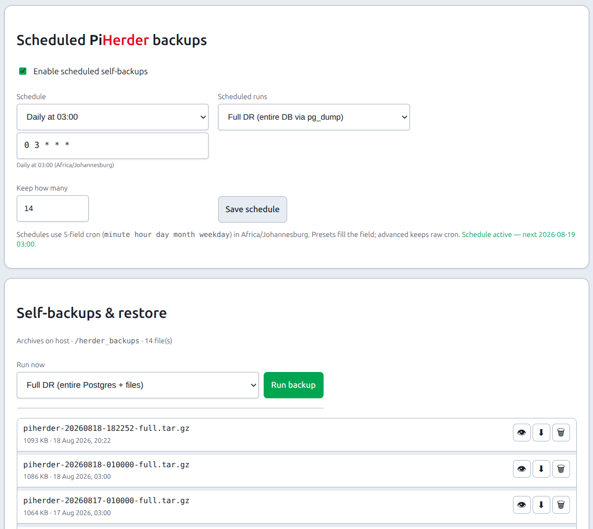
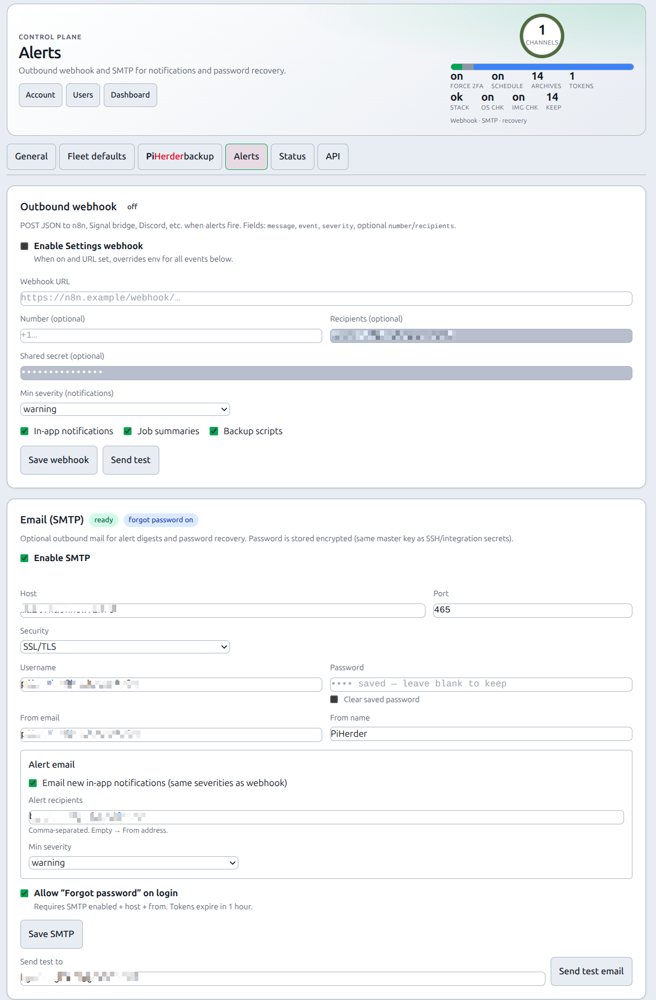
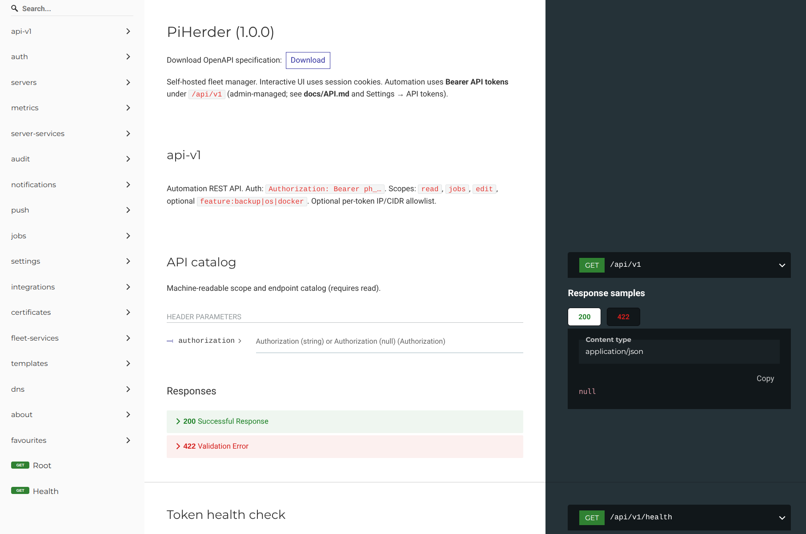
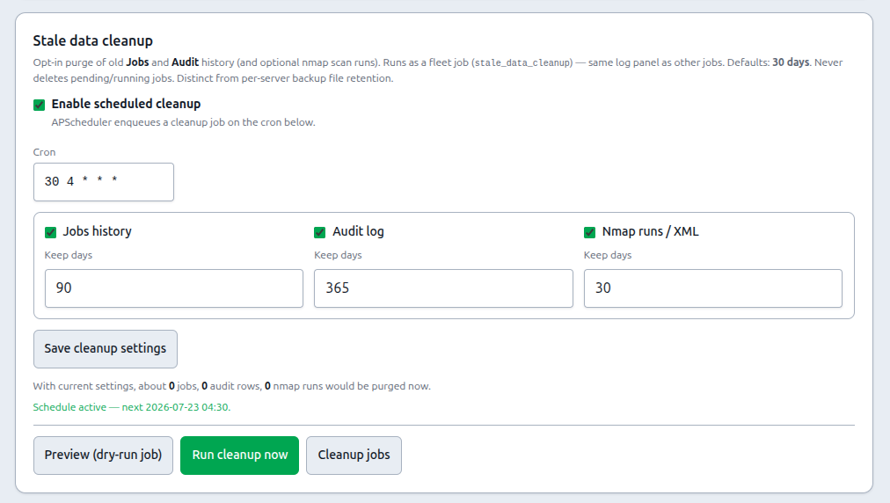
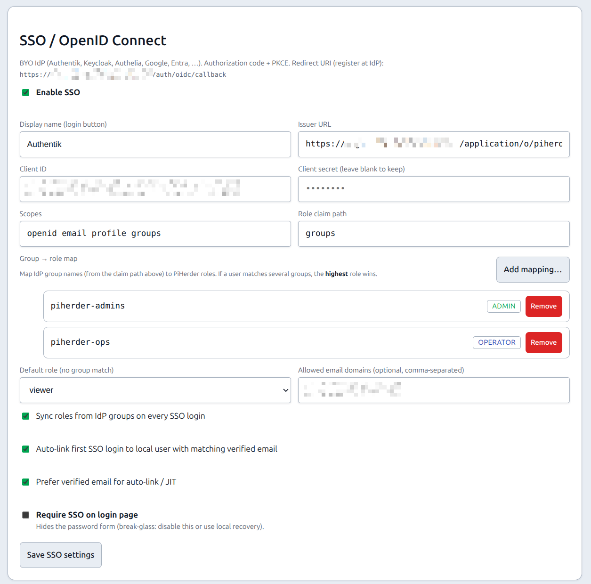

# Settings

## What this is

**Settings** is the admin control plane for the **instance**: timezone, security policy, **console limits**, **SSO / OIDC**, fleet update-check defaults, **stale data cleanup**, **Alerts** (policy + webhook + SMTP), PiHerder self-backup, stack Status, and API tokens.

**Where:** top nav **Settings** → `/herder-backups` (tabs on one page; legacy path kept for bookmarks).

## Why it exists

Day-to-day fleet work lives on Servers / Jobs / Catalog. Settings keeps **policy and DR** in one place so operators are not hunting for “where do I force 2FA?” or “where is the herder backup?”

Settings is **admin-oriented** for stack and policy; operators still use Account for self-service. **Timezone, security policy, console limits, fleet defaults, stale data cleanup, PiHerder self-backup/restore, Status, and API tokens** require **admin** (UI tabs and POST routes). Non-admins see a short notice on General only.

The page uses the shared **ops-hero** (tab-aware title + pulse) plus Settings-style tabs under the hero. Switching tabs is **client-side** (URL `?tab=` updates without a full reload); the hero title, caption, and viz follow the active tab.

---

## End-to-end: harden a new instance

1. **General** → set app **timezone** (Audit/Jobs clocks).  
2. **General** → **Security policy**: password rules, who must enrol 2FA (optional grace 0–60 days), step-up windows.  
3. **General** → **Console**: idle / max session, concurrency, ticket, park hold, bind, scrollback (kill switch stays `PIHERDER_SSH_CONSOLE`).  
4. Optional **General → SSO / OpenID Connect** when you have a BYO IdP — [SSO guide](../account-security/sso-oidc.md).  
5. **PiHerder backup** → run once + schedule; store archive + master key offline.  
6. **Status** → Check now until green.  
7. Optional **Alerts** — alert policy (mute / severity / debounce), webhook + SMTP, password recovery.  
8. Optional **API** tokens for n8n/HA only if needed.  

---

## Tabs (overview)

| Tab | Purpose |
|-----|---------|
| **General** | App timezone, **security policy**, **console limits**, **SSO / OIDC**, and **Stale data cleanup** |
| **Alerts** | **Alert policy** (per-category severity / mute / debounce) + outbound **webhook** + **SMTP** — [details](alerts-email-webhooks.md) |
| **Fleet defaults** | Global OS / container update-check defaults (optional apply to all hosts) |
| **PiHerder backup** | Schedule, run, download, restore herder config ([Self-backup & DR](self-backup.md)) |
| **Status** | Stack health: web, DB, Redis, Celery, scheduler, disk ([Status](status.md)) — admin |
| **API** | Create / rotate / revoke instance Bearer tokens; **Try a token** smoke checks; OpenAPI `/docs` + ReDoc ([API tokens](api-tokens.md)) — admin |

<figure class="ph-figure" markdown>
  
  <figcaption>Settings → PiHerder backup — Full DR and archives.</figcaption>
</figure>

<figure class="ph-figure" markdown>
  
  <figcaption>Settings → Alerts — webhook + SMTP (test send, password recovery).</figcaption>
</figure>

<figure class="ph-figure" markdown>
  
  <figcaption>Settings → API — tokens, Try a token, OpenAPI / ReDoc links.</figcaption>
</figure>

### Schedules (human-readable)

Cron fields across Settings (cleanup, fleet defaults, PiHerder backup) and host feature schedules show a short English line under the expression (e.g. “Daily at 04:30”) plus common presets where a select is offered. The stored value remains standard 5-field cron in the app timezone.

### General tab — timezone card

The hero shows a **timezone identity card** (not a city name jammed into the orb): continent badge, city, `UTC±offset`, local clock, and full IANA id (e.g. `Africa/Johannesburg`).

### Security policy {#security-policy}

**Admin-only.** Password rules, who must enrol 2FA (off / admins / operators+ / everyone), grace **0–60** days, step-up windows (account / secrets / **console grant**), allowed factors, and the IdP-MFA login skip (default off). See [2FA](../account-security/two-factor.md).

### Console {#console}

**Admin-only.** **Available from v1.3** on `v1.3.0-dev`. Timeouts and session limits for the optional [web SSH console](../day-to-day/web-ssh-console.md).

| Setting | Default | Range |
|---------|---------|--------|
| Idle timeout | 900s (15 min) | 60–28800 (8h). Also ends parked shells |
| Max session | 3600s (1h) | 120–43200 (12h), forced ≥ idle |
| Max shells per user | 4 | 1–16 (all hosts, including parked) |
| Max shells instance-wide | 20 | 1–64, forced ≥ per-user |
| Open-ticket TTL | 60s | 15–300 |
| Park hold after WS drop | 0 | 0 = until idle/max; else 30–3600 |
| Revalidate interval | 10s | 5–60 |
| Bind to client IP | on | Off only if mobile NAT breaks reconnects |
| Bind to device cookie | on | HttpOnly `console_device` |
| xterm scrollback | 2000 lines | 500–50000 |
| Who may open a privileged console | Admin only | Admin only, or operator and admin. Fleet shells stay operator+. Privileged always re-prompts 2FA. Env lock: `PIHERDER_SSH_CONSOLE_PRIVILEGED_ROLE` |
| Command audit | Off | Off · Commands only · Commands + truncated output. May capture secrets typed at the prompt; redaction is heuristic. Viewers cannot read transcripts. Demo never stores. Env: `PIHERDER_SSH_CONSOLE_AUDIT_MODE` |
| Require on every session | Off | When on, live shells always record commands (Off is ignored) and refuse to open if recording cannot start. Env: `PIHERDER_SSH_CONSOLE_AUDIT_REQUIRED` |
| Transcript retention | 14 days | 1–90. Drops the encrypted body; the row still shows that a transcript existed. Env: `PIHERDER_SSH_CONSOLE_AUDIT_RETENTION_DAYS` |

The **master enable** is still compose-only: `PIHERDER_SSH_CONSOLE` (default off). 2FA factors and the grant window stay on **Security policy** (two forms — do not move those checkboxes here).

A non-empty env var **locks** that knob (field shows read-only). Bundled compose does **not** inject defaults for these, or Settings cannot apply. Public demo **403s** writes. Lowering concurrency does **not** kick open shells.

Audit: `console_policy_changed`.

### Stale data cleanup {#stale-data-cleanup}

**Opt-in** purge of old **Jobs**, **Audit**, and optionally **nmap scan runs** (plus run XML under `DATA_ROOT/nmap/…`). Distinct from per-server **backup file** retention.

| Setting | Default lean |
|---------|----------------|
| Master enable + cron | **Off** · cron e.g. `30 4 * * *` (app timezone). UI shows a **plain-English** summary next to the expression (shared schedule helper used fleet-wide) |
| Jobs purge | On when cleanup enabled · **30 days** · never deletes pending/running |
| Audit purge | On when cleanup enabled · **30 days** (can differ from jobs) |
| nmap runs / artifacts | **Off** until enabled · **30 days** when on |

**Run now** enqueues Job type `stale_data_cleanup` (preview counts in the card). Admin-only. Removing a **server** still **keeps** unlinked Jobs/Audit by default — time purge is the bulk growth control ([Remove a server](../day-to-day/remove-server.md)).

<figure class="ph-figure" markdown>
  
  <figcaption>Settings → General → Stale data cleanup — opt-in Jobs / Audit / nmap retention.</figcaption>
</figure>

## Common tasks

| Goal | Path |
|------|------|
| Is Redis/Celery healthy? | Settings → **Status** → Check now |
| Nightly herder backup | Settings → **PiHerder backup** → schedule + path |
| Force everyone onto 2FA | Settings → **General** → security policy |
| Console idle / max shells | Settings → **General** → Console · [web SSH](../day-to-day/web-ssh-console.md) |
| Connect Authentik / Keycloak / Entra | Settings → **General** → SSO · [SSO / OIDC](../account-security/sso-oidc.md) |
| Trim old Jobs / Audit | Settings → **General** → Stale data cleanup |
| Times show SAST / local | Settings → **General** → timezone |
| n8n / HA automation | Settings → **API** · [API](api-tokens.md) |
| Alert policy / webhook / SMTP | Settings → **Alerts** · [Alerts](alerts-email-webhooks.md) |
| Forgot password on login | Settings → **Alerts** (SMTP + toggle) · [Alerts](alerts-email-webhooks.md) |

## Not under Settings

| Feature | Where |
|---------|--------|
| Catalog (integrations, certs, templates, network) | Nav **Catalog** |
| Users | Avatar → **Users** (admin) |
| Account / 2FA / SSO link / push | Avatar → **Account** |
| Fleet services grid | Dashboard tile or `/services` |

### General tab — SSO / OpenID Connect

Admin-only. Enable a confidential OIDC client, paste issuer / client id / secret (Fernet in DB), map groups to roles, optional **Require SSO** (hides the password form; **non-admins cannot password-login**; **admins stay break-glass**). Redirect URI is shown on the card.

<figure class="ph-figure" markdown>
  
  <figcaption>Settings → General → SSO / OpenID Connect.</figcaption>
</figure>

Full operator guide: [SSO / OpenID Connect](../account-security/sso-oidc.md). Lab Authentik: [SSO_AUTHENTIK_TEST.md](https://github.com/bjorngluck/piherder/blob/main/docs/SSO_AUTHENTIK_TEST.md).

## Related

- [Environment reference](env-reference.md) — secrets that stay in `.env` (includes LAN nmap fence / volume keys)  
- [SSO / OpenID Connect](../account-security/sso-oidc.md)  
- [Volumes](volumes.md)  
- [Upgrades](upgrades.md)  
