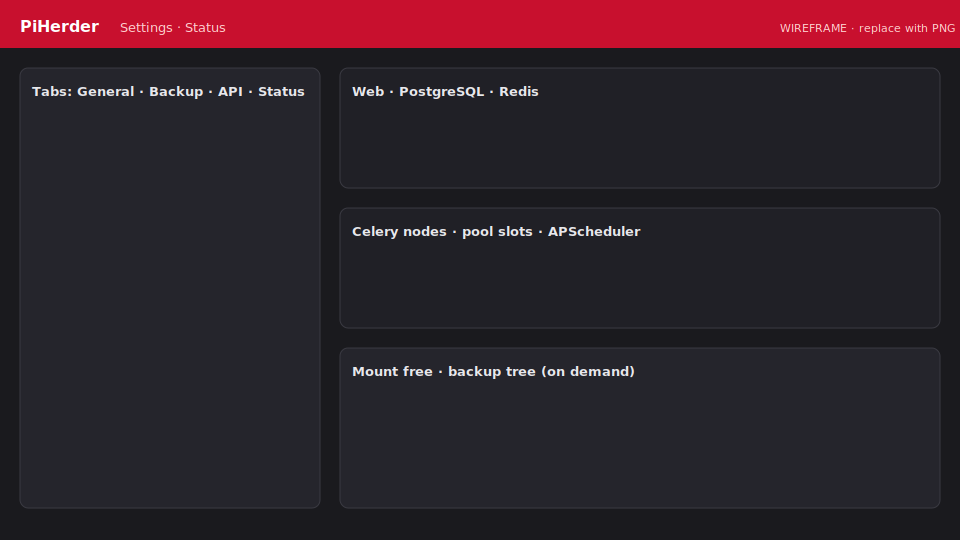

# Stack Status

**Where:** Settings → **Status** (admin).

<figure class="ph-figure" markdown>
  
  <figcaption>Component health + mount free. wireframe</figcaption>
</figure>

## What is checked

| Component | Idea |
|-----------|------|
| Web | Process / health |
| PostgreSQL | `SELECT 1` |
| Redis | Broker ping |
| Celery | Nodes + **pool slots** (`CELERY_CONCURRENCY`) |
| APScheduler | Running + jobs registered |
| Disk (fast) | Mount free on `/backups`, `/data`, `/herder_backups` |
| Disk (lazy) | Full tree `du` + host folders — **View details** only |

- Manual **Check now** + ~2 minute scheduled poll.  
- Notifications on **state transition** only (no spam).  
- Metrics gauges can reflect last check.

## Host dependency check (fleet)

Separate from stack Status: per-server remote tools for enabled features.  
Server detail → **Re-check** · also after SSH test / key deploy / least-priv.
