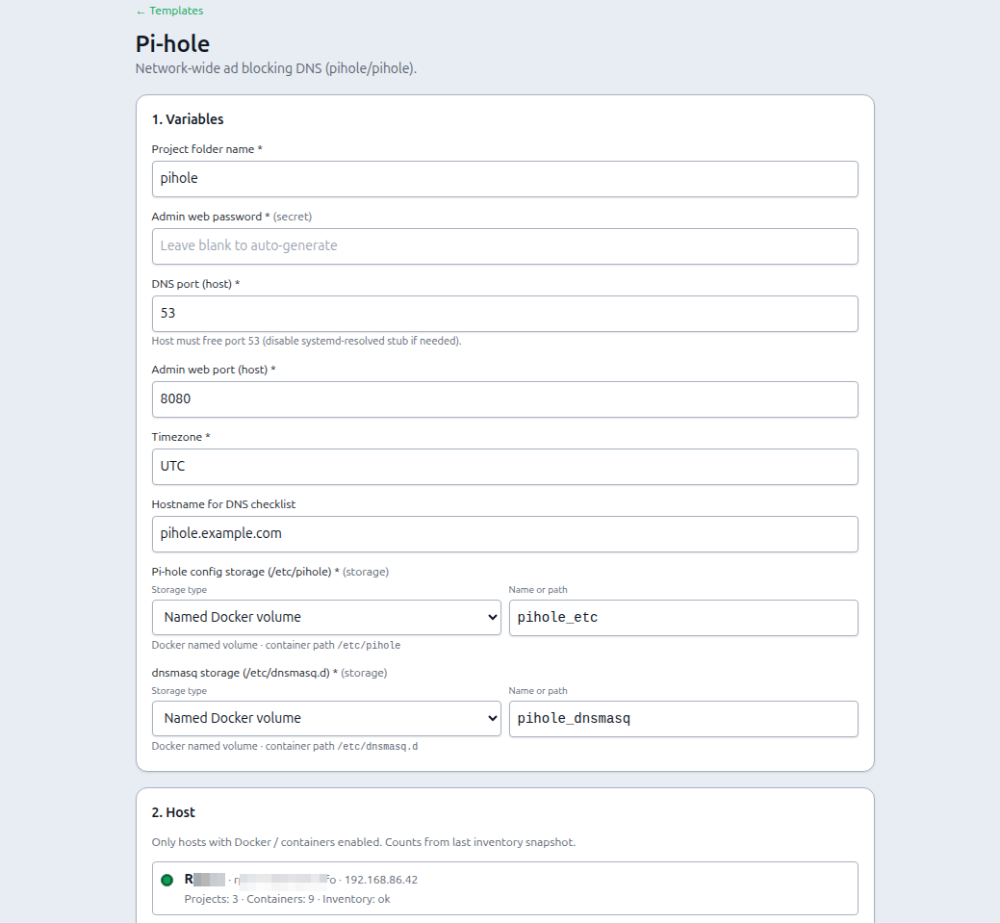
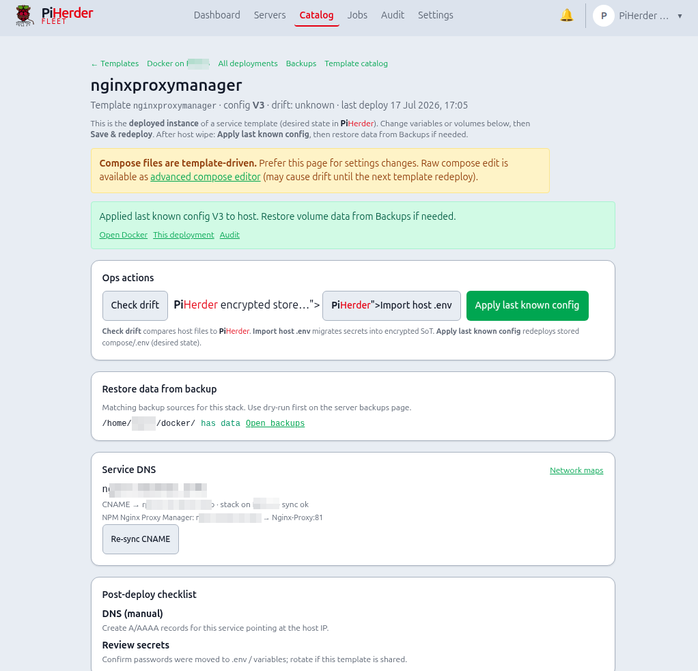

# Deploy a template

## What this is

**Deploy** takes a template, fills variables, picks a Docker-enabled host, writes files over SSH, runs `compose pull` + `up -d`, and stores **desired state** (versioned, secrets encrypted) in PiHerder.

## Why it exists

A one-shot SSH paste is not recoverable after host loss and not comparable for drift. Deploy stores what *should* be on the host so you can redeploy, detect drift, import host `.env`, or apply last known config after DR.

<figure class="ph-figure" markdown>
  
  <figcaption>Wizard: variables → host → preview → confirm.</figcaption>
</figure>

---

## End-to-end: first OOTB deploy

1. **Catalog → Templates** → open a template → **Deploy…**.  
2. Fill variables (generate passwords if offered; choose volume mode).  
3. Pick a **Docker-enabled** host with a correct Docker base dir.  
4. **Preview** rendered files (secrets masked) — sanity-check ports and names.  
5. **Confirm** — runs as a **Job** with live log (write + lock `.env` + compose pull/up).  
6. On success, open the **deployment** page (or Jobs / Audit).  
7. Read the **checklist** (DNS, first admin password in the app, firewall).  
8. Open **Docker** on that host to confirm the project is up.

---

## Flow

1. **Catalog → Templates** → open a template → **Deploy…** (or Details → Deploy).  
2. Fill **variables** (incl. volume mode for storage vars; generate secrets if offered).  
3. Pick a **Docker-enabled** host (inventory counts shown).  
4. **Preview** rendered files (secrets masked).  
5. **Confirm deploy** — queues a **Template deploy** job (live log in the hold modal):  
   - writes files over SSH  
   - locks host `.env` (`chmod 600`)  
   - runs `compose pull` + `up -d`  
6. Desired state **Vn** stored encrypted in PiHerder; success navigates to the deployment page.  
7. Post-deploy **checklist** (manual DNS, first login, …).

!!! note "Availability"
    Template deploy / redeploy as Jobs with live log requires **v0.6.0+**. **Check drift** as a Job with live log is on the **v0.7.0** track (same JobHold pattern).

## Redeploy & ops (deployment page)

Open the **deployment** for that host+project (`/templates/deployments/{id}`):

<figure class="ph-figure" markdown>
  
  <figcaption>Deployment page: drift, redeploy, import host .env, apply last known config.</figcaption>
</figure>

| Action | Effect | Why |
|--------|--------|-----|
| **Volumes / storage** | Change named volume, project folder, or host path without re-wizard | Storage decisions change more often than the whole recipe |
| **Save & redeploy** | New config version → write files → compose pull/up (**Job** + live log) | Apply edited desired state |
| **Check drift** | Compare host compose/.env to desired state as a **Job** (live log / JobHold); updates drift badge | Detect hand-edits on the host |
| **Import host .env** | Pull host secrets into PiHerder encrypted store | Capture changes made offline on the host |
| **Apply last known config** | Re-write stored desired state after host wipe / DR | Rebuild without retyping secrets |
| **Restore data** | Lists matching backup sources → use server **Backups** dry-run/apply | Config redeploy ≠ data restore |

Post-redeploy banner links to **Docker**, this deployment, and **Audit**.  
Drift also runs on a schedule (~every **6 hours**).

## Create / edit a template

1. **Catalog → Templates → + New template** or **From host…** or **Edit**.  
2. Metadata: slug, name, category, version.  
3. Paste or pull `docker-compose.yml`; use `{{VAR}}` placeholders.  
4. **Variables** as form rows. Types include boolean + volume.  
5. Editor tools:  
   - **Scan vars + volumes**  
   - **Move secrets → .env**  
6. Checklist rows for operators.  
7. **Save** → `source=user`.

## Import zip

Archive with `template.yaml` + `files/`. Fully editable after import.

## Security settings

**Settings → Security policy:**

| Option | Effect |
|--------|--------|
| Require 2FA for all users | Force 2FA for the whole UI |
| **Require 2FA for template deploy & secrets** | Operator must have TOTP to confirm deploy or view/edit secrets |

Step-up unlock for cleartext secrets: [Secrets model](secrets.md).

## Related

- [From host](from-host.md) · [Secrets](secrets.md) · [Templates overview](overview.md)  
- [Templates troubleshooting](../troubleshooting/templates-docker.md)  
