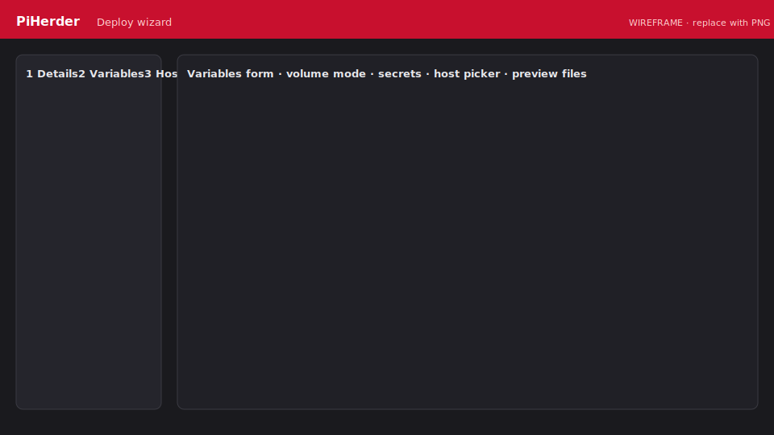

# Deploy a template

<figure class="ph-figure" markdown>
  
  <figcaption>Wizard: variables → host → preview → confirm. wireframe</figcaption>
</figure>

## Flow

1. **Catalog → Templates** → open a template → **Deploy…** (or Details → Deploy).  
2. Fill **variables** (incl. volume mode for storage vars; generate secrets if offered).  
3. Pick a **Docker-enabled** host (inventory counts shown).  
4. **Preview** rendered files (secrets masked).  
5. **Confirm deploy** — blocking **wait modal** while PiHerder:  
   - writes files over SSH  
   - locks host `.env` (`chmod 600`)  
   - runs `compose pull` + `up -d`  
6. Desired state **Vn** stored encrypted in PiHerder.  
7. Post-deploy **checklist** (manual DNS, first login, …).

## Redeploy

From the **deployment** page for that host+project — same wait modal.  
(Volume editor polish is planned for v0.5.0.)

## Create / edit a template

1. **Catalog → Templates → + New template** or **From host…** or **Edit**.  
2. Metadata: slug, name, category, version.  
3. Paste or pull `docker-compose.yml`; use `{{VAR}}` placeholders.  
4. **Variables** as form rows. Types include boolean + volume.  
5. Editor tools:  
   - **Scan vars + volumes**  
   - **Move secrets → .env**  
6. Checklist rows for operators.  
7. **Save** → `source=user`.

## Import zip

Archive with `template.yaml` + `files/`. Fully editable after import.

## Security settings

**Settings → Security policy:**

| Option | Effect |
|--------|--------|
| Require 2FA for all users | Force 2FA for the whole UI |
| **Require 2FA for template deploy & secrets** | Operator must have TOTP to confirm deploy or view/edit secrets |

Step-up unlock for cleartext secrets: [Secrets model](secrets.md).
