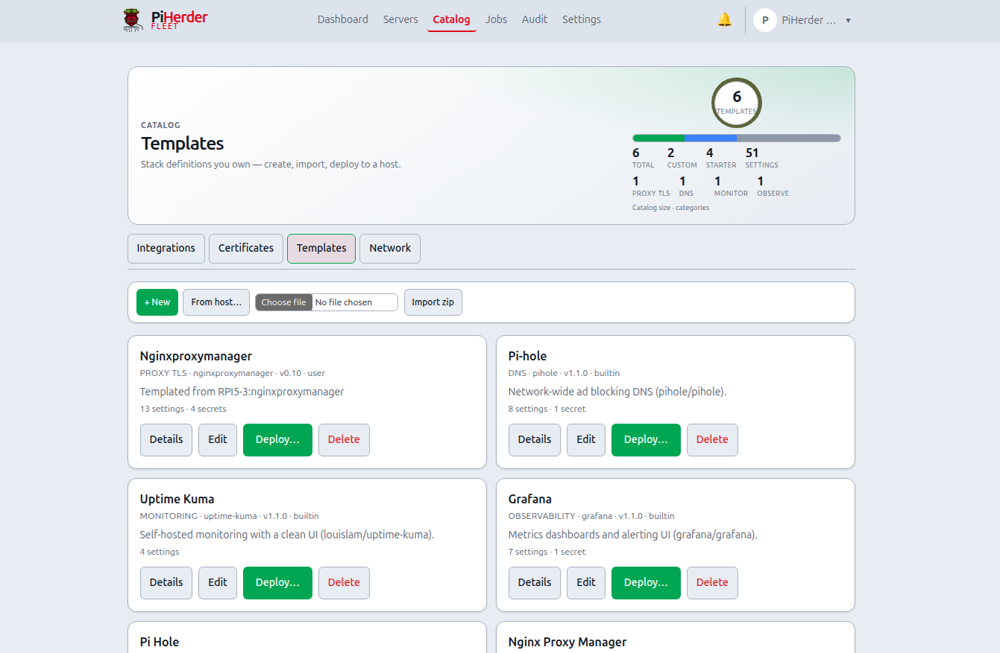

# Service templates

## What this is

A **service template** is a **versioned recipe** for a Docker stack: compose files, variables (including secrets and volumes), operator checklist, and deploy rules. Templates live under top-nav **Catalog** → tab **Templates** (`/templates`), sharing Catalog chrome with Integrations, Certificates, and Network.

You **create and edit** templates separately from **deploying** them to a host.

## Why it exists

Copy-pasting `docker-compose.yml` across Pis drifts immediately. Templates give you:

- One definition for NPM, Kuma, Pi-hole, Grafana (and your own stacks)  
- Parameterised ports, passwords, and volume modes  
- Encrypted secret storage in PiHerder + locked-down host `.env`  
- Desired state, redeploy, and drift detection after deploy  

**Status:** Foundation **v0.4.0**; ops polish **v0.5.0**; deploy/redeploy as Jobs **v0.6.0** — [RELEASE](https://github.com/bjorngluck/piherder/blob/main/docs/RELEASE_v0.6.0.md).

<figure class="ph-figure" markdown>
  
  <figcaption>Catalog with OOTB packs and user templates.</figcaption>
</figure>

---

## End-to-end: from zero to a running stack

1. Ensure a host has **Docker** enabled and working ([Add a server](../day-to-day/add-server.md) · [Docker](../docker/overview.md)).  
2. Open **Catalog → Templates** and pick an OOTB pack (or create / from-host).  
3. [Deploy](deploy.md) through variables → host → preview → wait modal.  
4. Complete the post-deploy checklist (DNS, first login).  
5. Optional: connect the matching [integration](../integrations/overview.md).  
6. Later: open the **deployment** page for redeploy, drift, or import host `.env`.

Full journey: [Operator scenarios — Journey D](../getting-started/operator-scenarios.md#journey-d).

---

## OOTB pack

| Slug | Service | Typical why |
|------|---------|-------------|
| `npm` | Nginx Proxy Manager | TLS / reverse proxy edge |
| `uptime-kuma` | Uptime Kuma | Monitor fleet URLs and SSH |
| `pihole` | Pi-hole | LAN DNS + blocking |
| `grafana` | Grafana | Metrics dashboards |

Defaults use **named volumes**; deploy can switch to project folder or host path.

## Operator ownership

| Source | Behaviour | Why |
|--------|-----------|-----|
| `builtin` | Seeded from disk `service_templates/`; refreshed if still builtin and checksum changes | Ship better defaults without clobbering your edits |
| `user` | After **Save** in UI — never auto-overwritten by disk | Your recipe is yours |
| `import` | Zip upload → editable as user | Share packs across instances |

## Variable types

| Type | Deploy UI | Notes |
|------|-----------|--------|
| string / port / int / url / email | Normal fields | Ports 1–65535 |
| **password** | Secret field | Optional auto-generate |
| **boolean** | Yes / No | `true_value` / `false_value` |
| **volume** | Storage mode + name/path | named · `./` project · absolute host path |

Volume and boolean vars are **never** secrets (no step-up 2FA).

## Next

- [Deploy a template](deploy.md)  
- [From host](from-host.md)  
- [Secrets model](secrets.md)  
- [Developer schema](../developers/templates-schema.md)  
