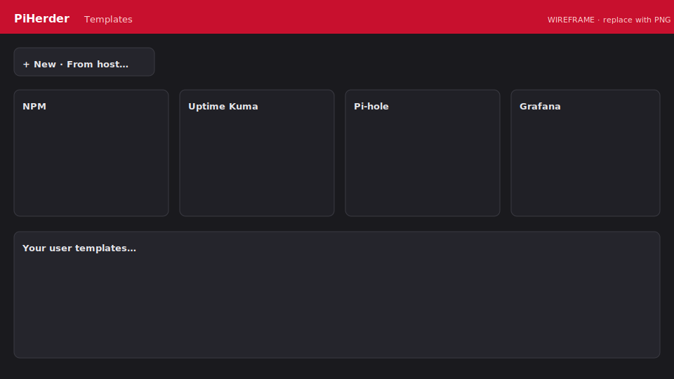

# Service templates

**Templates** live under top-nav **Catalog** → **Templates** button (Integrations is the default Catalog landing). They are **your** versioned stack definitions. Create, edit, and save them; deploy is separate.

**Shipped foundation:** v0.4.0 · polish/ops → [v0.5.0 plan](https://github.com/bjorngluck/piherder/blob/main/docs/PLAN_v0.5.0.md)

<figure class="ph-figure" markdown>
  
  <figcaption>Catalog with OOTB packs and user templates. wireframe</figcaption>
</figure>

## OOTB pack

| Slug | Service |
|------|---------|
| `npm` | Nginx Proxy Manager |
| `uptime-kuma` | Uptime Kuma |
| `pihole` | Pi-hole |
| `grafana` | Grafana |

Defaults use **named volumes**; deploy can switch to project folder or host path.

## Operator ownership

| Source | Behaviour |
|--------|-----------|
| `builtin` | Seeded from disk `service_templates/`; refreshed if still builtin and checksum changes |
| `user` | After **Save** in UI — never auto-overwritten by disk |
| `import` | Zip upload → editable as user |

## Variable types

| Type | Deploy UI | Notes |
|------|-----------|--------|
| string / port / int / url / email | Normal fields | Ports 1–65535 |
| **password** | Secret field | Optional auto-generate |
| **boolean** | Yes / No | `true_value` / `false_value` |
| **volume** | Storage mode + name/path | named · `./` project · absolute host path |

Volume and boolean vars are **never** secrets (no step-up 2FA).

## Next

- [Deploy a template](deploy.md)  
- [From host](from-host.md)  
- [Secrets model](secrets.md)  
- [Developer schema](../developers/templates-schema.md)  
